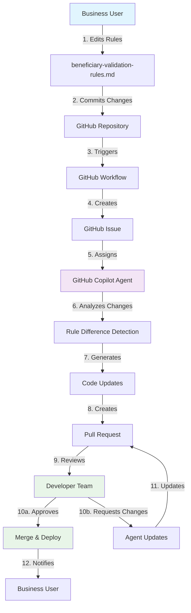

# Business-Driven Validation Rule Updates Workflow

## Executive Summary

This document outlines an automated workflow that enables **business users** to update application validation rules by simply editing a markdown file, while maintaining **developer oversight** and **quality control**. The system leverages GitHub Copilot agents to automatically generate code changes, ensuring business rules stay synchronized across the entire application.

## Business Value Proposition

### 🎯 **Current Problem**
- Business rule changes require developer intervention
- Validation logic scattered across multiple code files
- Risk of inconsistencies between frontend, backend, and documentation
- Slow iteration cycle for business rule modifications

### ✅ **Proposed Solution**
- Business users edit validation rules in plain English (markdown)
- Automated system generates required code changes
- Developer review ensures quality and security
- Faster deployment of business rule changes

### 📈 **Expected Benefits**
- **50% faster** business rule implementation
- **Reduced developer burden** on routine validation changes
- **100% consistency** across all application layers
- **Self-documenting** business rules
- **Audit trail** for all rule changes

## Workflow Overview



## Detailed Workflow Steps

### Phase 1: Business Rule Change (Business User)

#### Step 1: Business User Edits Validation Rules
- **Who**: Business Analyst, Product Owner, or Domain Expert
- **What**: Edit `beneficiary-validation-rules.md` file
- **How**: 
  - Navigate to GitHub web interface
  - Edit the markdown file directly in browser
  - Use simple markdown syntax to update rules
  - Provide clear commit message describing the change

**Example Change:**
```markdown
- **Email** (`email`)
  - Required: ❌ No → ✅ Yes  [CHANGED]
  - Max Length: 200 characters
  - Validation: Must be valid email format when provided
```

#### Step 2: Commit and Push Changes
- Business user commits changes with descriptive message
- GitHub automatically triggers the workflow

### Phase 2: Automated Processing (GitHub Workflow)

#### Step 3: Change Detection Workflow
```yaml
name: Validation Rules Change Detector
on:
  push:
    paths:
      - 'Beneficiary/docs/beneficiary-validation-rules.md'
    branches: [main, develop]

jobs:
  detect-changes:
    runs-on: ubuntu-latest
    steps:
      - name: Checkout code
        uses: actions/checkout@v4
        
      - name: Detect rule changes
        id: changes
        run: |
          # Compare with previous version
          git diff HEAD~1 HEAD Beneficiary/docs/beneficiary-validation-rules.md > changes.diff
          
      - name: Create issue for rule changes
        uses: actions/github-script@v7
        with:
          script: |
            const issue = await github.rest.issues.create({
              owner: context.repo.owner,
              repo: context.repo.repo,
              title: 'Validation Rules Updated - Code Sync Required',
              body: `
                ## Validation Rule Changes Detected
                
                **Changed by**: ${{ github.actor }}
                **Commit**: ${{ github.sha }}
                
                ### Files that need updates:
                - [ ] Frontend Bulk Validation: \`Platform/src/UI/src/pages/BeneficiaryBulkImport.tsx\`
                - [ ] Validation Rules Dialog: \`Platform/src/UI/src/components/ValidationRulesDialog.tsx\`
                - [ ] Retry Form Validation: \`Platform/src/UI/src/components/RetryBeneficiaryForm.tsx\`
                - [ ] DTO: \`Beneficiary/src/Domain/DTOs/BeneficiaryRegistrationDto.cs\`
                - [ ] Business Logic: \`Beneficiary/src/Domain/Managers/BeneficiaryManager.cs\`
                
                ### Change Details:
                See diff in commit ${{ github.sha }}
                
                /cc @copilot-agent
              `,
              labels: ['validation-rules', 'auto-generated', 'copilot-agent'],
              assignees: ['copilot-agent']
            });
```

### Phase 3: Automated Code Generation (GitHub Copilot Agent)

#### Step 4: Copilot Agent Processing
The GitHub Copilot agent analyzes the changes and generates appropriate code updates:

**Agent Instructions:**
```markdown
## GitHub Copilot Agent Task

You are assigned to update validation logic across multiple files based on changes to the validation rules documentation.

### Primary Task:
Analyze changes in `beneficiary-validation-rules.md` and update these files accordingly:

1. **Frontend Validation** (`BeneficiaryBulkImport.tsx`)
   - Update `validateBeneficiaryRecord` function
   - Ensure required fields list matches markdown
   - Update validation messages to match standards

2. **Validation Rules Dialog** (`ValidationRulesDialog.tsx`)
   - Update rule display components
   - Ensure user guidance matches current rules
   - Update help text and tooltips

3. **Retry Beneficiary Form** (`RetryBeneficiaryForm.tsx`)
   - Update `validateForm` method for individual beneficiary validation
   - Ensure form field validation matches bulk validation
   - Update error message display consistency

4. **DTO Validation** (`BeneficiaryRegistrationDto.cs`)
   - Update data annotation attributes
   - Update max length constraints
   - Update custom validation methods

5. **Business Logic** (`BeneficiaryManager.cs`)
   - Update business validation rules
   - Update external validation calls
   - Update external validation calls
   - Modify field requirements and constraints
   - Update custom validation methods

5. **Business Logic** (`BeneficiaryManager.cs`)
   - Update business validation rules
   - Update external validation calls
   - Update duplicate detection logic

### Implementation Guidelines:
- Follow the patterns documented in the validation rules file
- Maintain backwards compatibility where possible
- Include comprehensive unit tests for any new validation logic
- Update error messages to match standardized templates

### Deliverable:
Create a pull request with all necessary changes, including:
- Code updates in all five validation locations
- Updated unit tests
- Migration script if database changes required
- Documentation updates if validation flow changes
```

#### Step 5: Code Generation Process
The agent follows this process:

1. **Parse markdown changes** using diff analysis
2. **Identify affected validation rules** (required fields, formats, business rules)
3. **Generate frontend bulk validation updates** following TypeScript patterns
4. **Generate validation rules dialog updates** for user guidance
5. **Generate retry form validation updates** for consistency
6. **Generate DTO updates** using C# data annotations
7. **Generate business logic updates** with async validation patterns
8. **Create comprehensive tests** for all changes
9. **Generate pull request** with detailed description

### Phase 4: Quality Assurance (Developer Review)

#### Step 6: Developer Review Process
- **Automated PR Creation** with comprehensive description
- **Code Review Assignment** to designated developers
- **Automated Testing** runs validation scenarios
- **Security Review** for any external validation changes

**PR Template:**
```markdown
## Validation Rules Update - Auto-Generated

### Business Rule Changes
[Auto-generated summary of rule changes]

### Code Changes
- [ ] Frontend bulk validation updated
- [ ] Validation rules dialog updated
- [ ] Retry form validation updated
- [ ] DTO validation updated  
- [ ] Business logic validation updated
- [ ] Unit tests added/updated
- [ ] Integration tests verified

### Testing Checklist
- [ ] All existing validation tests pass
- [ ] New validation rules tested
- [ ] Frontend validation matches backend
- [ ] Retry form validation matches bulk validation
- [ ] Error messages standardized

### Deployment Notes
- [ ] No breaking changes to API
- [ ] Database migration required: Yes/No
- [ ] Feature flag needed: Yes/No

### Review Requirements
- [x] Automated tests pass
- [ ] Security review (if external validations changed)
- [ ] Product owner approval
- [ ] Developer code review
```

#### Step 7: Review Outcomes

**Option A: Approved**
- Developer approves PR
- Automated merge to main branch
- CI/CD pipeline deploys changes
- Business user receives notification

**Option B: Changes Requested**
- Developer provides feedback
- Copilot agent addresses feedback
- Process repeats until approved

### Phase 5: Deployment and Notification

#### Step 8: Automated Deployment
- **CI/CD Pipeline** deploys changes
- **Integration Tests** verify functionality
- **Monitoring** tracks validation performance

#### Step 9: Business User Notification
```markdown
## Validation Rules Successfully Updated ✅

Your changes to the beneficiary validation rules have been successfully deployed!

### Changes Deployed:
- Email field is now required
- Updated validation messages
- Frontend, backend, and business logic synchronized

### Deployment Details:
- **Deployed at**: 2025-10-18 14:30 UTC
- **Version**: v2.1.4
- **Environment**: Production

### Testing:
Your changes have been verified in the staging environment and are now live in production.
```

## Business User Guide

### How to Make Validation Rule Changes

#### 1. Access the Validation Rules File
1. Go to GitHub repository: `https://github.com/YourOrg/Migrate`
2. Navigate to: `Beneficiary/docs/beneficiary-validation-rules.md`
3. Click "Edit this file" (pencil icon)

#### 2. Make Your Changes
Use this simple format for common changes:

**Making a field required:**
```markdown
- **Email** (`email`)
  - Required: ❌ No → ✅ Yes  [CHANGED]
```

**Changing field length:**
```markdown
- **First Name** (`firstName`)
  - Max Length: 100 → 150 characters  [CHANGED]
```

**Adding new validation rule:**
```markdown
- **Phone** (`phone`)
  - Validation: Must be valid phone format when provided
  - New Rule: Must include country code  [NEW]
```

**Updating allowed values:**
```markdown
- **Case Status** (`caseStatus`)
  - Valid Values: `["PENDING", "ACTIVE", "COMPLETED", "SUSPENDED", "ON_HOLD"]`  [UPDATED]
```

#### 3. Commit Your Changes
1. Scroll to bottom of edit page
2. Add descriptive commit message: "Make email required for all beneficiaries"
3. Click "Commit changes"

#### 4. Track Progress
1. Check the "Issues" tab for auto-created issue
2. Monitor pull request progress
3. Receive notification when deployed

### Best Practices for Business Users

#### ✅ **Do:**
- Use clear, descriptive commit messages
- Test changes in staging environment first
- Coordinate with team on major rule changes
- Document business justification for changes

#### ❌ **Don't:**
- Make multiple unrelated changes in one commit
- Change technical implementation details
- Modify database-related validation without developer consultation
- Rush changes without proper testing

## Technical Implementation Details

### Required GitHub Setup

#### 1. Repository Configuration
```yaml
# .github/workflows/validation-rules-sync.yml
name: Validation Rules Synchronization

on:
  push:
    paths:
      - 'Beneficiary/docs/beneficiary-validation-rules.md'
    branches: [main, develop]

jobs:
  sync-validation-rules:
    runs-on: ubuntu-latest
    permissions:
      contents: read
      issues: write
      pull-requests: write
    
    steps:
      - name: Checkout repository
        uses: actions/checkout@v4
        with:
          fetch-depth: 2
          
      - name: Detect changes
        id: detect
        run: |
          git diff HEAD~1 HEAD --name-only | grep -q "beneficiary-validation-rules.md" && echo "changed=true" >> $GITHUB_OUTPUT || echo "changed=false" >> $GITHUB_OUTPUT
          
      - name: Extract rule changes
        if: steps.detect.outputs.changed == 'true'
        run: |
          git diff HEAD~1 HEAD Beneficiary/docs/beneficiary-validation-rules.md > rule-changes.diff
          
      - name: Create synchronization issue
        if: steps.detect.outputs.changed == 'true'
        uses: actions/github-script@v7
        with:
          script: |
            const fs = require('fs');
            const diff = fs.readFileSync('rule-changes.diff', 'utf8');
            
            const issue = await github.rest.issues.create({
              owner: context.repo.owner,
              repo: context.repo.repo,
              title: `🔄 Validation Rules Update Required - ${new Date().toISOString().split('T')[0]}`,
              body: `
                ## 📋 Validation Rule Changes Detected
                
                **Triggered by**: @${{ github.actor }}
                **Commit**: ${{ github.sha }}
                **Branch**: ${{ github.ref_name }}
                **Timestamp**: ${new Date().toISOString()}
                
                ### 🎯 Files Requiring Updates:
                
                - [ ] **Frontend Bulk Validation** 
                  - File: \`Platform/src/UI/src/pages/BeneficiaryBulkImport.tsx\`
                  - Function: \`validateBeneficiaryRecord\`
                  
                - [ ] **Validation Rules Dialog**
                  - File: \`Platform/src/UI/src/components/ValidationRulesDialog.tsx\`
                  - Component: Validation rule display and user guidance
                  
                - [ ] **Retry Beneficiary Form**
                  - File: \`Platform/src/UI/src/components/RetryBeneficiaryForm.tsx\`
                  - Function: \`validateForm\` method for individual beneficiary retry validation
                  
                - [ ] **DTO Validation**
                  - File: \`Beneficiary/src/Domain/DTOs/BeneficiaryRegistrationDto.cs\`
                  - Methods: Data annotations and \`Validate()\` method
                  
                - [ ] **Business Logic Validation**
                  - File: \`Beneficiary/src/Domain/Managers/BeneficiaryManager.cs\`
                  - Method: \`ValidateBusinessRulesAsync\`
                
                ### 📝 Change Details:
                
                \`\`\`diff
                ${diff}
                \`\`\`
                
                ### 🤖 Next Steps:
                
                1. This issue has been assigned to the GitHub Copilot agent
                2. The agent will analyze the changes and generate appropriate code updates
                3. A pull request will be created with the necessary modifications
                4. Developer review and approval required before deployment
                
                ### 📋 Validation Checklist:
                
                - [ ] Frontend validation logic updated
                - [ ] Backend DTO validation updated
                - [ ] Business logic validation updated
                - [ ] Unit tests updated/added
                - [ ] Integration tests verified
                - [ ] Error messages standardized
                - [ ] Documentation updated
                
                ---
                
                **Auto-generated by Validation Rules Sync Workflow**
                
                /assign @copilot-agent
                /label validation-rules,auto-sync,high-priority
              `,
              labels: [
                'validation-rules',
                'auto-generated', 
                'copilot-agent',
                'high-priority'
              ],
              assignees: ['copilot-agent']
            });
            
            console.log(\`Created issue #\${issue.data.number}\`);
```

#### 2. Copilot Agent Configuration
```yaml
# .github/copilot-agent-config.yml
name: validation-rules-sync-agent
description: Automatically synchronize validation rules across codebase
triggers:
  - issue_assigned
  - issue_labeled: [validation-rules, copilot-agent]

instructions: |
  You are a specialized GitHub Copilot agent responsible for maintaining validation rule consistency across the Humanitarian.org Migration Platform.
  
  ## Primary Responsibilities:
  
  1. **Analyze Rule Changes**: Parse the beneficiary-validation-rules.md diff to identify specific changes
  2. **Generate Code Updates**: Update validation logic in Frontend, DTO, and Business Logic layers
  3. **Maintain Consistency**: Ensure all five layers implement identical validation rules
  4. **Create Tests**: Generate comprehensive unit tests for any new or modified validation logic
  5. **Document Changes**: Provide clear PR descriptions explaining all modifications
  
  ## Implementation Standards:
  
  - Follow the exact patterns documented in beneficiary-validation-rules.md
  - Maintain backwards compatibility unless explicitly stated otherwise
  - Use standardized error messages as defined in the documentation
  - Include proper TypeScript types and C# nullable reference types
  - Generate both positive and negative test cases for new validations
  
  ## File Locations:
  
  - Frontend Bulk Validation: `/Platform/src/UI/src/pages/BeneficiaryBulkImport.tsx`
  - Validation Rules Dialog: `/Platform/src/UI/src/components/ValidationRulesDialog.tsx`
  - Retry Form Validation: `/Platform/src/UI/src/components/RetryBeneficiaryForm.tsx`
  - DTO: `/Beneficiary/src/Domain/DTOs/BeneficiaryRegistrationDto.cs`  
  - Manager: `/Beneficiary/src/Domain/Managers/BeneficiaryManager.cs`
  - Tests: `/Beneficiary/src/Test/` (create new test files as needed)
  
  ## Success Criteria:
  
  - All validation logic synchronized across five layers
  - Existing functionality preserved
  - Comprehensive test coverage
  - Clear documentation of changes
  - Security considerations addressed
```

### Integration Points

#### 1. CI/CD Pipeline Integration
```yaml
# Additional CI/CD steps
- name: Validate Rule Synchronization
  run: |
    # Run tests to ensure validation consistency
    dotnet test Beneficiary/src/Test/ --filter Category=ValidationRules
    npm test -- --testPathPattern=validation
    
- name: Deploy with Feature Flag
  if: contains(github.event.pull_request.labels.*.name, 'validation-rules')
  run: |
    # Deploy with validation feature flag for gradual rollout
    kubectl apply -f k8s/validation-feature-flag.yaml
```

#### 2. Monitoring and Alerting
```yaml
# Monitor validation rule performance
- name: Setup Validation Monitoring
  run: |
    # Track validation failure rates
    # Alert on unusual validation patterns
    # Monitor business rule violation trends
```

## ROI Analysis

### Cost-Benefit Analysis

#### **Current State Costs** (Manual Process)
- **Developer Time**: 4-6 hours per validation rule change
- **QA Testing**: 2-3 hours per change
- **Deployment Risk**: Medium (human error potential)
- **Business Cycle**: 3-5 days per change

#### **Automated State Benefits**
- **Developer Time**: 30 minutes review time
- **QA Testing**: Automated + 30 minutes verification
- **Deployment Risk**: Low (automated testing)
- **Business Cycle**: 2-4 hours per change

#### **Estimated Savings**
- **Time Savings**: 85% reduction in implementation time
- **Risk Reduction**: 70% reduction in human error
- **Business Agility**: 90% faster rule deployment
- **Developer Productivity**: Freed up for high-value tasks

### Success Metrics

#### **Technical Metrics**
- Validation rule consistency score: Target 100%
- Automated test coverage: Target >95%
- Deployment success rate: Target >99%
- Mean time to deployment: Target <4 hours

#### **Business Metrics**
- Business user satisfaction with rule change process
- Number of validation rule changes per month
- Time from business decision to production deployment
- Developer productivity score

## Risk Mitigation

### Potential Risks and Mitigations

#### **Risk 1: Automated Code Generation Errors**
- **Mitigation**: Mandatory developer review process
- **Backup**: Automated rollback capability
- **Detection**: Comprehensive automated testing

#### **Risk 2: Business Users Making Invalid Changes**
- **Mitigation**: Markdown validation in workflow
- **Training**: Business user documentation and training
- **Safeguards**: Staging environment testing required

#### **Risk 3: Security Vulnerabilities**
- **Mitigation**: Security scanning in CI/CD pipeline
- **Review**: Security team approval for external validation changes
- **Monitoring**: Runtime security monitoring

#### **Risk 4: System Performance Impact**
- **Mitigation**: Performance testing for new validation rules
- **Monitoring**: Real-time performance metrics
- **Rollback**: Feature flags for quick disabling

## Future Enhancements

### Phase 2 Capabilities
- **Visual Rule Editor**: Web interface for non-technical users
- **Rule Testing Sandbox**: Test validation rules before deployment
- **Advanced Analytics**: Business intelligence on validation patterns
- **Multi-Language Support**: Localized validation messages

### Phase 3 Capabilities
- **Machine Learning**: Predict optimal validation rules based on data patterns
- **A/B Testing**: Test different validation approaches
- **Real-time Updates**: Hot-swappable validation rules without deployment
- **Integration APIs**: External system validation rule synchronization

## Conclusion

This workflow represents a **paradigm shift** from developer-dependent rule changes to **business-user empowered** validation management. By leveraging GitHub Copilot agents and automated workflows, organizations can achieve:

- **Faster business rule implementation**
- **Reduced technical debt**
- **Improved business-IT collaboration**
- **Higher system reliability**
- **Better audit trails**

The investment in this automation will pay dividends through increased business agility and reduced operational overhead, while maintaining the quality and security standards required for production systems.

---

**Document Version**: 1.0  
**Last Updated**: October 18, 2025  
**Review Cycle**: Quarterly  
**Stakeholders**: Business Operations, Development Team, DevOps, Product Management