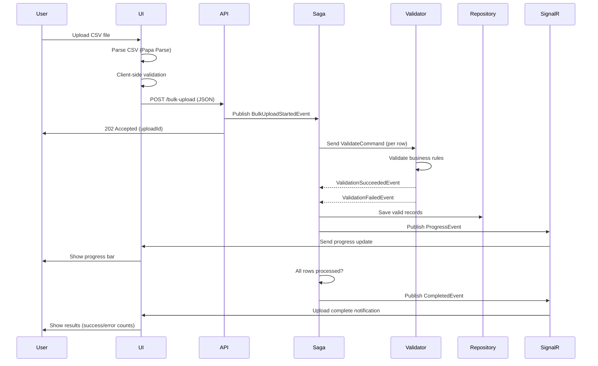

# Bulk Import Pattern

## Overview

The bulk import pattern enables users to upload CSV/Excel files containing hundreds or thousands of records, with **validation**, **progress tracking**, **error reporting**, and **real-time UI updates** via SignalR.

## Complete Flow



---

## Frontend Implementation

### CSV/Excel Upload Component

```typescript
// Beneficiary/src/UI/src/components/BulkImport.tsx
import React, { useState } from 'react';
import { Box, Button, Card, CardContent, Typography, LinearProgress } from '@mui/material';
import { useDropzone } from 'react-dropzone';
import Papa from 'papaparse';
import * as XLSX from 'xlsx';
import { BeneficiaryDto } from '../types/beneficiary.types';
import { validateBeneficiary, hasErrors } from '../utils/validation';
import { useSignalR } from '../hooks/useSignalR';

interface BulkImportProps {
  onComplete?: (uploadId: string) => void;
}

const BulkImport: React.FC<BulkImportProps> = ({ onComplete }) => {
  const [file, setFile] = useState<File | null>(null);
  const [data, setData] = useState<BeneficiaryDto[]>([]);
  const [validationErrors, setValidationErrors] = useState<string[]>([]);
  const [uploadId, setUploadId] = useState<string | null>(null);
  const [progress, setProgress] = useState(0);
  const [uploading, setUploading] = useState(false);
  
  // SignalR connection
  const { on, off } = useSignalR('http://localhost:7071/api');
  
  // Listen for progress updates
  React.useEffect(() => {
    if (!uploadId) return;
    
    const handleProgress = (data: any) => {
      if (data.uploadId === uploadId) {
        const percentComplete = (data.processedRecords / data.totalRecords) * 100;
        setProgress(percentComplete);
      }
    };
    
    const handleComplete = (data: any) => {
      if (data.uploadId === uploadId) {
        setUploading(false);
        setProgress(100);
        onComplete?.(uploadId);
        alert(`Upload complete! Success: ${data.successCount}, Errors: ${data.errorCount}`);
      }
    };
    
    on('BulkUploadProgress', handleProgress);
    on('BulkUploadCompleted', handleComplete);
    
    return () => {
      off('BulkUploadProgress');
      off('BulkUploadCompleted');
    };
  }, [uploadId]);
  
  const parseFile = (file: File) => {
    const extension = file.name.split('.').pop()?.toLowerCase();
    
    if (extension === 'csv') {
      // Parse CSV with Papa Parse
      Papa.parse(file, {
        header: true,
        skipEmptyLines: true,
        complete: (results) => {
          const parsedData = results.data as BeneficiaryDto[];
          processData(parsedData);
        },
        error: (error) => {
          alert(`CSV parsing error: ${error.message}`);
        }
      });
    } else if (extension === 'xlsx' || extension === 'xls') {
      // Parse Excel with XLSX
      const reader = new FileReader();
      reader.onload = (e) => {
        const data = new Uint8Array(e.target?.result as ArrayBuffer);
        const workbook = XLSX.read(data, { type: 'array' });
        const firstSheet = workbook.Sheets[workbook.SheetNames[0]];
        const jsonData = XLSX.utils.sheet_to_json(firstSheet) as BeneficiaryDto[];
        processData(jsonData);
      };
      reader.readAsArrayBuffer(file);
    } else {
      alert('Unsupported file format. Please upload CSV or Excel files.');
    }
  };
  
  const processData = (parsedData: BeneficiaryDto[]) => {
    setData(parsedData);
    
    // Client-side validation
    const errors: string[] = [];
    parsedData.forEach((row, index) => {
      const rowErrors = validateBeneficiary(row);
      if (hasErrors(rowErrors)) {
        errors.push(`Row ${index + 1}: ${rowErrors.map(e => e.message).join(', ')}`);
      }
    });
    
    setValidationErrors(errors);
  };
  
  const onDrop = (acceptedFiles: File[]) => {
    const uploadedFile = acceptedFiles[0];
    setFile(uploadedFile);
    parseFile(uploadedFile);
  };
  
  const { getRootProps, getInputProps, isDragActive } = useDropzone({
    onDrop,
    accept: {
      'text/csv': ['.csv'],
      'application/vnd.ms-excel': ['.xls'],
      'application/vnd.openxmlformats-officedocument.spreadsheetml.sheet': ['.xlsx']
    },
    maxFiles: 1
  });
  
  const handleSubmit = async () => {
    if (validationErrors.length > 0) {
      alert('Please fix validation errors before submitting');
      return;
    }
    
    setUploading(true);
    
    try {
      const response = await fetch('http://localhost:7075/api/beneficiary/bulk-upload', {
        method: 'POST',
        headers: {
          'Content-Type': 'application/json'
        },
        body: JSON.stringify({
          rows: data
        })
      });
      
      if (response.ok) {
        const result = await response.json();
        setUploadId(result.uploadId);
      } else {
        alert('Upload failed');
        setUploading(false);
      }
    } catch (error) {
      alert(`Error: ${error.message}`);
      setUploading(false);
    }
  };
  
  return (
    <Box sx={{ p: 3 }}>
      <Typography variant="h4" gutterBottom>
        Bulk Beneficiary Upload
      </Typography>
      
      <Card sx={{ mb: 2 }}>
        <CardContent>
          <Box
            {...getRootProps()}
            sx={{
              border: '2px dashed',
              borderColor: isDragActive ? 'primary.main' : 'grey.400',
              borderRadius: 2,
              p: 4,
              textAlign: 'center',
              cursor: 'pointer',
              bgcolor: isDragActive ? 'action.hover' : 'transparent'
            }}
          >
            <input {...getInputProps()} />
            <Typography variant="h6">
              {isDragActive
                ? 'Drop the file here...'
                : 'Drag and drop a CSV/Excel file here, or click to select'}
            </Typography>
            <Typography variant="body2" color="text.secondary" sx={{ mt: 1 }}>
              Supported formats: CSV, XLS, XLSX
            </Typography>
          </Box>
          
          {file && (
            <Box sx={{ mt: 3 }}>
              <Typography variant="h6">File: {file.name}</Typography>
              <Typography>Records: {data.length}</Typography>
              
              {validationErrors.length > 0 && (
                <Box sx={{ mt: 2, p: 2, bgcolor: 'error.light', borderRadius: 1 }}>
                  <Typography variant="h6" color="error.dark">
                    Validation Errors ({validationErrors.length}):
                  </Typography>
                  {validationErrors.slice(0, 10).map((error, index) => (
                    <Typography key={index} variant="body2" color="error.dark">
                      {error}
                    </Typography>
                  ))}
                  {validationErrors.length > 10 && (
                    <Typography variant="body2" color="error.dark">
                      ...and {validationErrors.length - 10} more
                    </Typography>
                  )}
                </Box>
              )}
              
              {validationErrors.length === 0 && !uploading && (
                <Button
                  variant="contained"
                  color="primary"
                  onClick={handleSubmit}
                  sx={{ mt: 2 }}
                  size="large"
                >
                  Submit Upload
                </Button>
              )}
              
              {uploading && (
                <Box sx={{ mt: 2 }}>
                  <Typography variant="body1" gutterBottom>
                    Processing: {Math.round(progress)}%
                  </Typography>
                  <LinearProgress variant="determinate" value={progress} />
                </Box>
              )}
            </Box>
          )}
        </CardContent>
      </Card>
    </Box>
  );
};

export default BulkImport;
```

---

## Backend Implementation

### API Endpoint

```csharp
// Beneficiary/src/Api/BulkUploadFunction.cs
using Microsoft.Azure.Functions.Worker;
using Microsoft.Azure.Functions.Worker.Http;
using System.Net;
using NServiceBus;

public class BulkUploadFunction
{
    private readonly IMessageSession _messageSession;
    private readonly ILogger<BulkUploadFunction> _logger;
    
    public BulkUploadFunction(
        IMessageSession messageSession,
        ILogger<BulkUploadFunction> logger)
    {
        _messageSession = messageSession;
        _logger = logger;
    }
    
    [Function("BulkUpload")]
    public async Task<HttpResponseData> Run(
        [HttpTrigger(AuthorizationLevel.Function, "post", Route = "beneficiary/bulk-upload")] 
        HttpRequestData req)
    {
        _logger.LogInformation("Bulk upload request received");
        
        // Parse request
        var request = await req.ReadFromJsonAsync<BulkUploadRequest>();
        
        if (request?.Rows == null || !request.Rows.Any())
        {
            var badResponse = req.CreateResponse(HttpStatusCode.BadRequest);
            await badResponse.WriteAsJsonAsync(new { error = "No data provided" });
            return badResponse;
        }
        
        var uploadId = Guid.NewGuid();
        
        // Publish event to start saga
        await _messageSession.Publish(new BulkUploadStartedEvent
        {
            UploadId = uploadId,
            TotalRecords = request.Rows.Count,
            Rows = request.Rows.Select((row, index) => new BeneficiaryRow
            {
                RowNumber = index + 1,
                Data = row
            }).ToList(),
            StartedAt = DateTime.UtcNow
        });
        
        _logger.LogInformation("Published BulkUploadStartedEvent for {UploadId}", uploadId);
        
        // Return 202 Accepted with upload ID
        var response = req.CreateResponse(HttpStatusCode.Accepted);
        await response.WriteAsJsonAsync(new { uploadId = uploadId });
        return response;
    }
}

public class BulkUploadRequest
{
    public List<BeneficiaryDto> Rows { get; set; }
}
```

### Saga Orchestration

```csharp
// Beneficiary/src/Endpoint.In/Sagas/BulkBeneficiaryUploadSaga.cs
using NServiceBus;

public class BulkBeneficiaryUploadSaga :
    Saga<BulkBeneficiaryUploadSagaData>,
    IAmStartedByMessages<BulkUploadStartedEvent>,
    IHandleMessages<BeneficiaryValidatedEvent>,
    IHandleMessages<BeneficiaryValidationFailedEvent>,
    IHandleTimeouts<BulkUploadTimeout>
{
    private readonly ILogger<BulkBeneficiaryUploadSaga> _logger;
    
    public BulkBeneficiaryUploadSaga(ILogger<BulkBeneficiaryUploadSaga> logger)
    {
        _logger = logger;
    }
    
    protected override void ConfigureHowToFindSaga(
        SagaPropertyMapper<BulkBeneficiaryUploadSagaData> mapper)
    {
        mapper.MapSaga(saga => saga.UploadId)
            .ToMessage<BulkUploadStartedEvent>(msg => msg.UploadId)
            .ToMessage<BeneficiaryValidatedEvent>(msg => msg.UploadId)
            .ToMessage<BeneficiaryValidationFailedEvent>(msg => msg.UploadId);
    }
    
    public async Task Handle(BulkUploadStartedEvent message, IMessageHandlerContext context)
    {
        _logger.LogInformation("Starting bulk upload: {UploadId} with {Count} records",
            message.UploadId, message.TotalRecords);
        
        // Initialize saga data
        Data.UploadId = message.UploadId;
        Data.TotalRecords = message.TotalRecords;
        Data.ProcessedRecords = 0;
        Data.SuccessCount = 0;
        Data.ErrorCount = 0;
        Data.Errors = new List<ValidationError>();
        Data.StartedAt = DateTime.UtcNow;
        
        // Set timeout (30 minutes max)
        await RequestTimeout<BulkUploadTimeout>(context, TimeSpan.FromMinutes(30));
        
        // Send validation command for each row
        foreach (var row in message.Rows)
        {
            await context.SendLocal(new ValidateBeneficiaryCommand
            {
                UploadId = message.UploadId,
                RowNumber = row.RowNumber,
                Data = row.Data
            });
        }
    }
    
    public async Task Handle(BeneficiaryValidatedEvent message, IMessageHandlerContext context)
    {
        Data.ProcessedRecords++;
        Data.SuccessCount++;
        
        _logger.LogInformation("Row {RowNumber} validated successfully", message.RowNumber);
        
        // Publish progress event
        await PublishProgress(context);
        
        // Check completion
        await CheckCompletion(context);
    }
    
    public async Task Handle(BeneficiaryValidationFailedEvent message, IMessageHandlerContext context)
    {
        Data.ProcessedRecords++;
        Data.ErrorCount++;
        Data.Errors.Add(new ValidationError
        {
            RowNumber = message.RowNumber,
            ErrorMessage = message.ErrorMessage
        });
        
        _logger.LogWarning("Row {RowNumber} validation failed: {Error}",
            message.RowNumber, message.ErrorMessage);
        
        // Publish progress event
        await PublishProgress(context);
        
        // Check completion
        await CheckCompletion(context);
    }
    
    public async Task Timeout(BulkUploadTimeout state, IMessageHandlerContext context)
    {
        _logger.LogError("Bulk upload timed out: {UploadId}", Data.UploadId);
        
        await context.Publish(new BulkUploadFailedEvent
        {
            UploadId = Data.UploadId,
            Reason = "Processing timeout (30 minutes exceeded)"
        });
        
        MarkAsComplete();
    }
    
    private async Task PublishProgress(IMessageHandlerContext context)
    {
        // Publish progress every 10 records or at completion
        if (Data.ProcessedRecords % 10 == 0 || Data.ProcessedRecords >= Data.TotalRecords)
        {
            await context.Publish(new BulkUploadProgressEvent
            {
                UploadId = Data.UploadId,
                TotalRecords = Data.TotalRecords,
                ProcessedRecords = Data.ProcessedRecords,
                SuccessCount = Data.SuccessCount,
                ErrorCount = Data.ErrorCount
            });
        }
    }
    
    private async Task CheckCompletion(IMessageHandlerContext context)
    {
        if (Data.ProcessedRecords >= Data.TotalRecords)
        {
            _logger.LogInformation(
                "Bulk upload completed: {UploadId}, Success: {Success}, Errors: {Errors}",
                Data.UploadId, Data.SuccessCount, Data.ErrorCount);
            
            await context.Publish(new BulkUploadCompletedEvent
            {
                UploadId = Data.UploadId,
                TotalRecords = Data.TotalRecords,
                SuccessCount = Data.SuccessCount,
                ErrorCount = Data.ErrorCount,
                Errors = Data.Errors,
                CompletedAt = DateTime.UtcNow,
                Duration = DateTime.UtcNow - Data.StartedAt
            });
            
            MarkAsComplete();
        }
    }
}

public class BulkBeneficiaryUploadSagaData : ContainSagaData
{
    public Guid UploadId { get; set; }
    public int TotalRecords { get; set; }
    public int ProcessedRecords { get; set; }
    public int SuccessCount { get; set; }
    public int ErrorCount { get; set; }
    public List<ValidationError> Errors { get; set; }
    public DateTime StartedAt { get; set; }
}

public class BulkUploadTimeout { }
```

### Validation Handler

```csharp
// Beneficiary/src/Endpoint.In/Handlers/ValidateBeneficiaryCommandHandler.cs
public class ValidateBeneficiaryCommandHandler : 
    IHandleMessages<ValidateBeneficiaryCommand>
{
    private readonly IBeneficiaryRepository _repository;
    private readonly IValidator<BeneficiaryDto> _validator;
    private readonly ILogger<ValidateBeneficiaryCommandHandler> _logger;
    
    public async Task Handle(ValidateBeneficiaryCommand message, IMessageHandlerContext context)
    {
        _logger.LogInformation("Validating row {RowNumber}", message.RowNumber);
        
        // 1. FluentValidation
        var validationResult = await _validator.ValidateAsync(message.Data);
        
        if (!validationResult.IsValid)
        {
            var errors = string.Join(", ", validationResult.Errors.Select(e => e.ErrorMessage));
            
            await context.Publish(new BeneficiaryValidationFailedEvent
            {
                UploadId = message.UploadId,
                RowNumber = message.RowNumber,
                ErrorMessage = errors
            });
            return;
        }
        
        // 2. Check for duplicates
        var existing = await _repository.FindByDocumentAsync(
            message.Data.DocumentNumber,
            message.Data.Nationality);
        
        if (existing != null)
        {
            await context.Publish(new BeneficiaryValidationFailedEvent
            {
                UploadId = message.UploadId,
                RowNumber = message.RowNumber,
                ErrorMessage = "Duplicate: Beneficiary with this document number already exists"
            });
            return;
        }
        
        // 3. Save beneficiary
        var beneficiary = MapToEntity(message.Data);
        await _repository.SaveAsync(beneficiary);
        
        // 4. Publish success event
        await context.Publish(new BeneficiaryValidatedEvent
        {
            UploadId = message.UploadId,
            RowNumber = message.RowNumber,
            BeneficiaryId = beneficiary.Id
        });
        
        _logger.LogInformation("Row {RowNumber} validated and saved", message.RowNumber);
    }
    
    private Beneficiary MapToEntity(BeneficiaryDto dto)
    {
        return new Beneficiary
        {
            Id = Guid.NewGuid(),
            FirstName = dto.FirstName,
            LastName = dto.LastName,
            DateOfBirth = DateTime.Parse(dto.DateOfBirth),
            Nationality = dto.Nationality,
            DocumentType = dto.DocumentType,
            DocumentNumber = dto.DocumentNumber,
            Email = dto.Email,
            Phone = dto.Phone,
            CaseStatus = CaseStatus.Pending,
            CreatedAt = DateTime.UtcNow
        };
    }
}
```

---

## SignalR Integration

### SignalR Handler (Platform Domain)

```csharp
// Platform/src/Endpoint.In/Handlers/SignalRProgressHandler.cs
public class SignalRProgressHandler :
    IHandleMessages<BulkUploadProgressEvent>,
    IHandleMessages<BulkUploadCompletedEvent>
{
    private readonly IHubContext<NotificationHub> _hubContext;
    private readonly ILogger<SignalRProgressHandler> _logger;
    
    public async Task Handle(BulkUploadProgressEvent message, IMessageHandlerContext context)
    {
        _logger.LogInformation("Sending progress update: {Processed}/{Total}",
            message.ProcessedRecords, message.TotalRecords);
        
        await _hubContext.Clients.All.SendAsync("BulkUploadProgress", new
        {
            uploadId = message.UploadId,
            totalRecords = message.TotalRecords,
            processedRecords = message.ProcessedRecords,
            successCount = message.SuccessCount,
            errorCount = message.ErrorCount
        });
    }
    
    public async Task Handle(BulkUploadCompletedEvent message, IMessageHandlerContext context)
    {
        _logger.LogInformation("Sending completion notification for {UploadId}", message.UploadId);
        
        await _hubContext.Clients.All.SendAsync("BulkUploadCompleted", new
        {
            uploadId = message.UploadId,
            totalRecords = message.TotalRecords,
            successCount = message.SuccessCount,
            errorCount = message.ErrorCount,
            errors = message.Errors,
            duration = message.Duration.TotalSeconds
        });
    }
}
```

---

## Sample CSV Template

```csv
firstName,lastName,dateOfBirth,nationality,documentType,documentNumber,email,phone
John,Doe,1990-01-15,USA,PASSPORT,123456789,john.doe@example.com,+1234567890
Jane,Smith,1985-03-22,UK,ID_CARD,987654321,jane.smith@example.com,+4412345678
```

**Download Template**:
```typescript
// Generate template file for download
const generateTemplate = () => {
  const template = `firstName,lastName,dateOfBirth,nationality,documentType,documentNumber,email,phone
John,Doe,1990-01-15,USA,PASSPORT,123456789,john.doe@example.com,+1234567890`;
  
  const blob = new Blob([template], { type: 'text/csv' });
  const url = window.URL.createObjectURL(blob);
  const link = document.createElement('a');
  link.href = url;
  link.download = 'beneficiary-template.csv';
  link.click();
};
```

---

## Error Handling

### Partial Success
```csharp
// Continue processing even if some rows fail
if (Data.ProcessedRecords >= Data.TotalRecords)
{
    if (Data.ErrorCount > 0)
    {
        // Partial success
        await context.Publish(new BulkUploadCompletedWithErrorsEvent
        {
            UploadId = Data.UploadId,
            SuccessCount = Data.SuccessCount,
            ErrorCount = Data.ErrorCount,
            Errors = Data.Errors
        });
    }
    else
    {
        // Full success
        await context.Publish(new BulkUploadCompletedEvent
        {
            UploadId = Data.UploadId,
            SuccessCount = Data.SuccessCount
        });
    }
}
```

### Download Error Report
```typescript
const downloadErrorReport = (errors: ValidationError[]) => {
  const csv = Papa.unparse(errors);
  const blob = new Blob([csv], { type: 'text/csv' });
  const url = window.URL.createObjectURL(blob);
  const link = document.createElement('a');
  link.href = url;
  link.download = 'bulk-upload-errors.csv';
  link.click();
};
```

---

## Performance Optimization

### Batch Processing
```csharp
// Process rows in batches for better performance
const int batchSize = 100;
var batches = message.Rows
    .Select((row, index) => new { row, index })
    .GroupBy(x => x.index / batchSize)
    .Select(g => g.Select(x => x.row).ToList());

foreach (var batch in batches)
{
    await context.SendLocal(new ValidateBatchCommand
    {
        UploadId = message.UploadId,
        Rows = batch
    });
}
```

### Parallel Processing
```csharp
// Configure NServiceBus for parallel processing
endpointConfiguration.LimitMessageProcessingConcurrencyTo(10);  // Process 10 messages at once
```

---

**Next**: See [SignalR Patterns](signalr-patterns.md) for real-time communication architecture and progress notification details.
