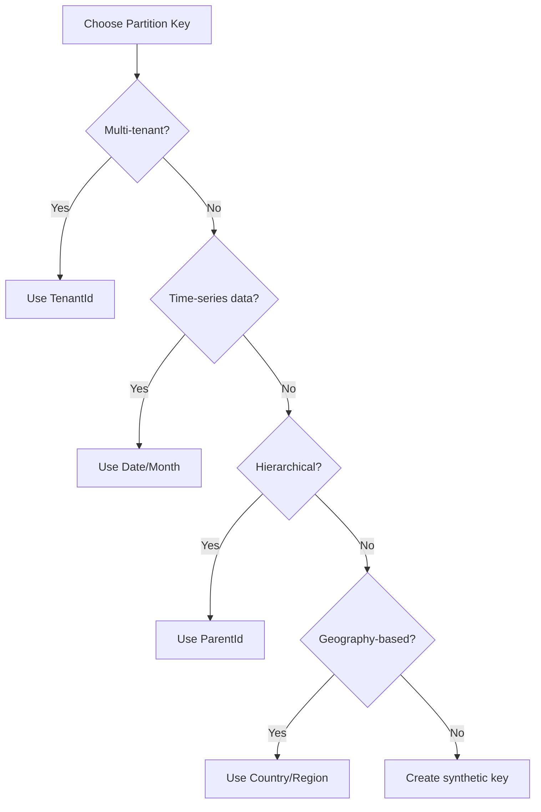

# Data Patterns

## Overview

This framework uses **Azure CosmosDB** as the primary database, with **one database per domain** to maintain bounded context isolation. Each domain owns its data schema, partition strategy, and repository implementations.

## Core Principles

### 1. One Database Per Domain
Each business domain has its own CosmosDB database:

```
Beneficiary Domain → BeneficiaryDb
Questions Domain → QuestionsDb
Points Domain → PointsDb
Medical Domain → MedicalDb
```

**Why?**
- **Bounded contexts**: Clear data ownership
- **Independent scaling**: Scale each database separately
- **Schema evolution**: Change schema without affecting other domains
- **Resilience**: Failure in one database doesn't affect others

### 2. Repository Pattern
All database access goes through repositories:

```csharp
// Domain layer (interface)
public interface IBeneficiaryRepository
{
    Task<Beneficiary> GetByIdAsync(Guid id);
    Task SaveAsync(Beneficiary beneficiary);
    Task DeleteAsync(Guid id);
}

// Infrastructure layer (implementation)
public class BeneficiaryRepository : IBeneficiaryRepository
{
    // CosmosDB implementation
}
```

**Benefits**:
- Testable (mock repository in tests)
- Swappable (change from CosmosDB to SQL without changing domain code)
- Clear data access layer

### 3. CQRS Pattern (Optional)
Separate **read models** from **write models**:

```csharp
// Write model (command side)
public class Beneficiary
{
    public Guid Id { get; set; }
    public string FirstName { get; set; }
    public string LastName { get; set; }
    // Rich domain logic
}

// Read model (query side)
public class BeneficiaryListItem
{
    public Guid Id { get; set; }
    public string FullName { get; set; }
    public string Status { get; set; }
    // Optimized for display
}
```

**Use When**:
- Read and write requirements differ significantly
- Performance optimization needed (denormalized reads)
- Complex queries (projections, aggregations)

---

## CosmosDB Database Structure

### Database Per Domain

```
CosmosDB Account
├── BeneficiaryDb
│   ├── Beneficiaries (container)
│   ├── Sagas (container)
│   └── Leases (container, for change feed)
├── QuestionsDb
│   ├── Questions (container)
│   ├── Answers (container)
│   └── Sagas (container)
└── PointsDb
    ├── PointsAccounts (container)
    ├── Transactions (container)
    └── Sagas (container)
```

### Container Structure

Each domain typically has:
- **Primary entity container(s)**: Business entities
- **Sagas container**: NServiceBus saga data
- **Leases container**: Change feed tracking (if using change feed)

**Example** (Beneficiary Domain):
```csharp
// Beneficiary/Infrastructure/CosmosDbInitializer.cs
public class CosmosDbInitializer
{
    public async Task InitializeAsync(CosmosClient client)
    {
        // Create database
        var database = await client.CreateDatabaseIfNotExistsAsync("BeneficiaryDb");
        
        // Create containers
        await database.Database.CreateContainerIfNotExistsAsync(
            new ContainerProperties
            {
                Id = "Beneficiaries",
                PartitionKeyPath = "/partitionKey"
            });
        
        await database.Database.CreateContainerIfNotExistsAsync(
            new ContainerProperties
            {
                Id = "Sagas",
                PartitionKeyPath = "/id"
            });
    }
}
```

---

## Partition Key Strategy

### What is a Partition Key?

CosmosDB uses partition keys to **distribute data across physical partitions** for scalability.

**Key Points**:
- All queries should include partition key (for performance)
- Partition key cannot be changed after document creation
- Choose partition key based on access patterns

### Common Strategies

#### Strategy 1: Entity ID (Not Recommended)
```csharp
public class Beneficiary
{
    [JsonProperty("id")]
    public Guid Id { get; set; }
    
    [JsonProperty("partitionKey")]
    public string PartitionKey => Id.ToString();  // BAD: Creates hot partitions
}
```

**Problems**:
- Each document is its own partition (inefficient)
- Cannot query across multiple beneficiaries efficiently

#### Strategy 2: Logical Grouping (Recommended)
```csharp
public class Beneficiary
{
    [JsonProperty("id")]
    public Guid Id { get; set; }
    
    [JsonProperty("partitionKey")]
    public string PartitionKey { get; set; }  // e.g., "country:USA" or "office:NYC"
    
    public string Country { get; set; }
    public string Office { get; set; }
}

// When creating
var beneficiary = new Beneficiary
{
    Id = Guid.NewGuid(),
    PartitionKey = $"country:{country}",  // Logical grouping
    Country = country,
    Office = office
};
```

**Benefits**:
- Related documents in same partition
- Efficient queries within partition
- Balanced distribution

#### Strategy 3: Composite Key
```csharp
public class Answer
{
    [JsonProperty("id")]
    public Guid Id { get; set; }
    
    [JsonProperty("partitionKey")]
    public string PartitionKey { get; set; }  // e.g., "user:123|question:456"
    
    public Guid UserId { get; set; }
    public Guid QuestionId { get; set; }
}

// When creating
var answer = new Answer
{
    Id = Guid.NewGuid(),
    PartitionKey = $"user:{userId}|question:{questionId}",
    UserId = userId,
    QuestionId = questionId
};
```

**Use When**:
- Multi-tenancy (partition by tenant)
- Time-series data (partition by date)
- Hierarchical data (partition by parent)

### Choosing Partition Key

**Ask These Questions**:
1. **How will data be queried?** (most common query pattern)
2. **What is the cardinality?** (number of unique values)
3. **Is distribution even?** (avoid hot partitions)

**Example Decision Tree**:


---

## Repository Implementation

### Basic Repository

```csharp
// Beneficiary/Infrastructure/BeneficiaryRepository.cs
public class BeneficiaryRepository : IBeneficiaryRepository
{
    private readonly Container _container;
    private readonly ILogger<BeneficiaryRepository> _logger;
    
    public BeneficiaryRepository(
        CosmosClient cosmosClient,
        ILogger<BeneficiaryRepository> logger)
    {
        _container = cosmosClient.GetContainer("BeneficiaryDb", "Beneficiaries");
        _logger = logger;
    }
    
    public async Task<Beneficiary> GetByIdAsync(Guid id, string partitionKey)
    {
        try
        {
            var response = await _container.ReadItemAsync<Beneficiary>(
                id.ToString(),
                new PartitionKey(partitionKey));
            
            return response.Resource;
        }
        catch (CosmosException ex) when (ex.StatusCode == HttpStatusCode.NotFound)
        {
            return null;
        }
    }
    
    public async Task SaveAsync(Beneficiary beneficiary)
    {
        await _container.UpsertItemAsync(
            beneficiary,
            new PartitionKey(beneficiary.PartitionKey));
        
        _logger.LogInformation(
            "Saved beneficiary: {BeneficiaryId}", 
            beneficiary.Id);
    }
    
    public async Task DeleteAsync(Guid id, string partitionKey)
    {
        await _container.DeleteItemAsync<Beneficiary>(
            id.ToString(),
            new PartitionKey(partitionKey));
        
        _logger.LogInformation("Deleted beneficiary: {BeneficiaryId}", id);
    }
}
```

### Query Repository

```csharp
public interface IBeneficiaryQueryRepository
{
    Task<List<Beneficiary>> GetByStatusAsync(CaseStatus status);
    Task<List<Beneficiary>> GetByCountryAsync(string country);
    Task<List<BeneficiaryListItem>> GetAllAsync(int pageSize, string continuationToken);
}

public class BeneficiaryQueryRepository : IBeneficiaryQueryRepository
{
    private readonly Container _container;
    
    public async Task<List<Beneficiary>> GetByStatusAsync(CaseStatus status)
    {
        var query = new QueryDefinition(
            "SELECT * FROM c WHERE c.caseStatus = @status")
            .WithParameter("@status", status.ToString());
        
        var iterator = _container.GetItemQueryIterator<Beneficiary>(query);
        var results = new List<Beneficiary>();
        
        while (iterator.HasMoreResults)
        {
            var response = await iterator.ReadNextAsync();
            results.AddRange(response);
        }
        
        return results;
    }
    
    public async Task<List<Beneficiary>> GetByCountryAsync(string country)
    {
        // Efficient: uses partition key
        var query = new QueryDefinition(
            "SELECT * FROM c WHERE c.country = @country")
            .WithParameter("@country", country);
        
        var requestOptions = new QueryRequestOptions
        {
            PartitionKey = new PartitionKey($"country:{country}")  // Scoped to partition
        };
        
        var iterator = _container.GetItemQueryIterator<Beneficiary>(
            query, 
            requestOptions: requestOptions);
        
        var results = new List<Beneficiary>();
        while (iterator.HasMoreResults)
        {
            var response = await iterator.ReadNextAsync();
            results.AddRange(response);
        }
        
        return results;
    }
    
    public async Task<(List<BeneficiaryListItem> Items, string ContinuationToken)> 
        GetAllAsync(int pageSize = 20, string continuationToken = null)
    {
        var query = new QueryDefinition("SELECT * FROM c");
        
        var requestOptions = new QueryRequestOptions
        {
            MaxItemCount = pageSize
        };
        
        var iterator = _container.GetItemQueryIterator<BeneficiaryListItem>(
            query,
            continuationToken,
            requestOptions);
        
        var response = await iterator.ReadNextAsync();
        
        return (response.ToList(), response.ContinuationToken);
    }
}
```

### CQRS Repository (Separate Read/Write)

```csharp
// Write repository (commands)
public class BeneficiaryCommandRepository : IBeneficiaryCommandRepository
{
    public async Task SaveAsync(Beneficiary beneficiary)
    {
        // Write to main container
        await _container.UpsertItemAsync(beneficiary);
    }
}

// Read repository (queries)
public class BeneficiaryQueryRepository : IBeneficiaryQueryRepository
{
    public async Task<BeneficiaryListItem> GetByIdAsync(Guid id)
    {
        // Read from denormalized view
        return await _container.ReadItemAsync<BeneficiaryListItem>(id.ToString());
    }
    
    public async Task<List<BeneficiaryListItem>> GetAllAsync()
    {
        // Optimized read model
        var query = new QueryDefinition("SELECT * FROM c");
        return await ExecuteQueryAsync<BeneficiaryListItem>(query);
    }
}
```

---

## Document Models

### Domain Model vs. Document Model

**Domain Model** (used in business logic):
```csharp
// Beneficiary/Domain/Models/Beneficiary.cs
public class Beneficiary
{
    public Guid Id { get; private set; }
    public string FirstName { get; private set; }
    public string LastName { get; private set; }
    public DateTime DateOfBirth { get; private set; }
    public CaseStatus Status { get; private set; }
    
    // Rich domain logic
    public void UpdateStatus(CaseStatus newStatus)
    {
        if (Status == CaseStatus.Closed)
            throw new InvalidOperationException("Cannot update closed case");
            
        Status = newStatus;
    }
    
    public bool IsEligible()
    {
        var age = CalculateAge();
        return age >= 18;
    }
    
    private int CalculateAge()
    {
        return DateTime.UtcNow.Year - DateOfBirth.Year;
    }
}
```

**Document Model** (stored in CosmosDB):
```csharp
// Beneficiary/Infrastructure/Models/BeneficiaryDocument.cs
public class BeneficiaryDocument
{
    [JsonProperty("id")]
    public string Id { get; set; }  // CosmosDB requires string id
    
    [JsonProperty("partitionKey")]
    public string PartitionKey { get; set; }
    
    [JsonProperty("firstName")]
    public string FirstName { get; set; }
    
    [JsonProperty("lastName")]
    public string LastName { get; set; }
    
    [JsonProperty("dateOfBirth")]
    public DateTime DateOfBirth { get; set; }
    
    [JsonProperty("status")]
    public string Status { get; set; }  // Stored as string
    
    [JsonProperty("createdAt")]
    public DateTime CreatedAt { get; set; }
    
    [JsonProperty("updatedAt")]
    public DateTime UpdatedAt { get; set; }
    
    [JsonProperty("_etag")]
    public string ETag { get; set; }  // For optimistic concurrency
}
```

### Mapping Between Models

```csharp
public class BeneficiaryRepository
{
    private BeneficiaryDocument ToDocument(Beneficiary beneficiary)
    {
        return new BeneficiaryDocument
        {
            Id = beneficiary.Id.ToString(),
            PartitionKey = $"country:{beneficiary.Country}",
            FirstName = beneficiary.FirstName,
            LastName = beneficiary.LastName,
            DateOfBirth = beneficiary.DateOfBirth,
            Status = beneficiary.Status.ToString(),
            UpdatedAt = DateTime.UtcNow
        };
    }
    
    private Beneficiary ToDomain(BeneficiaryDocument document)
    {
        return new Beneficiary
        {
            Id = Guid.Parse(document.Id),
            FirstName = document.FirstName,
            LastName = document.LastName,
            DateOfBirth = document.DateOfBirth,
            Status = Enum.Parse<CaseStatus>(document.Status)
        };
    }
    
    public async Task SaveAsync(Beneficiary beneficiary)
    {
        var document = ToDocument(beneficiary);
        await _container.UpsertItemAsync(document);
    }
    
    public async Task<Beneficiary> GetByIdAsync(Guid id, string partitionKey)
    {
        var document = await _container.ReadItemAsync<BeneficiaryDocument>(
            id.ToString(),
            new PartitionKey(partitionKey));
        
        return ToDomain(document.Resource);
    }
}
```

---

## Optimistic Concurrency

Use ETags to prevent concurrent updates:

```csharp
public async Task UpdateAsync(Beneficiary beneficiary, string etag)
{
    var document = ToDocument(beneficiary);
    
    var requestOptions = new ItemRequestOptions
    {
        IfMatchEtag = etag  // Only update if ETag matches
    };
    
    try
    {
        await _container.ReplaceItemAsync(
            document,
            document.Id,
            new PartitionKey(document.PartitionKey),
            requestOptions);
    }
    catch (CosmosException ex) when (ex.StatusCode == HttpStatusCode.PreconditionFailed)
    {
        throw new ConcurrencyException("Document was modified by another process");
    }
}
```

**Flow**:
1. Read document (includes ETag)
2. Modify document
3. Write with ETag (fails if document changed)

---

## Query Patterns

### Point Read (Most Efficient)
```csharp
// Requires: ID + Partition Key
var beneficiary = await _container.ReadItemAsync<Beneficiary>(
    id.ToString(),
    new PartitionKey(partitionKey));
```

**RU Cost**: ~1 RU (cheapest)

### Partition Query
```csharp
// Query within single partition
var query = new QueryDefinition(
    "SELECT * FROM c WHERE c.status = @status")
    .WithParameter("@status", "ACTIVE");

var requestOptions = new QueryRequestOptions
{
    PartitionKey = new PartitionKey("country:USA")  // Scoped to partition
};

var results = await ExecuteQueryAsync(query, requestOptions);
```

**RU Cost**: ~2-10 RUs (efficient)

### Cross-Partition Query
```csharp
// Query across all partitions
var query = new QueryDefinition(
    "SELECT * FROM c WHERE c.lastName = @lastName")
    .WithParameter("@lastName", "Smith");

// No partition key specified - queries all partitions
var results = await ExecuteQueryAsync(query);
```

**RU Cost**: ~50-500 RUs (expensive)

**Best Practice**: Avoid cross-partition queries when possible.

### Pagination
```csharp
public async Task<PagedResult<Beneficiary>> GetPagedAsync(
    int pageSize = 20, 
    string continuationToken = null)
{
    var query = new QueryDefinition("SELECT * FROM c");
    
    var requestOptions = new QueryRequestOptions
    {
        MaxItemCount = pageSize
    };
    
    var iterator = _container.GetItemQueryIterator<Beneficiary>(
        query,
        continuationToken,
        requestOptions);
    
    var response = await iterator.ReadNextAsync();
    
    return new PagedResult<Beneficiary>
    {
        Items = response.ToList(),
        ContinuationToken = response.ContinuationToken,
        HasMoreResults = iterator.HasMoreResults
    };
}
```

---

## Change Feed (Event-Driven Reads)

Monitor changes in real-time:

```csharp
public class BeneficiaryChangeFeedProcessor
{
    public async Task StartAsync()
    {
        var processor = _container
            .GetChangeFeedProcessorBuilder<BeneficiaryDocument>(
                "beneficiary-processor",
                HandleChangesAsync)
            .WithInstanceName("instance1")
            .WithLeaseContainer(_leaseContainer)
            .Build();
        
        await processor.StartAsync();
    }
    
    private async Task HandleChangesAsync(
        ChangeFeedProcessorContext context,
        IReadOnlyCollection<BeneficiaryDocument> changes,
        CancellationToken cancellationToken)
    {
        foreach (var change in changes)
        {
            _logger.LogInformation(
                "Beneficiary changed: {Id}, Status: {Status}",
                change.Id,
                change.Status);
            
            // React to change (e.g., update read model, send notification)
            await _messageSession.Publish(new BeneficiaryChangedEvent
            {
                BeneficiaryId = Guid.Parse(change.Id),
                NewStatus = change.Status
            });
        }
    }
}
```

**Use Cases**:
- Sync to read model (CQRS)
- Trigger workflows
- Send notifications
- Audit logging

---

## Indexing Strategy

### Default Indexing
CosmosDB automatically indexes **all properties**.

**Problem**: Wastes RUs on properties you never query.

### Custom Indexing
```csharp
var containerProperties = new ContainerProperties
{
    Id = "Beneficiaries",
    PartitionKeyPath = "/partitionKey",
    IndexingPolicy = new IndexingPolicy
    {
        Automatic = true,
        IndexingMode = IndexingMode.Consistent,
        IncludedPaths =
        {
            new IncludedPath { Path = "/firstName/*" },
            new IncludedPath { Path = "/lastName/*" },
            new IncludedPath { Path = "/status/*" }
        },
        ExcludedPaths =
        {
            new ExcludedPath { Path = "/medicalHistory/*" },  // Don't query this
            new ExcludedPath { Path = "/notes/*" }  // Don't query this
        }
    }
};

await database.CreateContainerIfNotExistsAsync(containerProperties);
```

**Benefits**:
- Lower RU costs for writes
- Faster writes (less indexing)
- Only index what you query

---

## Transactions (Batch Operations)

Execute multiple operations atomically:

```csharp
public async Task TransferPointsAsync(Guid fromUserId, Guid toUserId, int points)
{
    var partitionKey = new PartitionKey($"tenant:{tenantId}");
    
    var batch = _container.CreateTransactionalBatch(partitionKey)
        .ReadItem(fromUserId.ToString())
        .ReadItem(toUserId.ToString())
        .PatchItem(fromUserId.ToString(), new[]
        {
            PatchOperation.Increment("/balance", -points)
        })
        .PatchItem(toUserId.ToString(), new[]
        {
            PatchOperation.Increment("/balance", points)
        });
    
    var response = await batch.ExecuteAsync();
    
    if (!response.IsSuccessStatusCode)
        throw new Exception("Transfer failed");
}
```

**Limitations**:
- All operations must be in **same partition**
- Max 100 operations per batch
- All succeed or all fail (atomic)

---

## Best Practices

### 1. Use Partition Keys Effectively
```csharp
// Good - partition by tenant/country
PartitionKey = $"tenant:{tenantId}"

// Bad - partition by ID (too granular)
PartitionKey = Id.ToString()
```

### 2. Include Partition Key in Queries
```csharp
// Good - scoped to partition
var options = new QueryRequestOptions
{
    PartitionKey = new PartitionKey("country:USA")
};

// Bad - cross-partition query
var options = new QueryRequestOptions();  // No partition key
```

### 3. Use Point Reads When Possible
```csharp
// Good - 1 RU
var item = await _container.ReadItemAsync<T>(id, partitionKey);

// Bad - 10+ RUs
var query = new QueryDefinition("SELECT * FROM c WHERE c.id = @id");
var results = await ExecuteQueryAsync(query);
```

### 4. Paginate Large Result Sets
```csharp
// Good - paginated
var iterator = _container.GetItemQueryIterator<T>(query, requestOptions: new QueryRequestOptions { MaxItemCount = 20 });

// Bad - load all results
var allResults = new List<T>();
while (iterator.HasMoreResults)
{
    allResults.AddRange(await iterator.ReadNextAsync());  // Could be millions!
}
```

### 5. Use Async/Await Properly
```csharp
// Good
await _container.UpsertItemAsync(item);

// Bad - blocking
_container.UpsertItemAsync(item).Wait();  // Deadlock risk
```

### 6. Handle CosmosExceptions
```csharp
try
{
    await _container.ReadItemAsync<T>(id, partitionKey);
}
catch (CosmosException ex) when (ex.StatusCode == HttpStatusCode.NotFound)
{
    return null;  // Expected case
}
catch (CosmosException ex) when (ex.StatusCode == HttpStatusCode.TooManyRequests)
{
    // Retry with backoff
    await Task.Delay(ex.RetryAfter ?? TimeSpan.FromSeconds(1));
    return await GetByIdAsync(id, partitionKey);
}
```

---

## Performance Optimization

### Request Units (RUs)
Every operation costs RUs:
- **Point read**: 1 RU
- **Partition query**: 2-10 RUs
- **Cross-partition query**: 50-500 RUs
- **Write**: 5-10 RUs
- **Delete**: 5 RUs

**Optimize**:
- Use point reads (ID + partition key)
- Scope queries to single partition
- Index only queried properties
- Use pagination

### Connection Management
```csharp
// Good - singleton CosmosClient
services.AddSingleton<CosmosClient>(sp =>
{
    var connectionString = configuration["CosmosDb:ConnectionString"];
    return new CosmosClient(connectionString, new CosmosClientOptions
    {
        ConnectionMode = ConnectionMode.Direct,  // Faster
        MaxRetryAttemptsOnRateLimitedRequests = 3,
        MaxRetryWaitTimeOnRateLimitedRequests = TimeSpan.FromSeconds(10)
    });
});

// Bad - new client per request
var client = new CosmosClient(connectionString);  // Don't do this!
```

### Bulk Operations
```csharp
var clientOptions = new CosmosClientOptions
{
    AllowBulkExecution = true  // Parallel writes
};

var client = new CosmosClient(connectionString, clientOptions);

var tasks = new List<Task>();
foreach (var item in items)
{
    tasks.Add(_container.UpsertItemAsync(item));
}

await Task.WhenAll(tasks);  // Execute in parallel
```

---

**Next**: See [UI Architecture](ui-architecture.md) for React micro-frontends, Module Federation, component patterns, and theme consistency.
