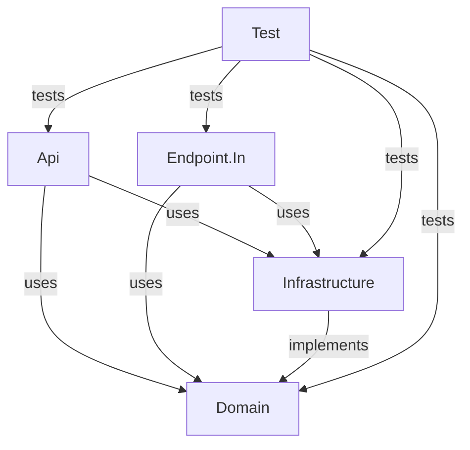

# Domain Template Structure

## Overview

Every business domain in the architecture follows an **identical project structure** to ensure consistency, predictability, and ease of development. This document defines the exact structure that must be created for every new domain.

## Domain Structure

```
{DomainName}/
├── Solution.sln                    # Visual Studio solution file
├── docs/                           # Domain-specific documentation
│   ├── {domain}-validation-rules.md
│   ├── {feature}-implementation.md
│   └── business-requirements.md
├── src/
│   ├── Api/                        # HTTP API endpoints
│   ├── Domain/                     # Core business logic
│   ├── Endpoint.In/                # Message processing
│   ├── Infrastructure/             # Data access & integrations
│   ├── Test/                       # Unit & integration tests
│   └── UI/                         # React frontend (optional)
└── README.md                       # Domain overview
```

## Project Breakdown

### 1. Api Project

**Purpose**: HTTP endpoints for external access to the domain

**Structure**:
```
Api/
├── Api.csproj
├── Program.cs                      # Dependency injection, NServiceBus setup
├── host.json                       # Azure Functions configuration
├── local.settings.json.template    # Environment variable template
├── {Entity}Function.cs             # HTTP trigger functions
├── Dockerfile                      # Container image (if using Docker)
└── bin/, obj/                      # Build artifacts (gitignored)
```

**Key Responsibilities**:
- Expose HTTP endpoints using Azure Functions HTTP triggers
- Validate incoming requests
- Publish commands/events to NServiceBus
- Return responses (async patterns for long-running operations)
- Configure dependency injection
- CORS configuration for UI access

**Example Function**:
```csharp
public class BeneficiaryRegistrationFunction
{
    private readonly IMessageSession _messageSession;
    
    [Function("RegisterBeneficiary")]
    public async Task<HttpResponseData> Run(
        [HttpTrigger(AuthorizationLevel.Function, "post")] 
        HttpRequestData req)
    {
        var command = await req.ReadFromJsonAsync<RegisterBeneficiaryCommand>();
        await _messageSession.Send(command);
        return req.CreateResponse(HttpStatusCode.Accepted);
    }
}
```

**Files to Generate**:
- `Api.csproj` - Project file with NuGet dependencies
- `Program.cs` - DI configuration and NServiceBus setup
- `{Entity}Function.cs` - One per HTTP endpoint
- `host.json` - Azure Functions configuration
- `local.settings.json.template` - Template for environment variables
- `Dockerfile` - If using Docker hosting

---

### 2. Domain Project

**Purpose**: Core business logic, entities, domain events, and contracts

**Structure**:
```
Domain/
├── Domain.csproj
├── Entities/
│   └── {Entity}.cs                 # Domain models (e.g., Beneficiary, Question)
├── ValueObjects/
│   └── {ValueObject}.cs            # Immutable value objects
├── Contracts/
│   ├── Commands/
│   │   └── {Command}.cs            # Commands (e.g., RegisterBeneficiaryCommand)
│   ├── Events/
│   │   └── {Event}.cs              # Domain events (e.g., BeneficiaryRegisteredEvent)
│   └── Queries/
│       └── {Query}.cs              # Query contracts (CQRS read models)
├── Services/
│   └── I{Service}.cs               # Business service interfaces
├── Managers/
│   └── {Manager}.cs                # Business logic coordination
└── Exceptions/
    └── {DomainException}.cs        # Domain-specific exceptions
```

**Key Responsibilities**:
- Define domain entities with business rules
- Define commands (write operations)
- Define events (domain notifications)
- Define query contracts (read operations)
- Business logic (no infrastructure concerns)
- Domain validation rules

**Example Entity**:
```csharp
public class Beneficiary
{
    public Guid Id { get; private set; }
    public string FirstName { get; private set; }
    public string LastName { get; private set; }
    public DateTime DateOfBirth { get; private set; }
    public CaseStatus Status { get; private set; }
    
    public void UpdateStatus(CaseStatus newStatus)
    {
        // Business rule: can't reopen completed cases
        if (Status == CaseStatus.Completed && newStatus != CaseStatus.Completed)
            throw new InvalidOperationException("Cannot reopen completed case");
            
        Status = newStatus;
    }
}
```

**Files to Generate**:
- `Domain.csproj` - Pure .NET project (no infrastructure dependencies)
- `Entities/{Entity}.cs` - One per business entity
- `Contracts/Commands/{Command}.cs` - One per write operation
- `Contracts/Events/{Event}.cs` - One per domain event
- `Services/I{Service}.cs` - Business service interfaces
- `Managers/{Manager}.cs` - Business logic coordinators

---

### 3. Endpoint.In Project

**Purpose**: Background message processing, sagas, and event handlers

**Structure**:
```
Endpoint.In/
├── Endpoint.In.csproj
├── Program.cs                      # NServiceBus endpoint configuration
├── host.json                       # Azure Functions configuration
├── local.settings.json.template    # Environment variable template
├── Handlers/
│   ├── Commands/
│   │   └── {Command}Handler.cs     # Command handlers
│   └── Events/
│       └── {Event}Handler.cs       # Event handlers (subscribers)
├── Sagas/
│   ├── {Saga}Data.cs               # Saga state
│   └── {Saga}.cs                   # Long-running workflows
└── Dockerfile                      # Container image (if using Docker)
```

**Key Responsibilities**:
- Process commands asynchronously
- Subscribe to and handle domain events (own domain + cross-domain)
- Coordinate long-running workflows (sagas)
- Implement retry and error handling
- Publish events to other domains

**Example Command Handler**:
```csharp
public class RegisterBeneficiaryCommandHandler : 
    IHandleMessages<RegisterBeneficiaryCommand>
{
    private readonly IBeneficiaryRepository _repository;
    
    public async Task Handle(RegisterBeneficiaryCommand message, 
        IMessageHandlerContext context)
    {
        var beneficiary = new Beneficiary(
            message.FirstName, 
            message.LastName, 
            message.DateOfBirth);
            
        await _repository.SaveAsync(beneficiary);
        
        await context.Publish(new BeneficiaryRegisteredEvent
        {
            BeneficiaryId = beneficiary.Id,
            FirstName = message.FirstName,
            LastName = message.LastName
        });
    }
}
```

**Example Saga**:
```csharp
public class BulkBeneficiaryUploadSaga : 
    Saga<BulkBeneficiaryUploadSagaData>,
    IAmStartedByMessages<BulkUploadStartedEvent>,
    IHandleMessages<BeneficiaryValidatedEvent>,
    IHandleTimeouts<UploadTimeoutEvent>
{
    protected override void ConfigureHowToFindSaga(
        SagaPropertyMapper<BulkBeneficiaryUploadSagaData> mapper)
    {
        mapper.MapSaga(saga => saga.UploadId)
            .ToMessage<BulkUploadStartedEvent>(msg => msg.UploadId);
    }
    
    public async Task Handle(BulkUploadStartedEvent message, 
        IMessageHandlerContext context)
    {
        Data.UploadId = message.UploadId;
        Data.TotalRecords = message.TotalRecords;
        Data.ProcessedRecords = 0;
        
        await RequestTimeout<UploadTimeoutEvent>(context, 
            TimeSpan.FromMinutes(30));
    }
    
    public async Task Handle(BeneficiaryValidatedEvent message, 
        IMessageHandlerContext context)
    {
        Data.ProcessedRecords++;
        
        if (Data.ProcessedRecords >= Data.TotalRecords)
        {
            await context.Publish(new BulkUploadCompletedEvent
            {
                UploadId = Data.UploadId,
                SuccessCount = Data.SuccessCount,
                ErrorCount = Data.ErrorCount
            });
            
            MarkAsComplete();
        }
    }
    
    public Task Timeout(UploadTimeoutEvent state, 
        IMessageHandlerContext context)
    {
        MarkAsComplete();
        return Task.CompletedTask;
    }
}
```

**Files to Generate**:
- `Endpoint.In.csproj` - NServiceBus dependencies
- `Program.cs` - Endpoint configuration
- `Handlers/Commands/{Command}Handler.cs` - One per command
- `Handlers/Events/{Event}Handler.cs` - One per event subscription
- `Sagas/{Saga}.cs` - One per long-running workflow
- `Sagas/{Saga}Data.cs` - Saga state persistence

---

### 4. Infrastructure Project

**Purpose**: Data access, external service integration, and cross-cutting concerns

**Structure**:
```
Infrastructure/
├── Infrastructure.csproj
├── Repositories/
│   ├── I{Entity}Repository.cs      # Repository interfaces
│   └── {Entity}Repository.cs       # CosmosDB implementations
├── CosmosDb/
│   ├── CosmosDbInitializer.cs      # Database/container creation
│   └── {Entity}Document.cs         # CosmosDB document models
├── ExternalServices/
│   ├── I{Service}.cs                # External service interfaces
│   └── {Service}.cs                 # HTTP client implementations
├── MessageHandlers/
│   └── SignalR{Event}Handler.cs     # SignalR notification handlers
└── NServiceBusConfigurationExtensions.cs  # NServiceBus setup helpers
```

**Key Responsibilities**:
- CosmosDB data access (repositories)
- External API integrations
- SignalR real-time notification handlers (separate from business logic)
- NServiceBus configuration
- Logging and telemetry

**Example Repository**:
```csharp
public interface IBeneficiaryRepository
{
    Task<Beneficiary> GetByIdAsync(Guid id);
    Task SaveAsync(Beneficiary beneficiary);
    Task<IEnumerable<Beneficiary>> QueryAsync(
        Expression<Func<Beneficiary, bool>> predicate);
}

public class BeneficiaryRepository : IBeneficiaryRepository
{
    private readonly Container _container;
    
    public async Task<Beneficiary> GetByIdAsync(Guid id)
    {
        var response = await _container.ReadItemAsync<BeneficiaryDocument>(
            id.ToString(), 
            new PartitionKey(id.ToString()));
            
        return response.Resource.ToDomain();
    }
    
    public async Task SaveAsync(Beneficiary beneficiary)
    {
        var document = BeneficiaryDocument.FromDomain(beneficiary);
        await _container.UpsertItemAsync(document, 
            new PartitionKey(document.PartitionKey));
    }
}
```

**Example SignalR Handler** (Separate from business logic):
```csharp
public class SignalRBeneficiaryRegisteredEventHandler : 
    IHandleMessages<BeneficiaryRegisteredEvent>
{
    private readonly IHubContext<BeneficiaryHub> _hubContext;
    
    public async Task Handle(BeneficiaryRegisteredEvent message, 
        IMessageHandlerContext context)
    {
        // Send real-time notification to UI
        // Failures here do NOT affect business logic
        try
        {
            await _hubContext.Clients.All.SendAsync("BeneficiaryRegistered", 
                new { message.BeneficiaryId, message.FirstName });
        }
        catch (Exception ex)
        {
            // Log but don't throw - SignalR failures are non-critical
            _logger.LogWarning(ex, "Failed to send SignalR notification");
        }
    }
}
```

**Files to Generate**:
- `Infrastructure.csproj` - CosmosDB, HTTP client dependencies
- `Repositories/I{Entity}Repository.cs` - One per entity
- `Repositories/{Entity}Repository.cs` - CosmosDB implementation
- `CosmosDb/{Entity}Document.cs` - CosmosDB document model
- `CosmosDb/CosmosDbInitializer.cs` - Database setup
- `ExternalServices/I{Service}.cs` - External integration interfaces
- `MessageHandlers/SignalR{Event}Handler.cs` - One per real-time notification

---

### 5. Test Project

**Purpose**: Unit tests, integration tests, and test utilities

**Structure**:
```
Test/
├── Test.csproj
├── Unit/
│   ├── Entities/
│   │   └── {Entity}Tests.cs
│   ├── Handlers/
│   │   └── {Handler}Tests.cs
│   └── Sagas/
│       └── {Saga}Tests.cs
├── Integration/
│   ├── Api/
│   │   └── {Function}Tests.cs
│   └── Repositories/
│       └── {Repository}Tests.cs
├── Mocks/
│   └── Fake{Service}.cs
├── Fixtures/
│   └── {Entity}Fixture.cs          # Test data builders
└── http/
    └── {endpoint}.http             # HTTP test files
```

**Key Responsibilities**:
- Unit test business logic
- Integration test repositories and APIs
- Test saga workflows
- Provide test fixtures and mocks

**Example Unit Test**:
```csharp
public class BeneficiaryTests
{
    [Fact]
    public void UpdateStatus_CannotReopenCompletedCase()
    {
        // Arrange
        var beneficiary = new Beneficiary("John", "Doe", DateTime.Now);
        beneficiary.UpdateStatus(CaseStatus.Completed);
        
        // Act & Assert
        Assert.Throws<InvalidOperationException>(
            () => beneficiary.UpdateStatus(CaseStatus.Active));
    }
}
```

**Example Integration Test**:
```csharp
public class BeneficiaryRepositoryTests : IAsyncLifetime
{
    private Container _container;
    private BeneficiaryRepository _repository;
    
    public async Task InitializeAsync()
    {
        // Setup test CosmosDB container
        _container = await CreateTestContainerAsync();
        _repository = new BeneficiaryRepository(_container);
    }
    
    [Fact]
    public async Task SaveAsync_PersistsToCosmosDB()
    {
        // Arrange
        var beneficiary = new Beneficiary("John", "Doe", DateTime.Now);
        
        // Act
        await _repository.SaveAsync(beneficiary);
        var retrieved = await _repository.GetByIdAsync(beneficiary.Id);
        
        // Assert
        Assert.Equal(beneficiary.FirstName, retrieved.FirstName);
    }
}
```

**Files to Generate**:
- `Test.csproj` - xUnit, Moq, test dependencies
- `Unit/Entities/{Entity}Tests.cs` - One per entity
- `Unit/Handlers/{Handler}Tests.cs` - One per handler
- `Unit/Sagas/{Saga}Tests.cs` - One per saga
- `Integration/Api/{Function}Tests.cs` - One per API function
- `Integration/Repositories/{Repository}Tests.cs` - One per repository

---

### 6. UI Project (Optional)

**Purpose**: React frontend for the domain (only if domain has UI needs)

**Structure**:
```
UI/
├── package.json
├── webpack.config.js               # Module Federation configuration
├── tsconfig.json
├── public/
│   └── index.html
├── src/
│   ├── App.tsx                     # Main app component
│   ├── index.tsx                   # Entry point
│   ├── components/
│   │   ├── common/                 # Reusable components
│   │   └── {feature}/              # Feature-specific components
│   ├── pages/
│   │   └── {Page}.tsx              # Route pages
│   ├── services/
│   │   └── {api}.ts                # API client functions
│   ├── types/
│   │   └── {types}.ts              # TypeScript type definitions
│   └── utils/
│       └── {utility}.ts            # Helper functions
└── README.md
```

**Key Responsibilities**:
- Domain-specific UI pages and components
- API integration to domain's Api project
- SignalR integration for real-time updates
- Form validation and submission
- File upload (if applicable)

**When to Include UI**:
- Domain has user-facing screens
- Domain needs custom components (e.g., bulk upload, specialized forms)

**When to Skip UI**:
- Domain is purely backend (e.g., background processing)
- Domain UI is fully handled by Platform shell

**Example Component**:
```typescript
export const BeneficiaryRegistration: React.FC = () => {
  const { register, handleSubmit, errors } = useForm<BeneficiaryDto>();
  
  const onSubmit = async (data: BeneficiaryDto) => {
    await fetch('http://localhost:7075/api/beneficiary/register', {
      method: 'POST',
      headers: { 'Content-Type': 'application/json' },
      body: JSON.stringify(data)
    });
  };
  
  return (
    <form onSubmit={handleSubmit(onSubmit)}>
      <TextField {...register('firstName', { required: true })} />
      <TextField {...register('lastName', { required: true })} />
      <Button type="submit">Register</Button>
    </form>
  );
};
```

**Files to Generate**:
- `package.json` - React, TypeScript, MUI dependencies
- `webpack.config.js` - Module Federation setup
- `src/App.tsx` - Main component
- `src/pages/{Page}.tsx` - One per route
- `src/components/{feature}/{Component}.tsx` - Feature components
- `src/services/{api}.ts` - API client

---

## Solution File

**Solution.sln Structure**:
```xml
Microsoft Visual Studio Solution File, Format Version 12.00
Project("{FAE04EC0-301F-11D3-BF4B-00C04F79EFBC}") = "Api", "src\Api\Api.csproj"
Project("{FAE04EC0-301F-11D3-BF4B-00C04F79EFBC}") = "Domain", "src\Domain\Domain.csproj"
Project("{FAE04EC0-301F-11D3-BF4B-00C04F79EFBC}") = "Endpoint.In", "src\Endpoint.In\Endpoint.In.csproj"
Project("{FAE04EC0-301F-11D3-BF4B-00C04F79EFBC}") = "Infrastructure", "src\Infrastructure\Infrastructure.csproj"
Project("{FAE04EC0-301F-11D3-BF4B-00C04F79EFBC}") = "Test", "src\Test\Test.csproj"
```

---

## Project Dependencies



**Dependency Rules**:
1. **Domain** - No dependencies on other projects (pure business logic)
2. **Api** - References Domain and Infrastructure
3. **Endpoint.In** - References Domain and Infrastructure
4. **Infrastructure** - References Domain (implements interfaces)
5. **Test** - References all projects
6. **UI** - No references to backend projects (HTTP API only)

---

## NuGet Package Requirements

### Api Project
```xml
<ItemGroup>
  <PackageReference Include="Microsoft.Azure.Functions.Worker" Version="1.21.0" />
  <PackageReference Include="Microsoft.Azure.Functions.Worker.Sdk" Version="1.17.0" />
  <PackageReference Include="NServiceBus" Version="9.0.0" />
  <PackageReference Include="NServiceBus.AzureFunctions.Worker.ServiceBus" Version="5.0.0" />
</ItemGroup>
```

### Domain Project
```xml
<ItemGroup>
  <!-- No external dependencies - pure .NET -->
</ItemGroup>
```

### Endpoint.In Project
```xml
<ItemGroup>
  <PackageReference Include="Microsoft.Azure.Functions.Worker" Version="1.21.0" />
  <PackageReference Include="Microsoft.Azure.Functions.Worker.Sdk" Version="1.17.0" />
  <PackageReference Include="NServiceBus" Version="9.0.0" />
  <PackageReference Include="NServiceBus.AzureFunctions.Worker.ServiceBus" Version="5.0.0" />
  <PackageReference Include="NServiceBus.Persistence.CosmosDB" Version="2.0.0" />
</ItemGroup>
```

### Infrastructure Project
```xml
<ItemGroup>
  <PackageReference Include="Microsoft.Azure.Cosmos" Version="3.38.1" />
  <PackageReference Include="NServiceBus" Version="9.0.0" />
  <PackageReference Include="Microsoft.Extensions.Logging" Version="8.0.0" />
  <PackageReference Include="Microsoft.AspNetCore.SignalR.Client" Version="8.0.0" />
</ItemGroup>
```

### Test Project
```xml
<ItemGroup>
  <PackageReference Include="xunit" Version="2.6.2" />
  <PackageReference Include="xunit.runner.visualstudio" Version="2.5.4" />
  <PackageReference Include="Moq" Version="4.20.69" />
  <PackageReference Include="FluentAssertions" Version="6.12.0" />
  <PackageReference Include="NServiceBus.Testing" Version="9.0.0" />
</ItemGroup>
```

---

## Naming Conventions

### Projects
- **Format**: `{DomainName}.{ProjectType}`
- **Examples**: `Beneficiary.Api`, `Questions.Domain`, `Points.Endpoint.In`

### Namespaces
- **Format**: `{CompanyName}.{DomainName}.{ProjectType}`
- **Examples**: `Humanitarian.Beneficiary.Api`, `MyCompany.Questions.Domain`

### Files
- **Entities**: `{EntityName}.cs` (e.g., `Beneficiary.cs`, `Question.cs`)
- **Commands**: `{Verb}{Entity}Command.cs` (e.g., `RegisterBeneficiaryCommand.cs`)
- **Events**: `{Entity}{PastTenseVerb}Event.cs` (e.g., `BeneficiaryRegisteredEvent.cs`)
- **Handlers**: `{Message}Handler.cs` (e.g., `RegisterBeneficiaryCommandHandler.cs`)
- **Sagas**: `{WorkflowName}Saga.cs` (e.g., `BulkBeneficiaryUploadSaga.cs`)

---

## GitHub Copilot Prompt for Domain Scaffolding

To generate a complete domain structure, use this prompt:

```
Create a new domain called {DomainName} following the standard domain template structure:

1. Create Solution.sln with these projects:
   - Api (Azure Functions HTTP triggers)
   - Domain (business logic, no external dependencies)
   - Endpoint.In (NServiceBus message handlers and sagas)
   - Infrastructure (CosmosDB repositories, external services)
   - Test (xUnit tests for all projects)
   - UI (React TypeScript, Module Federation) [if needed]

2. Based on these business requirements:
   {paste requirements document}

3. Generate:
   - All project files (.csproj with correct NuGet packages)
   - Folder structure matching the template
   - Program.cs files with DI and NServiceBus configuration
   - Entities from requirements
   - Commands and Events from requirements
   - Handlers for all commands and events
   - Repository interfaces and implementations
   - Unit tests for core business logic
   - API functions for HTTP endpoints

4. Follow these conventions:
   - Commands: {Verb}{Entity}Command
   - Events: {Entity}{PastTenseVerb}Event
   - Handlers: {Message}Handler
   - Partition key strategy: Use entity ID

5. Include:
   - local.settings.json.template with all required environment variables
   - README.md explaining the domain
   - Dockerfile for container deployment
```

---

## Checklist for New Domain

When creating a new domain, ensure all these items are completed:

- [ ] Solution.sln created with all projects
- [ ] Api project with HTTP triggers for all operations
- [ ] Domain project with entities, commands, events
- [ ] Endpoint.In project with handlers for all commands/events
- [ ] Infrastructure project with repositories and CosmosDB setup
- [ ] Test project with unit tests (>80% coverage goal)
- [ ] UI project (if domain has user interface)
- [ ] docs/ folder with validation-rules.md and business-requirements.md
- [ ] README.md explaining domain purpose and setup
- [ ] local.settings.json.template with all environment variables
- [ ] Dockerfile(s) for container deployment
- [ ] All naming conventions followed
- [ ] Project dependencies correct (no circular references)
- [ ] NuGet packages match template versions
- [ ] CosmosDB database and container initialization code
- [ ] NServiceBus endpoint configuration
- [ ] SignalR handlers (if real-time updates needed)
- [ ] Integration with Platform domain for cross-domain events

---

**Next**: See [Platform Domain Responsibilities](platform-domain-responsibilities.md) to understand what goes in Platform vs. business domains.
