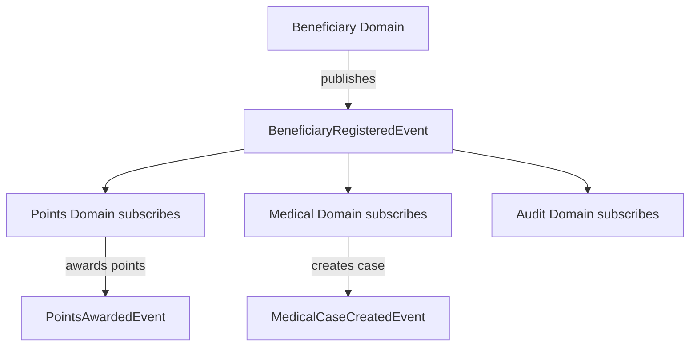
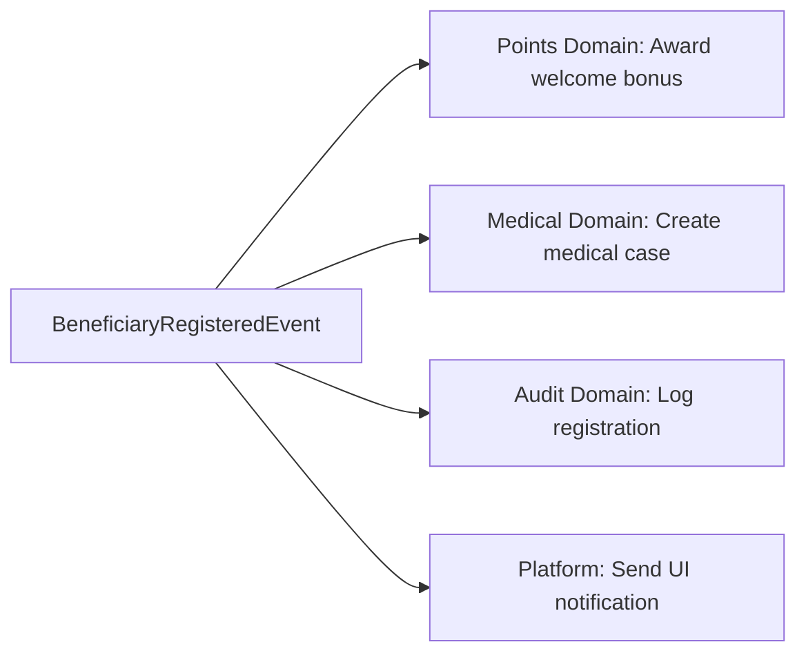
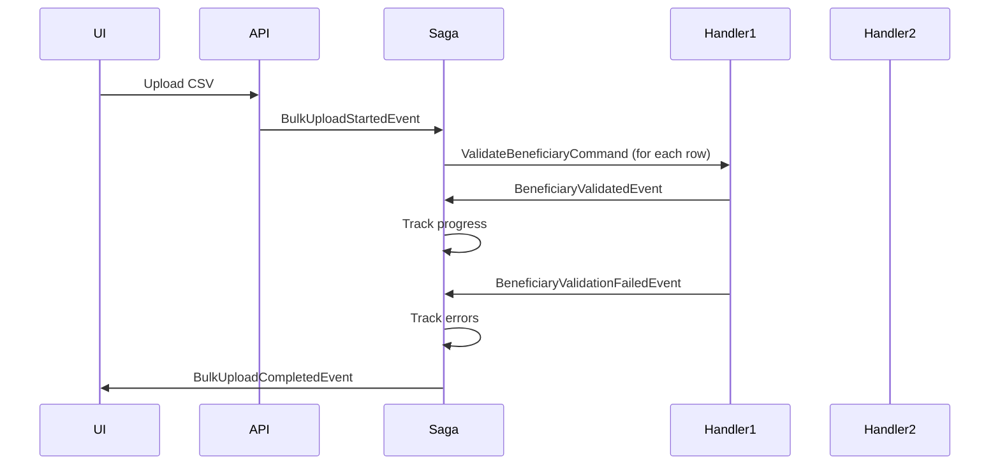
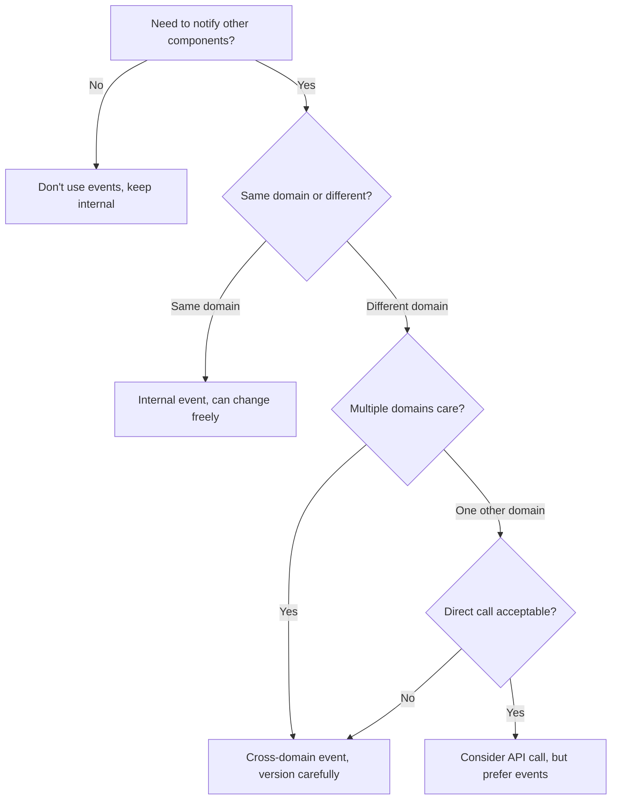

# Event-Driven Patterns

## Overview

Event-driven architecture is the **cornerstone** of this framework. Events provide loose coupling between domains, enable scalability, create audit trails, and allow the system to evolve without breaking existing functionality.

## Core Principles

### 1. Events Are Facts
Events represent **things that have already happened**. They are immutable and cannot be changed.

**Good**: `BeneficiaryRegisteredEvent`, `QuestionAnsweredEvent`, `PointsAwardedEvent`
**Bad**: `RegisterBeneficiaryEvent`, `AnswerQuestionEvent` (these sound like commands)

### 2. Events Are Domain-Owned
Each domain publishes events about its own state changes. Other domains can subscribe but cannot modify the event.

### 3. Events Enable Choreography
Instead of orchestration (one service calling others), events allow choreography (services react independently to events).



---

## Event Naming Conventions

### Pattern: `{Entity}{PastTenseVerb}Event`

**Examples**:
- `BeneficiaryRegisteredEvent` (not RegisteredBeneficiaryEvent)
- `QuestionAnsweredEvent` (not AnsweredQuestionEvent)
- `PointsAwardedEvent` (not AwardedPointsEvent)
- `CaseClosedEvent` (not ClosedCaseEvent)

### Why Past Tense?
Events describe what **has happened**, not what **should happen**.

---

## Event Structure

### Minimal Event (Recommended)
```csharp
public class BeneficiaryRegisteredEvent
{
    public Guid BeneficiaryId { get; set; }
    public string FirstName { get; set; }
    public string LastName { get; set; }
    public DateTime RegisteredAt { get; set; }
}
```

**Principles**:
- Include entity ID (required for subscribers to act)
- Include timestamp (for audit and ordering)
- Include only data relevant to the event
- Don't include entire entity (keep events small)

### Rich Event (When Needed)
```csharp
public class BulkUploadCompletedEvent
{
    public Guid UploadId { get; set; }
    public int TotalRecords { get; set; }
    public int SuccessCount { get; set; }
    public int ErrorCount { get; set; }
    public List<ValidationError> Errors { get; set; }
    public DateTime CompletedAt { get; set; }
}
```

**Use When**:
- Subscribers need detailed context
- Avoiding extra database lookups improves performance
- Event is end-of-workflow summary

---

## Event Ownership

### Rule: Events Belong to the Domain That Publishes Them

**Beneficiary Domain** owns:
- `BeneficiaryRegisteredEvent`
- `BeneficiaryStatusUpdatedEvent`
- `CaseClosedEvent`

**Questions Domain** owns:
- `QuestionCreatedEvent`
- `QuestionAnsweredEvent`
- `CorrectAnswerGivenEvent`

**Points Domain** owns:
- `PointsAwardedEvent`
- `PointsRedeemedEvent`
- `PointsExpiredEvent`

### Where Do Events Live?

**Option 1: In Publishing Domain** (Recommended)
```
Beneficiary/
└── src/
    └── Domain/
        └── Contracts/
            └── Events/
                └── BeneficiaryRegisteredEvent.cs
```

**Why**: Clear ownership, domain controls event contract

**Option 2: Shared Contracts Project** (For Platform-Level Events)
```
Platform/
└── src/
    └── Domain/
        └── Contracts/
            └── Events/
                └── UserLoggedInEvent.cs (used by multiple domains)
```

**Use For**: True cross-cutting events (auth, system health, etc.)

---

## Publishing Events

### From Command Handler
```csharp
public class RegisterBeneficiaryCommandHandler : 
    IHandleMessages<RegisterBeneficiaryCommand>
{
    private readonly IBeneficiaryRepository _repository;
    
    public async Task Handle(RegisterBeneficiaryCommand message, 
        IMessageHandlerContext context)
    {
        // 1. Execute business logic
        var beneficiary = new Beneficiary(
            message.FirstName, 
            message.LastName, 
            message.DateOfBirth);
            
        // 2. Persist changes
        await _repository.SaveAsync(beneficiary);
        
        // 3. Publish event (AFTER successful save)
        await context.Publish(new BeneficiaryRegisteredEvent
        {
            BeneficiaryId = beneficiary.Id,
            FirstName = beneficiary.FirstName,
            LastName = beneficiary.LastName,
            RegisteredAt = DateTime.UtcNow
        });
    }
}
```

**Key Points**:
- Publish AFTER successful persistence
- If save fails, event is not published
- Event publishing is part of the same transaction context

### From Domain Entity (Domain Events Pattern)
```csharp
public class Beneficiary
{
    private readonly List<DomainEvent> _domainEvents = new();
    public IReadOnlyList<DomainEvent> DomainEvents => _domainEvents.AsReadOnly();
    
    public void Register(string firstName, string lastName, DateTime dateOfBirth)
    {
        FirstName = firstName;
        LastName = lastName;
        DateOfBirth = dateOfBirth;
        
        _domainEvents.Add(new BeneficiaryRegisteredEvent
        {
            BeneficiaryId = Id,
            FirstName = firstName,
            LastName = lastName
        });
    }
    
    public void ClearDomainEvents() => _domainEvents.Clear();
}

// In handler, publish domain events
await _repository.SaveAsync(beneficiary);

foreach (var domainEvent in beneficiary.DomainEvents)
{
    await context.Publish(domainEvent);
}

beneficiary.ClearDomainEvents();
```

**Benefits**:
- Business logic stays in domain
- Events generated where state changes happen
- Clear audit of what happened

---

## Subscribing to Events

### Single Domain Subscription
```csharp
// Points/Endpoint.In/Handlers/Events/BeneficiaryRegisteredEventHandler.cs
public class BeneficiaryRegisteredEventHandler : 
    IHandleMessages<BeneficiaryRegisteredEvent>
{
    private readonly IPointsRepository _repository;
    
    public async Task Handle(BeneficiaryRegisteredEvent message, 
        IMessageHandlerContext context)
    {
        // React to beneficiary registration
        var pointsAccount = new PointsAccount(message.BeneficiaryId);
        pointsAccount.AwardPoints(100, "Welcome bonus");
        
        await _repository.SaveAsync(pointsAccount);
        
        // Publish own event
        await context.Publish(new PointsAwardedEvent
        {
            BeneficiaryId = message.BeneficiaryId,
            Points = 100,
            Reason = "Welcome bonus"
        });
    }
}
```

### Multiple Domain Subscriptions


**Each domain has its own handler**, they run independently:
```csharp
// Points Domain
public class BeneficiaryRegisteredEventHandler : IHandleMessages<BeneficiaryRegisteredEvent>
{
    // Award points
}

// Medical Domain  
public class BeneficiaryRegisteredEventHandler : IHandleMessages<BeneficiaryRegisteredEvent>
{
    // Create medical case
}

// Platform Infrastructure (SignalR)
public class SignalRBeneficiaryRegisteredHandler : IHandleMessages<BeneficiaryRegisteredEvent>
{
    // Send real-time notification
}
```

---

## Internal vs. Cross-Domain Events

### Internal Events
Events that only matter **within the same domain**

**Example**: `BeneficiaryValidatedEvent` (used by BulkUploadSaga in Beneficiary domain)
```csharp
// Beneficiary/Domain/Contracts/Events/BeneficiaryValidatedEvent.cs
public class BeneficiaryValidatedEvent
{
    public Guid UploadId { get; set; }
    public int RowNumber { get; set; }
    public BeneficiaryDto Data { get; set; }
}
```

**Subscribers**: Only handlers in Beneficiary domain

### Cross-Domain Events
Events that **multiple domains care about**

**Example**: `BeneficiaryRegisteredEvent`
```csharp
// Beneficiary/Domain/Contracts/Events/BeneficiaryRegisteredEvent.cs
public class BeneficiaryRegisteredEvent
{
    public Guid BeneficiaryId { get; set; }
    public string FirstName { get; set; }
    public string LastName { get; set; }
}
```

**Subscribers**: Points domain, Medical domain, Audit domain, Platform SignalR

### How to Decide?
**Ask**: "Would another domain ever care about this event?"
- **Yes** → Cross-domain event (design carefully, versioning matters)
- **No** → Internal event (can change more freely)

---

## Event Versioning

### Problem
What happens when you need to add a field to an event that's already published?

### Solution 1: Additive Changes Only
```csharp
// V1 (existing)
public class BeneficiaryRegisteredEvent
{
    public Guid BeneficiaryId { get; set; }
    public string FirstName { get; set; }
    public string LastName { get; set; }
}

// V2 (add optional field)
public class BeneficiaryRegisteredEvent
{
    public Guid BeneficiaryId { get; set; }
    public string FirstName { get; set; }
    public string LastName { get; set; }
    public string Email { get; set; }  // NEW (optional)
}
```

**Existing subscribers** ignore new field, **new subscribers** can use it.

### Solution 2: New Event Version
```csharp
public class BeneficiaryRegisteredEventV2
{
    public Guid BeneficiaryId { get; set; }
    public string FirstName { get; set; }
    public string LastName { get; set; }
    public string Email { get; set; }
    public DateTime DateOfBirth { get; set; }  // Breaking change
}

// Publisher publishes both versions
await context.Publish(new BeneficiaryRegisteredEvent { /* V1 data */ });
await context.Publish(new BeneficiaryRegisteredEventV2 { /* V2 data */ });
```

**Old subscribers** use V1, **new subscribers** use V2. Eventually deprecate V1.

### Best Practice
- Prefer **additive changes** (add optional fields)
- Document event contracts clearly
- Use semantic versioning for breaking changes
- Maintain backwards compatibility for at least one release cycle

---

## Event Ordering

### Problem
Events can arrive out of order:
1. `BeneficiaryRegisteredEvent`
2. `BeneficiaryStatusUpdatedEvent`
3. `BeneficiaryDeletedEvent`

What if subscriber receives delete before registration?

### Solution 1: Event Timestamps
```csharp
public class BeneficiaryRegisteredEvent
{
    public Guid BeneficiaryId { get; set; }
    public DateTime OccurredAt { get; set; }  // When event actually happened
}

// In handler
public async Task Handle(BeneficiaryRegisteredEvent message, IMessageHandlerContext context)
{
    var existing = await _repository.GetByIdAsync(message.BeneficiaryId);
    
    // Ignore if we already have a later version
    if (existing != null && existing.LastUpdated > message.OccurredAt)
        return;
        
    // Process event
}
```

### Solution 2: Version Numbers
```csharp
public class BeneficiaryStatusUpdatedEvent
{
    public Guid BeneficiaryId { get; set; }
    public int Version { get; set; }  // Incremental version
    public CaseStatus NewStatus { get; set; }
}

// In handler
if (message.Version <= existing.Version)
    return;  // Already processed later version
```

### Solution 3: Idempotent Handlers
Make handlers safe to run multiple times with same message:
```csharp
public async Task Handle(PointsAwardedEvent message, IMessageHandlerContext context)
{
    var existing = await _repository.GetTransactionByIdAsync(message.TransactionId);
    
    if (existing != null)
        return;  // Already processed
        
    // Process points award
}
```

---

## Event Sourcing (Advanced Pattern)

### Concept
Store **events** instead of current state. Rebuild state by replaying events.

**Traditional**:
```csharp
// Store current state
var beneficiary = new Beneficiary { Id = 1, Status = CaseStatus.Completed };
await _repository.SaveAsync(beneficiary);
```

**Event Sourcing**:
```csharp
// Store event stream
await _eventStore.AppendAsync(new BeneficiaryRegisteredEvent { /* */ });
await _eventStore.AppendAsync(new BeneficiaryStatusUpdatedEvent { /* */ });
await _eventStore.AppendAsync(new CaseClosedEvent { /* */ });

// Rebuild state
var beneficiary = new Beneficiary();
var events = await _eventStore.GetEventsAsync(beneficiaryId);
foreach (var evt in events)
{
    beneficiary.Apply(evt);  // Apply each event
}
```

**Benefits**:
- Complete audit history
- Time travel (state at any point)
- Event replay for debugging

**Drawbacks**:
- More complex
- Slower reads (rebuild from events)
- Need snapshots for performance

**Recommendation**: Start with traditional state storage. Use event sourcing only if audit/history is critical.

---

## Saga Coordination with Events

Sagas use events to coordinate long-running workflows:



**Example**:
```csharp
public class BulkBeneficiaryUploadSaga : 
    Saga<BulkBeneficiaryUploadSagaData>,
    IAmStartedByMessages<BulkUploadStartedEvent>,
    IHandleMessages<BeneficiaryValidatedEvent>,
    IHandleMessages<BeneficiaryValidationFailedEvent>
{
    public async Task Handle(BulkUploadStartedEvent message, IMessageHandlerContext context)
    {
        Data.UploadId = message.UploadId;
        Data.TotalRecords = message.TotalRecords;
        
        // Kick off validation for each row
        foreach (var row in message.Rows)
        {
            await context.SendLocal(new ValidateBeneficiaryCommand
            {
                UploadId = message.UploadId,
                RowNumber = row.RowNumber,
                Data = row.Data
            });
        }
    }
    
    public async Task Handle(BeneficiaryValidatedEvent message, IMessageHandlerContext context)
    {
        Data.ProcessedRecords++;
        Data.SuccessCount++;
        
        if (Data.ProcessedRecords >= Data.TotalRecords)
        {
            await context.Publish(new BulkUploadCompletedEvent
            {
                UploadId = Data.UploadId,
                SuccessCount = Data.SuccessCount,
                ErrorCount = Data.ErrorCount
            });
            MarkAsComplete();
        }
    }
}
```

---

## Error Handling in Event Handlers

### Retry Policy
NServiceBus automatically retries failed handlers:

```csharp
// In endpoint configuration
endpointConfiguration.Recoverability()
    .Immediate(immediate => immediate.NumberOfRetries(3))
    .Delayed(delayed => delayed
        .NumberOfRetries(5)
        .TimeIncrease(TimeSpan.FromMinutes(1)));
```

**Flow**:
1. Handler fails → immediate retry (3 attempts)
2. Still failing → delayed retry (5 attempts, 1 min apart)
3. Still failing → move to error queue

### Idempotent Handlers
Make handlers safe to retry:
```csharp
public async Task Handle(PointsAwardedEvent message, IMessageHandlerContext context)
{
    // Check if already processed
    var existing = await _repository.GetTransactionByIdAsync(message.TransactionId);
    if (existing != null)
    {
        _logger.LogInformation("Transaction {TransactionId} already processed", 
            message.TransactionId);
        return;  // Idempotent - safe to skip
    }
    
    // Process points
    var account = await _repository.GetByUserIdAsync(message.UserId);
    account.AwardPoints(message.Points, message.Reason);
    await _repository.SaveAsync(account);
}
```

### Compensating Actions
If event processing fails after partial completion:
```csharp
public async Task Handle(BeneficiaryRegisteredEvent message, IMessageHandlerContext context)
{
    try
    {
        // 1. Create points account
        var pointsAccount = new PointsAccount(message.BeneficiaryId);
        await _pointsRepository.SaveAsync(pointsAccount);
        
        // 2. Award welcome bonus
        pointsAccount.AwardPoints(100, "Welcome");
        await _pointsRepository.SaveAsync(pointsAccount);
    }
    catch (Exception ex)
    {
        // Compensate: delete points account
        await _pointsRepository.DeleteAsync(message.BeneficiaryId);
        throw;  // Re-throw for retry
    }
}
```

---

## Event Patterns Summary

### Pattern 1: Simple Notification
```
Beneficiary Domain: Register beneficiary → Publish BeneficiaryRegisteredEvent
Points Domain: Subscribe → Award points
```

### Pattern 2: Saga Coordination
```
API: Start upload → Publish BulkUploadStartedEvent
Saga: Coordinate validation → Publish progress events
Handlers: Process each record
Saga: Publish BulkUploadCompletedEvent
```

### Pattern 3: Event Chain
```
Beneficiary: Register → BeneficiaryRegisteredEvent
Points: Award points → PointsAwardedEvent
Achievements: Check achievements → AchievementUnlockedEvent
Notifications: Send email → NotificationSentEvent
```

---

## Decision Tree: When to Use Events



---

## Best Practices Checklist

- [ ] Events use past tense naming (`{Entity}{PastVerb}Event`)
- [ ] Events include entity ID and timestamp
- [ ] Events are immutable (no setters, only init/constructor)
- [ ] Event handlers are idempotent (safe to retry)
- [ ] Events are published AFTER successful persistence
- [ ] Cross-domain events are versioned carefully
- [ ] Handlers don't call other domains directly (use events)
- [ ] SignalR handlers are separate from business logic handlers
- [ ] Events include enough context to avoid lookups
- [ ] Event ownership is clear (which domain publishes)

---

**Next**: See [NServiceBus Patterns](nservicebus-patterns.md) for deep dive on commands, sagas, handlers, and messaging infrastructure.
