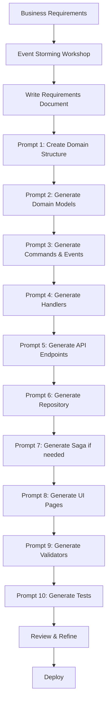

# Initial Scaffolding Prompts

## Overview

These are **exact prompts** to use with **GitHub Copilot** to generate complete domain implementations from business requirements. Each prompt references the architecture documentation and produces production-ready code following framework patterns.

---

## Prerequisites

Before using these prompts, ensure:

1. ✅ **Architecture documentation** exists in `Platform/docs/architecture/`
2. ✅ **Requirements document** written following [Requirements Document Template](requirements-document-template.md)
3. ✅ **Event Storming** completed (see [Event Storming Guide](event-storming-guide.md))
4. ✅ **GitHub Copilot** installed and active in VS Code
5. ✅ **Copilot Space** created with architecture documentation (optional but recommended)

---

## Scaffolding Workflow



---

## Prompt 1: Create Domain Folder Structure

**When**: Starting a brand new domain

**Prompt**:
```
I need to create a new domain called "{DomainName}" following the architecture patterns in Platform/docs/architecture/domain-template-structure.md.

Please create the complete folder structure with the following projects:
- Api (Azure Functions HTTP triggers)
- Domain (Business logic, contracts, DTOs)
- Endpoint.In (NServiceBus message handlers and sagas)
- Infrastructure (Repositories, CosmosDB, external integrations)
- Test (Unit and integration tests)
- UI (React TypeScript application)

Include:
- .csproj files with correct NuGet package references
- Program.cs for each project with NServiceBus configuration
- package.json for UI project
- webpack.config.js for Module Federation
- local.settings.json.template files

Use the exact structure from Beneficiary domain as reference.
```

**Expected Output**:
```
{DomainName}/
├── src/
│   ├── Api/
│   │   ├── Api.csproj
│   │   ├── Program.cs
│   │   ├── local.settings.json.template
│   │   └── host.json
│   ├── Domain/
│   │   ├── Domain.csproj
│   │   ├── Contracts/
│   │   ├── Models/
│   │   └── DTOs/
│   ├── Endpoint.In/
│   │   ├── Endpoint.In.csproj
│   │   ├── Program.cs
│   │   └── Handlers/
│   ├── Infrastructure/
│   │   ├── Infrastructure.csproj
│   │   └── Repositories/
│   ├── Test/
│   │   └── Test.csproj
│   └── UI/
│       ├── package.json
│       ├── webpack.config.js
│       └── src/
└── docs/
    └── {domain}-requirements.md
```

---

## Prompt 2: Generate Domain Models

**When**: After folder structure created

**Prompt**:
```
Based on the requirements in {DomainName}/docs/{domain}-requirements.md (Section 2: Entities), generate domain models for all entities.

Follow these patterns from Platform/docs/architecture/domain-template-structure.md:
- Create models in {DomainName}/src/Domain/Models/
- Use C# properties with proper types
- Include validation attributes where appropriate
- Add XML documentation comments
- Follow naming conventions (PascalCase, singular nouns)

Entities to generate:
{List entities from requirements}

Include:
- Primary key (Guid Id)
- All properties from requirements
- CreatedAt, UpdatedAt timestamps
- Any computed properties
- Business logic methods if specified

Reference Beneficiary/src/Domain/Models/Beneficiary.cs as example.
```

**Example Output** (for Questions domain):
```csharp
// Questions/src/Domain/Models/Question.cs
namespace Questions.Domain.Models;

/// <summary>
/// Represents a multiple-choice question with answers
/// </summary>
public class Question
{
    /// <summary>
    /// Unique identifier for the question
    /// </summary>
    public Guid Id { get; set; }
    
    /// <summary>
    /// Question text
    /// </summary>
    public string Text { get; set; }
    
    /// <summary>
    /// Category/topic of the question
    /// </summary>
    public string Category { get; set; }
    
    /// <summary>
    /// Difficulty level
    /// </summary>
    public DifficultyLevel Difficulty { get; set; }
    
    /// <summary>
    /// Points awarded for correct answer
    /// </summary>
    public int Points { get; set; }
    
    /// <summary>
    /// Answer options for this question
    /// </summary>
    public List<AnswerOption> AnswerOptions { get; set; } = new();
    
    /// <summary>
    /// Whether question is currently available
    /// </summary>
    public bool IsActive { get; set; }
    
    /// <summary>
    /// User who created the question
    /// </summary>
    public Guid CreatedBy { get; set; }
    
    public DateTime CreatedAt { get; set; }
    public DateTime? UpdatedAt { get; set; }
    
    /// <summary>
    /// Validates that question has exactly 4 answers with 1 correct
    /// </summary>
    public bool IsValid()
    {
        return AnswerOptions.Count == 4 
            && AnswerOptions.Count(a => a.IsCorrect) == 1;
    }
}

public enum DifficultyLevel
{
    Easy,
    Medium,
    Hard
}
```

---

## Prompt 3: Generate Commands & Events

**When**: After domain models created

**Prompt**:
```
Based on {DomainName}/docs/{domain}-requirements.md (Section 3: Operations), generate NServiceBus commands and events.

Follow patterns from Platform/docs/architecture/event-driven-patterns.md and Platform/docs/architecture/nservicebus-patterns.md:

Commands (Domain/Contracts/Commands/):
- Use imperative naming (RegisterX, CreateY, UpdateZ)
- Include all input parameters from requirements
- Add XML documentation

Events (Domain/Contracts/Events/):
- Use past tense naming (XRegistered, YCreated, ZUpdated)
- Include entity ID, timestamp, and relevant data
- Add XML documentation

Operations to implement:
{List operations from requirements}

Reference Beneficiary domain as example.
```

**Example Output**:
```csharp
// Questions/src/Domain/Contracts/Commands/CreateQuestionCommand.cs
namespace Questions.Domain.Contracts.Commands;

/// <summary>
/// Command to create a new question
/// </summary>
public class CreateQuestionCommand
{
    public Guid QuestionId { get; set; }
    public string Text { get; set; }
    public string Category { get; set; }
    public DifficultyLevel Difficulty { get; set; }
    public int Points { get; set; }
    public List<AnswerOptionDto> AnswerOptions { get; set; }
    public Guid CreatedBy { get; set; }
}

// Questions/src/Domain/Contracts/Events/QuestionCreatedEvent.cs
/// <summary>
/// Published when a new question is created
/// </summary>
public class QuestionCreatedEvent
{
    public Guid QuestionId { get; set; }
    public string Text { get; set; }
    public string Category { get; set; }
    public DifficultyLevel Difficulty { get; set; }
    public int Points { get; set; }
    public Guid CreatedBy { get; set; }
    public DateTime CreatedAt { get; set; }
}
```

---

## Prompt 4: Generate Command Handlers

**When**: After commands/events created

**Prompt**:
```
Generate NServiceBus command handlers for {DomainName} domain.

Follow patterns from Platform/docs/architecture/nservicebus-patterns.md:
- Create handlers in {DomainName}/src/Endpoint.In/Handlers/Commands/
- Implement IHandleMessages<TCommand>
- Include constructor injection for repository and logger
- Follow pattern: Validate → Execute → Save → Publish Event
- Add comprehensive error handling and logging
- Make handlers idempotent where possible

Commands to handle:
{List commands}

Reference Beneficiary/src/Endpoint.In/Handlers/ as example.
```

**Example Output**:
```csharp
// Questions/src/Endpoint.In/Handlers/Commands/CreateQuestionCommandHandler.cs
using NServiceBus;
using Questions.Domain.Contracts.Commands;
using Questions.Domain.Contracts.Events;

public class CreateQuestionCommandHandler : IHandleMessages<CreateQuestionCommand>
{
    private readonly IQuestionRepository _repository;
    private readonly ILogger<CreateQuestionCommandHandler> _logger;
    
    public CreateQuestionCommandHandler(
        IQuestionRepository repository,
        ILogger<CreateQuestionCommandHandler> logger)
    {
        _repository = repository;
        _logger = logger;
    }
    
    public async Task Handle(CreateQuestionCommand message, IMessageHandlerContext context)
    {
        _logger.LogInformation("Creating question: {Text}", message.Text);
        
        // 1. Validate
        if (string.IsNullOrWhiteSpace(message.Text))
            throw new ValidationException("Question text is required");
        
        if (message.AnswerOptions?.Count != 4)
            throw new ValidationException("Must provide exactly 4 answer options");
        
        if (message.AnswerOptions.Count(a => a.IsCorrect) != 1)
            throw new ValidationException("Exactly one answer must be correct");
        
        // 2. Check for duplicates
        var existing = await _repository.FindByTextAndCategoryAsync(
            message.Text, message.Category);
        
        if (existing != null)
            throw new DuplicateException("Question already exists in this category");
        
        // 3. Create entity
        var question = new Question
        {
            Id = message.QuestionId,
            Text = message.Text,
            Category = message.Category,
            Difficulty = message.Difficulty,
            Points = message.Points,
            AnswerOptions = message.AnswerOptions.Select((opt, index) => new AnswerOption
            {
                Id = Guid.NewGuid(),
                QuestionId = message.QuestionId,
                Text = opt.Text,
                IsCorrect = opt.IsCorrect,
                DisplayOrder = index + 1
            }).ToList(),
            IsActive = false,  // Starts as draft
            CreatedBy = message.CreatedBy,
            CreatedAt = DateTime.UtcNow
        };
        
        // 4. Save to repository
        await _repository.SaveAsync(question);
        
        // 5. Publish event
        await context.Publish(new QuestionCreatedEvent
        {
            QuestionId = question.Id,
            Text = question.Text,
            Category = question.Category,
            Difficulty = question.Difficulty,
            Points = question.Points,
            CreatedBy = question.CreatedBy,
            CreatedAt = question.CreatedAt
        });
        
        _logger.LogInformation("Question created: {QuestionId}", question.Id);
    }
}
```

---

## Prompt 5: Generate API Endpoints

**When**: After handlers created

**Prompt**:
```
Generate Azure Functions HTTP trigger endpoints for {DomainName} API.

Follow patterns from Platform/docs/architecture/domain-template-structure.md:
- Create functions in {DomainName}/src/Api/
- Use Azure Functions isolated worker model
- Include dependency injection for IMessageSession
- Map HTTP requests to NServiceBus commands
- Return appropriate HTTP status codes (200, 201, 202, 400, 404, 500)
- Add comprehensive logging
- Include CORS configuration

Endpoints to create:
{List from requirements Section 3: Operations}

Reference Beneficiary/src/Api/ as example.
```

**Example Output**:
```csharp
// Questions/src/Api/CreateQuestionFunction.cs
using Microsoft.Azure.Functions.Worker;
using Microsoft.Azure.Functions.Worker.Http;
using NServiceBus;

public class CreateQuestionFunction
{
    private readonly IMessageSession _messageSession;
    private readonly ILogger<CreateQuestionFunction> _logger;
    
    public CreateQuestionFunction(
        IMessageSession messageSession,
        ILogger<CreateQuestionFunction> logger)
    {
        _messageSession = messageSession;
        _logger = logger;
    }
    
    [Function("CreateQuestion")]
    public async Task<HttpResponseData> Run(
        [HttpTrigger(AuthorizationLevel.Function, "post", Route = "question")] 
        HttpRequestData req)
    {
        _logger.LogInformation("CreateQuestion request received");
        
        try
        {
            // Parse request
            var dto = await req.ReadFromJsonAsync<CreateQuestionDto>();
            
            if (dto == null)
            {
                var badRequest = req.CreateResponse(HttpStatusCode.BadRequest);
                await badRequest.WriteAsJsonAsync(new { error = "Invalid request body" });
                return badRequest;
            }
            
            // Generate ID
            var questionId = Guid.NewGuid();
            
            // Send command
            await _messageSession.SendLocal(new CreateQuestionCommand
            {
                QuestionId = questionId,
                Text = dto.Text,
                Category = dto.Category,
                Difficulty = dto.Difficulty,
                Points = dto.Points,
                AnswerOptions = dto.AnswerOptions,
                CreatedBy = Guid.Parse(req.Headers.GetValues("X-User-Id").First())
            });
            
            // Return 202 Accepted
            var response = req.CreateResponse(HttpStatusCode.Accepted);
            await response.WriteAsJsonAsync(new { questionId = questionId });
            return response;
        }
        catch (ValidationException ex)
        {
            _logger.LogWarning(ex, "Validation failed");
            var response = req.CreateResponse(HttpStatusCode.BadRequest);
            await response.WriteAsJsonAsync(new { error = ex.Message });
            return response;
        }
        catch (Exception ex)
        {
            _logger.LogError(ex, "Error creating question");
            var response = req.CreateResponse(HttpStatusCode.InternalServerError);
            await response.WriteAsJsonAsync(new { error = "An error occurred" });
            return response;
        }
    }
}
```

---

## Prompt 6: Generate Repository

**When**: After handlers and API created

**Prompt**:
```
Generate CosmosDB repository implementation for {DomainName}.

Follow patterns from Platform/docs/architecture/data-patterns.md:
- Create interface in Domain/Repositories/I{Entity}Repository.cs
- Create implementation in Infrastructure/Repositories/{Entity}Repository.cs
- Use repository pattern with async methods
- Include partition key strategy (specify based on requirements)
- Map between domain models and document models
- Add error handling for CosmosDB exceptions
- Include logging

Entities needing repositories:
{List entities}

Reference Beneficiary/Infrastructure/BeneficiaryRepository.cs as example.
```

**Example Output**:
```csharp
// Questions/src/Domain/Repositories/IQuestionRepository.cs
public interface IQuestionRepository
{
    Task<Question> GetByIdAsync(Guid id, string partitionKey);
    Task<Question> FindByTextAndCategoryAsync(string text, string category);
    Task<List<Question>> GetByCategoryAsync(string category);
    Task SaveAsync(Question question);
    Task DeleteAsync(Guid id, string partitionKey);
}

// Questions/src/Infrastructure/Repositories/QuestionRepository.cs
using Microsoft.Azure.Cosmos;

public class QuestionRepository : IQuestionRepository
{
    private readonly Container _container;
    private readonly ILogger<QuestionRepository> _logger;
    
    public QuestionRepository(CosmosClient cosmosClient, ILogger<QuestionRepository> logger)
    {
        _container = cosmosClient.GetContainer("QuestionsDb", "Questions");
        _logger = logger;
    }
    
    public async Task<Question> GetByIdAsync(Guid id, string partitionKey)
    {
        try
        {
            var response = await _container.ReadItemAsync<QuestionDocument>(
                id.ToString(),
                new PartitionKey(partitionKey));
            
            return ToDomain(response.Resource);
        }
        catch (CosmosException ex) when (ex.StatusCode == HttpStatusCode.NotFound)
        {
            return null;
        }
    }
    
    public async Task SaveAsync(Question question)
    {
        var document = ToDocument(question);
        await _container.UpsertItemAsync(
            document,
            new PartitionKey(document.PartitionKey));
        
        _logger.LogInformation("Saved question: {QuestionId}", question.Id);
    }
    
    private QuestionDocument ToDocument(Question question)
    {
        return new QuestionDocument
        {
            Id = question.Id.ToString(),
            PartitionKey = $"category:{question.Category}",
            Text = question.Text,
            Category = question.Category,
            Difficulty = question.Difficulty.ToString(),
            Points = question.Points,
            AnswerOptions = question.AnswerOptions.Select(a => new AnswerOptionDocument
            {
                Id = a.Id.ToString(),
                Text = a.Text,
                IsCorrect = a.IsCorrect,
                DisplayOrder = a.DisplayOrder
            }).ToList(),
            IsActive = question.IsActive,
            CreatedBy = question.CreatedBy.ToString(),
            CreatedAt = question.CreatedAt
        };
    }
    
    private Question ToDomain(QuestionDocument document)
    {
        return new Question
        {
            Id = Guid.Parse(document.Id),
            Text = document.Text,
            Category = document.Category,
            Difficulty = Enum.Parse<DifficultyLevel>(document.Difficulty),
            Points = document.Points,
            AnswerOptions = document.AnswerOptions.Select(a => new AnswerOption
            {
                Id = Guid.Parse(a.Id),
                QuestionId = Guid.Parse(document.Id),
                Text = a.Text,
                IsCorrect = a.IsCorrect,
                DisplayOrder = a.DisplayOrder
            }).ToList(),
            IsActive = document.IsActive,
            CreatedBy = Guid.Parse(document.CreatedBy),
            CreatedAt = document.CreatedAt
        };
    }
}
```

---

## Prompt 7: Generate Saga (if needed)

**When**: Requirements include multi-step workflows (Section 4)

**Prompt**:
```
Generate NServiceBus saga for {WorkflowName} workflow in {DomainName}.

Follow patterns from Platform/docs/architecture/nservicebus-patterns.md:
- Create saga in {DomainName}/src/Endpoint.In/Sagas/
- Create saga data class
- Implement IAmStartedByMessages for initial event
- Implement IHandleMessages for subsequent events
- Configure correlation (how messages map to saga instances)
- Add timeout handling if specified in requirements
- Track progress in saga data
- Publish completion event
- Mark as complete when workflow finishes

Workflow from requirements:
{Paste Section 4: Workflows details}

Reference Beneficiary/src/Endpoint.In/Sagas/BulkBeneficiaryUploadSaga.cs as example.
```

**Example Output**: See Bulk Upload Saga in nservicebus-patterns.md

---

## Prompt 8: Generate UI Pages

**When**: After backend implementation complete

**Prompt**:
```
Generate React TypeScript UI pages for {DomainName}.

Follow patterns from Platform/docs/architecture/ui-architecture.md:
- Create pages in {DomainName}/src/UI/src/pages/
- Use Material-UI components with Humanitarian.org theme
- Implement React Hook Form for forms
- Add client-side validation matching backend rules
- Include loading states and error handling
- Use custom hooks for API calls
- Add SignalR integration if real-time updates needed

Pages from requirements (Section 6):
{List UI pages}

Reference Beneficiary/src/UI/ and Platform/src/UI/src/theme/theme.ts.
```

**Example Output**: See UI examples in ui-architecture.md and bulk-import-pattern.md

---

## Prompt 9: Generate Validators

**When**: Requirements include validation rules (Section 5)

**Prompt**:
```
Generate FluentValidation validators for {DomainName}.

Follow patterns from Platform/docs/architecture/validation-workflow-pattern.md:
- Create validators in {DomainName}/src/Domain/Validators/
- Implement AbstractValidator<T>
- Include all rules from requirements Section 5
- Add appropriate error messages
- Set severity levels (Error vs Warning)
- Handle cross-field validations
- Add async validations for database checks if needed

Validation rules from requirements:
{Paste Section 5 validation rules}

Reference Beneficiary/src/Domain/Validators/ as example.
```

---

## Prompt 10: Generate Tests

**When**: After all code generated

**Prompt**:
```
Generate comprehensive unit tests for {DomainName}.

Follow xUnit patterns:
- Create tests in {DomainName}/src/Test/
- Test domain models, validators, handlers, repositories
- Use FluentValidation.TestHelper for validator tests
- Mock dependencies (repositories, message context)
- Cover happy paths and error cases
- Use Theory for parameterized tests

Components to test:
- {Entity}Validator tests
- {Command}Handler tests
- {Entity}Repository tests (if testable without CosmosDB)

Reference Beneficiary/src/Test/ as example.
```

---

## Complete Domain Generation Prompt

**When**: You want to generate entire domain in one shot (advanced)

**Prompt**:
```
I need to create a complete new domain called "{DomainName}" based on the requirements in {DomainName}/docs/{domain}-requirements.md.

Please read and follow all patterns from:
- Platform/docs/architecture/domain-template-structure.md
- Platform/docs/architecture/event-driven-patterns.md
- Platform/docs/architecture/nservicebus-patterns.md
- Platform/docs/architecture/data-patterns.md
- Platform/docs/architecture/ui-architecture.md

Generate the following:

1. Complete folder structure (Api, Domain, Endpoint.In, Infrastructure, Test, UI)
2. Domain models for all entities (Section 2 of requirements)
3. Commands and Events (Section 3)
4. Command handlers with full logic
5. API endpoints (Azure Functions)
6. CosmosDB repository with partition key strategy: {specify strategy}
7. Saga if workflow exists (Section 4)
8. FluentValidation validators (Section 5)
9. React UI pages (Section 6)
10. Unit tests

Use existing domains (Beneficiary, Platform) as reference for code style and patterns.

Requirements document: {DomainName}/docs/{domain}-requirements.md
```

**Note**: This comprehensive prompt works best with GitHub Copilot Workspace or when uploaded to a Copilot Space.

---

## Best Practices

### 1. Be Specific
```
✅ "Generate CreateQuestionCommand following nservicebus-patterns.md section on Commands"
❌ "Create a command for questions"
```

### 2. Reference Examples
```
✅ "Use Beneficiary/src/Domain/Models/Beneficiary.cs as reference"
❌ "Make it like the other domains"
```

### 3. Iterate and Refine
- Generate one component at a time
- Review output
- Provide feedback: "Add error handling for duplicate check"
- Regenerate if needed

### 4. Validate Against Architecture
- Check generated code matches patterns
- Ensure naming conventions followed
- Verify event-driven patterns used correctly

---

**Complete!** You now have the complete architecture documentation suite and scaffolding prompts to generate entire multi-domain applications using GitHub Copilot.
