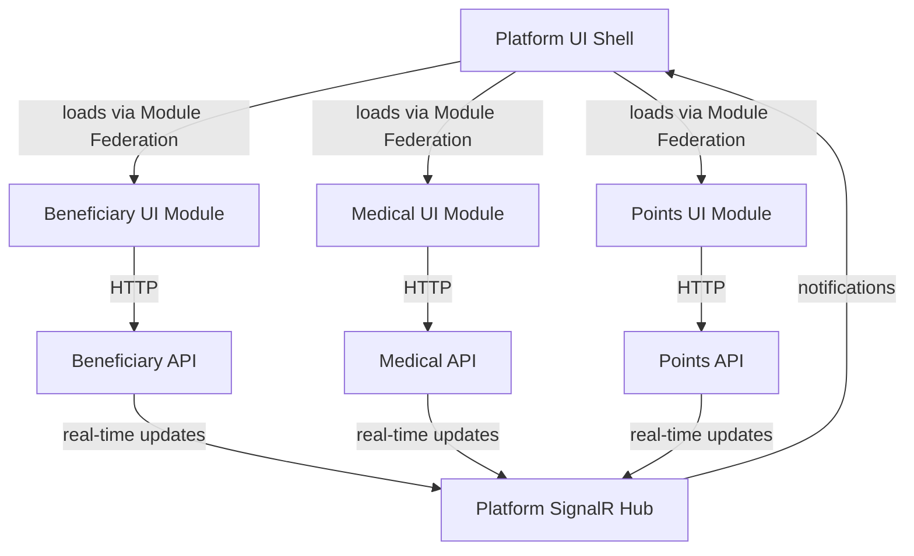
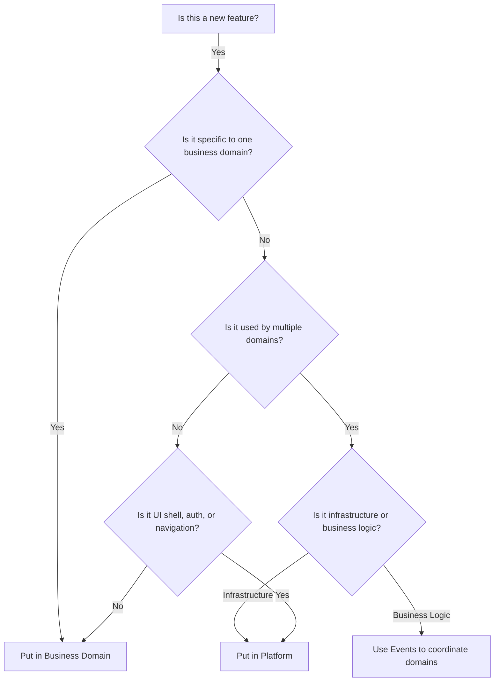

# Platform Domain Responsibilities

## Overview

The **Platform domain** is a special domain that serves as the foundation for all business domains. Unlike business domains that encapsulate specific business capabilities, the Platform domain provides **cross-cutting infrastructure and hosting capabilities** that all other domains depend on.

## Core Principle

**Platform provides infrastructure; Business domains provide capabilities.**

## What Belongs in Platform

### 1. UI Shell and Navigation

**Responsibility**: Host and compose micro-frontends from business domains

**Components**:
- Main application shell (`App.tsx`)
- Top-level routing configuration
- Navigation menu (dynamically populated from domains)
- Header with branding
- Sidebar/drawer navigation
- Footer
- Layout components (page wrappers, containers)

**Example - App.tsx**:
```typescript
function App() {
  return (
    <ThemeProvider theme={theme}>
      <Router>
        <Header />
        <Sidebar />
        <Routes>
          <Route path="/" element={<Dashboard />} />
          <Route path="/beneficiary/*" element={<BeneficiaryModule />} />
          <Route path="/medical/*" element={<MedicalModule />} />
          <Route path="/points/*" element={<PointsModule />} />
        </Routes>
        <Footer />
      </Router>
    </ThemeProvider>
  );
}
```

**Module Federation Configuration**:
```javascript
// webpack.config.js in Platform UI
module.exports = {
  plugins: [
    new ModuleFederationPlugin({
      name: 'platformShell',
      remotes: {
        beneficiaryUI: 'beneficiaryUI@http://localhost:3001/remoteEntry.js',
        medicalUI: 'medicalUI@http://localhost:3002/remoteEntry.js',
        pointsUI: 'pointsUI@http://localhost:3003/remoteEntry.js'
      },
      shared: ['react', 'react-dom', '@mui/material']
    })
  ]
};
```

---

### 2. Shared UI Theme and Branding

**Responsibility**: Provide consistent look and feel across all domains

**Components**:
- MUI theme configuration
- Brand colors, typography, spacing
- Common UI components (buttons, cards, alerts)
- Shared icons and assets
- Logo and branding assets

**Example - Theme Configuration**:
```typescript
// Platform/src/UI/src/theme/theme.ts
const theme = createTheme({
  palette: {
    primary: {
      main: '#0072CE',  // Company Blue
    },
    secondary: {
      main: '#FF6B35',  // Company Orange
    },
  },
  typography: {
    fontFamily: '"Roboto", "Helvetica", "Arial", sans-serif',
  },
  components: {
    MuiButton: {
      styleOverrides: {
        root: {
          borderRadius: 8,
          textTransform: 'none',
        },
      },
    },
  },
});
```

**Shared Components**:
- `LoadingSpinner.tsx`
- `ErrorBoundary.tsx`
- `ConfirmDialog.tsx`
- `Notification.tsx`
- `PageHeader.tsx`

---

### 3. Authentication and Authorization

**Responsibility**: Centralized user authentication and authorization

**Components**:
- Authentication context provider
- Login/logout flows
- Token management
- Role-based access control (RBAC)
- Protected route wrapper

**Example - Auth Context**:
```typescript
// Platform/src/UI/src/context/AuthContext.tsx
export const AuthProvider: React.FC = ({ children }) => {
  const [user, setUser] = useState<User | null>(null);
  
  const login = async (username: string, password: string) => {
    const response = await fetch('/api/auth/login', {
      method: 'POST',
      body: JSON.stringify({ username, password })
    });
    const user = await response.json();
    setUser(user);
  };
  
  return (
    <AuthContext.Provider value={{ user, login, logout }}>
      {children}
    </AuthContext.Provider>
  );
};
```

**Protected Routes**:
```typescript
function ProtectedRoute({ children, requiredRole }) {
  const { user } = useAuth();
  
  if (!user) return <Navigate to="/login" />;
  if (requiredRole && !user.roles.includes(requiredRole)) {
    return <Navigate to="/unauthorized" />;
  }
  
  return children;
}
```

---

### 4. SignalR Hub and Real-Time Infrastructure

**Responsibility**: Central SignalR hub for real-time notifications

**Components**:
- SignalR hub configuration
- Connection management
- Event broadcasting to connected clients
- Reconnection logic

**Example - SignalR Hub**:
```csharp
// Platform/src/Api/Hubs/NotificationHub.cs
public class NotificationHub : Hub
{
    public async Task SendNotification(string message)
    {
        await Clients.All.SendAsync("ReceiveNotification", message);
    }
    
    public async Task JoinGroup(string groupName)
    {
        await Groups.AddToGroupAsync(Context.ConnectionId, groupName);
    }
}
```

**Frontend Integration**:
```typescript
// Platform/src/UI/src/services/signalr.ts
const connection = new HubConnectionBuilder()
  .withUrl('http://localhost:7071/api/notifications')
  .withAutomaticReconnect()
  .build();

connection.on('ReceiveNotification', (message) => {
  console.log('Notification:', message);
});

await connection.start();
```

---

### 5. Shared Domain Contracts (Cross-Domain Events)

**Responsibility**: Events that multiple domains subscribe to

**When to Place in Platform**:
- Event is relevant to multiple domains
- Event represents a platform-level concept (e.g., `UserLoggedInEvent`)

**Example - Platform Events**:
```csharp
// Platform/src/Domain/Contracts/Events/UserLoggedInEvent.cs
public class UserLoggedInEvent
{
    public Guid UserId { get; set; }
    public string Username { get; set; }
    public DateTime LoginTime { get; set; }
}

// Platform/src/Domain/Contracts/Events/SystemHealthCheckEvent.cs
public class SystemHealthCheckEvent
{
    public string ComponentName { get; set; }
    public HealthStatus Status { get; set; }
}
```

**When NOT to Place in Platform**:
- Event is domain-specific (e.g., `BeneficiaryRegisteredEvent` belongs in Beneficiary domain)
- Only one domain cares about the event

---

### 6. Common Infrastructure Utilities

**Responsibility**: Reusable infrastructure code

**Components**:
- Logging utilities
- Exception handling middleware
- Retry policies
- Configuration helpers
- Health check endpoints

**Example - Retry Policy**:
```csharp
// Platform/src/Infrastructure/Utilities/RetryPolicy.cs
public static class RetryPolicy
{
    public static async Task<T> ExecuteWithRetryAsync<T>(
        Func<Task<T>> operation, 
        int maxAttempts = 3)
    {
        for (int i = 0; i < maxAttempts; i++)
        {
            try
            {
                return await operation();
            }
            catch (Exception ex) when (i < maxAttempts - 1)
            {
                await Task.Delay(TimeSpan.FromSeconds(Math.Pow(2, i)));
            }
        }
        throw new InvalidOperationException("Max retry attempts exceeded");
    }
}
```

---

### 7. Configuration Management

**Responsibility**: Centralized configuration for cross-cutting concerns

**Components**:
- Environment-specific configuration
- Feature flags
- API base URLs for domains
- External service endpoints

**Example - Configuration**:
```typescript
// Platform/src/UI/src/config/config.ts
export const config = {
  api: {
    beneficiary: process.env.REACT_APP_BENEFICIARY_API_URL,
    medical: process.env.REACT_APP_MEDICAL_API_URL,
    points: process.env.REACT_APP_POINTS_API_URL,
    platform: process.env.REACT_APP_PLATFORM_API_URL
  },
  signalr: {
    hubUrl: process.env.REACT_APP_SIGNALR_HUB_URL
  },
  features: {
    enableBulkImport: process.env.REACT_APP_FEATURE_BULK_IMPORT === 'true'
  }
};
```

---

### 8. Dashboard and Home Page

**Responsibility**: Landing page with cross-domain overview

**Components**:
- Dashboard page showing aggregated data from multiple domains
- Quick actions linking to domain-specific features
- System status indicators

**Example - Dashboard**:
```typescript
function Dashboard() {
  const { data: beneficiaryStats } = useFetch('/api/beneficiary/stats');
  const { data: medicalStats } = useFetch('/api/medical/stats');
  
  return (
    <Grid container spacing={3}>
      <Grid item xs={12} md={6}>
        <Card>
          <CardContent>
            <Typography variant="h5">Beneficiaries</Typography>
            <Typography variant="h3">{beneficiaryStats?.total}</Typography>
            <Button href="/beneficiary">View All</Button>
          </CardContent>
        </Card>
      </Grid>
      <Grid item xs={12} md={6}>
        <Card>
          <CardContent>
            <Typography variant="h5">Medical Cases</Typography>
            <Typography variant="h3">{medicalStats?.total}</Typography>
            <Button href="/medical">View All</Button>
          </CardContent>
        </Card>
      </Grid>
    </Grid>
  );
}
```

---

## What Does NOT Belong in Platform

### ❌ Business Domain Logic
- **Never** put Beneficiary, Medical, Question, or Points logic in Platform
- Platform should not know about business entities
- Platform should not implement business rules

### ❌ Domain-Specific Events
- Events like `BeneficiaryRegisteredEvent` belong in Beneficiary domain
- Events like `QuestionAnsweredEvent` belong in Questions domain
- Only truly cross-cutting events belong in Platform

### ❌ Domain-Specific Repositories
- Each domain owns its own data access
- Platform doesn't access domain databases

### ❌ Domain-Specific UI Pages
- Beneficiary registration form belongs in Beneficiary UI
- Question management page belongs in Questions UI
- Platform UI only hosts the shell and dashboard

---

## Platform Project Structure

```
Platform/
├── Solution.sln
├── docs/
│   └── architecture/               # This documentation
├── src/
│   ├── Api/                        # Platform API (SignalR hub, auth endpoints)
│   ├── Domain/                     # Shared contracts, platform events
│   ├── Endpoint.In/                # Platform message handlers (minimal)
│   ├── Infrastructure/             # Shared utilities, logging, config
│   ├── Test/                       # Platform tests
│   └── UI/                         # Shell, navigation, dashboard, theme
└── README.md
```

---

## Communication Flow



---

## Domain Interaction Patterns

### Pattern 1: Direct API Call (Discouraged)
```
❌ Beneficiary UI --> Medical API
```
**Why avoid**: Tight coupling, harder to scale, no event history

### Pattern 2: Event-Driven (Recommended)
```
✅ Beneficiary Domain --> BeneficiaryRegisteredEvent --> Medical Domain
```
**Benefits**: Loose coupling, scalable, auditable, resilient

### Pattern 3: UI Composition
```
✅ Platform UI Shell --> Beneficiary UI Module (HTTP to Beneficiary API)
                    --> Medical UI Module (HTTP to Medical API)
```
**Benefits**: Each domain owns its UI and API independently

---

## Decision Tree: Platform vs. Domain



**Examples**:
- **Beneficiary registration form** → Beneficiary domain (business-specific)
- **SignalR connection management** → Platform (infrastructure)
- **Awarding points when beneficiary registers** → Event-driven (BeneficiaryRegisteredEvent → Points domain subscribes)
- **Navigation menu** → Platform (cross-cutting UI)
- **Validation rules for beneficiaries** → Beneficiary domain (business rules)
- **Theme configuration** → Platform (branding)

---

## Platform API Endpoints

Platform API should only expose:

### Authentication Endpoints
```
POST /api/auth/login
POST /api/auth/logout
POST /api/auth/refresh
GET  /api/auth/me
```

### Health Check Endpoints
```
GET /api/health
GET /api/health/beneficiary
GET /api/health/medical
GET /api/health/points
```

### SignalR Hub
```
/api/notifications (SignalR endpoint)
```

**Note**: Platform API does NOT expose business domain endpoints. Each domain has its own API.

---

## Platform Messaging (Minimal)

Platform `Endpoint.In` should have minimal handlers:

### Platform-Level Events Only
```csharp
// Platform/src/Endpoint.In/Handlers/SystemHealthCheckEventHandler.cs
public class SystemHealthCheckEventHandler : 
    IHandleMessages<SystemHealthCheckEvent>
{
    public async Task Handle(SystemHealthCheckEvent message, 
        IMessageHandlerContext context)
    {
        // Aggregate health status from all domains
        // Publish consolidated status
    }
}
```

**What NOT to handle in Platform**:
- Business domain events (BeneficiaryRegistered, QuestionAnswered, etc.)
- Those belong in their respective domain message handlers

---

## Shared Dependencies

Platform provides shared NuGet packages for consistency:

### Platform.Common (NuGet Package - Optional)
```xml
<ItemGroup>
  <PackageReference Include="NServiceBus" Version="9.0.0" />
  <PackageReference Include="Microsoft.Extensions.Logging" Version="8.0.0" />
</ItemGroup>
```

**Purpose**: Ensure all domains use consistent versions of core libraries

**Alternative**: Document recommended versions in architecture docs (simpler)

---

## SignalR Event Handlers (Architectural Pattern)

**Critical Principle**: SignalR handlers are **separate from business logic handlers**

### Example - Separate Handlers

**Business Logic Handler** (in Beneficiary domain):
```csharp
// Beneficiary/src/Endpoint.In/Handlers/BeneficiaryRegisteredEventHandler.cs
public class BeneficiaryRegisteredEventHandler : 
    IHandleMessages<BeneficiaryRegisteredEvent>
{
    private readonly IPointsService _pointsService;
    
    public async Task Handle(BeneficiaryRegisteredEvent message, 
        IMessageHandlerContext context)
    {
        // Core business logic
        await _pointsService.AwardWelcomePoints(message.BeneficiaryId);
        
        // This handler does NOT send SignalR notifications
    }
}
```

**SignalR Handler** (in Platform infrastructure or Beneficiary infrastructure):
```csharp
// Platform/src/Infrastructure/SignalRHandlers/SignalRBeneficiaryRegisteredHandler.cs
public class SignalRBeneficiaryRegisteredHandler : 
    IHandleMessages<BeneficiaryRegisteredEvent>
{
    private readonly IHubContext<NotificationHub> _hubContext;
    
    public async Task Handle(BeneficiaryRegisteredEvent message, 
        IMessageHandlerContext context)
    {
        // ONLY handles real-time UI updates
        // Failures here do NOT affect business logic
        try
        {
            await _hubContext.Clients.All.SendAsync("BeneficiaryRegistered", 
                new { message.BeneficiaryId, message.FirstName });
        }
        catch (Exception ex)
        {
            _logger.LogWarning(ex, "SignalR notification failed");
            // Do NOT throw - this is non-critical
        }
    }
}
```

**Benefits**:
- Business logic succeeds even if SignalR fails
- SignalR can be disabled without breaking core functionality
- Clear separation of concerns
- Easier testing

---

## Summary Checklist

When deciding where to place code, ask:

**Place in Platform if**:
- [ ] It's UI shell, navigation, or layout
- [ ] It's authentication/authorization
- [ ] It's SignalR hub or connection management
- [ ] It's shared theme/branding
- [ ] It's a cross-cutting utility (logging, retry, config)
- [ ] Multiple domains need it for infrastructure purposes

**Place in Business Domain if**:
- [ ] It's business logic specific to one domain
- [ ] It's a domain entity, command, or event
- [ ] It's a repository for domain data
- [ ] It's a UI page/component for that domain
- [ ] It's a business workflow (saga) specific to that domain

**Use Events to Coordinate if**:
- [ ] Multiple domains need to react to a business event
- [ ] You're tempted to make a direct API call between domains
- [ ] You need loose coupling between domains

---

**Next**: See [Requirements to Architecture Mapping](requirements-to-architecture-mapping.md) to learn how business requirements translate to Platform and domain components.
