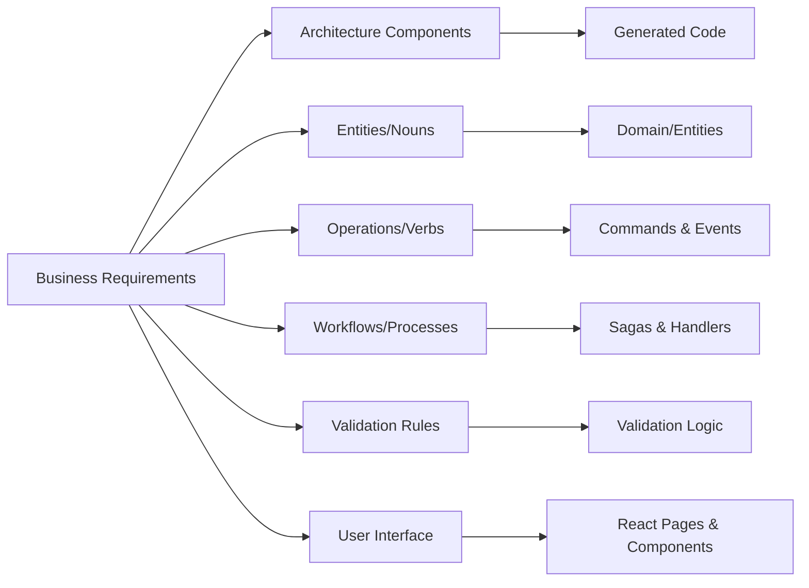

# Requirements to Architecture Mapping

## Overview

This document shows how business requirements translate directly into architectural components and code artifacts. By following this mapping systematically, GitHub Copilot can generate complete, working implementations from business requirements documents.

## Core Mapping Principles



## Mapping Categories

### 1. Entities (Nouns) → Domain Models

**Business Requirement**: "The system manages **beneficiaries** who have a **case** with a **status**"

**Maps To**:
- `Beneficiary.cs` (Domain entity)
- `Case.cs` (Domain entity)
- `CaseStatus.cs` (Enum or value object)

**Generated Code**:
```csharp
// Domain/Entities/Beneficiary.cs
public class Beneficiary
{
    public Guid Id { get; private set; }
    public string FirstName { get; private set; }
    public string LastName { get; private set; }
    public DateTime DateOfBirth { get; private set; }
    public Case CurrentCase { get; private set; }
    
    public Beneficiary(string firstName, string lastName, DateTime dateOfBirth)
    {
        Id = Guid.NewGuid();
        FirstName = firstName;
        LastName = lastName;
        DateOfBirth = dateOfBirth;
        CurrentCase = new Case(CaseStatus.Pending);
    }
}

// Domain/Entities/Case.cs
public class Case
{
    public Guid Id { get; private set; }
    public CaseStatus Status { get; private set; }
    public DateTime CreatedAt { get; private set; }
    
    public Case(CaseStatus status)
    {
        Id = Guid.NewGuid();
        Status = status;
        CreatedAt = DateTime.UtcNow;
    }
    
    public void UpdateStatus(CaseStatus newStatus)
    {
        Status = newStatus;
    }
}

// Domain/Entities/CaseStatus.cs
public enum CaseStatus
{
    Pending,
    Active,
    Completed,
    Suspended
}
```

---

### 2. Operations (Verbs) → Commands & Events

**Business Requirement**: "Users can **register** a beneficiary, **update** their status, and **close** their case"

**Maps To**:

**Commands** (Write Operations):
- `RegisterBeneficiaryCommand.cs`
- `UpdateBeneficiaryStatusCommand.cs`
- `CloseCaseCommand.cs`

**Events** (Domain Notifications):
- `BeneficiaryRegisteredEvent.cs`
- `BeneficiaryStatusUpdatedEvent.cs`
- `CaseClosedEvent.cs`

**Generated Code**:
```csharp
// Domain/Contracts/Commands/RegisterBeneficiaryCommand.cs
public class RegisterBeneficiaryCommand
{
    public string FirstName { get; set; }
    public string LastName { get; set; }
    public DateTime DateOfBirth { get; set; }
}

// Domain/Contracts/Events/BeneficiaryRegisteredEvent.cs
public class BeneficiaryRegisteredEvent
{
    public Guid BeneficiaryId { get; set; }
    public string FirstName { get; set; }
    public string LastName { get; set; }
    public DateTime RegisteredAt { get; set; }
}

// Endpoint.In/Handlers/Commands/RegisterBeneficiaryCommandHandler.cs
public class RegisterBeneficiaryCommandHandler : 
    IHandleMessages<RegisterBeneficiaryCommand>
{
    private readonly IBeneficiaryRepository _repository;
    
    public async Task Handle(RegisterBeneficiaryCommand message, 
        IMessageHandlerContext context)
    {
        var beneficiary = new Beneficiary(
            message.FirstName, 
            message.LastName, 
            message.DateOfBirth);
            
        await _repository.SaveAsync(beneficiary);
        
        await context.Publish(new BeneficiaryRegisteredEvent
        {
            BeneficiaryId = beneficiary.Id,
            FirstName = beneficiary.FirstName,
            LastName = beneficiary.LastName,
            RegisteredAt = DateTime.UtcNow
        });
    }
}
```

**Naming Conventions**:
- Commands: `{Verb}{Entity}Command` (imperative: RegisterBeneficiaryCommand)
- Events: `{Entity}{PastTenseVerb}Event` (past tense: BeneficiaryRegisteredEvent)

---

### 3. Workflows (Processes) → Sagas

**Business Requirement**: "When a user uploads a CSV file with multiple beneficiaries, the system should validate each record, save valid ones, report errors, and notify the user when complete"

**Maps To**:
- `BulkBeneficiaryUploadSaga.cs` (coordinates the workflow)
- `BulkUploadStartedEvent.cs` (starts the saga)
- `BeneficiaryValidatedEvent.cs` (progress update)
- `BulkUploadCompletedEvent.cs` (ends the saga)

**Generated Code**:
```csharp
// Domain/Contracts/Events/BulkUploadStartedEvent.cs
public class BulkUploadStartedEvent
{
    public Guid UploadId { get; set; }
    public int TotalRecords { get; set; }
    public Guid UserId { get; set; }
}

// Endpoint.In/Sagas/BulkBeneficiaryUploadSaga.cs
public class BulkBeneficiaryUploadSaga : 
    Saga<BulkBeneficiaryUploadSagaData>,
    IAmStartedByMessages<BulkUploadStartedEvent>,
    IHandleMessages<BeneficiaryValidatedEvent>,
    IHandleMessages<BeneficiaryValidationFailedEvent>
{
    protected override void ConfigureHowToFindSaga(
        SagaPropertyMapper<BulkBeneficiaryUploadSagaData> mapper)
    {
        mapper.MapSaga(saga => saga.UploadId)
            .ToMessage<BulkUploadStartedEvent>(msg => msg.UploadId)
            .ToMessage<BeneficiaryValidatedEvent>(msg => msg.UploadId)
            .ToMessage<BeneficiaryValidationFailedEvent>(msg => msg.UploadId);
    }
    
    public async Task Handle(BulkUploadStartedEvent message, 
        IMessageHandlerContext context)
    {
        Data.UploadId = message.UploadId;
        Data.TotalRecords = message.TotalRecords;
        Data.ProcessedRecords = 0;
        Data.SuccessCount = 0;
        Data.ErrorCount = 0;
    }
    
    public async Task Handle(BeneficiaryValidatedEvent message, 
        IMessageHandlerContext context)
    {
        Data.ProcessedRecords++;
        Data.SuccessCount++;
        
        // Send SignalR progress update
        await context.Publish(new BulkUploadProgressEvent
        {
            UploadId = Data.UploadId,
            Processed = Data.ProcessedRecords,
            Total = Data.TotalRecords
        });
        
        if (Data.ProcessedRecords >= Data.TotalRecords)
        {
            await context.Publish(new BulkUploadCompletedEvent
            {
                UploadId = Data.UploadId,
                SuccessCount = Data.SuccessCount,
                ErrorCount = Data.ErrorCount
            });
            
            MarkAsComplete();
        }
    }
    
    public async Task Handle(BeneficiaryValidationFailedEvent message, 
        IMessageHandlerContext context)
    {
        Data.ProcessedRecords++;
        Data.ErrorCount++;
        Data.Errors.Add(new ValidationError
        {
            RowNumber = message.RowNumber,
            ErrorMessage = message.ErrorMessage
        });
        
        if (Data.ProcessedRecords >= Data.TotalRecords)
        {
            await context.Publish(new BulkUploadCompletedEvent
            {
                UploadId = Data.UploadId,
                SuccessCount = Data.SuccessCount,
                ErrorCount = Data.ErrorCount,
                Errors = Data.Errors
            });
            
            MarkAsComplete();
        }
    }
}

// Endpoint.In/Sagas/BulkBeneficiaryUploadSagaData.cs
public class BulkBeneficiaryUploadSagaData : ContainSagaData
{
    public Guid UploadId { get; set; }
    public int TotalRecords { get; set; }
    public int ProcessedRecords { get; set; }
    public int SuccessCount { get; set; }
    public int ErrorCount { get; set; }
    public List<ValidationError> Errors { get; set; } = new();
}
```

---

### 4. Validation Rules → Validation Logic

**Business Requirement**: "Beneficiary first name and last name are required. Date of birth must be in the past. Email must be valid format if provided."

**Maps To**:
- `BeneficiaryValidator.cs` (validation logic)
- `beneficiary-validation-rules.md` (documentation)

**Generated Code**:
```csharp
// Domain/Validators/BeneficiaryValidator.cs
public class BeneficiaryValidator
{
    public ValidationResult Validate(BeneficiaryDto beneficiary)
    {
        var errors = new List<string>();
        
        // First name required
        if (string.IsNullOrWhiteSpace(beneficiary.FirstName))
            errors.Add("First name is required");
            
        // Last name required
        if (string.IsNullOrWhiteSpace(beneficiary.LastName))
            errors.Add("Last name is required");
            
        // Date of birth must be in the past
        if (beneficiary.DateOfBirth >= DateTime.UtcNow)
            errors.Add("Date of birth must be in the past");
            
        // Email format (if provided)
        if (!string.IsNullOrWhiteSpace(beneficiary.Email) && 
            !IsValidEmail(beneficiary.Email))
            errors.Add("Email must be valid format");
            
        return new ValidationResult
        {
            IsValid = errors.Count == 0,
            Errors = errors
        };
    }
    
    private bool IsValidEmail(string email)
    {
        return new EmailAddressAttribute().IsValid(email);
    }
}
```

**Documentation**:
```markdown
<!-- docs/beneficiary-validation-rules.md -->
# Beneficiary Validation Rules

## Required Fields
- **First Name**: Cannot be empty or whitespace
- **Last Name**: Cannot be empty or whitespace
- **Date of Birth**: Must be provided

## Field-Level Validation
- **Date of Birth**: Must be in the past (cannot be today or future)
- **Email**: Must be valid email format (if provided, optional field)
- **Phone**: Must match format XXX-XXX-XXXX (if provided, optional field)

## Business Rules
- Beneficiary must be at least 18 years old
- Cannot have duplicate combinations of (FirstName, LastName, DateOfBirth)
```

---

### 5. User Interface → React Pages & Components

**Business Requirement**: "Users need a page to register beneficiaries with a form containing first name, last name, date of birth, and email fields"

**Maps To**:
- `BeneficiaryRegistration.tsx` (page)
- `BeneficiaryForm.tsx` (form component)
- Route in Platform UI

**Generated Code**:
```typescript
// UI/src/pages/BeneficiaryRegistration.tsx
import React from 'react';
import { useForm } from 'react-hook-form';
import { TextField, Button, Box } from '@mui/material';
import { registerBeneficiary } from '../services/beneficiaryApi';

interface BeneficiaryFormData {
  firstName: string;
  lastName: string;
  dateOfBirth: string;
  email?: string;
}

export const BeneficiaryRegistration: React.FC = () => {
  const { register, handleSubmit, formState: { errors } } = 
    useForm<BeneficiaryFormData>();
    
  const onSubmit = async (data: BeneficiaryFormData) => {
    try {
      await registerBeneficiary(data);
      alert('Beneficiary registered successfully');
    } catch (error) {
      alert('Registration failed');
    }
  };
  
  return (
    <Box component="form" onSubmit={handleSubmit(onSubmit)}>
      <TextField
        label="First Name"
        {...register('firstName', { required: 'First name is required' })}
        error={!!errors.firstName}
        helperText={errors.firstName?.message}
        fullWidth
        margin="normal"
      />
      
      <TextField
        label="Last Name"
        {...register('lastName', { required: 'Last name is required' })}
        error={!!errors.lastName}
        helperText={errors.lastName?.message}
        fullWidth
        margin="normal"
      />
      
      <TextField
        label="Date of Birth"
        type="date"
        {...register('dateOfBirth', { required: 'Date of birth is required' })}
        error={!!errors.dateOfBirth}
        helperText={errors.dateOfBirth?.message}
        fullWidth
        margin="normal"
        InputLabelProps={{ shrink: true }}
      />
      
      <TextField
        label="Email (Optional)"
        type="email"
        {...register('email')}
        fullWidth
        margin="normal"
      />
      
      <Button type="submit" variant="contained" color="primary">
        Register Beneficiary
      </Button>
    </Box>
  );
};

// UI/src/services/beneficiaryApi.ts
export const registerBeneficiary = async (data: BeneficiaryFormData) => {
  const response = await fetch('http://localhost:7075/api/beneficiary/register', {
    method: 'POST',
    headers: { 'Content-Type': 'application/json' },
    body: JSON.stringify(data)
  });
  
  if (!response.ok) throw new Error('Registration failed');
  return response.json();
};
```

---

### 6. Data Storage → Repository & CosmosDB Models

**Business Requirement**: "Beneficiary data must be persisted and retrievable by ID"

**Maps To**:
- `IBeneficiaryRepository.cs` (interface)
- `BeneficiaryRepository.cs` (CosmosDB implementation)
- `BeneficiaryDocument.cs` (CosmosDB document model)

**Generated Code**:
```csharp
// Domain/Repositories/IBeneficiaryRepository.cs
public interface IBeneficiaryRepository
{
    Task<Beneficiary> GetByIdAsync(Guid id);
    Task SaveAsync(Beneficiary beneficiary);
    Task<IEnumerable<Beneficiary>> GetAllAsync();
    Task DeleteAsync(Guid id);
}

// Infrastructure/Repositories/BeneficiaryRepository.cs
public class BeneficiaryRepository : IBeneficiaryRepository
{
    private readonly Container _container;
    
    public BeneficiaryRepository(Container container)
    {
        _container = container;
    }
    
    public async Task<Beneficiary> GetByIdAsync(Guid id)
    {
        var response = await _container.ReadItemAsync<BeneficiaryDocument>(
            id.ToString(), 
            new PartitionKey(id.ToString()));
            
        return response.Resource.ToDomain();
    }
    
    public async Task SaveAsync(Beneficiary beneficiary)
    {
        var document = BeneficiaryDocument.FromDomain(beneficiary);
        await _container.UpsertItemAsync(document, 
            new PartitionKey(document.PartitionKey));
    }
}

// Infrastructure/CosmosDb/BeneficiaryDocument.cs
public class BeneficiaryDocument
{
    [JsonProperty("id")]
    public string Id { get; set; }
    
    [JsonProperty("partitionKey")]
    public string PartitionKey { get; set; }
    
    [JsonProperty("firstName")]
    public string FirstName { get; set; }
    
    [JsonProperty("lastName")]
    public string LastName { get; set; }
    
    [JsonProperty("dateOfBirth")]
    public DateTime DateOfBirth { get; set; }
    
    [JsonProperty("createdAt")]
    public DateTime CreatedAt { get; set; }
    
    public static BeneficiaryDocument FromDomain(Beneficiary beneficiary)
    {
        return new BeneficiaryDocument
        {
            Id = beneficiary.Id.ToString(),
            PartitionKey = beneficiary.Id.ToString(),
            FirstName = beneficiary.FirstName,
            LastName = beneficiary.LastName,
            DateOfBirth = beneficiary.DateOfBirth,
            CreatedAt = DateTime.UtcNow
        };
    }
    
    public Beneficiary ToDomain()
    {
        return new Beneficiary(FirstName, LastName, DateOfBirth)
        {
            // Hydrate from document
        };
    }
}
```

---

### 7. Cross-Domain Interactions → Events

**Business Requirement**: "When a beneficiary is registered, award them 100 welcome points"

**Maps To**:
- `BeneficiaryRegisteredEvent.cs` (published by Beneficiary domain)
- `BeneficiaryRegisteredEventHandler.cs` (in Points domain)

**Generated Code**:

**Beneficiary Domain** (publishes event):
```csharp
// Beneficiary/Domain/Contracts/Events/BeneficiaryRegisteredEvent.cs
public class BeneficiaryRegisteredEvent
{
    public Guid BeneficiaryId { get; set; }
    public string FirstName { get; set; }
    public string LastName { get; set; }
}

// Beneficiary/Endpoint.In/Handlers/RegisterBeneficiaryCommandHandler.cs
public async Task Handle(RegisterBeneficiaryCommand message, 
    IMessageHandlerContext context)
{
    var beneficiary = new Beneficiary(message.FirstName, message.LastName, 
        message.DateOfBirth);
    await _repository.SaveAsync(beneficiary);
    
    // Publish event for other domains to react
    await context.Publish(new BeneficiaryRegisteredEvent
    {
        BeneficiaryId = beneficiary.Id,
        FirstName = beneficiary.FirstName,
        LastName = beneficiary.LastName
    });
}
```

**Points Domain** (subscribes to event):
```csharp
// Points/Endpoint.In/Handlers/Events/BeneficiaryRegisteredEventHandler.cs
public class BeneficiaryRegisteredEventHandler : 
    IHandleMessages<BeneficiaryRegisteredEvent>
{
    private readonly IPointsRepository _repository;
    
    public async Task Handle(BeneficiaryRegisteredEvent message, 
        IMessageHandlerContext context)
    {
        // Award welcome points
        var pointsAccount = new PointsAccount(message.BeneficiaryId);
        pointsAccount.AwardPoints(100, "Welcome bonus");
        
        await _repository.SaveAsync(pointsAccount);
        
        await context.Publish(new PointsAwardedEvent
        {
            BeneficiaryId = message.BeneficiaryId,
            Points = 100,
            Reason = "Welcome bonus"
        });
    }
}
```

**Key Principle**: Domains don't call each other directly. They communicate through events.

---

### 8. Real-Time Updates → SignalR Handlers

**Business Requirement**: "Users should see real-time progress updates when uploading bulk beneficiaries"

**Maps To**:
- SignalR handler for `BulkUploadProgressEvent`
- Frontend SignalR connection

**Generated Code**:

**Backend** (Platform Infrastructure):
```csharp
// Platform/Infrastructure/SignalRHandlers/SignalRBulkUploadProgressHandler.cs
public class SignalRBulkUploadProgressHandler : 
    IHandleMessages<BulkUploadProgressEvent>
{
    private readonly IHubContext<NotificationHub> _hubContext;
    
    public async Task Handle(BulkUploadProgressEvent message, 
        IMessageHandlerContext context)
    {
        try
        {
            await _hubContext.Clients.Group(message.UploadId.ToString())
                .SendAsync("UploadProgress", new
                {
                    message.UploadId,
                    message.Processed,
                    message.Total,
                    Percentage = (message.Processed * 100.0) / message.Total
                });
        }
        catch (Exception ex)
        {
            _logger.LogWarning(ex, "SignalR notification failed");
            // Don't throw - non-critical
        }
    }
}
```

**Frontend**:
```typescript
// UI/src/hooks/useUploadProgress.ts
export const useUploadProgress = (uploadId: string) => {
  const [progress, setProgress] = useState({ processed: 0, total: 0 });
  
  useEffect(() => {
    const connection = new HubConnectionBuilder()
      .withUrl('http://localhost:7071/api/notifications')
      .build();
      
    connection.on('UploadProgress', (data) => {
      setProgress({ processed: data.Processed, total: data.Total });
    });
    
    connection.start().then(() => {
      connection.invoke('JoinGroup', uploadId);
    });
    
    return () => connection.stop();
  }, [uploadId]);
  
  return progress;
};
```

---

## Complete Mapping Example

**Business Requirement**:
> "Create a Questions domain where users can create questions, answer them, and earn points for correct answers. Each question has a title, description, difficulty level, and correct answer. When a user answers correctly, they earn points based on difficulty (Easy=10, Medium=20, Hard=30)."

### Step 1: Identify Entities
- **Question** (title, description, difficulty, correctAnswer)
- **Answer** (questionId, userId, submittedAnswer, isCorrect)
- **DifficultyLevel** (enum: Easy, Medium, Hard)

### Step 2: Identify Operations
- **Create Question** → `CreateQuestionCommand`, `QuestionCreatedEvent`
- **Submit Answer** → `SubmitAnswerCommand`, `AnswerSubmittedEvent`
- **Correct Answer** (implicit) → `CorrectAnswerGivenEvent`

### Step 3: Identify Workflows
- **Answer and Award Points Workflow**:
  1. User submits answer
  2. System validates answer
  3. If correct, publish `CorrectAnswerGivenEvent`
  4. Points domain subscribes and awards points

### Step 4: Generate Structure
```
Questions/
├── src/
│   ├── Api/
│   │   └── QuestionFunction.cs (POST /create, POST /answer)
│   ├── Domain/
│   │   ├── Entities/
│   │   │   ├── Question.cs
│   │   │   ├── Answer.cs
│   │   │   └── DifficultyLevel.cs
│   │   └── Contracts/
│   │       ├── Commands/
│   │       │   ├── CreateQuestionCommand.cs
│   │       │   └── SubmitAnswerCommand.cs
│   │       └── Events/
│   │           ├── QuestionCreatedEvent.cs
│   │           ├── AnswerSubmittedEvent.cs
│   │           └── CorrectAnswerGivenEvent.cs
│   ├── Endpoint.In/
│   │   └── Handlers/
│   │       ├── CreateQuestionCommandHandler.cs
│   │       └── SubmitAnswerCommandHandler.cs
│   └── Infrastructure/
│       └── Repositories/
│           ├── QuestionRepository.cs
│           └── AnswerRepository.cs
```

### Step 5: Cross-Domain Event
```csharp
// Questions domain publishes
await context.Publish(new CorrectAnswerGivenEvent
{
    UserId = message.UserId,
    QuestionId = message.QuestionId,
    Difficulty = question.Difficulty
});

// Points domain subscribes
public class CorrectAnswerGivenEventHandler : 
    IHandleMessages<CorrectAnswerGivenEvent>
{
    public async Task Handle(CorrectAnswerGivenEvent message, 
        IMessageHandlerContext context)
    {
        int points = message.Difficulty switch
        {
            DifficultyLevel.Easy => 10,
            DifficultyLevel.Medium => 20,
            DifficultyLevel.Hard => 30,
            _ => 0
        };
        
        var account = await _repository.GetByUserIdAsync(message.UserId);
        account.AwardPoints(points, $"Correct answer for question {message.QuestionId}");
        await _repository.SaveAsync(account);
    }
}
```

---

## Quick Reference Table

| Business Concept | Architecture Component | File/Project |
|-----------------|----------------------|--------------|
| Noun (entity) | Domain Model | `Domain/Entities/{Entity}.cs` |
| Verb (operation) | Command | `Domain/Contracts/Commands/{Verb}{Entity}Command.cs` |
| Event notification | Domain Event | `Domain/Contracts/Events/{Entity}{PastVerb}Event.cs` |
| Workflow/Process | Saga | `Endpoint.In/Sagas/{Workflow}Saga.cs` |
| Validation Rule | Validator | `Domain/Validators/{Entity}Validator.cs` |
| Data Storage | Repository | `Infrastructure/Repositories/{Entity}Repository.cs` |
| User Screen | React Page | `UI/src/pages/{Page}.tsx` |
| API Endpoint | Azure Function | `Api/{Entity}Function.cs` |
| Message Handler | NServiceBus Handler | `Endpoint.In/Handlers/{Message}Handler.cs` |
| Real-Time Update | SignalR Handler | `Infrastructure/SignalRHandlers/SignalR{Event}Handler.cs` |

---

**Next**: See [Event-Driven Patterns](event-driven-patterns.md) for deep dive on events and cross-domain communication.
