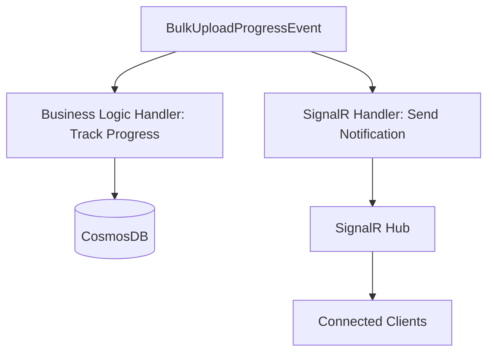

# SignalR Patterns

## Overview

SignalR provides **real-time bidirectional communication** between server and client, enabling live progress updates, notifications, and collaborative features without polling.

## Architecture

### SignalR Hub (Platform Domain)

**Location**: `Platform/src/Api/Hubs/NotificationHub.cs`

```csharp
using Microsoft.AspNetCore.SignalR;

public class NotificationHub : Hub
{
    private readonly ILogger<NotificationHub> _logger;
    
    public NotificationHub(ILogger<NotificationHub> logger)
    {
        _logger = logger;
    }
    
    public override async Task OnConnectedAsync()
    {
        _logger.LogInformation("Client connected: {ConnectionId}", Context.ConnectionId);
        await base.OnConnectedAsync();
    }
    
    public override async Task OnDisconnectedAsync(Exception exception)
    {
        _logger.LogInformation("Client disconnected: {ConnectionId}", Context.ConnectionId);
        await base.OnDisconnectedAsync(exception);
    }
    
    // Client can call this to join a specific group
    public async Task JoinUploadGroup(string uploadId)
    {
        await Groups.AddToGroupAsync(Context.ConnectionId, $"upload-{uploadId}");
        _logger.LogInformation("Client {ConnectionId} joined upload group {UploadId}",
            Context.ConnectionId, uploadId);
    }
    
    public async Task LeaveUploadGroup(string uploadId)
    {
        await Groups.RemoveFromGroupAsync(Context.ConnectionId, $"upload-{uploadId}");
    }
}
```

### SignalR Configuration (Platform API)

```csharp
// Platform/src/Api/Program.cs
var builder = Host.CreateDefaultBuilder(args)
    .ConfigureFunctionsWorkerDefaults()
    .ConfigureServices(services =>
    {
        // Add SignalR
        services.AddSignalR();
        
        // Add Azure SignalR Service (for production scalability)
        services.AddSignalR().AddAzureSignalR(options =>
        {
            options.ConnectionString = Environment.GetEnvironmentVariable("SignalRConnectionString");
        });
    });

var host = builder.Build();
await host.RunAsync();
```

---

## Event-Driven SignalR Pattern

### Separate Handler for SignalR

**Key Principle**: SignalR handlers are **independent** from business logic handlers.



**Benefits**:
- SignalR failures don't affect business logic
- Multiple subscribers can react independently
- Easy to add/remove real-time features

### SignalR Handler Implementation

```csharp
// Platform/src/Endpoint.In/Handlers/SignalR/SignalRProgressHandler.cs
using Microsoft.AspNetCore.SignalR;
using NServiceBus;

public class SignalRProgressHandler :
    IHandleMessages<BulkUploadProgressEvent>,
    IHandleMessages<BulkUploadCompletedEvent>,
    IHandleMessages<BeneficiaryRegisteredEvent>
{
    private readonly IHubContext<NotificationHub> _hubContext;
    private readonly ILogger<SignalRProgressHandler> _logger;
    
    public SignalRProgressHandler(
        IHubContext<NotificationHub> hubContext,
        ILogger<SignalRProgressHandler> logger)
    {
        _hubContext = hubContext;
        _logger = logger;
    }
    
    public async Task Handle(BulkUploadProgressEvent message, IMessageHandlerContext context)
    {
        try
        {
            _logger.LogInformation("Sending progress update: {Processed}/{Total}",
                message.ProcessedRecords, message.TotalRecords);
            
            // Send to specific upload group
            await _hubContext.Clients
                .Group($"upload-{message.UploadId}")
                .SendAsync("BulkUploadProgress", new
                {
                    uploadId = message.UploadId,
                    totalRecords = message.TotalRecords,
                    processedRecords = message.ProcessedRecords,
                    successCount = message.SuccessCount,
                    errorCount = message.ErrorCount,
                    percentComplete = (double)message.ProcessedRecords / message.TotalRecords * 100
                });
        }
        catch (Exception ex)
        {
            // Log error but don't throw - SignalR failures shouldn't affect business logic
            _logger.LogError(ex, "Failed to send SignalR progress update");
        }
    }
    
    public async Task Handle(BulkUploadCompletedEvent message, IMessageHandlerContext context)
    {
        try
        {
            _logger.LogInformation("Sending completion notification for {UploadId}", message.UploadId);
            
            await _hubContext.Clients
                .Group($"upload-{message.UploadId}")
                .SendAsync("BulkUploadCompleted", new
                {
                    uploadId = message.UploadId,
                    totalRecords = message.TotalRecords,
                    successCount = message.SuccessCount,
                    errorCount = message.ErrorCount,
                    errors = message.Errors,
                    duration = message.Duration.TotalSeconds
                });
        }
        catch (Exception ex)
        {
            _logger.LogError(ex, "Failed to send SignalR completion notification");
        }
    }
    
    public async Task Handle(BeneficiaryRegisteredEvent message, IMessageHandlerContext context)
    {
        try
        {
            // Broadcast to all clients
            await _hubContext.Clients.All.SendAsync("BeneficiaryRegistered", new
            {
                beneficiaryId = message.BeneficiaryId,
                name = $"{message.FirstName} {message.LastName}",
                registeredAt = message.RegisteredAt
            });
        }
        catch (Exception ex)
        {
            _logger.LogError(ex, "Failed to send SignalR beneficiary notification");
        }
    }
}
```

---

## React Client Integration

### SignalR Hook

```typescript
// Platform/src/UI/src/hooks/useSignalR.ts
import { useEffect, useState, useCallback } from 'react';
import * as signalR from '@microsoft/signalr';

export interface UseSignalROptions {
  hubUrl: string;
  onConnected?: () => void;
  onDisconnected?: () => void;
  onReconnecting?: () => void;
  onReconnected?: () => void;
}

export const useSignalR = (options: UseSignalROptions) => {
  const [connection, setConnection] = useState<signalR.HubConnection | null>(null);
  const [connectionState, setConnectionState] = useState<signalR.HubConnectionState>(
    signalR.HubConnectionState.Disconnected
  );
  
  useEffect(() => {
    const newConnection = new signalR.HubConnectionBuilder()
      .withUrl(options.hubUrl)
      .withAutomaticReconnect({
        nextRetryDelayInMilliseconds: (retryContext) => {
          // Exponential backoff: 0s, 2s, 10s, 30s, then 30s
          if (retryContext.previousRetryCount === 0) return 0;
          if (retryContext.previousRetryCount === 1) return 2000;
          if (retryContext.previousRetryCount === 2) return 10000;
          return 30000;
        }
      })
      .configureLogging(signalR.LogLevel.Information)
      .build();
    
    // Connection state callbacks
    newConnection.onclose(() => {
      setConnectionState(signalR.HubConnectionState.Disconnected);
      options.onDisconnected?.();
    });
    
    newConnection.onreconnecting(() => {
      setConnectionState(signalR.HubConnectionState.Reconnecting);
      options.onReconnecting?.();
    });
    
    newConnection.onreconnected(() => {
      setConnectionState(signalR.HubConnectionState.Connected);
      options.onReconnected?.();
    });
    
    // Start connection
    newConnection
      .start()
      .then(() => {
        setConnectionState(signalR.HubConnectionState.Connected);
        options.onConnected?.();
        console.log('SignalR connected');
      })
      .catch((err) => {
        console.error('SignalR connection error:', err);
        setConnectionState(signalR.HubConnectionState.Disconnected);
      });
    
    setConnection(newConnection);
    
    // Cleanup
    return () => {
      newConnection.stop();
    };
  }, [options.hubUrl]);
  
  const on = useCallback((eventName: string, callback: (...args: any[]) => void) => {
    connection?.on(eventName, callback);
  }, [connection]);
  
  const off = useCallback((eventName: string, callback?: (...args: any[]) => void) => {
    if (callback) {
      connection?.off(eventName, callback);
    } else {
      connection?.off(eventName);
    }
  }, [connection]);
  
  const invoke = useCallback(async (methodName: string, ...args: any[]) => {
    if (connection && connectionState === signalR.HubConnectionState.Connected) {
      try {
        await connection.invoke(methodName, ...args);
      } catch (err) {
        console.error(`SignalR invoke error (${methodName}):`, err);
        throw err;
      }
    } else {
      throw new Error('SignalR not connected');
    }
  }, [connection, connectionState]);
  
  return {
    connection,
    connectionState,
    connected: connectionState === signalR.HubConnectionState.Connected,
    on,
    off,
    invoke
  };
};
```

### Usage in Component

```typescript
// Beneficiary/src/UI/src/pages/BulkUploadPage.tsx
import React, { useState, useEffect } from 'react';
import { useSignalR } from '@acmecorp/platform-ui/hooks/useSignalR';

const BulkUploadPage: React.FC = () => {
  const [uploadId, setUploadId] = useState<string | null>(null);
  const [progress, setProgress] = useState(0);
  const [status, setStatus] = useState<'idle' | 'uploading' | 'completed'>('idle');
  
  const { connected, on, off, invoke } = useSignalR({
    hubUrl: 'http://localhost:7071/api',
    onConnected: () => console.log('SignalR connected'),
    onDisconnected: () => console.log('SignalR disconnected'),
    onReconnecting: () => console.log('SignalR reconnecting...'),
    onReconnected: () => console.log('SignalR reconnected')
  });
  
  useEffect(() => {
    if (!uploadId || !connected) return;
    
    // Join upload-specific group
    invoke('JoinUploadGroup', uploadId)
      .then(() => console.log(`Joined group: upload-${uploadId}`))
      .catch(err => console.error('Failed to join group:', err));
    
    // Listen for progress updates
    const handleProgress = (data: any) => {
      console.log('Progress update:', data);
      setProgress(data.percentComplete);
    };
    
    const handleCompleted = (data: any) => {
      console.log('Upload completed:', data);
      setStatus('completed');
      alert(`Upload complete! Success: ${data.successCount}, Errors: ${data.errorCount}`);
    };
    
    on('BulkUploadProgress', handleProgress);
    on('BulkUploadCompleted', handleCompleted);
    
    // Cleanup
    return () => {
      off('BulkUploadProgress', handleProgress);
      off('BulkUploadCompleted', handleCompleted);
      invoke('LeaveUploadGroup', uploadId);
    };
  }, [uploadId, connected]);
  
  const handleUpload = async (file: File) => {
    // Parse file, validate, send to API
    const response = await fetch('http://localhost:7075/api/beneficiary/bulk-upload', {
      method: 'POST',
      body: JSON.stringify({ rows: parsedData })
    });
    
    const result = await response.json();
    setUploadId(result.uploadId);
    setStatus('uploading');
  };
  
  return (
    <div>
      {status === 'uploading' && (
        <div>
          <p>Uploading: {Math.round(progress)}%</p>
          <progress value={progress} max={100} />
        </div>
      )}
    </div>
  );
};
```

---

## Broadcasting Patterns

### Broadcast to All Clients

```csharp
// Send to all connected clients
await _hubContext.Clients.All.SendAsync("BeneficiaryRegistered", new
{
    beneficiaryId = message.BeneficiaryId,
    name = message.Name
});
```

### Broadcast to Specific Group

```csharp
// Send to specific upload group
await _hubContext.Clients
    .Group($"upload-{uploadId}")
    .SendAsync("BulkUploadProgress", data);
```

### Broadcast to Specific User

```csharp
// Send to specific user (requires authentication)
await _hubContext.Clients
    .User(userId)
    .SendAsync("PersonalNotification", data);
```

### Broadcast to Everyone Except Caller

```csharp
// In hub method (not handler)
public async Task NotifyOthers(string message)
{
    await Clients.Others.SendAsync("MessageReceived", message);
}
```

---

## Error Handling

### Client-Side Retry

```typescript
const { connected, on, invoke } = useSignalR({
  hubUrl: 'http://localhost:7071/api',
  onReconnected: async () => {
    // Re-join groups after reconnection
    if (uploadId) {
      try {
        await invoke('JoinUploadGroup', uploadId);
      } catch (err) {
        console.error('Failed to rejoin group:', err);
      }
    }
  }
});
```

### Server-Side Graceful Degradation

```csharp
public async Task Handle(BulkUploadProgressEvent message, IMessageHandlerContext context)
{
    try
    {
        await _hubContext.Clients.Group($"upload-{message.UploadId}")
            .SendAsync("BulkUploadProgress", data);
    }
    catch (Exception ex)
    {
        // Log but don't throw - business logic continues even if SignalR fails
        _logger.LogError(ex, "SignalR notification failed, but processing continues");
    }
}
```

---

## Connection Management

### Connection State Indicator

```typescript
const ConnectionStatus: React.FC = () => {
  const { connectionState } = useSignalR({ hubUrl: 'http://localhost:7071/api' });
  
  const getStatusColor = () => {
    switch (connectionState) {
      case signalR.HubConnectionState.Connected:
        return 'green';
      case signalR.HubConnectionState.Reconnecting:
        return 'orange';
      case signalR.HubConnectionState.Disconnected:
        return 'red';
      default:
        return 'grey';
    }
  };
  
  return (
    <Box sx={{ display: 'flex', alignItems: 'center', gap: 1 }}>
      <Box
        sx={{
          width: 10,
          height: 10,
          borderRadius: '50%',
          bgcolor: getStatusColor()
        }}
      />
      <Typography variant="caption">
        {connectionState === signalR.HubConnectionState.Connected && 'Connected'}
        {connectionState === signalR.HubConnectionState.Reconnecting && 'Reconnecting...'}
        {connectionState === signalR.HubConnectionState.Disconnected && 'Disconnected'}
      </Typography>
    </Box>
  );
};
```

---

## Best Practices

### 1. Use Groups for Scoped Notifications

```csharp
// Good - scoped to upload
await _hubContext.Clients.Group($"upload-{uploadId}").SendAsync("Progress", data);

// Bad - broadcast to everyone (noisy)
await _hubContext.Clients.All.SendAsync("Progress", data);
```

### 2. Handle Disconnections Gracefully

```typescript
// Good - handle reconnection
onReconnected: async () => {
  await invoke('JoinUploadGroup', uploadId);
}

// Bad - assume always connected
useEffect(() => {
  invoke('JoinUploadGroup', uploadId);  // May fail if not connected
}, []);
```

### 3. Clean Up Event Listeners

```typescript
// Good - cleanup
useEffect(() => {
  on('Progress', handler);
  return () => off('Progress', handler);
}, []);

// Bad - memory leak
useEffect(() => {
  on('Progress', handler);
}, []);
```

### 4. Use Typed Event Names

```typescript
// Good - constants
const SignalREvents = {
  BulkUploadProgress: 'BulkUploadProgress',
  BulkUploadCompleted: 'BulkUploadCompleted'
} as const;

on(SignalREvents.BulkUploadProgress, handler);

// Bad - magic strings
on('BulkUploadProgress', handler);
```

---

**Next**: See [Requirements Document Template](requirements-document-template.md) for standard business requirements format that maps directly to architecture.
