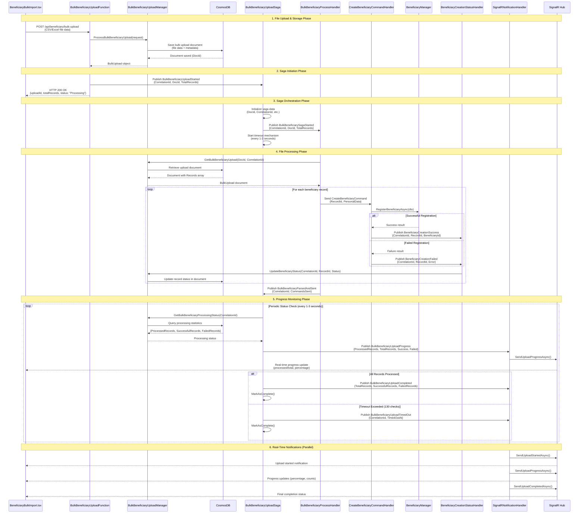

# Bulk Beneficiary Upload Process Documentation

## Overview

The Bulk Beneficiary Upload Process is a distributed, event-driven workflow that allows users to upload CSV/Excel files containing multiple beneficiary records for batch processing. The system provides real-time progress updates via SignalR and handles individual record validation and creation asynchronously.

## Business Process Flow

The process follows these main phases:

1. **File Upload & Storage** - User uploads file, system validates and stores in CosmosDB
2. **Saga Orchestration** - Long-running saga coordinates the entire process
3. **Record Processing** - Individual beneficiary records are processed asynchronously  
4. **Status Tracking** - Real-time updates sent to UI via SignalR
5. **Completion** - Final status reported when all records are processed

## Key Components

### Core Services
- **BulkBeneficiaryUploadFunction** - HTTP API endpoint for file uploads
- **BulkBeneficiaryUploadSaga** - Long-running process coordinator
- **BulkBeneficiaryUploadManager** - Business logic manager
- **CosmosDB** - Document storage for upload data and status tracking
- **SignalR** - Real-time communication with UI

### Domain Handlers
- **BulkBeneficiaryProcessHandler** - Processes file parsing and command distribution
- **CreateBeneficiaryCommandHandler** - Individual beneficiary record creation (Beneficiary domain)
- **BeneficiaryCreationStatusHandler** - Status updates from beneficiary processing
- **SignalRNotificationHandler** - Real-time UI notifications

### UI Components
- **BeneficiaryBulkImport.tsx** - Main upload interface and progress display
- **ValidationRulesDialog.tsx** - Validation rules display for users

## Event Flow

### Core Events
1. **BulkBeneficiaryUploadStarted** - Triggers saga initiation
2. **BulkBeneficiarySagaStarted** - Signals start of record processing
3. **BulkBeneficiaryParsedAndSent** - All individual commands have been sent
4. **BulkBeneficiaryUploadProgress** - Periodic status updates
5. **BulkBeneficiaryUploadCompleted** - Final completion status
6. **BeneficiaryCreationSuccess/Failed** - Individual record results

## Sequence Diagram



## Component Responsibilities

### BulkBeneficiaryUploadFunction.cs
- **Purpose**: HTTP API endpoint for bulk uploads
- **Responsibilities**:
  - Receive and validate file upload requests
  - Delegate processing to BulkBeneficiaryUploadManager
  - Publish BulkBeneficiaryUploadStarted event
  - Provide status endpoint for progress queries
  - Return immediate HTTP response to client

### BulkBeneficiaryUploadSaga.cs
- **Purpose**: Long-running process coordinator
- **Responsibilities**:
  - Orchestrate the entire bulk upload workflow
  - Publish BulkBeneficiarySagaStarted to initiate processing
  - Monitor processing progress via periodic timeouts
  - Track overall status and completion
  - Handle timeout scenarios (130 check limit)
  - Publish progress and completion events

### BulkBeneficiaryProcessHandler.cs  
- **Purpose**: File parsing and command distribution
- **Responsibilities**:
  - Handle BulkBeneficiarySagaStarted event
  - Retrieve upload document from CosmosDB
  - Parse file data into individual records
  - Send CreateBeneficiaryCommand for each record
  - Publish BulkBeneficiaryParsedAndSent completion event

### CreateBeneficiaryCommandHandler.cs (Beneficiary Domain)
- **Purpose**: Individual beneficiary record processing
- **Responsibilities**:
  - Process individual CreateBeneficiaryCommand
  - Validate and register single beneficiary
  - Publish success/failure events for each record
  - Handle business validation and data persistence

### BeneficiaryCreationStatusHandler.cs
- **Purpose**: Individual record status tracking
- **Responsibilities**:
  - Handle BeneficiaryCreationSuccess/Failed events
  - Update record status in CosmosDB document
  - Maintain processing statistics for saga monitoring

### SignalRNotificationHandler.cs
- **Purpose**: Real-time UI communication
- **Responsibilities**:
  - Handle all bulk upload events
  - Send real-time notifications to SignalR Hub
  - Provide progress updates to connected UI clients
  - Handle notification failures gracefully

### BeneficiaryBulkImport.tsx
- **Purpose**: User interface for bulk uploads
- **Responsibilities**:
  - File upload interface (drag/drop, file selection)
  - Client-side validation and error display
  - Real-time progress display via SignalR
  - Handle upload completion and error scenarios

## Data Flow

### 1. Upload Document Structure (CosmosDB)
```json
{
  "id": "guid",
  "correlationId": "guid",
  "uploadId": "guid", 
  "fileName": "beneficiaries.csv",
  "totalRecordsCount": 100,
  "userId": "user123",
  "startedAt": "2025-10-19T10:00:00Z",
  "records": [
    {
      "recordId": "guid",
      "firstName": "John",
      "lastName": "Doe", 
      "dateOfBirth": "1990-01-01",
      "nationality": "USA",
      "documentType": "Passport",
      "documentNumber": "P123456789",
      "result": {
        "status": "Success|Failed|Pending",
        "beneficiaryId": "guid",
        "errorMessage": null,
        "processedAt": "2025-10-19T10:05:00Z"
      }
    }
  ]
}
```

### 2. Progress Tracking
- **Real-time Updates**: Every 1-3 seconds via SignalR
- **Status Calculation**: Based on individual record results in CosmosDB
- **Completion Detection**: When ProcessedRecords = TotalRecords
- **Timeout Handling**: Maximum 130 status checks (~2 hours)

## Business Rules

### File Processing
- Supported formats: CSV, Excel (.xlsx, .xls)
- Validation occurs on both client and server side
- Invalid records are highlighted for user correction
- Processing continues for valid records even if some fail

### Individual Record Processing  
- Each record gets unique RecordId for tracking
- Validation includes data format and business rules
- Duplicate detection based on document number
- Asynchronous processing allows parallel execution

### Progress Monitoring
- Saga polls status every 1-3 seconds
- UI receives real-time updates via SignalR
- Processing statistics track success/failure counts
- Timeout protection prevents infinite loops

### Completion Criteria
- **Success**: All records processed (success or failure status)
- **Timeout**: 130 status checks exceeded without completion
- **Error**: System failure during processing

## Integration Points

### CosmosDB Operations
- **Save**: Initial bulk upload document storage
- **Query**: Retrieve document for processing
- **Update**: Individual record status updates  
- **Statistics**: Aggregate processing counts

### SignalR Communication
- **Connection**: UI establishes SignalR connection
- **Groups**: Upload-specific groups for targeted notifications
- **Events**: Started, Progress, Completed, TimedOut
- **Error Handling**: Graceful degradation if SignalR fails

### Cross-Domain Messaging
- **Platform → Beneficiary**: CreateBeneficiaryCommand via NServiceBus
- **Beneficiary → Platform**: Success/Failed events via NServiceBus
- **Event Routing**: Based on NServiceBus endpoint configuration

This documentation provides a business-level view of the bulk beneficiary upload process, focusing on the workflow, component interactions, and data flow without diving into technical implementation details.