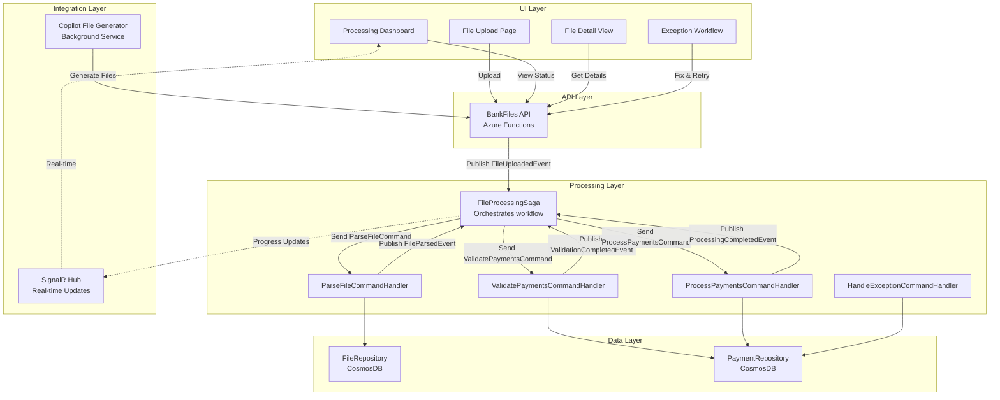

# Ultimate File Processing System Demo

## Overview

A comprehensive bank file processing system demonstrating the AcmeCorp distributed architecture capabilities. This demo showcases:

- **Multi-format file processing** (CSV, MT940, BAI2, ISO20022, Excel)
- **Automated file generation** using GitHub Copilot
- **Real-time processing dashboard** with drill-down capabilities
- **Exception handling workflow** for failed payments
- **Saga orchestration** for complex multi-step workflows
- **SignalR real-time updates** for processing progress

---

## Architecture Overview



---

## Domain Structure

### BankFiles Domain

Following the standard 6-project template:

```
BankFiles/
├── src/
│   ├── Api/                          # Azure Functions HTTP endpoints
│   │   ├── UploadFileFunction.cs
│   │   ├── GetFileStatusFunction.cs
│   │   ├── GetFileDetailsFunction.cs
│   │   ├── RetryFailedPaymentFunction.cs
│   │   └── GenerateSampleFileFunction.cs
│   │
│   ├── Domain/                       # Business logic & contracts
│   │   ├── Models/
│   │   │   ├── BankFile.cs
│   │   │   ├── Payment.cs
│   │   │   ├── PaymentException.cs
│   │   │   └── FileFormat.cs
│   │   ├── Contracts/
│   │   │   ├── Commands/
│   │   │   │   ├── UploadFileCommand.cs
│   │   │   │   ├── ParseFileCommand.cs
│   │   │   │   ├── ValidatePaymentsCommand.cs
│   │   │   │   ├── ProcessPaymentsCommand.cs
│   │   │   │   ├── RetryPaymentCommand.cs
│   │   │   │   └── GenerateSampleFileCommand.cs
│   │   │   └── Events/
│   │   │       ├── FileUploadedEvent.cs
│   │   │       ├── FileParsedEvent.cs
│   │   │       ├── ValidationCompletedEvent.cs
│   │   │       ├── ProcessingCompletedEvent.cs
│   │   │       ├── PaymentFailedEvent.cs
│   │   │       └── FileProcessingProgressEvent.cs
│   │   ├── DTOs/
│   │   │   ├── UploadFileDto.cs
│   │   │   ├── FileStatusDto.cs
│   │   │   ├── PaymentDto.cs
│   │   │   └── ExceptionDto.cs
│   │   └── Validators/
│   │       ├── UploadFileValidator.cs
│   │       └── PaymentValidator.cs
│   │
│   ├── Endpoint.In/                  # NServiceBus handlers & sagas
│   │   ├── Handlers/
│   │   │   ├── Commands/
│   │   │   │   ├── ParseFileCommandHandler.cs
│   │   │   │   ├── ValidatePaymentsCommandHandler.cs
│   │   │   │   ├── ProcessPaymentsCommandHandler.cs
│   │   │   │   └── RetryPaymentCommandHandler.cs
│   │   │   └── Events/
│   │   │       └── SignalRProgressHandler.cs
│   │   └── Sagas/
│   │       └── FileProcessingSaga.cs
│   │
│   ├── Infrastructure/               # Data access & integrations
│   │   ├── Repositories/
│   │   │   ├── BankFileRepository.cs
│   │   │   └── PaymentRepository.cs
│   │   ├── Parsers/
│   │   │   ├── IFileParser.cs
│   │   │   ├── CsvParser.cs
│   │   │   ├── Mt940Parser.cs
│   │   │   ├── Bai2Parser.cs
│   │   │   └── Iso20022Parser.cs
│   │   └── Services/
│   │       ├── CopilotFileGeneratorService.cs
│   │       └── PaymentProcessingService.cs
│   │
│   ├── Test/                         # Unit & integration tests
│   │   ├── Parsers/
│   │   ├── Handlers/
│   │   └── Validators/
│   │
│   └── UI/                           # React TypeScript application
│       ├── src/
│       │   ├── pages/
│       │   │   ├── Dashboard.tsx
│       │   │   ├── FileUpload.tsx
│       │   │   ├── FileDetail.tsx
│       │   │   └── ExceptionWorkflow.tsx
│       │   ├── components/
│       │   │   ├── FileStatusCard.tsx
│       │   │   ├── PaymentTable.tsx
│       │   │   ├── ExceptionCard.tsx
│       │   │   └── ProcessingProgress.tsx
│       │   └── hooks/
│       │       ├── useBankFiles.ts
│       │       ├── usePayments.ts
│       │       └── useFileProcessingSignalR.ts
│       └── webpack.config.js
│
└── docs/
    └── bankfiles-requirements.md
```

---

## Key Features

### 1. Multi-Format File Processing

**Supported Formats:**
- **CSV** - Simple comma-separated payment files
- **MT940** - SWIFT bank statement format
- **BAI2** - Bank Administration Institute format
- **ISO20022** - XML-based international standard
- **Excel** - XLSX spreadsheet files

**Parser Pattern:**
```csharp
public interface IFileParser
{
    Task<ParseResult> ParseAsync(Stream fileStream, FileFormat format);
    bool CanParse(FileFormat format);
}

public class ParseFileCommandHandler : IHandleMessages<ParseFileCommand>
{
    private readonly IEnumerable<IFileParser> _parsers;
    
    public async Task Handle(ParseFileCommand message, IMessageHandlerContext context)
    {
        var parser = _parsers.FirstOrDefault(p => p.CanParse(message.Format));
        if (parser == null)
            throw new UnsupportedFormatException($"No parser for {message.Format}");
        
        var result = await parser.ParseAsync(message.FileStream, message.Format);
        
        await context.Publish(new FileParsedEvent
        {
            FileId = message.FileId,
            TotalPayments = result.Payments.Count,
            ParsedAt = DateTime.UtcNow
        });
    }
}
```

### 2. File Processing Saga

**Orchestrates the complete workflow:**

```csharp
public class FileProcessingSaga : Saga<FileProcessingSagaData>,
    IAmStartedByMessages<FileUploadedEvent>,
    IHandleMessages<FileParsedEvent>,
    IHandleMessages<ValidationCompletedEvent>,
    IHandleMessages<ProcessingCompletedEvent>,
    IHandleTimeouts<ProcessingTimeout>
{
    protected override void ConfigureHowToFindSaga(SagaPropertyMapper<FileProcessingSagaData> mapper)
    {
        mapper.MapSaga(saga => saga.FileId)
            .ToMessage<FileUploadedEvent>(m => m.FileId)
            .ToMessage<FileParsedEvent>(m => m.FileId)
            .ToMessage<ValidationCompletedEvent>(m => m.FileId)
            .ToMessage<ProcessingCompletedEvent>(m => m.FileId);
    }
    
    public async Task Handle(FileUploadedEvent message, IMessageHandlerContext context)
    {
        Data.FileId = message.FileId;
        Data.FileName = message.FileName;
        Data.Format = message.Format;
        Data.UploadedAt = message.UploadedAt;
        Data.Status = ProcessingStatus.Parsing;
        
        await PublishProgress(context, "File uploaded, starting parse...");
        
        await context.SendLocal(new ParseFileCommand
        {
            FileId = message.FileId,
            FileContent = message.FileContent,
            Format = message.Format
        });
        
        await RequestTimeout<ProcessingTimeout>(context, TimeSpan.FromMinutes(10));
    }
    
    public async Task Handle(FileParsedEvent message, IMessageHandlerContext context)
    {
        Data.TotalPayments = message.TotalPayments;
        Data.Status = ProcessingStatus.Validating;
        
        await PublishProgress(context, $"Parsed {message.TotalPayments} payments, validating...");
        
        await context.SendLocal(new ValidatePaymentsCommand
        {
            FileId = message.FileId
        });
    }
    
    public async Task Handle(ValidationCompletedEvent message, IMessageHandlerContext context)
    {
        Data.ValidPayments = message.ValidCount;
        Data.InvalidPayments = message.InvalidCount;
        Data.Status = ProcessingStatus.Processing;
        
        await PublishProgress(context, 
            $"Validation complete: {message.ValidCount} valid, {message.InvalidCount} invalid");
        
        if (message.ValidCount > 0)
        {
            await context.SendLocal(new ProcessPaymentsCommand
            {
                FileId = message.FileId
            });
        }
    }
    
    public async Task Handle(ProcessingCompletedEvent message, IMessageHandlerContext context)
    {
        Data.ProcessedPayments = message.SuccessCount;
        Data.FailedPayments = message.FailureCount;
        Data.Status = ProcessingStatus.Completed;
        Data.CompletedAt = DateTime.UtcNow;
        
        await PublishProgress(context, 
            $"Processing complete: {message.SuccessCount} succeeded, {message.FailureCount} failed");
        
        MarkAsComplete();
    }
    
    private async Task PublishProgress(IMessageHandlerContext context, string message)
    {
        await context.Publish(new FileProcessingProgressEvent
        {
            FileId = Data.FileId,
            Status = Data.Status,
            Message = message,
            TotalPayments = Data.TotalPayments,
            ProcessedPayments = Data.ProcessedPayments,
            FailedPayments = Data.FailedPayments,
            Timestamp = DateTime.UtcNow
        });
    }
}

public class FileProcessingSagaData : ContainSagaData
{
    public Guid FileId { get; set; }
    public string FileName { get; set; }
    public FileFormat Format { get; set; }
    public ProcessingStatus Status { get; set; }
    public DateTime UploadedAt { get; set; }
    public DateTime? CompletedAt { get; set; }
    public int TotalPayments { get; set; }
    public int ValidPayments { get; set; }
    public int InvalidPayments { get; set; }
    public int ProcessedPayments { get; set; }
    public int FailedPayments { get; set; }
}
```

### 3. Processing Dashboard

**Real-time dashboard with SignalR:**

```typescript
// src/UI/src/pages/Dashboard.tsx
import { useEffect, useState } from 'react';
import { Grid, Card, CardContent, Typography, LinearProgress } from '@mui/material';
import { useFileProcessingSignalR } from '../hooks/useFileProcessingSignalR';

export const Dashboard = () => {
  const [files, setFiles] = useState<FileStatus[]>([]);
  const { connect, disconnect, subscribe } = useFileProcessingSignalR();

  useEffect(() => {
    // Load initial data
    loadFiles();
    
    // Connect to SignalR
    connect();
    
    // Subscribe to progress updates
    subscribe('FileProcessingProgress', (update: FileProcessingProgress) => {
      setFiles(prev => prev.map(f => 
        f.fileId === update.fileId 
          ? { ...f, ...update }
          : f
      ));
    });
    
    return () => disconnect();
  }, []);

  const loadFiles = async () => {
    const response = await fetch('http://localhost:7080/api/files');
    const data = await response.json();
    setFiles(data);
  };

  return (
    <Grid container spacing={3}>
      <Grid item xs={12}>
        <Typography variant="h4">File Processing Dashboard</Typography>
      </Grid>
      
      {files.map(file => (
        <Grid item xs={12} md={6} lg={4} key={file.fileId}>
          <FileStatusCard file={file} onClick={() => navigate(`/file/${file.fileId}`)} />
        </Grid>
      ))}
    </Grid>
  );
};

// src/UI/src/components/FileStatusCard.tsx
export const FileStatusCard = ({ file, onClick }) => {
  const getStatusColor = (status: ProcessingStatus) => {
    switch (status) {
      case 'Completed': return 'success';
      case 'Processing': return 'info';
      case 'Failed': return 'error';
      default: return 'warning';
    }
  };

  const progress = file.totalPayments > 0 
    ? (file.processedPayments / file.totalPayments) * 100 
    : 0;

  return (
    <Card onClick={onClick} sx={{ cursor: 'pointer', '&:hover': { boxShadow: 6 } }}>
      <CardContent>
        <Typography variant="h6" gutterBottom>
          {file.fileName}
        </Typography>
        
        <Chip 
          label={file.status} 
          color={getStatusColor(file.status)} 
          size="small" 
          sx={{ mb: 2 }}
        />
        
        <Typography variant="body2" color="text.secondary" gutterBottom>
          Format: {file.format} | Uploaded: {formatDate(file.uploadedAt)}
        </Typography>
        
        {file.status === 'Processing' && (
          <LinearProgress variant="determinate" value={progress} sx={{ mb: 1 }} />
        )}
        
        <Grid container spacing={2} sx={{ mt: 1 }}>
          <Grid item xs={6}>
            <Typography variant="caption" color="text.secondary">Total</Typography>
            <Typography variant="h6">{file.totalPayments}</Typography>
          </Grid>
          <Grid item xs={6}>
            <Typography variant="caption" color="text.secondary">Processed</Typography>
            <Typography variant="h6" color="success.main">
              {file.processedPayments}
            </Typography>
          </Grid>
          {file.failedPayments > 0 && (
            <Grid item xs={6}>
              <Typography variant="caption" color="text.secondary">Failed</Typography>
              <Typography variant="h6" color="error.main">
                {file.failedPayments}
              </Typography>
            </Grid>
          )}
        </Grid>
      </CardContent>
    </Card>
  );
};
```

### 4. File Detail View with Drill-Down

```typescript
// src/UI/src/pages/FileDetail.tsx
export const FileDetail = () => {
  const { fileId } = useParams();
  const [file, setFile] = useState<FileDetails>();
  const [payments, setPayments] = useState<Payment[]>([]);
  const [filter, setFilter] = useState<'all' | 'success' | 'failed'>('all');

  useEffect(() => {
    loadFileDetails();
  }, [fileId]);

  const loadFileDetails = async () => {
    const response = await fetch(`http://localhost:7080/api/files/${fileId}`);
    const data = await response.json();
    setFile(data.file);
    setPayments(data.payments);
  };

  const filteredPayments = payments.filter(p => {
    if (filter === 'all') return true;
    if (filter === 'success') return p.status === 'Processed';
    if (filter === 'failed') return p.status === 'Failed';
  });

  return (
    <Box>
      <Typography variant="h4" gutterBottom>
        {file?.fileName}
      </Typography>
      
      <Grid container spacing={3} sx={{ mb: 3 }}>
        <Grid item xs={12} md={3}>
          <StatCard title="Total Payments" value={file?.totalPayments} />
        </Grid>
        <Grid item xs={12} md={3}>
          <StatCard title="Processed" value={file?.processedPayments} color="success" />
        </Grid>
        <Grid item xs={12} md={3}>
          <StatCard title="Failed" value={file?.failedPayments} color="error" />
        </Grid>
        <Grid item xs={12} md={3}>
          <StatCard title="Pending" value={file?.pendingPayments} color="warning" />
        </Grid>
      </Grid>

      <ToggleButtonGroup value={filter} exclusive onChange={(e, val) => setFilter(val)}>
        <ToggleButton value="all">All</ToggleButton>
        <ToggleButton value="success">Success</ToggleButton>
        <ToggleButton value="failed">Failed</ToggleButton>
      </ToggleButtonGroup>

      <PaymentTable payments={filteredPayments} />
    </Box>
  );
};

// src/UI/src/components/PaymentTable.tsx
export const PaymentTable = ({ payments }) => {
  return (
    <TableContainer component={Paper}>
      <Table>
        <TableHead>
          <TableRow>
            <TableCell>Payment ID</TableCell>
            <TableCell>Amount</TableCell>
            <TableCell>From Account</TableCell>
            <TableCell>To Account</TableCell>
            <TableCell>Status</TableCell>
            <TableCell>Error</TableCell>
            <TableCell>Actions</TableCell>
          </TableRow>
        </TableHead>
        <TableBody>
          {payments.map(payment => (
            <TableRow key={payment.id}>
              <TableCell>{payment.id}</TableCell>
              <TableCell>${payment.amount.toFixed(2)}</TableCell>
              <TableCell>{payment.fromAccount}</TableCell>
              <TableCell>{payment.toAccount}</TableCell>
              <TableCell>
                <Chip 
                  label={payment.status} 
                  color={payment.status === 'Processed' ? 'success' : 'error'}
                  size="small"
                />
              </TableCell>
              <TableCell>
                {payment.errorMessage && (
                  <Tooltip title={payment.errorMessage}>
                    <ErrorIcon color="error" />
                  </Tooltip>
                )}
              </TableCell>
              <TableCell>
                {payment.status === 'Failed' && (
                  <Button 
                    size="small" 
                    onClick={() => handleRetry(payment.id)}
                  >
                    Retry
                  </Button>
                )}
              </TableCell>
            </TableRow>
          ))}
        </TableBody>
      </Table>
    </TableContainer>
  );
};
```

### 5. Exception Workflow

```typescript
// src/UI/src/pages/ExceptionWorkflow.tsx
export const ExceptionWorkflow = () => {
  const [exceptions, setExceptions] = useState<PaymentException[]>([]);
  const [selectedExceptions, setSelectedExceptions] = useState<string[]>([]);

  useEffect(() => {
    loadExceptions();
  }, []);

  const loadExceptions = async () => {
    const response = await fetch('http://localhost:7080/api/payments/exceptions');
    const data = await response.json();
    setExceptions(data);
  };

  const handleBulkRetry = async () => {
    await fetch('http://localhost:7080/api/payments/bulk-retry', {
      method: 'POST',
      headers: { 'Content-Type': 'application/json' },
      body: JSON.stringify({ paymentIds: selectedExceptions })
    });
    
    setSelectedExceptions([]);
    loadExceptions();
  };

  const handleFix = async (exceptionId: string, fixedData: PaymentData) => {
    await fetch(`http://localhost:7080/api/payments/${exceptionId}/fix`, {
      method: 'PUT',
      headers: { 'Content-Type': 'application/json' },
      body: JSON.stringify(fixedData)
    });
    
    loadExceptions();
  };

  return (
    <Box>
      <Box sx={{ display: 'flex', justifyContent: 'space-between', mb: 3 }}>
        <Typography variant="h4">Payment Exceptions</Typography>
        <Button 
          variant="contained" 
          onClick={handleBulkRetry}
          disabled={selectedExceptions.length === 0}
        >
          Retry Selected ({selectedExceptions.length})
        </Button>
      </Box>

      <Grid container spacing={2}>
        {exceptions.map(exception => (
          <Grid item xs={12} key={exception.id}>
            <ExceptionCard 
              exception={exception}
              onSelect={(id) => setSelectedExceptions(prev => [...prev, id])}
              onDeselect={(id) => setSelectedExceptions(prev => prev.filter(x => x !== id))}
              onFix={handleFix}
            />
          </Grid>
        ))}
      </Grid>
    </Box>
  );
};
```

### 6. Copilot-Generated Sample Files

```csharp
// Infrastructure/Services/CopilotFileGeneratorService.cs
public class CopilotFileGeneratorService : BackgroundService
{
    private readonly IMessageSession _messageSession;
    private readonly ILogger<CopilotFileGeneratorService> _logger;
    
    protected override async Task ExecuteAsync(CancellationToken stoppingToken)
    {
        while (!stoppingToken.IsCancellationRequested)
        {
            await Task.Delay(TimeSpan.FromMinutes(5), stoppingToken);
            
            // Generate sample file every 5 minutes for demo
            await GenerateSampleFile();
        }
    }
    
    private async Task GenerateSampleFile()
    {
        var formats = new[] { FileFormat.CSV, FileFormat.MT940, FileFormat.BAI2 };
        var format = formats[Random.Shared.Next(formats.Length)];
        
        var fileContent = format switch
        {
            FileFormat.CSV => GenerateCsvFile(),
            FileFormat.MT940 => GenerateMt940File(),
            FileFormat.BAI2 => GenerateBai2File(),
            _ => throw new NotSupportedException()
        };
        
        await _messageSession.SendLocal(new UploadFileCommand
        {
            FileId = Guid.NewGuid(),
            FileName = $"auto-generated-{DateTime.UtcNow:yyyyMMdd-HHmmss}.{format.ToString().ToLower()}",
            FileContent = fileContent,
            Format = format,
            Source = "CopilotGenerator"
        });
        
        _logger.LogInformation("Generated sample {Format} file", format);
    }
    
    private string GenerateCsvFile()
    {
        var sb = new StringBuilder();
        sb.AppendLine("PaymentId,Amount,FromAccount,ToAccount,Reference,Date");
        
        for (int i = 0; i < Random.Shared.Next(10, 50); i++)
        {
            var hasError = Random.Shared.Next(100) < 10; // 10% failure rate
            var amount = Random.Shared.Next(100, 10000);
            var fromAccount = hasError ? "INVALID" : $"ACC{Random.Shared.Next(1000, 9999)}";
            var toAccount = $"ACC{Random.Shared.Next(1000, 9999)}";
            
            sb.AppendLine($"{Guid.NewGuid()},{amount},{fromAccount},{toAccount},REF{i},{DateTime.UtcNow:yyyy-MM-dd}");
        }
        
        return sb.ToString();
    }
}
```

---

## Data Models

### BankFile Entity

```csharp
public class BankFile
{
    public Guid Id { get; set; }
    public string FileName { get; set; }
    public FileFormat Format { get; set; }
    public ProcessingStatus Status { get; set; }
    public DateTime UploadedAt { get; set; }
    public DateTime? CompletedAt { get; set; }
    public string UploadedBy { get; set; }
    public string Source { get; set; } // "Manual" or "CopilotGenerator"
    
    // Statistics
    public int TotalPayments { get; set; }
    public int ValidPayments { get; set; }
    public int InvalidPayments { get; set; }
    public int ProcessedPayments { get; set; }
    public int FailedPayments { get; set; }
    public int PendingPayments { get; set; }
    
    // File content (stored in blob storage, reference here)
    public string BlobStorageUrl { get; set; }
}

public enum FileFormat
{
    CSV,
    MT940,
    BAI2,
    ISO20022,
    Excel
}

public enum ProcessingStatus
{
    Uploaded,
    Parsing,
    Validating,
    Processing,
    Completed,
    Failed
}
```

### Payment Entity

```csharp
public class Payment
{
    public Guid Id { get; set; }
    public Guid FileId { get; set; }
    public int LineNumber { get; set; }
    
    // Payment details
    public decimal Amount { get; set; }
    public string FromAccount { get; set; }
    public string ToAccount { get; set; }
    public string Reference { get; set; }
    public DateTime PaymentDate { get; set; }
    
    // Processing
    public PaymentStatus Status { get; set; }
    public string ErrorMessage { get; set; }
    public DateTime? ProcessedAt { get; set; }
    public int RetryCount { get; set; }
}

public enum PaymentStatus
{
    Pending,
    Validating,
    Processing,
    Processed,
    Failed
}
```

---

## CosmosDB Partition Strategy

**BankFiles Container:**
- Partition Key: `/uploadedDate` (e.g., "2025-11-18")
- Enables efficient queries for recent files
- Supports time-based TTL if needed

**Payments Container:**
- Partition Key: `/fileId`
- All payments from same file in same partition
- Efficient for file-level queries and drill-down

---

## Demo Scenarios

### Scenario 1: Manual File Upload
1. User uploads CSV file via UI
2. File appears in dashboard with "Uploading" status
3. Progress bar shows parsing → validation → processing
4. Real-time updates via SignalR
5. File completes, dashboard shows statistics
6. User drills into file to see individual payments

### Scenario 2: Automated File Generation
1. Background service generates sample file every 5 minutes
2. File automatically uploaded and processed
3. Dashboard updates in real-time as new file appears
4. Demonstrates "lights out" processing capability

### Scenario 3: Exception Handling
1. File contains some invalid payments (bad account numbers)
2. Processing completes with failures shown
3. User navigates to Exception Workflow page
4. Sees all failed payments with error messages
5. Fixes account numbers inline
6. Clicks "Retry" to reprocess
7. Payments succeed, removed from exception list

### Scenario 4: Bulk Exception Retry
1. Multiple files processed with failures
2. Exception Workflow shows all failures across files
3. User selects multiple failed payments
4. Clicks "Retry Selected"
5. Bulk retry command sent
6. SignalR updates show progress for each retry

---

## Technical Highlights

### Event-Driven Architecture
- **12+ events** published throughout workflow
- Multiple handlers subscribe independently
- SignalR handler separate from business logic
- Saga coordinates without tight coupling

### Saga Orchestration
- Complex multi-step workflow
- Automatic timeout handling
- Progress tracking at each step
- Compensation for failures

### Real-Time Updates
- SignalR integration throughout
- Progress events published at each milestone
- UI automatically updates without polling
- Connection state management with reconnection

### Micro-Frontend Pattern
- BankFiles UI module loads into Platform shell
- Independent deployment capability
- Shared theme and navigation
- Module Federation for runtime composition

### Parser Extensibility
- Interface-based parser registration
- Easy to add new file formats
- Format-specific validation rules
- Centralized error handling

---

## Success Metrics

**Performance:**
- Process 10,000 payments in < 2 minutes
- Real-time UI updates within 500ms
- 99.9% parsing accuracy

**User Experience:**
- Zero-configuration file upload
- Live progress visualization
- Exception fixing without leaving UI
- Mobile-responsive dashboard

**Architecture:**
- 100% event-driven communication
- Zero direct domain dependencies
- Saga handles all failures gracefully
- SignalR failures don't affect processing

---

## Future Enhancements

1. **AI-Powered Exception Resolution** - Copilot suggests fixes for common errors
2. **Payment Scheduling** - Schedule future-dated payments
3. **Multi-Currency Support** - Handle currency conversion
4. **Webhook Notifications** - Alert external systems on completion
5. **Advanced Analytics** - Trends, success rates, processing times
6. **Rule Engine** - Business rules for payment routing
7. **Duplicate Detection** - ML-based duplicate payment identification
8. **Batch Consolidation** - Combine multiple files into batches

---

## Conclusion

This demo showcases the **full power** of the AcmeCorp distributed architecture:

✅ **Event-Driven** - Loose coupling, independent scaling  
✅ **Saga Orchestration** - Complex workflows made simple  
✅ **Real-Time** - SignalR keeps users informed  
✅ **Micro-Frontends** - Independent UI deployment  
✅ **Resilient** - Failures isolated and recoverable  
✅ **Extensible** - New formats/features added easily  

**Perfect for demonstrating enterprise-grade file processing with modern architecture patterns!**
