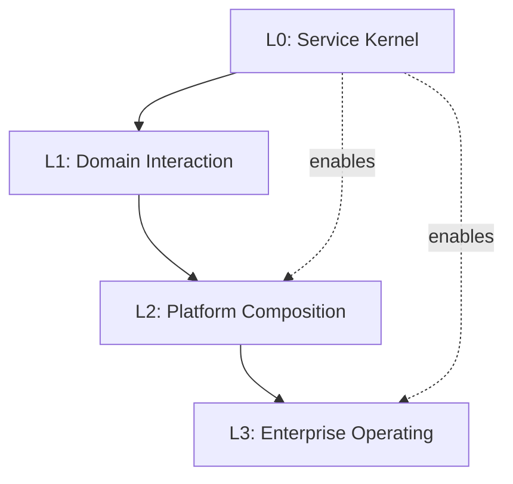

# Distributed Architecture Pattern Index

> Navigate the IOM Migration Platform's pattern catalog. Each pattern includes context, runnable code, and Copilot prompts.

## Quick Navigation

- **[L0 - Service Kernel](#l0---service-kernel)** - Per-service building blocks (mandatory)
- **[L1 - Domain Interaction](#l1---domain-interaction)** - Cross-service collaboration patterns  
- **[L2 - Platform Composition](#l2---platform-composition)** - Enterprise-level composition
- **[L3 - Enterprise Operating Model](#l3---enterprise-operating-model)** - Governance and evolution

---

## L0 - Service Kernel
*Per-service, always-on building blocks that every service should implement consistently.*

### Identity & Security
- **[Identity & Access](patterns/L0/Identity-Access/README.md)** - OIDC/OAuth2, Managed Identity, RBAC, service-to-service auth
- **[Security Posture](patterns/L0/Security-Posture/)** - Secret management, TLS, encryption defaults, least privilege

### Configuration & Operations  
- **[Config & Flags](patterns/L0/Config-Flags/README.md)** - Azure App Config, Key Vault, feature flags, hierarchical config
- **[Observability](patterns/L0/Observability/)** - Structured logging, metrics, distributed tracing, health probes
- **[Background Work](patterns/L0/Background-Work/)** - Schedulers, timers, durable tasks, compensation utilities

### Communication & Data
- **[Resilience & Networking](patterns/L0/Resilience-Networking/README.md)** - Timeouts, retries, circuit breakers, correlation tracking
- **[Data Access](patterns/L0/Data-Access/)** - Repository/UoW, aggregate mappers, connection management, optimistic concurrency
- **[Messaging Client](patterns/L0/Messaging-Client/)** - Producer/consumer baselines, dead letter handling, outbox/inbox
- **[Contracts](patterns/L0/Contracts/)** - API versioning, schema validation, DTO mapping, error envelopes

---

## L1 - Domain Interaction  
*Patterns for collaboration within and between bounded contexts to achieve business outcomes.*

### Synchronous Collaboration
- **[Sync Collaboration](patterns/L1/Sync-Collaboration/)** - BFF per UI, API Gateway, GraphQL federation, composite UI
- **[Boundary Protection](patterns/L1/Boundary-Protection/)** - Anti-corruption layers, CQRS projections, reference data sync

### Asynchronous Collaboration
- **[Async Collaboration](patterns/L1/Async-Collaboration/README.md)** - Pub/sub, event-carried state transfer, request/reply messaging
- **[Saga Orchestration](patterns/L1/Saga-Orchestration/README.md)** - Coordinated workflows, distributed transactions, compensation patterns

### Data & File Processing
- **[File & Batch](patterns/L1/File-Batch/)** - Ingestion pipelines, validation, chunking, poison file quarantine
- **[Scatter-Gather](patterns/L1/Scatter-Gather/)** - Fan-out/fan-in, map-reduce aggregation, quorum patterns

### Cross-Domain Contracts
- **[Contracts Between Domains](patterns/L1/Contracts-Between-Domains/)** - Schema registry, consumer-driven contracts, API evolution
- **[Domain Gateways](patterns/L1/Domain-Gateways/)** - Composite integration layers, canonical messages, correlation mapping

---

## L2 - Platform Composition
*Enterprise-level patterns that standardize how domains are combined and orchestrated.*

### Enterprise Orchestration
- **[Orchestration & Event Mesh](patterns/L2/Orchestration-Event-Mesh/)** - Cross-domain journeys, routing rules, event ordering
- **[Contract Governance](patterns/L2/Contract-Governance/)** - Schema evolution, deprecation workflows, breaking change management

### Platform Services & Policies
- **[Policy & Guardrails](patterns/L2/Policy-Guardrails/)** - Central policy enforcement, API policies, data residency routing
- **[Shared Infra Services](patterns/L2/Shared-Infra-Services/)** - Composite search, distributed caching, file vault, KMS
- **[Data Products](patterns/L2/Data-Products/)** - Domain-owned data products, lineage, SLO-backed contracts

### Deployment & Reliability
- **[Deployment & Traffic](patterns/L2/Deployment-Traffic/)** - Blue/green, canary, shadow traffic, progressive delivery
- **[Reliability at Edges](patterns/L2/Reliability-Edges/)** - Global circuit breakers, bulkheads, load shedding

---

## L3 - Enterprise Operating Model
*Patterns for running, changing, and governing the entire platform at scale.*

### Platform Engineering
- **[Platform Engineering](patterns/L3/Platform-Engineering/)** - Golden paths, template repos, internal developer platform
- **[Knowledge & Enablement](patterns/L3/Knowledge-Enablement/)** - Pattern catalog portal, training labs, runnable examples

### Governance & Risk
- **[Governance & Risk](patterns/L3/Governance-Risk/)** - ADRs, tech radar, RFC processes, compliance, audit trails
- **[Change & Lifecycle](patterns/L3/Change-Lifecycle/)** - GitOps/IaC promotion, environment parity, deprecation policies

### Operations & Financial Management
- **[SRE & FinOps](patterns/L3/SRE-FinOps/)** - SLO taxonomy, error budgets, incident management, cost guardrails
- **[Resilience & DR](patterns/L3/Resilience-DR/)** - Multi-region strategies, chaos engineering, game days

---

## How to Use These Patterns

### 1. With GitHub Copilot
Each pattern includes a `prompt.md` with ready-to-use Copilot prompts:

```
Apply L0/Identity-Access pattern with Entra ID authentication. 
Configure RBAC with Reader/Admin roles, add Managed Identity for outbound calls.
Include unit tests and integration tests.
```

### 2. Pattern Selection Guide

**For New Services:**
1. Start with all **L0 patterns** (mandatory baseline)
2. Add **L1 patterns** based on service interactions needed
3. Apply **L2 patterns** when multiple services need coordination
4. Use **L3 patterns** for platform-wide governance

**For Existing Services:**
1. Audit against **L0 patterns** for gaps
2. Identify integration needs and apply **L1 patterns**  
3. Evolve to **L2/L3** patterns as platform matures

### 3. Implementation Order


### 4. Template Usage
Each pattern links to templates in `/templates/` directory:
- `api-service-with-auth/` - L0 Identity & Access
- `async-messaging-service/` - L1 Async Collaboration  
- `saga-orchestration/` - L1 Saga Orchestration
- `platform-service/` - L2 Platform Composition

### 5. Compliance & Standards
- **Security**: All patterns include security considerations and standards
- **Observability**: Logging, metrics, and tracing built into every pattern
- **Testing**: Each pattern includes unit, integration, and end-to-end test examples
- **Documentation**: Consistent structure with Context, Problem/Forces, Solution, Examples

---

## Pattern Maturity Model

### Level 1: Basic Implementation
✅ Pattern basics implemented  
✅ Core functionality working  
❌ Missing advanced features  
❌ Limited testing  

### Level 2: Production Ready
✅ All pattern features implemented  
✅ Comprehensive testing  
✅ Monitoring and alerting  
❌ Limited optimization  

### Level 3: Optimized & Governed  
✅ Performance optimized  
✅ Full governance integration  
✅ Automated compliance checks  
✅ Advanced monitoring and SLOs  

---

## Contributing to Patterns

### Adding New Patterns
1. Follow the [Pattern Card Template](../docs/DeveloperGuidance/Patterns.md#pattern-card-template)
2. Include runnable code samples
3. Add Copilot prompts in `prompt.md`
4. Update this index file

### Pattern Review Process
1. **Technical Review**: Ensure pattern solves real problems
2. **Security Review**: Validate security implications  
3. **Copilot Testing**: Verify prompts work effectively
4. **Documentation Review**: Check completeness and clarity

---

## Quick Reference

| Need | Pattern | Level | Key Tech |
|------|---------|-------|----------|
| Authentication | [Identity & Access](patterns/L0/Identity-Access/README.md) | L0 | Entra ID, Managed Identity |
| Configuration | [Config & Flags](patterns/L0/Config-Flags/README.md) | L0 | App Config, Key Vault |
| Resilient Calls | [Resilience & Networking](patterns/L0/Resilience-Networking/README.md) | L0 | Polly, HttpClientFactory |
| Event Processing | [Async Collaboration](patterns/L1/Async-Collaboration/README.md) | L1 | Service Bus, NServiceBus |
| Multi-Service Workflows | [Saga Orchestration](patterns/L1/Saga-Orchestration/README.md) | L1 | NServiceBus Sagas |
| API Contracts | [Contracts Between Domains](patterns/L1/Contracts-Between-Domains/) | L1 | OpenAPI, AsyncAPI |
| Deployment | [Deployment & Traffic](patterns/L2/Deployment-Traffic/) | L2 | Blue/Green, Canary |
| Platform Templates | [Platform Engineering](patterns/L3/Platform-Engineering/) | L3 | Cookie-cutters, IDP |

---

*Last Updated: {{ "now" | date: "%Y-%m-%d" }}*