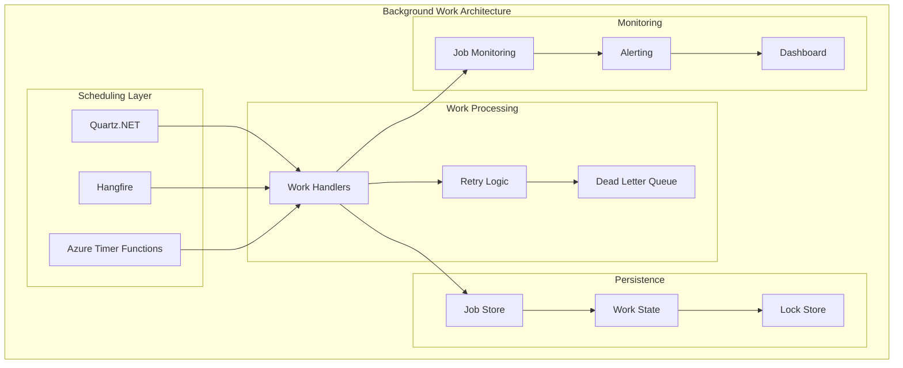

# L0 Background Work Pattern

> Reliable background processing foundation for schedulers, timers, durable tasks, and compensation workflows.

## Context
Services need to perform work outside of request-response cycles: scheduled tasks, periodic cleanup, retry logic, and long-running processes. This pattern provides consistent approaches for background work execution, error handling, and ensuring work completion even in failure scenarios.

## Problem & Forces
- **Reliability**: Background work must complete even if the service restarts
- **Scalability**: Work should distribute across multiple instances without conflicts
- **Observability**: Need visibility into background work status and failures
- **Resource Management**: Background work shouldn't impact foreground request processing
- **Error Handling**: Failed work needs retry logic and dead letter processing

### Trade-offs
- Reliability vs Complexity: Durable processing adds infrastructure complexity
- Immediate vs Deferred: Real-time processing vs background queue processing
- Resource Usage vs Throughput: Background workers consume memory and CPU

## Solution Sketch



## Standards/SLOs/Security

### Processing Standards
- **Idempotency**: All background jobs must be idempotent
- **Timeouts**: Maximum 30 minutes per job execution
- **Retries**: Exponential backoff with max 5 attempts
- **Dead Letter**: Failed jobs moved to dead letter queue after max retries
- **Monitoring**: All jobs tracked with start/end timestamps and status

### SLOs
- **Job Completion**: 99.9% of jobs complete within SLA
- **Processing Latency**: Jobs start within 5 seconds of schedule
- **Retry Success**: 95% of failed jobs succeed after retry
- **Dead Letter Processing**: Dead letter jobs reviewed within 24 hours

### Security
- **Job Authorization**: Background jobs run with least privilege
- **Data Encryption**: Job payloads encrypted at rest
- **Audit Logging**: All job executions logged for compliance
- **Resource Limits**: CPU and memory limits enforced per job

## Tech Anchors
- **Hangfire** - Background job processing and dashboard
- **Quartz.NET** - Advanced job scheduling
- **Azure Functions Timer Triggers** - Cloud-native scheduling
- **Azure Service Bus** - Durable message queues
- **Redis/SQL Server** - Job state persistence
- **Polly** - Retry policies and circuit breakers

## Code Starter

### Background Work Configuration
```csharp
// Program.cs - Background work setup
public class Program
{
    public static void Main(string[] args)
    {
        var builder = WebApplication.CreateBuilder(args);
        
        // Configure background work
        builder.Services.AddBackgroundWork(builder.Configuration);
        
        var app = builder.Build();
        
        // Configure background work pipeline
        app.UseBackgroundWork();
        
        app.Run();
    }
}
```

### Background Work Extensions
```csharp
public static class BackgroundWorkExtensions
{
    public static IServiceCollection AddBackgroundWork(
        this IServiceCollection services,
        IConfiguration configuration)
    {
        // Hangfire for background processing
        services.AddHangfire(config =>
        {
            config.UseSqlServerStorage(configuration.GetConnectionString("Hangfire"))
                  .UseSerializerSettings(new JsonSerializerSettings
                  {
                      TypeNameHandling = TypeNameHandling.Objects
                  });
        });
        
        services.AddHangfireServer(options =>
        {
            options.WorkerCount = Environment.ProcessorCount * 2;
            options.ServerTimeout = TimeSpan.FromMinutes(30);
            options.HeartbeatInterval = TimeSpan.FromSeconds(30);
        });
        
        // Quartz.NET for complex scheduling
        services.AddQuartz(q =>
        {
            q.UseMicrosoftDependencyInjection();
            q.UseSimpleTypeLoader();
            q.UseInMemoryStore();
            q.UseDefaultThreadPool(tp =>
            {
                tp.MaxConcurrency = 10;
            });
        });
        
        services.AddQuartzHostedService(q => q.WaitForJobsToComplete = true);
        
        // Background work services
        services.AddSingleton<IBackgroundJobManager, BackgroundJobManager>();
        services.AddSingleton<IScheduledJobManager, ScheduledJobManager>();
        services.AddScoped<IWorkProcessor, WorkProcessor>();
        
        // Job handlers
        services.AddScoped<BeneficiaryCleanupJob>();
        services.AddScoped<DataExportJob>();
        services.AddScoped<NotificationJob>();
        
        // Retry policies
        services.AddSingleton<IRetryPolicyProvider, RetryPolicyProvider>();
        
        return services;
    }
    
    public static IApplicationBuilder UseBackgroundWork(this IApplicationBuilder app)
    {
        // Hangfire dashboard (only in development)
        var env = app.ApplicationServices.GetRequiredService<IWebHostEnvironment>();
        if (env.IsDevelopment())
        {
            app.UseHangfireDashboard("/hangfire", new DashboardOptions
            {
                Authorization = new[] { new LocalhostAuthorizationFilter() }
            });
        }
        
        return app;
    }
}
```

### Background Job Manager
```csharp
public interface IBackgroundJobManager
{
    string EnqueueJob<T>(Expression<Func<T, Task>> methodCall, TimeSpan? delay = null);
    string ScheduleRecurringJob<T>(string jobId, Expression<Func<T, Task>> methodCall, string cronExpression);
    bool DeleteJob(string jobId);
    JobStatusDto GetJobStatus(string jobId);
}

public class BackgroundJobManager : IBackgroundJobManager
{
    private readonly IBackgroundJobClient _jobClient;
    private readonly IRecurringJobManager _recurringJobManager;
    private readonly ILogger<BackgroundJobManager> _logger;

    public BackgroundJobManager(
        IBackgroundJobClient jobClient,
        IRecurringJobManager recurringJobManager,
        ILogger<BackgroundJobManager> logger)
    {
        _jobClient = jobClient;
        _recurringJobManager = recurringJobManager;
        _logger = logger;
    }

    public string EnqueueJob<T>(Expression<Func<T, Task>> methodCall, TimeSpan? delay = null)
    {
        var jobId = delay.HasValue
            ? _jobClient.Schedule(methodCall, delay.Value)
            : _jobClient.Enqueue(methodCall);
        
        _logger.LogInformation("Enqueued background job {JobId} for {JobType}", 
            jobId, typeof(T).Name);
        
        return jobId;
    }

    public string ScheduleRecurringJob<T>(string jobId, Expression<Func<T, Task>> methodCall, string cronExpression)
    {
        _recurringJobManager.AddOrUpdate(jobId, methodCall, cronExpression, TimeZoneInfo.Utc);
        
        _logger.LogInformation("Scheduled recurring job {JobId} for {JobType} with cron {CronExpression}", 
            jobId, typeof(T).Name, cronExpression);
        
        return jobId;
    }

    public bool DeleteJob(string jobId)
    {
        var result = _jobClient.Delete(jobId);
        
        if (result)
        {
            _logger.LogInformation("Deleted background job {JobId}", jobId);
        }
        
        return result;
    }

    public JobStatusDto GetJobStatus(string jobId)
    {
        var monitoringApi = JobStorage.Current.GetMonitoringApi();
        var jobDetails = monitoringApi.JobDetails(jobId);
        
        if (jobDetails == null)
        {
            return new JobStatusDto { JobId = jobId, Status = "NotFound" };
        }

        return new JobStatusDto
        {
            JobId = jobId,
            Status = jobDetails.History.LastOrDefault()?.StateName ?? "Unknown",
            CreatedAt = jobDetails.CreatedAt,
            StartedAt = jobDetails.History.FirstOrDefault(h => h.StateName == "Processing")?.CreatedAt,
            CompletedAt = jobDetails.History.FirstOrDefault(h => h.StateName == "Succeeded")?.CreatedAt,
            FailureReason = jobDetails.History.FirstOrDefault(h => h.StateName == "Failed")?.Reason
        };
    }
}

public record JobStatusDto
{
    public string JobId { get; init; } = string.Empty;
    public string Status { get; init; } = string.Empty;
    public DateTime? CreatedAt { get; init; }
    public DateTime? StartedAt { get; init; }
    public DateTime? CompletedAt { get; init; }
    public string? FailureReason { get; init; }
}
```

### Work Processor with Retry Logic
```csharp
public interface IWorkProcessor
{
    Task<WorkResult> ProcessAsync<T>(T workItem, CancellationToken cancellationToken = default) where T : class;
    Task<WorkResult> ProcessWithRetryAsync<T>(T workItem, int maxRetries = 3, CancellationToken cancellationToken = default) where T : class;
}

public class WorkProcessor : IWorkProcessor
{
    private readonly IServiceProvider _serviceProvider;
    private readonly IRetryPolicyProvider _retryPolicyProvider;
    private readonly ILogger<WorkProcessor> _logger;

    public WorkProcessor(
        IServiceProvider serviceProvider,
        IRetryPolicyProvider retryPolicyProvider,
        ILogger<WorkProcessor> logger)
    {
        _serviceProvider = serviceProvider;
        _retryPolicyProvider = retryPolicyProvider;
        _logger = logger;
    }

    public async Task<WorkResult> ProcessAsync<T>(T workItem, CancellationToken cancellationToken = default) where T : class
    {
        using var scope = _serviceProvider.CreateScope();
        var startTime = DateTime.UtcNow;
        
        try
        {
            var handler = scope.ServiceProvider.GetRequiredService<IWorkHandler<T>>();
            
            _logger.LogInformation("Starting work processing for {WorkType}", typeof(T).Name);
            
            await handler.HandleAsync(workItem, cancellationToken);
            
            var duration = DateTime.UtcNow - startTime;
            _logger.LogInformation("Completed work processing for {WorkType} in {Duration}ms", 
                typeof(T).Name, duration.TotalMilliseconds);
            
            return WorkResult.Success(duration);
        }
        catch (Exception ex)
        {
            var duration = DateTime.UtcNow - startTime;
            _logger.LogError(ex, "Failed work processing for {WorkType} after {Duration}ms", 
                typeof(T).Name, duration.TotalMilliseconds);
            
            return WorkResult.Failure(ex, duration);
        }
    }

    public async Task<WorkResult> ProcessWithRetryAsync<T>(T workItem, int maxRetries = 3, CancellationToken cancellationToken = default) where T : class
    {
        var retryPolicy = _retryPolicyProvider.GetRetryPolicy<T>();
        
        return await retryPolicy.ExecuteAsync(async () =>
        {
            var result = await ProcessAsync(workItem, cancellationToken);
            
            if (!result.IsSuccess)
            {
                throw result.Exception ?? new InvalidOperationException("Work processing failed");
            }
            
            return result;
        });
    }
}

public record WorkResult
{
    public bool IsSuccess { get; init; }
    public Exception? Exception { get; init; }
    public TimeSpan Duration { get; init; }
    public string? ErrorMessage { get; init; }

    public static WorkResult Success(TimeSpan duration) => new()
    {
        IsSuccess = true,
        Duration = duration
    };

    public static WorkResult Failure(Exception exception, TimeSpan duration) => new()
    {
        IsSuccess = false,
        Exception = exception,
        Duration = duration,
        ErrorMessage = exception.Message
    };
}
```

### Job Handlers
```csharp
public interface IWorkHandler<T> where T : class
{
    Task HandleAsync(T workItem, CancellationToken cancellationToken = default);
}

// Beneficiary cleanup job
public class BeneficiaryCleanupJob : IWorkHandler<BeneficiaryCleanupWorkItem>
{
    private readonly IBeneficiaryRepository _repository;
    private readonly ILogger<BeneficiaryCleanupJob> _logger;

    public BeneficiaryCleanupJob(IBeneficiaryRepository repository, ILogger<BeneficiaryCleanupJob> logger)
    {
        _repository = repository;
        _logger = logger;
    }

    public async Task HandleAsync(BeneficiaryCleanupWorkItem workItem, CancellationToken cancellationToken = default)
    {
        _logger.LogInformation("Starting beneficiary cleanup for records older than {CutoffDate}", workItem.CutoffDate);

        var deletedCount = await _repository.DeleteInactiveBeneficiariesAsync(workItem.CutoffDate, cancellationToken);
        
        _logger.LogInformation("Beneficiary cleanup completed. Deleted {DeletedCount} inactive records", deletedCount);
    }
}

public record BeneficiaryCleanupWorkItem
{
    public DateTime CutoffDate { get; init; }
    public bool DryRun { get; init; } = false;
}

// Data export job
public class DataExportJob : IWorkHandler<DataExportWorkItem>
{
    private readonly IDataExportService _exportService;
    private readonly ILogger<DataExportJob> _logger;

    public async Task HandleAsync(DataExportWorkItem workItem, CancellationToken cancellationToken = default)
    {
        _logger.LogInformation("Starting data export for {ExportType}", workItem.ExportType);

        var exportResult = await _exportService.ExportDataAsync(workItem, cancellationToken);
        
        _logger.LogInformation("Data export completed. File: {FileName}, Records: {RecordCount}", 
            exportResult.FileName, exportResult.RecordCount);
    }
}

public record DataExportWorkItem
{
    public string ExportType { get; init; } = string.Empty;
    public DateTime StartDate { get; init; }
    public DateTime EndDate { get; init; }
    public string OutputFormat { get; init; } = "CSV";
    public string RequestedBy { get; init; } = string.Empty;
}
```

### Retry Policy Provider
```csharp
public interface IRetryPolicyProvider
{
    IAsyncPolicy<WorkResult> GetRetryPolicy<T>() where T : class;
    IAsyncPolicy GetRetryPolicy(string policyName);
}

public class RetryPolicyProvider : IRetryPolicyProvider
{
    private readonly ILogger<RetryPolicyProvider> _logger;

    public RetryPolicyProvider(ILogger<RetryPolicyProvider> logger)
    {
        _logger = logger;
    }

    public IAsyncPolicy<WorkResult> GetRetryPolicy<T>() where T : class
    {
        return Policy
            .Handle<Exception>(ex => !(ex is ArgumentException)) // Don't retry argument exceptions
            .WaitAndRetryAsync(
                retryCount: 3,
                sleepDurationProvider: retryAttempt => TimeSpan.FromSeconds(Math.Pow(2, retryAttempt)), // Exponential backoff
                onRetry: (outcome, timespan, retryCount, context) =>
                {
                    _logger.LogWarning("Retry {RetryCount} for {WorkType} in {Delay}ms due to: {Exception}", 
                        retryCount, typeof(T).Name, timespan.TotalMilliseconds, outcome.Exception?.Message);
                });
    }

    public IAsyncPolicy GetRetryPolicy(string policyName)
    {
        return policyName switch
        {
            "database" => Policy
                .Handle<SqlException>()
                .WaitAndRetryAsync(3, retryAttempt => TimeSpan.FromSeconds(Math.Pow(2, retryAttempt))),
            
            "http" => Policy
                .Handle<HttpRequestException>()
                .WaitAndRetryAsync(5, retryAttempt => TimeSpan.FromSeconds(Math.Pow(2, retryAttempt))),
            
            _ => Policy.NoOpAsync()
        };
    }
}
```

### Scheduled Job Manager
```csharp
public interface IScheduledJobManager
{
    Task ScheduleJobAsync<T>(string jobKey, string cronExpression, T jobData = default) where T : class, IJob;
    Task UnscheduleJobAsync(string jobKey);
    Task<bool> IsJobScheduledAsync(string jobKey);
}

public class ScheduledJobManager : IScheduledJobManager
{
    private readonly ISchedulerFactory _schedulerFactory;
    private readonly ILogger<ScheduledJobManager> _logger;

    public ScheduledJobManager(ISchedulerFactory schedulerFactory, ILogger<ScheduledJobManager> logger)
    {
        _schedulerFactory = schedulerFactory;
        _logger = logger;
    }

    public async Task ScheduleJobAsync<T>(string jobKey, string cronExpression, T jobData = default) where T : class, IJob
    {
        var scheduler = await _schedulerFactory.GetScheduler();
        
        var job = JobBuilder.Create<T>()
            .WithIdentity(jobKey)
            .Build();

        var trigger = TriggerBuilder.Create()
            .WithIdentity($"{jobKey}-trigger")
            .WithCronSchedule(cronExpression)
            .Build();

        await scheduler.ScheduleJob(job, trigger);
        
        _logger.LogInformation("Scheduled job {JobKey} with cron expression {CronExpression}", jobKey, cronExpression);
    }

    public async Task UnscheduleJobAsync(string jobKey)
    {
        var scheduler = await _schedulerFactory.GetScheduler();
        var triggerKey = new TriggerKey($"{jobKey}-trigger");
        
        var result = await scheduler.UnscheduleJob(triggerKey);
        
        if (result)
        {
            _logger.LogInformation("Unscheduled job {JobKey}", jobKey);
        }
    }

    public async Task<bool> IsJobScheduledAsync(string jobKey)
    {
        var scheduler = await _schedulerFactory.GetScheduler();
        var jobKey = new JobKey(jobKey);
        
        return await scheduler.CheckExists(jobKey);
    }
}
```

### Background Job Controller
```csharp
[ApiController]
[Route("api/[controller]")]
public class BackgroundJobsController : ControllerBase
{
    private readonly IBackgroundJobManager _jobManager;
    private readonly IScheduledJobManager _scheduledJobManager;

    public BackgroundJobsController(IBackgroundJobManager jobManager, IScheduledJobManager scheduledJobManager)
    {
        _jobManager = jobManager;
        _scheduledJobManager = scheduledJobManager;
    }

    [HttpPost("cleanup/beneficiaries")]
    public IActionResult StartBeneficiaryCleanup([FromBody] BeneficiaryCleanupRequest request)
    {
        var workItem = new BeneficiaryCleanupWorkItem
        {
            CutoffDate = request.CutoffDate,
            DryRun = request.DryRun
        };

        var jobId = _jobManager.EnqueueJob<BeneficiaryCleanupJob>(job => job.HandleAsync(workItem, CancellationToken.None));
        
        return Accepted(new { JobId = jobId });
    }

    [HttpPost("export/data")]
    public IActionResult StartDataExport([FromBody] DataExportRequest request)
    {
        var workItem = new DataExportWorkItem
        {
            ExportType = request.ExportType,
            StartDate = request.StartDate,
            EndDate = request.EndDate,
            OutputFormat = request.OutputFormat,
            RequestedBy = User.Identity?.Name ?? "Anonymous"
        };

        var jobId = _jobManager.EnqueueJob<DataExportJob>(job => job.HandleAsync(workItem, CancellationToken.None));
        
        return Accepted(new { JobId = jobId });
    }

    [HttpGet("status/{jobId}")]
    public IActionResult GetJobStatus(string jobId)
    {
        var status = _jobManager.GetJobStatus(jobId);
        return Ok(status);
    }

    [HttpDelete("{jobId}")]
    public IActionResult CancelJob(string jobId)
    {
        var result = _jobManager.DeleteJob(jobId);
        return result ? Ok() : NotFound();
    }
}

public record BeneficiaryCleanupRequest
{
    public DateTime CutoffDate { get; init; }
    public bool DryRun { get; init; } = true;
}

public record DataExportRequest
{
    public string ExportType { get; init; } = string.Empty;
    public DateTime StartDate { get; init; }
    public DateTime EndDate { get; init; }
    public string OutputFormat { get; init; } = "CSV";
}
```

## Tests

### Background Job Tests
```csharp
[TestClass]
public class BackgroundJobManagerTests
{
    private Mock<IBackgroundJobClient> _mockJobClient;
    private Mock<IRecurringJobManager> _mockRecurringJobManager;
    private BackgroundJobManager _jobManager;

    [TestInitialize]
    public void Setup()
    {
        _mockJobClient = new Mock<IBackgroundJobClient>();
        _mockRecurringJobManager = new Mock<IRecurringJobManager>();
        var logger = Mock.Of<ILogger<BackgroundJobManager>>();
        
        _jobManager = new BackgroundJobManager(_mockJobClient.Object, _mockRecurringJobManager.Object, logger);
    }

    [TestMethod]
    public void EnqueueJob_ReturnsJobId()
    {
        // Arrange
        var expectedJobId = "job-123";
        _mockJobClient.Setup(x => x.Enqueue(It.IsAny<Expression<Func<BeneficiaryCleanupJob, Task>>>()))
                     .Returns(expectedJobId);

        // Act
        var jobId = _jobManager.EnqueueJob<BeneficiaryCleanupJob>(job => job.HandleAsync(new BeneficiaryCleanupWorkItem(), CancellationToken.None));

        // Assert
        Assert.AreEqual(expectedJobId, jobId);
    }

    [TestMethod]
    public void ScheduleRecurringJob_CallsRecurringJobManager()
    {
        // Arrange
        var jobId = "recurring-cleanup";
        var cronExpression = "0 2 * * *"; // Daily at 2 AM

        // Act
        _jobManager.ScheduleRecurringJob<BeneficiaryCleanupJob>(jobId, 
            job => job.HandleAsync(new BeneficiaryCleanupWorkItem(), CancellationToken.None), 
            cronExpression);

        // Assert
        _mockRecurringJobManager.Verify(x => x.AddOrUpdate(
            jobId, 
            It.IsAny<Expression<Func<BeneficiaryCleanupJob, Task>>>(), 
            cronExpression, 
            TimeZoneInfo.Utc), Times.Once);
    }
}
```

### Work Processor Tests
```csharp
[TestClass]
public class WorkProcessorTests
{
    [TestMethod]
    public async Task ProcessAsync_ReturnsSuccess_WhenHandlerSucceeds()
    {
        // Arrange
        var services = new ServiceCollection();
        var mockHandler = new Mock<IWorkHandler<BeneficiaryCleanupWorkItem>>();
        services.AddScoped(_ => mockHandler.Object);
        
        var serviceProvider = services.BuildServiceProvider();
        var retryPolicyProvider = Mock.Of<IRetryPolicyProvider>();
        var logger = Mock.Of<ILogger<WorkProcessor>>();
        
        var processor = new WorkProcessor(serviceProvider, retryPolicyProvider, logger);
        var workItem = new BeneficiaryCleanupWorkItem();

        // Act
        var result = await processor.ProcessAsync(workItem);

        // Assert
        Assert.IsTrue(result.IsSuccess);
        mockHandler.Verify(x => x.HandleAsync(workItem, It.IsAny<CancellationToken>()), Times.Once);
    }
}
```

### Integration Tests
```csharp
[TestClass]
public class BackgroundWorkIntegrationTests
{
    [TestMethod]
    public async Task BeneficiaryCleanupJob_ProcessesWorkItem_Successfully()
    {
        // Arrange
        var factory = new WebApplicationFactory<Program>();
        var client = factory.CreateClient();

        var request = new BeneficiaryCleanupRequest
        {
            CutoffDate = DateTime.UtcNow.AddMonths(-6),
            DryRun = true
        };

        // Act
        var response = await client.PostAsJsonAsync("/api/backgroundjobs/cleanup/beneficiaries", request);

        // Assert
        Assert.AreEqual(HttpStatusCode.Accepted, response.StatusCode);
        
        var content = await response.Content.ReadAsStringAsync();
        Assert.IsTrue(content.Contains("JobId"));
    }
}
```

## Pitfalls & Anti-Patterns

### ❌ Anti-Patterns
- **Non-Idempotent Jobs**: Jobs that fail when run multiple times
- **Long-Running Jobs**: Jobs that run for hours without checkpoints
- **Shared State**: Background jobs modifying shared state without coordination
- **Resource Leaks**: Not properly disposing resources in background workers

### 🚨 Common Pitfalls
- **No Dead Letter Queue**: Failed jobs disappear without investigation
- **Missing Monitoring**: No visibility into job execution and failures
- **Inadequate Retries**: Not handling transient failures properly
- **Memory Leaks**: Background workers accumulating memory over time

### 🔧 Solutions
- Implement idempotent job handlers with correlation IDs
- Use checkpointing for long-running jobs
- Implement proper resource disposal and monitoring
- Configure dead letter queues and alerting for failed jobs
- Regular health checks and memory monitoring

## References
- [Hangfire Documentation](https://docs.hangfire.io/)
- [Quartz.NET Guide](https://www.quartz-scheduler.net/)
- [Azure Functions Timer Triggers](https://docs.microsoft.com/en-us/azure/azure-functions/functions-bindings-timer)
- [Background Service in .NET](https://docs.microsoft.com/en-us/dotnet/core/extensions/workers)
- Template: `templates/background-work/`
- Example: `/samples/background-work/`