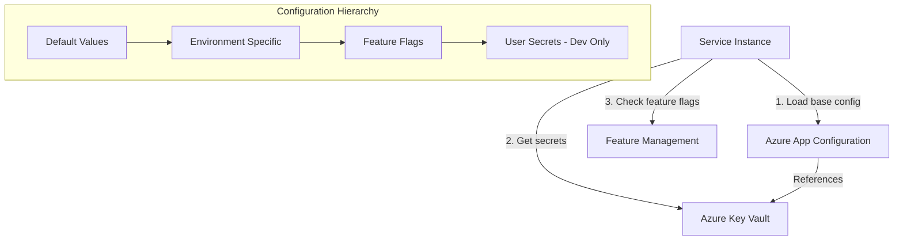

# L0 Configuration & Feature Flags Pattern

> Hierarchical configuration management with feature flags for safe rollouts and runtime behavior control.

## Context
Services need configuration that can be updated without deployment, support for different environments, and the ability to safely roll out features to subsets of users. Configuration should be hierarchical, secure, and observable.

## Problem & Forces
- **Security**: Sensitive config (connection strings, keys) must be secure
- **Environment Parity**: Same code should work across Dev/Test/Prod with different config
- **Safe Rollouts**: New features need gradual rollout with rollback capability
- **Runtime Changes**: Configuration updates without service restart
- **Auditability**: Changes to configuration should be tracked

### Trade-offs
- Complexity vs Flexibility: More configuration options increase complexity
- Performance vs Freshness: Caching config vs real-time updates
- Security vs Convenience: Secure storage vs easy access

## Solution Sketch



## Standards/SLOs/Security
- **Hierarchy**: Default → Environment → Feature Flags → User Secrets (dev only)
- **Secrets**: All sensitive data in Key Vault with Managed Identity access
- **Refresh**: Configuration refresh ≤ 30 seconds for non-secrets
- **Feature Flags**: Support percentage rollout, user targeting, and kill switches
- **Audit**: All configuration changes logged with timestamps and user context
- **Performance**: Config loading < 500ms, cached for runtime efficiency

## Tech Anchors
- **Azure App Configuration** for application settings and feature flags
- **Azure Key Vault** for secrets and certificates
- **Microsoft.Extensions.Configuration** for .NET configuration system
- **Microsoft.FeatureManagement** for feature flags
- **Managed Identity** for secure access to configuration services

## Code Starter

### Program.cs Configuration
```csharp
using Microsoft.Extensions.Configuration.AzureAppConfiguration;
using Microsoft.FeatureManagement;
using Azure.Identity;

var builder = WebApplication.CreateBuilder(args);

// Configure Azure App Configuration
builder.Configuration.AddAzureAppConfiguration(options =>
{
    var connectionString = builder.Configuration.GetConnectionString("AppConfig");
    
    options.Connect(connectionString)
           .ConfigureRefresh(refresh =>
           {
               // Refresh configuration every 30 seconds
               refresh.Register("Settings:Sentinel", refreshAll: true)
                      .SetCacheExpiration(TimeSpan.FromSeconds(30));
           })
           .ConfigureKeyVault(kv =>
           {
               // Use Managed Identity for Key Vault access
               kv.SetCredential(new DefaultAzureCredential());
           })
           .UseFeatureFlags(featureFlags =>
           {
               // Configure feature flags with refresh
               featureFlags.CacheExpirationInterval = TimeSpan.FromSeconds(30);
           });
});

// Add feature management
builder.Services.AddFeatureManagement();

// Add configuration refresh service
builder.Services.AddAzureAppConfiguration();

// Register configuration sections
builder.Services.Configure<DatabaseSettings>(
    builder.Configuration.GetSection("Database"));
builder.Services.Configure<IntegrationSettings>(
    builder.Configuration.GetSection("Integration"));

var app = builder.Build();

// Use Azure App Configuration middleware for refresh
app.UseAzureAppConfiguration();

app.Run();
```

### Configuration Models
```csharp
public class DatabaseSettings
{
    public string ConnectionString { get; set; } = string.Empty;
    public int CommandTimeout { get; set; } = 30;
    public int MaxRetries { get; set; } = 3;
    public bool EnableSensitiveDataLogging { get; set; } = false;
}

public class IntegrationSettings
{
    public string ServiceBusConnectionString { get; set; } = string.Empty;
    public string CosmosDbConnectionString { get; set; } = string.Empty;
    public TimeSpan DefaultTimeout { get; set; } = TimeSpan.FromSeconds(30);
    public Dictionary<string, string> EndpointUrls { get; set; } = new();
}

public class FeatureFlags
{
    public const string NewBeneficiaryWorkflow = "NewBeneficiaryWorkflow";
    public const string EnhancedLogging = "EnhancedLogging";
    public const string ExperimentalSearch = "ExperimentalSearch";
}
```

### Using Configuration in Services
```csharp
[ApiController]
[Route("api/[controller]")]
public class BeneficiaryController : ControllerBase
{
    private readonly IOptionsSnapshot<DatabaseSettings> _dbSettings;
    private readonly IFeatureManager _featureManager;
    private readonly ILogger<BeneficiaryController> _logger;

    public BeneficiaryController(
        IOptionsSnapshot<DatabaseSettings> dbSettings,
        IFeatureManager featureManager,
        ILogger<BeneficiaryController> logger)
    {
        _dbSettings = dbSettings;
        _featureManager = featureManager;
        _logger = logger;
    }

    [HttpPost]
    public async Task<IActionResult> CreateBeneficiary([FromBody] CreateBeneficiaryRequest request)
    {
        // Check feature flag
        if (await _featureManager.IsEnabledAsync(FeatureFlags.NewBeneficiaryWorkflow))
        {
            _logger.LogInformation("Using new beneficiary workflow");
            return await ProcessWithNewWorkflow(request);
        }

        _logger.LogInformation("Using legacy beneficiary workflow");
        return await ProcessWithLegacyWorkflow(request);
    }

    [HttpGet]
    public async Task<IActionResult> SearchBeneficiaries([FromQuery] string query)
    {
        if (await _featureManager.IsEnabledAsync(FeatureFlags.ExperimentalSearch))
        {
            return await ExperimentalSearch(query);
        }

        return await StandardSearch(query);
    }

    private async Task<IActionResult> ProcessWithNewWorkflow(CreateBeneficiaryRequest request)
    {
        // Enhanced logging if enabled
        if (await _featureManager.IsEnabledAsync(FeatureFlags.EnhancedLogging))
        {
            _logger.LogInformation("Processing beneficiary with correlation {CorrelationId}", 
                HttpContext.TraceIdentifier);
        }

        // Use current database settings
        var timeout = _dbSettings.Value.CommandTimeout;
        
        // Implementation using new workflow
        return Ok(new { Message = "Created with new workflow", Timeout = timeout });
    }

    private Task<IActionResult> ProcessWithLegacyWorkflow(CreateBeneficiaryRequest request)
    {
        // Legacy implementation
        return Task.FromResult<IActionResult>(Ok(new { Message = "Created with legacy workflow" }));
    }

    private Task<IActionResult> ExperimentalSearch(string query)
    {
        // Experimental search implementation
        return Task.FromResult<IActionResult>(Ok(new { Results = new[] { "Experimental result" } }));
    }

    private Task<IActionResult> StandardSearch(string query)
    {
        // Standard search implementation
        return Task.FromResult<IActionResult>(Ok(new { Results = new[] { "Standard result" } }));
    }
}
```

### Configuration Files

#### appsettings.json
```json
{
  "ConnectionStrings": {
    "AppConfig": "{app-config-connection-string}"
  },
  "Database": {
    "CommandTimeout": 30,
    "MaxRetries": 3,
    "EnableSensitiveDataLogging": false
  },
  "Integration": {
    "DefaultTimeout": "00:00:30",
    "EndpointUrls": {
      "BeneficiaryService": "https://beneficiary-service.azurewebsites.net",
      "MedicalService": "https://medical-service.azurewebsites.net"
    }
  },
  "Logging": {
    "LogLevel": {
      "Default": "Information",
      "Microsoft.AspNetCore": "Warning"
    }
  }
}
```

#### appsettings.Development.json
```json
{
  "Database": {
    "EnableSensitiveDataLogging": true
  },
  "Integration": {
    "EndpointUrls": {
      "BeneficiaryService": "https://localhost:7075",
      "MedicalService": "https://localhost:7076"
    }
  },
  "Logging": {
    "LogLevel": {
      "Default": "Debug"
    }
  }
}
```

## Tests

### Configuration Tests
```csharp
[TestClass]
public class ConfigurationTests
{
    [TestMethod]
    public void DatabaseSettings_LoadsCorrectly()
    {
        // Arrange
        var configuration = new ConfigurationBuilder()
            .AddJsonFile("appsettings.json")
            .Build();

        // Act
        var settings = configuration.GetSection("Database").Get<DatabaseSettings>();

        // Assert
        Assert.IsNotNull(settings);
        Assert.AreEqual(30, settings.CommandTimeout);
        Assert.AreEqual(3, settings.MaxRetries);
    }

    [TestMethod]
    public void IntegrationSettings_LoadsEndpoints()
    {
        // Arrange
        var configuration = new ConfigurationBuilder()
            .AddJsonFile("appsettings.json")
            .Build();

        // Act
        var settings = configuration.GetSection("Integration").Get<IntegrationSettings>();

        // Assert
        Assert.IsNotNull(settings);
        Assert.IsTrue(settings.EndpointUrls.ContainsKey("BeneficiaryService"));
    }
}
```

### Feature Flag Tests
```csharp
[TestClass]
public class FeatureFlagTests
{
    [TestMethod]
    public async Task CreateBeneficiary_WithNewWorkflowEnabled_UsesNewWorkflow()
    {
        // Arrange
        var mockFeatureManager = new Mock<IFeatureManager>();
        mockFeatureManager.Setup(fm => fm.IsEnabledAsync(FeatureFlags.NewBeneficiaryWorkflow))
                         .ReturnsAsync(true);

        var controller = new BeneficiaryController(
            Mock.Of<IOptionsSnapshot<DatabaseSettings>>(),
            mockFeatureManager.Object,
            Mock.Of<ILogger<BeneficiaryController>>());

        // Act
        var result = await controller.CreateBeneficiary(new CreateBeneficiaryRequest());

        // Assert
        var okResult = result as OkObjectResult;
        Assert.IsNotNull(okResult);
        var response = okResult.Value as dynamic;
        Assert.IsTrue(response.Message.ToString().Contains("new workflow"));
    }
}
```

## Pitfalls & Anti-Patterns

### ❌ Anti-Patterns
- **Hardcoded Values**: Never embed configuration values directly in code
- **Secrets in Config Files**: Don't put connection strings or keys in appsettings.json
- **No Environment Separation**: Using same config values across all environments
- **No Feature Flag Strategy**: Rolling out features to 100% of users immediately

### 🚨 Common Pitfalls
- **Configuration Drift**: Different environments having inconsistent configuration
- **No Refresh Strategy**: Services requiring restart for configuration changes
- **Missing Fallbacks**: No default values when external configuration is unavailable
- **Feature Flag Debt**: Leaving old feature flags in code permanently

### 🔧 Solutions
- Use Azure App Configuration with Key Vault references for secrets
- Implement configuration refresh with appropriate caching strategies
- Always provide sensible default values in code
- Regular feature flag cleanup and technical debt management

## References
- [Azure App Configuration Documentation](https://docs.microsoft.com/en-us/azure/azure-app-configuration/)
- [Feature Management in .NET](https://docs.microsoft.com/en-us/azure/azure-app-configuration/use-feature-flags-dotnet-core)
- [Configuration in ASP.NET Core](https://docs.microsoft.com/en-us/aspnet/core/fundamentals/configuration/)
- Template: `templates/api-service-with-config/`
- Example: `/samples/config-flags/`