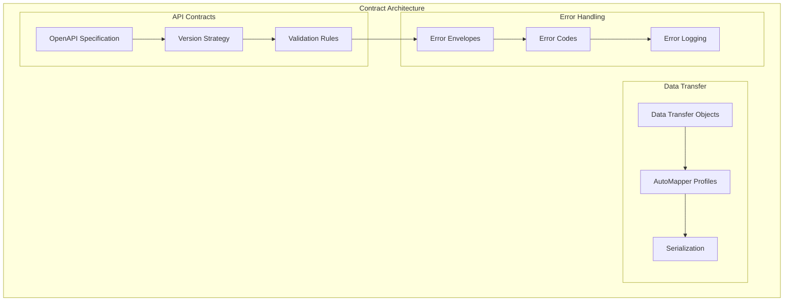

# L0 Contracts Pattern

> API versioning, schema validation, DTO mapping, and error envelopes for consistent service interfaces.

## Context
Services need well-defined contracts for external communication including API versioning strategies, consistent request/response formats, validation rules, and standardized error handling. This pattern ensures backward compatibility and clear service boundaries.

## Problem & Forces
- **API Evolution**: Supporting multiple API versions without breaking clients
- **Data Validation**: Consistent validation across all endpoints
- **Error Consistency**: Standardized error responses and error codes
- **Documentation**: Auto-generated, up-to-date API documentation
- **Contract Testing**: Ensuring contract compliance between services

### Trade-offs
- Flexibility vs Stability: Easy changes vs backward compatibility
- Validation Overhead vs Data Quality: Performance vs comprehensive validation
- Contract Coupling vs Service Autonomy: Shared contracts vs independent evolution

## Solution Sketch

## Tech Anchors
- **OpenAPI/Swagger** - API specification and documentation
- **FluentValidation** - Validation framework
- **AutoMapper** - Object-to-object mapping
- **ASP.NET Core ModelState** - Built-in validation

## Key Components
- **API Versioning**: URL-based and header-based versioning strategies
- **Request/Response DTOs**: Strongly-typed data contracts
- **Validation Pipeline**: Comprehensive input validation
- **Error Response Format**: Consistent error structure across services

*[Full implementation details coming soon]*

## References
- [OpenAPI Specification](https://spec.openapis.org/oas/v3.0.3)
- [API Versioning Best Practices](https://docs.microsoft.com/en-us/azure/architecture/best-practices/api-design)
- Template: `templates/contracts/`