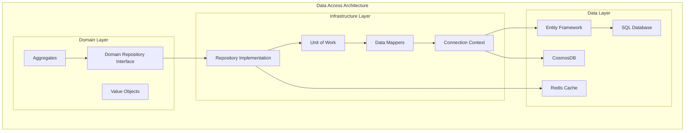

# L0 Data Access Pattern

> Consistent data access foundation with Repository/UoW, aggregate mappers, connection management, and optimistic concurrency.

## Context
Services need reliable, consistent data access patterns that handle connection management, transaction boundaries, optimistic concurrency, and aggregate mapping. This pattern provides a standardized approach to data operations that works across different storage technologies while maintaining domain boundaries.

## Problem & Forces
- **Connection Management**: Efficient database connection pooling and lifecycle
- **Transaction Boundaries**: Clear transaction scopes and rollback handling
- **Concurrency Control**: Preventing lost updates in concurrent scenarios
- **Domain Mapping**: Clean separation between domain models and data models
- **Performance**: Efficient queries and minimal database round trips

### Trade-offs
- Abstraction vs Performance: Repository pattern adds abstraction but may hide optimization opportunities
- Generic vs Specific: Generic repositories vs specific query methods
- ORM vs Raw SQL: Development speed vs performance control

## Solution Sketch



## Standards/SLOs/Security

### Data Access Standards
- **Repository Pattern**: All data access through repository interfaces
- **Unit of Work**: Transaction boundaries clearly defined
- **Optimistic Concurrency**: Version fields on all aggregates
- **Connection Pooling**: Minimum 10, maximum 100 connections per service
- **Query Patterns**: No N+1 queries, eager loading for predictable patterns

### SLOs
- **Query Response**: 95% of queries respond within 100ms
- **Connection Utilization**: Maximum 80% of connection pool usage
- **Transaction Duration**: 99% of transactions complete within 5 seconds
- **Cache Hit Rate**: 85% hit rate for read-heavy operations

### Security
- **Least Privilege**: Database users with minimal required permissions
- **Connection Encryption**: All database connections use TLS
- **SQL Injection**: Parameterized queries only, no dynamic SQL
- **Audit Logging**: All data changes logged with user context

## Tech Anchors
- **Entity Framework Core** - Primary ORM for relational data
- **Azure Cosmos DB SDK** - NoSQL document operations
- **Dapper** - Lightweight ORM for performance-critical queries
- **Redis** - Distributed caching layer
- **SQL Server/PostgreSQL** - Relational database systems
- **AutoMapper** - Object-to-object mapping

## Code Starter

### Repository Pattern Implementation
```csharp
// Domain repository interface
public interface IBeneficiaryRepository
{
    Task<Beneficiary?> GetByIdAsync(string id, CancellationToken cancellationToken = default);
    Task<IEnumerable<Beneficiary>> GetByFilterAsync(BeneficiaryFilter filter, CancellationToken cancellationToken = default);
    Task<Beneficiary> CreateAsync(Beneficiary beneficiary, CancellationToken cancellationToken = default);
    Task<Beneficiary> UpdateAsync(Beneficiary beneficiary, CancellationToken cancellationToken = default);
    Task DeleteAsync(string id, CancellationToken cancellationToken = default);
    Task<bool> ExistsAsync(string id, CancellationToken cancellationToken = default);
    Task<PagedResult<Beneficiary>> GetPagedAsync(PagedQuery query, CancellationToken cancellationToken = default);
}

// Base repository interface
public interface IRepository<T, TKey> where T : class, IAggregateRoot<TKey>
{
    Task<T?> GetByIdAsync(TKey id, CancellationToken cancellationToken = default);
    Task<IEnumerable<T>> GetAllAsync(CancellationToken cancellationToken = default);
    Task<T> AddAsync(T entity, CancellationToken cancellationToken = default);
    Task<T> UpdateAsync(T entity, CancellationToken cancellationToken = default);
    Task DeleteAsync(TKey id, CancellationToken cancellationToken = default);
    Task<bool> ExistsAsync(TKey id, CancellationToken cancellationToken = default);
}
```

### Unit of Work Pattern
```csharp
public interface IUnitOfWork : IDisposable
{
    IBeneficiaryRepository Beneficiaries { get; }
    IMedicalRecordRepository MedicalRecords { get; }
    INotificationRepository Notifications { get; }
    
    Task<int> SaveChangesAsync(CancellationToken cancellationToken = default);
    Task BeginTransactionAsync(CancellationToken cancellationToken = default);
    Task CommitTransactionAsync(CancellationToken cancellationToken = default);
    Task RollbackTransactionAsync(CancellationToken cancellationToken = default);
}

public class UnitOfWork : IUnitOfWork
{
    private readonly ApplicationDbContext _context;
    private IDbContextTransaction? _transaction;
    private bool _disposed;

    // Lazy-loaded repositories
    private IBeneficiaryRepository? _beneficiaries;
    private IMedicalRecordRepository? _medicalRecords;
    private INotificationRepository? _notifications;

    public UnitOfWork(ApplicationDbContext context)
    {
        _context = context;
    }

    public IBeneficiaryRepository Beneficiaries =>
        _beneficiaries ??= new BeneficiaryRepository(_context);

    public IMedicalRecordRepository MedicalRecords =>
        _medicalRecords ??= new MedicalRecordRepository(_context);

    public INotificationRepository Notifications =>
        _notifications ??= new NotificationRepository(_context);

    public async Task<int> SaveChangesAsync(CancellationToken cancellationToken = default)
    {
        return await _context.SaveChangesAsync(cancellationToken);
    }

    public async Task BeginTransactionAsync(CancellationToken cancellationToken = default)
    {
        _transaction = await _context.Database.BeginTransactionAsync(cancellationToken);
    }

    public async Task CommitTransactionAsync(CancellationToken cancellationToken = default)
    {
        if (_transaction != null)
        {
            await _transaction.CommitAsync(cancellationToken);
            await _transaction.DisposeAsync();
            _transaction = null;
        }
    }

    public async Task RollbackTransactionAsync(CancellationToken cancellationToken = default)
    {
        if (_transaction != null)
        {
            await _transaction.RollbackAsync(cancellationToken);
            await _transaction.DisposeAsync();
            _transaction = null;
        }
    }

    public void Dispose()
    {
        if (!_disposed)
        {
            _transaction?.Dispose();
            _context.Dispose();
            _disposed = true;
        }
    }
}
```

### Repository Implementation with EF Core
```csharp
public class BeneficiaryRepository : IBeneficiaryRepository
{
    private readonly ApplicationDbContext _context;
    private readonly ILogger<BeneficiaryRepository> _logger;
    private readonly IMapper _mapper;

    public BeneficiaryRepository(
        ApplicationDbContext context,
        ILogger<BeneficiaryRepository> logger,
        IMapper mapper)
    {
        _context = context;
        _logger = logger;
        _mapper = mapper;
    }

    public async Task<Beneficiary?> GetByIdAsync(string id, CancellationToken cancellationToken = default)
    {
        var entity = await _context.Beneficiaries
            .Include(b => b.MedicalRecords)
            .Include(b => b.Documents)
            .FirstOrDefaultAsync(b => b.Id == id, cancellationToken);

        return entity != null ? _mapper.Map<Beneficiary>(entity) : null;
    }

    public async Task<IEnumerable<Beneficiary>> GetByFilterAsync(BeneficiaryFilter filter, CancellationToken cancellationToken = default)
    {
        var query = _context.Beneficiaries.AsQueryable();

        if (!string.IsNullOrEmpty(filter.FirstName))
        {
            query = query.Where(b => b.FirstName.Contains(filter.FirstName));
        }

        if (!string.IsNullOrEmpty(filter.LastName))
        {
            query = query.Where(b => b.LastName.Contains(filter.LastName));
        }

        if (filter.DateOfBirth.HasValue)
        {
            query = query.Where(b => b.DateOfBirth == filter.DateOfBirth.Value);
        }

        if (!string.IsNullOrEmpty(filter.CaseStatus))
        {
            query = query.Where(b => b.CaseStatus == filter.CaseStatus);
        }

        var entities = await query
            .OrderBy(b => b.LastName)
            .ThenBy(b => b.FirstName)
            .ToListAsync(cancellationToken);

        return _mapper.Map<IEnumerable<Beneficiary>>(entities);
    }

    public async Task<Beneficiary> CreateAsync(Beneficiary beneficiary, CancellationToken cancellationToken = default)
    {
        var entity = _mapper.Map<BeneficiaryEntity>(beneficiary);
        entity.Id = Guid.NewGuid().ToString();
        entity.CreatedAt = DateTime.UtcNow;
        entity.Version = 1;

        _context.Beneficiaries.Add(entity);
        await _context.SaveChangesAsync(cancellationToken);

        _logger.LogInformation("Created beneficiary {BeneficiaryId}", entity.Id);

        return _mapper.Map<Beneficiary>(entity);
    }

    public async Task<Beneficiary> UpdateAsync(Beneficiary beneficiary, CancellationToken cancellationToken = default)
    {
        var existingEntity = await _context.Beneficiaries
            .FirstOrDefaultAsync(b => b.Id == beneficiary.Id, cancellationToken);

        if (existingEntity == null)
        {
            throw new EntityNotFoundException($"Beneficiary with ID {beneficiary.Id} not found");
        }

        // Optimistic concurrency check
        if (existingEntity.Version != beneficiary.Version)
        {
            throw new ConcurrencyException($"Beneficiary {beneficiary.Id} has been modified by another user");
        }

        _mapper.Map(beneficiary, existingEntity);
        existingEntity.UpdatedAt = DateTime.UtcNow;
        existingEntity.Version++;

        await _context.SaveChangesAsync(cancellationToken);

        _logger.LogInformation("Updated beneficiary {BeneficiaryId} to version {Version}", 
            existingEntity.Id, existingEntity.Version);

        return _mapper.Map<Beneficiary>(existingEntity);
    }

    public async Task DeleteAsync(string id, CancellationToken cancellationToken = default)
    {
        var entity = await _context.Beneficiaries
            .FirstOrDefaultAsync(b => b.Id == id, cancellationToken);

        if (entity == null)
        {
            throw new EntityNotFoundException($"Beneficiary with ID {id} not found");
        }

        _context.Beneficiaries.Remove(entity);
        await _context.SaveChangesAsync(cancellationToken);

        _logger.LogInformation("Deleted beneficiary {BeneficiaryId}", id);
    }

    public async Task<bool> ExistsAsync(string id, CancellationToken cancellationToken = default)
    {
        return await _context.Beneficiaries
            .AnyAsync(b => b.Id == id, cancellationToken);
    }

    public async Task<PagedResult<Beneficiary>> GetPagedAsync(PagedQuery query, CancellationToken cancellationToken = default)
    {
        var totalCount = await _context.Beneficiaries.CountAsync(cancellationToken);

        var entities = await _context.Beneficiaries
            .OrderBy(b => b.CreatedAt)
            .Skip((query.Page - 1) * query.PageSize)
            .Take(query.PageSize)
            .ToListAsync(cancellationToken);

        var beneficiaries = _mapper.Map<IEnumerable<Beneficiary>>(entities);

        return new PagedResult<Beneficiary>
        {
            Items = beneficiaries,
            TotalCount = totalCount,
            Page = query.Page,
            PageSize = query.PageSize,
            TotalPages = (int)Math.Ceiling((double)totalCount / query.PageSize)
        };
    }
}
```

### Connection Context and DbContext
```csharp
public class ApplicationDbContext : DbContext
{
    public ApplicationDbContext(DbContextOptions<ApplicationDbContext> options) : base(options)
    {
    }

    public DbSet<BeneficiaryEntity> Beneficiaries { get; set; } = null!;
    public DbSet<MedicalRecordEntity> MedicalRecords { get; set; } = null!;
    public DbSet<DocumentEntity> Documents { get; set; } = null!;

    protected override void OnModelCreating(ModelBuilder modelBuilder)
    {
        base.OnModelCreating(modelBuilder);

        // Beneficiary entity configuration
        modelBuilder.Entity<BeneficiaryEntity>(entity =>
        {
            entity.HasKey(e => e.Id);
            entity.Property(e => e.FirstName).HasMaxLength(100).IsRequired();
            entity.Property(e => e.LastName).HasMaxLength(100).IsRequired();
            entity.Property(e => e.Email).HasMaxLength(255);
            entity.Property(e => e.CaseStatus).HasMaxLength(50).IsRequired();
            entity.Property(e => e.Version).IsConcurrencyToken();

            // Indexes
            entity.HasIndex(e => new { e.FirstName, e.LastName });
            entity.HasIndex(e => e.Email).IsUnique();
            entity.HasIndex(e => e.CaseStatus);

            // Relationships
            entity.HasMany(e => e.MedicalRecords)
                  .WithOne(m => m.Beneficiary)
                  .HasForeignKey(m => m.BeneficiaryId)
                  .OnDelete(DeleteBehavior.Cascade);
        });

        // Value object configuration
        modelBuilder.Entity<BeneficiaryEntity>()
            .OwnsOne(b => b.Address, address =>
            {
                address.Property(a => a.Street).HasMaxLength(200);
                address.Property(a => a.City).HasMaxLength(100);
                address.Property(a => a.Country).HasMaxLength(100);
                address.Property(a => a.PostalCode).HasMaxLength(20);
            });
    }

    public override async Task<int> SaveChangesAsync(CancellationToken cancellationToken = default)
    {
        // Automatically set audit fields
        var entries = ChangeTracker.Entries()
            .Where(e => e.Entity is IAuditable && (e.State == EntityState.Added || e.State == EntityState.Modified));

        foreach (var entry in entries)
        {
            var auditable = (IAuditable)entry.Entity;
            
            if (entry.State == EntityState.Added)
            {
                auditable.CreatedAt = DateTime.UtcNow;
            }
            
            auditable.UpdatedAt = DateTime.UtcNow;
        }

        return await base.SaveChangesAsync(cancellationToken);
    }
}
```

### Domain Models and Entities
```csharp
// Domain aggregate root
public class Beneficiary : IAggregateRoot<string>
{
    public string Id { get; set; } = string.Empty;
    public string FirstName { get; set; } = string.Empty;
    public string LastName { get; set; } = string.Empty;
    public DateTime DateOfBirth { get; set; }
    public string Email { get; set; } = string.Empty;
    public string CaseStatus { get; set; } = string.Empty;
    public Address Address { get; set; } = new();
    public int Version { get; set; }
    public DateTime CreatedAt { get; set; }
    public DateTime? UpdatedAt { get; set; }

    public ICollection<MedicalRecord> MedicalRecords { get; set; } = new List<MedicalRecord>();
    public ICollection<Document> Documents { get; set; } = new List<Document>();

    public void UpdateAddress(Address newAddress)
    {
        Address = newAddress;
    }

    public void ChangeStatus(string newStatus)
    {
        if (string.IsNullOrEmpty(newStatus))
            throw new ArgumentException("Status cannot be empty");

        CaseStatus = newStatus;
    }
}

// Value object
public record Address
{
    public string Street { get; init; } = string.Empty;
    public string City { get; init; } = string.Empty;
    public string Country { get; init; } = string.Empty;
    public string PostalCode { get; init; } = string.Empty;
}

// Data entity
public class BeneficiaryEntity : IAuditable
{
    public string Id { get; set; } = string.Empty;
    public string FirstName { get; set; } = string.Empty;
    public string LastName { get; set; } = string.Empty;
    public DateTime DateOfBirth { get; set; }
    public string Email { get; set; } = string.Empty;
    public string CaseStatus { get; set; } = string.Empty;
    public Address Address { get; set; } = new();
    public int Version { get; set; }
    public DateTime CreatedAt { get; set; }
    public DateTime? UpdatedAt { get; set; }

    public ICollection<MedicalRecordEntity> MedicalRecords { get; set; } = new List<MedicalRecordEntity>();
    public ICollection<DocumentEntity> Documents { get; set; } = new List<DocumentEntity>();
}

// Interfaces
public interface IAggregateRoot<TKey>
{
    TKey Id { get; set; }
    int Version { get; set; }
}

public interface IAuditable
{
    DateTime CreatedAt { get; set; }
    DateTime? UpdatedAt { get; set; }
}
```

### CosmosDB Repository Implementation
```csharp
public class CosmosDbBeneficiaryRepository : IBeneficiaryRepository
{
    private readonly Container _container;
    private readonly ILogger<CosmosDbBeneficiaryRepository> _logger;

    public CosmosDbBeneficiaryRepository(CosmosClient cosmosClient, ILogger<CosmosDbBeneficiaryRepository> logger)
    {
        _container = cosmosClient.GetContainer("IOM", "Beneficiaries");
        _logger = logger;
    }

    public async Task<Beneficiary?> GetByIdAsync(string id, CancellationToken cancellationToken = default)
    {
        try
        {
            var response = await _container.ReadItemAsync<BeneficiaryDocument>(id, new PartitionKey(id), cancellationToken: cancellationToken);
            return MapToDomain(response.Resource);
        }
        catch (CosmosException ex) when (ex.StatusCode == HttpStatusCode.NotFound)
        {
            return null;
        }
    }

    public async Task<Beneficiary> CreateAsync(Beneficiary beneficiary, CancellationToken cancellationToken = default)
    {
        var document = MapToDocument(beneficiary);
        document.id = Guid.NewGuid().ToString();
        document.PartitionKey = document.id;
        document._ts = DateTimeOffset.UtcNow.ToUnixTimeSeconds();

        var response = await _container.CreateItemAsync(document, new PartitionKey(document.PartitionKey), cancellationToken: cancellationToken);
        
        _logger.LogInformation("Created beneficiary {BeneficiaryId} in CosmosDB", document.id);
        
        return MapToDomain(response.Resource);
    }

    public async Task<Beneficiary> UpdateAsync(Beneficiary beneficiary, CancellationToken cancellationToken = default)
    {
        var document = MapToDocument(beneficiary);
        
        // Optimistic concurrency using ETag
        var requestOptions = new ItemRequestOptions
        {
            IfMatchEtag = document._etag
        };

        try
        {
            var response = await _container.ReplaceItemAsync(document, document.id, new PartitionKey(document.PartitionKey), requestOptions, cancellationToken);
            
            _logger.LogInformation("Updated beneficiary {BeneficiaryId} in CosmosDB", document.id);
            
            return MapToDomain(response.Resource);
        }
        catch (CosmosException ex) when (ex.StatusCode == HttpStatusCode.PreconditionFailed)
        {
            throw new ConcurrencyException($"Beneficiary {beneficiary.Id} has been modified by another user");
        }
    }

    private static Beneficiary MapToDomain(BeneficiaryDocument document)
    {
        return new Beneficiary
        {
            Id = document.id,
            FirstName = document.FirstName,
            LastName = document.LastName,
            DateOfBirth = document.DateOfBirth,
            Email = document.Email,
            CaseStatus = document.CaseStatus,
            Address = new Address
            {
                Street = document.Address?.Street ?? string.Empty,
                City = document.Address?.City ?? string.Empty,
                Country = document.Address?.Country ?? string.Empty,
                PostalCode = document.Address?.PostalCode ?? string.Empty
            },
            Version = document.Version,
            CreatedAt = DateTimeOffset.FromUnixTimeSeconds(document._ts).DateTime
        };
    }

    private static BeneficiaryDocument MapToDocument(Beneficiary beneficiary)
    {
        return new BeneficiaryDocument
        {
            id = beneficiary.Id,
            PartitionKey = beneficiary.Id,
            FirstName = beneficiary.FirstName,
            LastName = beneficiary.LastName,
            DateOfBirth = beneficiary.DateOfBirth,
            Email = beneficiary.Email,
            CaseStatus = beneficiary.CaseStatus,
            Address = new AddressDocument
            {
                Street = beneficiary.Address.Street,
                City = beneficiary.Address.City,
                Country = beneficiary.Address.Country,
                PostalCode = beneficiary.Address.PostalCode
            },
            Version = beneficiary.Version
        };
    }
}

public class BeneficiaryDocument
{
    public string id { get; set; } = string.Empty;
    public string PartitionKey { get; set; } = string.Empty;
    public string FirstName { get; set; } = string.Empty;
    public string LastName { get; set; } = string.Empty;
    public DateTime DateOfBirth { get; set; }
    public string Email { get; set; } = string.Empty;
    public string CaseStatus { get; set; } = string.Empty;
    public AddressDocument? Address { get; set; }
    public int Version { get; set; }
    public long _ts { get; set; }
    public string? _etag { get; set; }
}

public class AddressDocument
{
    public string Street { get; set; } = string.Empty;
    public string City { get; set; } = string.Empty;
    public string Country { get; set; } = string.Empty;
    public string PostalCode { get; set; } = string.Empty;
}
```

### Data Access Configuration
```csharp
public static class DataAccessExtensions
{
    public static IServiceCollection AddDataAccess(
        this IServiceCollection services,
        IConfiguration configuration)
    {
        // Entity Framework Core
        services.AddDbContext<ApplicationDbContext>(options =>
        {
            options.UseSqlServer(configuration.GetConnectionString("DefaultConnection"), sqlOptions =>
            {
                sqlOptions.EnableRetryOnFailure(
                    maxRetryCount: 3,
                    maxRetryDelay: TimeSpan.FromSeconds(30),
                    errorNumbersToAdd: null);
            });
            
            options.EnableServiceProviderCaching();
            options.EnableSensitiveDataLogging(false);
        });

        // CosmosDB
        services.AddSingleton<CosmosClient>(provider =>
        {
            var connectionString = configuration.GetConnectionString("CosmosDB");
            return new CosmosClient(connectionString, new CosmosClientOptions
            {
                SerializerOptions = new CosmosSerializationOptions
                {
                    PropertyNamingPolicy = CosmosPropertyNamingPolicy.CamelCase
                }
            });
        });

        // Repositories
        services.AddScoped<IBeneficiaryRepository, BeneficiaryRepository>();
        services.AddScoped<IMedicalRecordRepository, MedicalRecordRepository>();
        
        // Unit of Work
        services.AddScoped<IUnitOfWork, UnitOfWork>();
        
        // AutoMapper
        services.AddAutoMapper(typeof(BeneficiaryMappingProfile));
        
        return services;
    }
}

// AutoMapper profile
public class BeneficiaryMappingProfile : Profile
{
    public BeneficiaryMappingProfile()
    {
        CreateMap<Beneficiary, BeneficiaryEntity>()
            .ReverseMap();
            
        CreateMap<Address, Address>()
            .ReverseMap();
    }
}
```

## Tests

### Repository Tests
```csharp
[TestClass]
public class BeneficiaryRepositoryTests
{
    private ApplicationDbContext _context;
    private BeneficiaryRepository _repository;

    [TestInitialize]
    public void Setup()
    {
        var options = new DbContextOptionsBuilder<ApplicationDbContext>()
            .UseInMemoryDatabase(databaseName: Guid.NewGuid().ToString())
            .Options;

        _context = new ApplicationDbContext(options);
        var logger = Mock.Of<ILogger<BeneficiaryRepository>>();
        var mapper = new Mock<IMapper>();
        
        _repository = new BeneficiaryRepository(_context, logger, mapper.Object);
    }

    [TestMethod]
    public async Task CreateAsync_SavesBeneficiary_ReturnsWithId()
    {
        // Arrange
        var beneficiary = new Beneficiary
        {
            FirstName = "John",
            LastName = "Doe",
            DateOfBirth = new DateTime(1990, 1, 1),
            Email = "john.doe@example.com",
            CaseStatus = "ACTIVE"
        };

        // Act
        var result = await _repository.CreateAsync(beneficiary);

        // Assert
        Assert.IsNotNull(result.Id);
        Assert.AreEqual(beneficiary.FirstName, result.FirstName);
        Assert.AreEqual(1, result.Version);
    }

    [TestMethod]
    public async Task UpdateAsync_ThrowsConcurrencyException_WhenVersionMismatch()
    {
        // Arrange
        var beneficiary = new Beneficiary { Id = "1", Version = 1 };
        
        var existingEntity = new BeneficiaryEntity { Id = "1", Version = 2 };
        _context.Beneficiaries.Add(existingEntity);
        await _context.SaveChangesAsync();

        // Act & Assert
        await Assert.ThrowsExceptionAsync<ConcurrencyException>(
            () => _repository.UpdateAsync(beneficiary));
    }
}
```

### Unit of Work Tests
```csharp
[TestClass]
public class UnitOfWorkTests
{
    [TestMethod]
    public async Task SaveChangesAsync_CommitsAllChanges()
    {
        // Arrange
        var options = new DbContextOptionsBuilder<ApplicationDbContext>()
            .UseInMemoryDatabase(databaseName: Guid.NewGuid().ToString())
            .Options;

        using var context = new ApplicationDbContext(options);
        using var unitOfWork = new UnitOfWork(context);

        // Act
        var beneficiary = new Beneficiary { FirstName = "Test", LastName = "User" };
        await unitOfWork.Beneficiaries.CreateAsync(beneficiary);
        var result = await unitOfWork.SaveChangesAsync();

        // Assert
        Assert.AreEqual(1, result);
    }

    [TestMethod]
    public async Task Transaction_RollsBackOnException()
    {
        // Arrange
        var options = new DbContextOptionsBuilder<ApplicationDbContext>()
            .UseInMemoryDatabase(databaseName: Guid.NewGuid().ToString())
            .Options;

        using var context = new ApplicationDbContext(options);
        using var unitOfWork = new UnitOfWork(context);

        // Act & Assert
        await unitOfWork.BeginTransactionAsync();
        
        try
        {
            var beneficiary = new Beneficiary { FirstName = "Test" };
            await unitOfWork.Beneficiaries.CreateAsync(beneficiary);
            
            // Simulate exception
            throw new InvalidOperationException("Test exception");
        }
        catch
        {
            await unitOfWork.RollbackTransactionAsync();
        }

        // Verify no data was saved
        var count = await context.Beneficiaries.CountAsync();
        Assert.AreEqual(0, count);
    }
}
```

## Pitfalls & Anti-Patterns

### ❌ Anti-Patterns
- **Anemic Domain Model**: Entities with no behavior, just properties
- **Repository with Business Logic**: Repositories containing business rules
- **N+1 Query Problem**: Loading related data in loops
- **Leaky Abstractions**: Repository exposing ORM-specific types

### 🚨 Common Pitfalls
- **Missing Concurrency Control**: Not handling concurrent updates
- **Connection Leaks**: Not properly disposing database connections
- **Inefficient Queries**: Loading too much data or using inefficient joins
- **Missing Transaction Boundaries**: Not defining clear transaction scopes

### 🔧 Solutions
- Use domain-driven design with rich domain models
- Keep repositories focused on data access only
- Use eager loading and projection for efficient queries
- Implement optimistic concurrency control
- Proper connection pool configuration and monitoring

## References
- [Repository Pattern](https://docs.microsoft.com/en-us/dotnet/architecture/microservices/microservice-ddd-cqrs-patterns/infrastructure-persistence-layer-design)
- [Entity Framework Core Best Practices](https://docs.microsoft.com/en-us/ef/core/miscellaneous/configuring-dbcontext)
- [Unit of Work Pattern](https://www.martinfowler.com/eaaCatalog/unitOfWork.html)
- [Domain-Driven Design](https://www.domainlanguage.com/ddd/)
- Template: `templates/data-access/`
- Example: `/samples/data-access/`