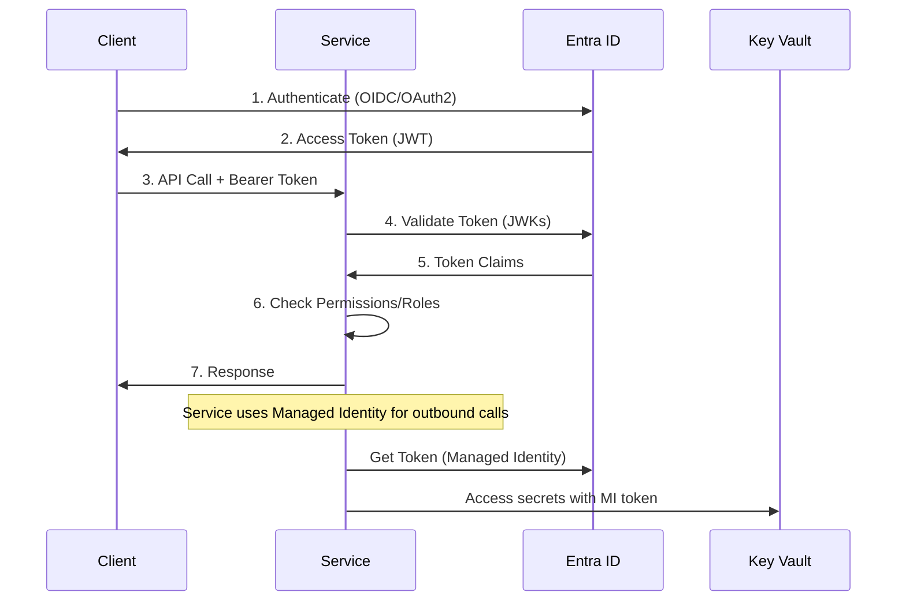

# L0 Identity & Access Pattern

> Authentication, authorization, and identity management for service-to-service and user-to-service scenarios.

## Context
Every service needs secure authentication and authorization. Services must authenticate incoming requests, manage service-to-service trust relationships, and handle token lifecycle management without embedding secrets or using basic auth.

## Problem & Forces
- **Security**: Services need robust authentication without storing secrets
- **Scalability**: Token validation must be fast and not create bottlenecks
- **Maintainability**: Identity configuration should be centralized and consistent
- **Compliance**: Must support audit trails and principle of least privilege
- **Integration**: Must work seamlessly with Azure/cloud-native services

### Trade-offs
- Complexity vs Security: More robust auth adds configuration complexity
- Performance vs Security: Token validation adds latency but provides security
- Centralization vs Autonomy: Centralized identity vs service-specific auth

## Solution Sketch



## Standards/SLOs/Security
- **Authentication**: OIDC/OAuth2 with JWT tokens
- **Authorization**: Role-based access control (RBAC)
- **Token Lifetime**: Access tokens ≤ 1 hour, refresh tokens ≤ 24 hours
- **Secrets**: Zero embedded secrets, use Managed Identity
- **Audit**: All authentication events logged with correlation IDs
- **Performance**: Token validation < 100ms p95

## Tech Anchors
- **Azure Entra ID** (formerly Azure AD) for identity provider
- **Managed Identity** for service-to-service authentication  
- **Azure Key Vault** for secret storage
- **JWT Bearer Authentication** middleware
- **Microsoft Authentication Library (MSAL)** for token acquisition

## Code Starter

### Program.cs Configuration
```csharp
using Microsoft.AspNetCore.Authentication.JwtBearer;
using Microsoft.Identity.Web;
using Azure.Identity;

var builder = WebApplication.CreateBuilder(args);

// Configure JWT Bearer authentication
builder.Services.AddAuthentication(JwtBearerDefaults.AuthenticationScheme)
    .AddMicrosoftIdentityWebApi(builder.Configuration.GetSection("AzureAd"));

// Configure Managed Identity
builder.Services.AddSingleton<DefaultAzureCredential>();

// Add authorization policies
builder.Services.AddAuthorization(options =>
{
    options.AddPolicy("RequireReaderRole", policy =>
        policy.RequireRole("Reader", "Admin"));
    options.AddPolicy("RequireAdminRole", policy =>
        policy.RequireRole("Admin"));
});

var app = builder.Build();

app.UseAuthentication();
app.UseAuthorization();

app.MapControllers();
app.Run();
```

### Controller with Authorization
```csharp
[ApiController]
[Route("api/[controller]")]
[Authorize]
public class BeneficiaryController : ControllerBase
{
    private readonly IBeneficiaryService _beneficiaryService;
    
    public BeneficiaryController(IBeneficiaryService beneficiaryService)
    {
        _beneficiaryService = beneficiaryService;
    }
    
    [HttpGet]
    [Authorize(Policy = "RequireReaderRole")]
    public async Task<IActionResult> GetBeneficiaries()
    {
        var userId = User.FindFirst(ClaimTypes.NameIdentifier)?.Value;
        var tenantId = User.FindFirst("tid")?.Value;
        
        var beneficiaries = await _beneficiaryService.GetBeneficiariesAsync(userId, tenantId);
        return Ok(beneficiaries);
    }
    
    [HttpPost]
    [Authorize(Policy = "RequireAdminRole")]
    public async Task<IActionResult> CreateBeneficiary([FromBody] CreateBeneficiaryRequest request)
    {
        // Implementation
        return Ok();
    }
}
```

### Service-to-Service Client
```csharp
public class ExternalApiClient
{
    private readonly HttpClient _httpClient;
    private readonly DefaultAzureCredential _credential;
    private readonly string _scope;
    
    public ExternalApiClient(HttpClient httpClient, DefaultAzureCredential credential)
    {
        _httpClient = httpClient;
        _credential = credential;
        _scope = "api://external-service/.default";
    }
    
    public async Task<T> CallExternalServiceAsync<T>(string endpoint)
    {
        // Get token using Managed Identity
        var tokenResult = await _credential.GetTokenAsync(
            new TokenRequestContext(new[] { _scope }));
            
        _httpClient.DefaultRequestHeaders.Authorization = 
            new AuthenticationHeaderValue("Bearer", tokenResult.Token);
            
        var response = await _httpClient.GetAsync(endpoint);
        response.EnsureSuccessStatusCode();
        
        var content = await response.Content.ReadAsStringAsync();
        return JsonSerializer.Deserialize<T>(content);
    }
}
```

### Configuration (appsettings.json)
```json
{
  "AzureAd": {
    "Instance": "https://login.microsoftonline.com/",
    "TenantId": "{tenant-id}",
    "ClientId": "{client-id}",
    "Audience": "api://{client-id}"
  },
  "Logging": {
    "LogLevel": {
      "Microsoft.AspNetCore.Authentication": "Information"
    }
  }
}
```

## Tests

### Unit Test for Authorization
```csharp
[TestClass]
public class BeneficiaryControllerTests
{
    [TestMethod]
    public async Task GetBeneficiaries_WithValidReaderRole_ReturnsOk()
    {
        // Arrange
        var mockService = new Mock<IBeneficiaryService>();
        var controller = new BeneficiaryController(mockService.Object);
        
        var claims = new List<Claim>
        {
            new Claim(ClaimTypes.NameIdentifier, "test-user"),
            new Claim("tid", "test-tenant"),
            new Claim(ClaimTypes.Role, "Reader")
        };
        
        var identity = new ClaimsIdentity(claims, "Test");
        var principal = new ClaimsPrincipal(identity);
        
        controller.ControllerContext = new ControllerContext
        {
            HttpContext = new DefaultHttpContext { User = principal }
        };
        
        mockService.Setup(s => s.GetBeneficiariesAsync("test-user", "test-tenant"))
                   .ReturnsAsync(new List<Beneficiary>());
        
        // Act
        var result = await controller.GetBeneficiaries();
        
        // Assert
        Assert.IsInstanceOfType(result, typeof(OkObjectResult));
    }
}
```

### Integration Test
```csharp
[TestClass]
public class AuthenticationIntegrationTests
{
    private WebApplicationFactory<Program> _factory;
    
    [TestInitialize]
    public void Setup()
    {
        _factory = new WebApplicationFactory<Program>();
    }
    
    [TestMethod]
    public async Task Get_Beneficiaries_Without_Token_Returns_Unauthorized()
    {
        // Arrange
        var client = _factory.CreateClient();
        
        // Act
        var response = await client.GetAsync("/api/beneficiary");
        
        // Assert
        Assert.AreEqual(HttpStatusCode.Unauthorized, response.StatusCode);
    }
}
```

## Pitfalls & Anti-Patterns

### ❌ Anti-Patterns
- **Embedded Secrets**: Never store client secrets in code or config files
- **Basic Auth**: Avoid username/password authentication for services
- **Long-Lived Tokens**: Don't use tokens that never expire
- **Custom JWT**: Avoid rolling your own JWT implementation
- **Overprivileged Access**: Don't grant more permissions than needed

### 🚨 Common Pitfalls
- **Token Caching**: Not caching tokens leads to performance issues
- **Clock Skew**: Not accounting for time differences in token validation
- **Scope Creep**: Adding too many permissions to a single service identity
- **Local Development**: Not having a strategy for local auth (use Azurite/emulators)

### 🔧 Solutions
- Use Managed Identity + Key Vault for production secrets
- Implement proper token caching with refresh logic
- Follow principle of least privilege for service permissions
- Use development containers with proper auth setup

## References
- [Microsoft Identity Platform Documentation](https://docs.microsoft.com/en-us/azure/active-directory/develop/)
- [Azure Managed Identity Best Practices](https://docs.microsoft.com/en-us/azure/active-directory/managed-identities-azure-resources/managed-identities-best-practice-recommendations)
- [JWT Bearer Authentication in ASP.NET Core](https://docs.microsoft.com/en-us/aspnet/core/security/authentication/jwt-authn)
- Template: `templates/api-service-with-auth/`
- Example: `/samples/identity-access/`