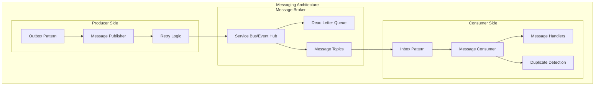

# L0 Messaging Client Pattern

> Producer/consumer baselines, dead letter handling, and outbox/inbox patterns for reliable messaging.

## Context
Services need reliable messaging capabilities for asynchronous communication, event publishing, and command processing. This pattern provides consistent approaches for message producers, consumers, dead letter handling, and ensuring exactly-once delivery through outbox/inbox patterns.

## Problem & Forces
- **Message Reliability**: Ensuring messages are delivered even in failure scenarios
- **Exactly-Once Processing**: Preventing duplicate message processing
- **Error Handling**: Managing poison messages and retry logic
- **Performance**: Balancing throughput with reliability guarantees
- **Monitoring**: Visibility into message flow and processing health

### Trade-offs
- Reliability vs Performance: Transactional guarantees vs message throughput
- Complexity vs Simplicity: Advanced patterns vs straightforward messaging
- Coupling vs Decoupling: Strong contracts vs loose message schemas

## Solution Sketch

## Tech Anchors
- **NServiceBus** - Enterprise messaging framework
- **Azure Service Bus** - Managed message broker
- **MediatR** - In-process messaging patterns
- **Polly** - Retry and circuit breaker policies

## Key Components
- **Message Publisher**: Reliable message publishing with outbox pattern
- **Message Consumer**: Idempotent message processing with inbox pattern
- **Dead Letter Handler**: Processing and retry of failed messages
- **Message Contracts**: Versioned message schemas and routing

*[Full implementation details coming soon]*

## References
- [NServiceBus Documentation](https://docs.particular.net/nservicebus/)
- [Azure Service Bus Patterns](https://docs.microsoft.com/en-us/azure/service-bus-messaging/)
- Template: `templates/messaging-client/`