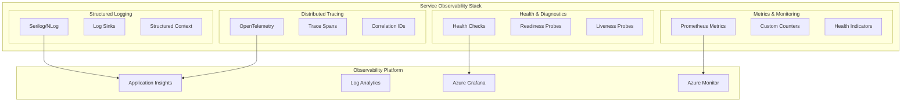

# L0 Observability Pattern

> Comprehensive monitoring, logging, and tracing foundation that every service must implement.

## Context
Modern distributed systems require deep observability to understand system behavior, troubleshoot issues, and ensure reliability. Each service needs consistent logging, metrics, distributed tracing, and health monitoring to provide operational visibility and enable effective debugging across service boundaries.

## Problem & Forces
- **Distributed Debugging**: Hard to trace requests across multiple services
- **Performance Monitoring**: Need to identify bottlenecks and performance degradation
- **Operational Visibility**: Understanding system health and business metrics
- **Alert Fatigue**: Too many alerts vs missing critical issues
- **Compliance**: Audit logging and data retention requirements

### Trade-offs
- Observability Overhead vs Performance: Detailed monitoring impacts latency and resources
- Data Volume vs Storage Costs: More telemetry increases storage and analysis costs
- Real-time vs Batch Processing: Immediate visibility vs processing efficiency

## Solution Sketch



## Standards/SLOs/Security

### Logging Standards
- **Structured Format**: JSON with consistent schema
- **Log Levels**: TRACE, DEBUG, INFO, WARN, ERROR, FATAL
- **Correlation**: Request correlation IDs for tracing
- **No Secrets**: Sanitize sensitive data from logs
- **Retention**: 90 days for application logs, 7 years for audit logs

### Metrics Standards
- **RED Method**: Rate, Errors, Duration for services
- **USE Method**: Utilization, Saturation, Errors for resources
- **Business Metrics**: Domain-specific KPIs and counters
- **Standard Labels**: service, version, environment, region

### Tracing Standards
- **Sampling**: 1% for production, 100% for development
- **Span Attributes**: Required metadata for context
- **Baggage**: Cross-service correlation data

### SLOs
- **Trace Completeness**: 99.9% of traces captured
- **Log Ingestion**: 99.95% of logs delivered within 30s
- **Alert Response**: Critical alerts acknowledged within 5 minutes
- **Dashboard Load**: Monitoring dashboards load within 3 seconds

## Tech Anchors
- **Serilog** - Structured logging framework
- **Application Insights** - APM and telemetry collection
- **OpenTelemetry** - Distributed tracing and metrics
- **Azure Monitor** - Metrics aggregation and alerting
- **Azure Log Analytics** - Log storage and querying
- **Grafana** - Dashboards and visualization

## Code Starter

### Observability Configuration
```csharp
// Program.cs - Service startup with observability
public class Program
{
    public static void Main(string[] args)
    {
        var builder = WebApplication.CreateBuilder(args);
        
        // Configure observability
        builder.Services.AddObservability(builder.Configuration);
        
        // Configure Serilog
        builder.Host.UseSerilog((context, configuration) =>
        {
            configuration.ReadFrom.Configuration(context.Configuration)
                .Enrich.WithProperty("ServiceName", "IOM.Migration.Platform")
                .Enrich.WithProperty("ServiceVersion", GetVersion())
                .Enrich.WithCorrelationId()
                .WriteTo.Console(new JsonFormatter())
                .WriteTo.ApplicationInsights(
                    context.Configuration.GetConnectionString("ApplicationInsights"),
                    TelemetryConverter.Traces);
        });
        
        var app = builder.Build();
        
        // Add observability middleware
        app.UseCorrelationId();
        app.UseRequestLogging();
        app.UseMetricsCollection();
        
        app.Run();
    }
    
    private static string GetVersion() =>
        Assembly.GetExecutingAssembly().GetName().Version?.ToString() ?? "unknown";
}
```

### Observability Extensions
```csharp
public static class ObservabilityExtensions
{
    public static IServiceCollection AddObservability(
        this IServiceCollection services,
        IConfiguration configuration)
    {
        // Application Insights
        services.AddApplicationInsightsTelemetry(configuration);
        
        // OpenTelemetry
        services.AddOpenTelemetry()
            .WithTracing(builder =>
            {
                builder.AddAspNetCoreInstrumentation()
                       .AddHttpClientInstrumentation()
                       .AddSqlClientInstrumentation()
                       .AddSource("IOM.Migration.Platform")
                       .SetSampler(new TraceIdRatioBasedSampler(0.01)) // 1% sampling
                       .AddApplicationInsightsExporter();
            })
            .WithMetrics(builder =>
            {
                builder.AddAspNetCoreInstrumentation()
                       .AddHttpClientInstrumentation()
                       .AddRuntimeInstrumentation()
                       .AddMeter("IOM.Migration.Platform")
                       .AddApplicationInsightsExporter();
            });
        
        // Health checks
        services.AddHealthChecks()
            .AddCheck<DatabaseHealthCheck>("database")
            .AddCheck<ServiceBusHealthCheck>("servicebus")
            .AddCheck<ExternalServiceHealthCheck>("external-api");
        
        // Custom metrics
        services.AddSingleton<IMetricsCollector, MetricsCollector>();
        
        // Correlation ID
        services.AddSingleton<ICorrelationIdProvider, CorrelationIdProvider>();
        
        return services;
    }
    
    public static IApplicationBuilder UseRequestLogging(this IApplicationBuilder app)
    {
        return app.UseSerilogRequestLogging(options =>
        {
            options.MessageTemplate = "HTTP {RequestMethod} {RequestPath} responded {StatusCode} in {Elapsed:0.0000} ms";
            options.EnrichDiagnosticContext = (diagnosticContext, httpContext) =>
            {
                diagnosticContext.Set("RequestHost", httpContext.Request.Host.Value);
                diagnosticContext.Set("RequestScheme", httpContext.Request.Scheme);
                diagnosticContext.Set("UserAgent", httpContext.Request.Headers["User-Agent"].FirstOrDefault());
                diagnosticContext.Set("CorrelationId", httpContext.Request.Headers["X-Correlation-ID"].FirstOrDefault());
            };
        });
    }
}
```

### Structured Logging Service
```csharp
public interface IAppLogger<T>
{
    void LogInformation(string messageTemplate, params object[] args);
    void LogWarning(string messageTemplate, params object[] args);
    void LogError(Exception exception, string messageTemplate, params object[] args);
    void LogBusinessEvent(string eventName, object eventData);
    IDisposable BeginScope(string operation, Dictionary<string, object>? properties = null);
}

public class AppLogger<T> : IAppLogger<T>
{
    private readonly ILogger<T> _logger;
    private readonly ICorrelationIdProvider _correlationIdProvider;

    public AppLogger(ILogger<T> logger, ICorrelationIdProvider correlationIdProvider)
    {
        _logger = logger;
        _correlationIdProvider = correlationIdProvider;
    }

    public void LogInformation(string messageTemplate, params object[] args)
    {
        using var scope = CreateScope();
        _logger.LogInformation(messageTemplate, args);
    }

    public void LogWarning(string messageTemplate, params object[] args)
    {
        using var scope = CreateScope();
        _logger.LogWarning(messageTemplate, args);
    }

    public void LogError(Exception exception, string messageTemplate, params object[] args)
    {
        using var scope = CreateScope();
        _logger.LogError(exception, messageTemplate, args);
    }

    public void LogBusinessEvent(string eventName, object eventData)
    {
        using var scope = CreateScope();
        using var eventScope = _logger.BeginScope(new Dictionary<string, object>
        {
            ["EventType"] = "BusinessEvent",
            ["EventName"] = eventName,
            ["EventData"] = eventData
        });
        
        _logger.LogInformation("Business event {EventName} occurred", eventName);
    }

    public IDisposable BeginScope(string operation, Dictionary<string, object>? properties = null)
    {
        var scope = new Dictionary<string, object>
        {
            ["Operation"] = operation,
            ["CorrelationId"] = _correlationIdProvider.Get()
        };
        
        if (properties != null)
        {
            foreach (var prop in properties)
            {
                scope[prop.Key] = prop.Value;
            }
        }
        
        return _logger.BeginScope(scope);
    }
    
    private IDisposable CreateScope()
    {
        return _logger.BeginScope(new Dictionary<string, object>
        {
            ["CorrelationId"] = _correlationIdProvider.Get()
        });
    }
}
```

### Metrics Collector
```csharp
public interface IMetricsCollector
{
    void RecordDuration(string operation, TimeSpan duration, Dictionary<string, object>? tags = null);
    void IncrementCounter(string name, Dictionary<string, object>? tags = null);
    void RecordValue(string name, double value, Dictionary<string, object>? tags = null);
    void RecordBusinessMetric(string metricName, double value, Dictionary<string, object>? dimensions = null);
}

public class MetricsCollector : IMetricsCollector
{
    private readonly Meter _meter;
    private readonly Counter<long> _operationCounter;
    private readonly Histogram<double> _operationDuration;
    private readonly Counter<long> _businessEventCounter;
    private readonly Histogram<double> _businessMetricHistogram;

    public MetricsCollector()
    {
        _meter = new Meter("IOM.Migration.Platform");
        _operationCounter = _meter.CreateCounter<long>("operation_total", "count", "Total number of operations");
        _operationDuration = _meter.CreateHistogram<double>("operation_duration_ms", "ms", "Duration of operations");
        _businessEventCounter = _meter.CreateCounter<long>("business_event_total", "count", "Total business events");
        _businessMetricHistogram = _meter.CreateHistogram<double>("business_metric_value", "value", "Business metric values");
    }

    public void RecordDuration(string operation, TimeSpan duration, Dictionary<string, object>? tags = null)
    {
        var tagList = CreateTagList(tags);
        tagList.Add("operation", operation);
        
        _operationDuration.Record(duration.TotalMilliseconds, tagList.ToArray());
    }

    public void IncrementCounter(string name, Dictionary<string, object>? tags = null)
    {
        var tagList = CreateTagList(tags);
        tagList.Add("counter_name", name);
        
        _operationCounter.Add(1, tagList.ToArray());
    }

    public void RecordValue(string name, double value, Dictionary<string, object>? tags = null)
    {
        var tagList = CreateTagList(tags);
        tagList.Add("metric_name", name);
        
        _businessMetricHistogram.Record(value, tagList.ToArray());
    }

    public void RecordBusinessMetric(string metricName, double value, Dictionary<string, object>? dimensions = null)
    {
        var tagList = CreateTagList(dimensions);
        tagList.Add("business_metric", metricName);
        
        _businessMetricHistogram.Record(value, tagList.ToArray());
        _businessEventCounter.Add(1, tagList.ToArray());
    }

    private static List<KeyValuePair<string, object?>> CreateTagList(Dictionary<string, object>? tags)
    {
        var tagList = new List<KeyValuePair<string, object?>>();
        
        if (tags != null)
        {
            foreach (var tag in tags)
            {
                tagList.Add(new KeyValuePair<string, object?>(tag.Key, tag.Value));
            }
        }
        
        return tagList;
    }
}
```

### Health Checks Implementation
```csharp
public class DatabaseHealthCheck : IHealthCheck
{
    private readonly IConfiguration _configuration;
    private readonly ILogger<DatabaseHealthCheck> _logger;

    public DatabaseHealthCheck(IConfiguration configuration, ILogger<DatabaseHealthCheck> logger)
    {
        _configuration = configuration;
        _logger = logger;
    }

    public async Task<HealthCheckResult> CheckHealthAsync(
        HealthCheckContext context,
        CancellationToken cancellationToken = default)
    {
        try
        {
            var connectionString = _configuration.GetConnectionString("DefaultConnection");
            using var connection = new SqlConnection(connectionString);
            
            await connection.OpenAsync(cancellationToken);
            
            using var command = connection.CreateCommand();
            command.CommandText = "SELECT 1";
            await command.ExecuteScalarAsync(cancellationToken);
            
            return HealthCheckResult.Healthy("Database connection is healthy");
        }
        catch (Exception ex)
        {
            _logger.LogError(ex, "Database health check failed");
            return HealthCheckResult.Unhealthy("Database connection failed", ex);
        }
    }
}

public class ServiceBusHealthCheck : IHealthCheck
{
    private readonly IConfiguration _configuration;
    private readonly ILogger<ServiceBusHealthCheck> _logger;

    public async Task<HealthCheckResult> CheckHealthAsync(
        HealthCheckContext context,
        CancellationToken cancellationToken = default)
    {
        try
        {
            var connectionString = _configuration.GetConnectionString("ServiceBus");
            await using var client = new ServiceBusClient(connectionString);
            
            // Simple connectivity check
            var properties = await client.GetPropertiesAsync(cancellationToken);
            
            return HealthCheckResult.Healthy($"Service Bus connection healthy. Created: {properties.CreatedAt}");
        }
        catch (Exception ex)
        {
            _logger.LogError(ex, "Service Bus health check failed");
            return HealthCheckResult.Unhealthy("Service Bus connection failed", ex);
        }
    }
}
```

### Correlation ID Provider
```csharp
public interface ICorrelationIdProvider
{
    string Get();
    void Set(string correlationId);
}

public class CorrelationIdProvider : ICorrelationIdProvider
{
    private readonly IHttpContextAccessor _httpContextAccessor;
    
    public CorrelationIdProvider(IHttpContextAccessor httpContextAccessor)
    {
        _httpContextAccessor = httpContextAccessor;
    }

    public string Get()
    {
        var context = _httpContextAccessor.HttpContext;
        if (context != null)
        {
            if (context.Request.Headers.TryGetValue("X-Correlation-ID", out var correlationId))
            {
                return correlationId.FirstOrDefault() ?? GenerateNew();
            }
        }
        
        return GenerateNew();
    }

    public void Set(string correlationId)
    {
        var context = _httpContextAccessor.HttpContext;
        context?.Response.Headers.Add("X-Correlation-ID", correlationId);
    }
    
    private static string GenerateNew() => Guid.NewGuid().ToString("N")[..8];
}

public class CorrelationMiddleware
{
    private readonly RequestDelegate _next;
    private readonly ICorrelationIdProvider _correlationIdProvider;

    public CorrelationMiddleware(RequestDelegate next, ICorrelationIdProvider correlationIdProvider)
    {
        _next = next;
        _correlationIdProvider = correlationIdProvider;
    }

    public async Task InvokeAsync(HttpContext context)
    {
        var correlationId = _correlationIdProvider.Get();
        _correlationIdProvider.Set(correlationId);
        
        using (LogContext.PushProperty("CorrelationId", correlationId))
        {
            await _next(context);
        }
    }
}
```

### Business Event Tracking
```csharp
public interface IBusinessEventTracker
{
    void Track(string eventName, object eventData, string? userId = null);
    void TrackBeneficiaryRegistration(string beneficiaryId, string correlationId);
    void TrackFileUpload(string fileName, int recordCount, string uploadedBy);
}

public class BusinessEventTracker : IBusinessEventTracker
{
    private readonly IAppLogger<BusinessEventTracker> _logger;
    private readonly IMetricsCollector _metrics;

    public BusinessEventTracker(IAppLogger<BusinessEventTracker> logger, IMetricsCollector metrics)
    {
        _logger = logger;
        _metrics = metrics;
    }

    public void Track(string eventName, object eventData, string? userId = null)
    {
        _logger.LogBusinessEvent(eventName, eventData);
        
        var tags = new Dictionary<string, object> { ["event_name"] = eventName };
        if (userId != null) tags["user_id"] = userId;
        
        _metrics.IncrementCounter("business_events", tags);
    }

    public void TrackBeneficiaryRegistration(string beneficiaryId, string correlationId)
    {
        Track("BeneficiaryRegistered", new
        {
            BeneficiaryId = beneficiaryId,
            CorrelationId = correlationId,
            Timestamp = DateTime.UtcNow
        });
    }

    public void TrackFileUpload(string fileName, int recordCount, string uploadedBy)
    {
        Track("FileUploaded", new
        {
            FileName = fileName,
            RecordCount = recordCount,
            UploadedBy = uploadedBy,
            Timestamp = DateTime.UtcNow
        });
        
        _metrics.RecordBusinessMetric("file_upload_records", recordCount, new Dictionary<string, object>
        {
            ["file_name"] = fileName,
            ["uploaded_by"] = uploadedBy
        });
    }
}
```

## Tests

### Observability Tests
```csharp
[TestClass]
public class ObservabilityTests
{
    [TestMethod]
    public void AddObservability_RegistersRequiredServices()
    {
        // Arrange
        var services = new ServiceCollection();
        var configuration = new ConfigurationBuilder()
            .AddInMemoryCollection(new Dictionary<string, string>
            {
                ["ApplicationInsights:ConnectionString"] = "test-connection-string"
            })
            .Build();

        // Act
        services.AddObservability(configuration);

        // Assert
        var serviceProvider = services.BuildServiceProvider();
        Assert.IsNotNull(serviceProvider.GetService<IMetricsCollector>());
        Assert.IsNotNull(serviceProvider.GetService<ICorrelationIdProvider>());
    }

    [TestMethod]
    public void MetricsCollector_RecordsDuration()
    {
        // Arrange
        var collector = new MetricsCollector();
        var duration = TimeSpan.FromMilliseconds(100);

        // Act & Assert
        // In a real test, you would verify metrics were recorded
        collector.RecordDuration("test_operation", duration);
        Assert.IsTrue(true); // Placeholder - actual metrics testing requires test framework
    }

    [TestMethod]
    public void CorrelationIdProvider_GeneratesId_WhenNotPresent()
    {
        // Arrange
        var httpContextAccessor = new Mock<IHttpContextAccessor>();
        var provider = new CorrelationIdProvider(httpContextAccessor.Object);

        // Act
        var correlationId = provider.Get();

        // Assert
        Assert.IsNotNull(correlationId);
        Assert.AreEqual(8, correlationId.Length);
    }
}
```

### Health Check Tests
```csharp
[TestClass]
public class HealthCheckTests
{
    [TestMethod]
    public async Task DatabaseHealthCheck_ReturnsHealthy_WhenConnectionSucceeds()
    {
        // Arrange
        var configuration = new Mock<IConfiguration>();
        var logger = new Mock<ILogger<DatabaseHealthCheck>>();
        var healthCheck = new DatabaseHealthCheck(configuration.Object, logger.Object);

        // This would require a test database or mocking
        // Simplified for example
        var context = new HealthCheckContext();

        // Act & Assert
        // In integration tests, verify actual database connectivity
        Assert.IsNotNull(healthCheck);
    }
}
```

### Integration Tests
```csharp
[TestClass]
public class ObservabilityIntegrationTests
{
    [TestMethod]
    public async Task CorrelationId_IsPreserved_AcrossRequests()
    {
        // Arrange
        var factory = new WebApplicationFactory<Program>();
        var client = factory.CreateClient();
        var correlationId = Guid.NewGuid().ToString("N")[..8];

        // Act
        client.DefaultRequestHeaders.Add("X-Correlation-ID", correlationId);
        var response = await client.GetAsync("/health");

        // Assert
        Assert.IsTrue(response.Headers.Contains("X-Correlation-ID"));
        var responseCorrelationId = response.Headers.GetValues("X-Correlation-ID").First();
        Assert.AreEqual(correlationId, responseCorrelationId);
    }

    [TestMethod]
    public async Task Metrics_AreCollected_DuringRequests()
    {
        // Arrange
        var factory = new WebApplicationFactory<Program>();
        var client = factory.CreateClient();

        // Act
        await client.GetAsync("/health");

        // Assert
        // Verify metrics collection - would require metrics endpoint or test framework
        Assert.IsTrue(true);
    }
}
```

## Pitfalls & Anti-Patterns

### ❌ Anti-Patterns
- **Log Everything**: Excessive logging that creates noise and storage costs
- **Secrets in Logs**: Accidentally logging sensitive information
- **Synchronous Logging**: Blocking operations for log writes
- **No Correlation**: Unable to trace requests across services

### 🚨 Common Pitfalls
- **Missing Structured Data**: Using string concatenation instead of structured logging
- **No Sampling**: 100% tracing in production causing performance issues
- **Alert Spam**: Too many low-priority alerts causing alert fatigue
- **Dashboard Proliferation**: Too many dashboards without clear ownership

### 🔧 Solutions
- Implement log level configuration and structured logging
- Use appropriate sampling rates for tracing
- Create alert hierarchies with escalation policies
- Standardize dashboard templates and ownership
- Regular review of observability data and costs

## References
- [OpenTelemetry .NET](https://opentelemetry.io/docs/instrumentation/net/)
- [Serilog Best Practices](https://github.com/serilog/serilog/wiki/Best-Practices)
- [Application Insights](https://docs.microsoft.com/en-us/azure/azure-monitor/app/app-insights-overview)
- [The Three Pillars of Observability](https://peter.bourgon.org/blog/2017/02/21/metrics-tracing-and-logging.html)
- Template: `templates/observability/`
- Example: `/samples/observability/`