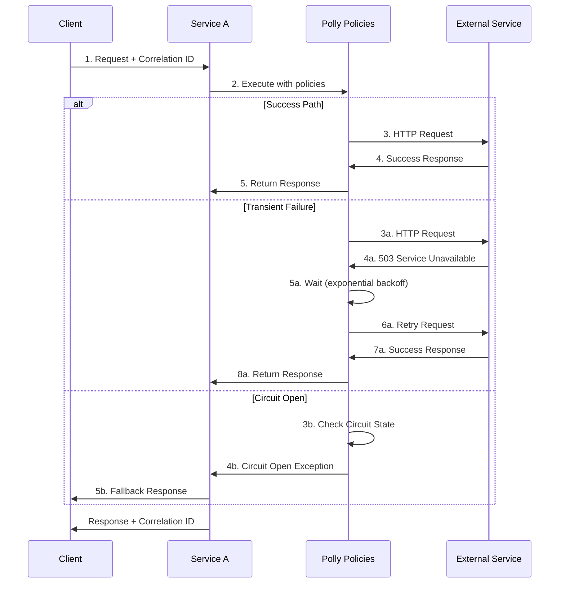

# L0 Resilience & Networking Pattern

> Robust communication patterns with timeouts, retries, circuit breakers, and correlation tracking.

## Context
Distributed services must handle transient failures, network partitions, and service degradations gracefully. Services need to implement timeouts, retries with backoff, circuit breakers, and proper correlation tracking without blocking the entire system.

## Problem & Forces
- **Reliability**: Network calls can fail intermittently
- **Performance**: Failed calls should not block healthy operations
- **Cascading Failures**: One service failure shouldn't bring down the entire system
- **Observability**: Need to track requests across service boundaries
- **Resource Protection**: Prevent resource exhaustion from retries

### Trade-offs
- Complexity vs Resilience: More resilience patterns add configuration complexity
- Latency vs Reliability: Retries add latency but improve success rates
- Resource Usage vs Fault Tolerance: Circuit breakers protect resources but may reject valid requests

## Solution Sketch



## Standards/SLOs/Security
- **Timeouts**: HTTP calls ≤ 30s, database calls ≤ 10s
- **Retries**: Max 3 retries with exponential backoff + jitter
- **Circuit Breaker**: Open after 5 consecutive failures, half-open after 60s
- **Correlation**: W3C TraceContext standard for distributed tracing
- **Bulkhead**: Separate thread pools for different external dependencies
- **Idempotency**: All operations should be idempotent with unique keys

## Tech Anchors
- **Polly** for resilience policies (retry, circuit breaker, timeout)
- **HttpClientFactory** for managed HTTP connections
- **System.Diagnostics.Activity** for correlation tracking
- **Microsoft.Extensions.Http.Polly** for integration
- **IMemoryCache** for circuit breaker state and response caching

## Code Starter

### Program.cs Configuration
```csharp
using Polly;
using Polly.Extensions.Http;
using System.Diagnostics;

var builder = WebApplication.CreateBuilder(args);

// Configure HttpClient with Polly policies
builder.Services.AddHttpClient<ExternalServiceClient>(client =>
{
    client.BaseAddress = new Uri("https://external-service.com");
    client.Timeout = TimeSpan.FromSeconds(30);
    client.DefaultRequestHeaders.Add("User-Agent", "IOM-Migration-Platform/1.0");
})
.AddPolicyHandler(GetRetryPolicy())
.AddPolicyHandler(GetCircuitBreakerPolicy())
.AddPolicyHandler(GetTimeoutPolicy());

// Add correlation context
builder.Services.AddSingleton<ICorrelationIdGenerator, CorrelationIdGenerator>();
builder.Services.AddScoped<CorrelationIdMiddleware>();

var app = builder.Build();

// Add correlation middleware early in pipeline
app.UseMiddleware<CorrelationIdMiddleware>();

app.Run();

static IAsyncPolicy<HttpResponseMessage> GetRetryPolicy()
{
    return HttpPolicyExtensions
        .HandleTransientHttpError()
        .OrResult(msg => !msg.IsSuccessStatusCode)
        .WaitAndRetryAsync(
            retryCount: 3,
            sleepDurationProvider: retryAttempt => 
                TimeSpan.FromSeconds(Math.Pow(2, retryAttempt)) + 
                TimeSpan.FromMilliseconds(Random.Shared.Next(0, 1000)), // Jitter
            onRetry: (outcome, timespan, retryCount, context) =>
            {
                var logger = context.GetLogger();
                logger?.LogWarning("Retry {RetryCount} for {Operation} in {Duration}ms", 
                    retryCount, context.OperationKey, timespan.TotalMilliseconds);
            });
}

static IAsyncPolicy<HttpResponseMessage> GetCircuitBreakerPolicy()
{
    return HttpPolicyExtensions
        .HandleTransientHttpError()
        .CircuitBreakerAsync(
            handledEventsAllowedBeforeBreaking: 5,
            durationOfBreak: TimeSpan.FromSeconds(60),
            onBreak: (exception, duration) =>
            {
                // Log circuit breaker opened
            },
            onReset: () =>
            {
                // Log circuit breaker closed
            });
}

static IAsyncPolicy<HttpResponseMessage> GetTimeoutPolicy()
{
    return Policy.TimeoutAsync<HttpResponseMessage>(TimeSpan.FromSeconds(10));
}
```

### Correlation ID Middleware
```csharp
public interface ICorrelationIdGenerator
{
    string Generate();
    string GetCorrelationId();
}

public class CorrelationIdGenerator : ICorrelationIdGenerator
{
    private const string CorrelationIdHeader = "X-Correlation-ID";
    private readonly IHttpContextAccessor _httpContextAccessor;

    public CorrelationIdGenerator(IHttpContextAccessor httpContextAccessor)
    {
        _httpContextAccessor = httpContextAccessor;
    }

    public string Generate() => Guid.NewGuid().ToString();

    public string GetCorrelationId()
    {
        return _httpContextAccessor.HttpContext?.Items[CorrelationIdHeader]?.ToString() 
               ?? Activity.Current?.Id 
               ?? Generate();
    }
}

public class CorrelationIdMiddleware : IMiddleware
{
    private const string CorrelationIdHeader = "X-Correlation-ID";
    private readonly ILogger<CorrelationIdMiddleware> _logger;

    public CorrelationIdMiddleware(ILogger<CorrelationIdMiddleware> logger)
    {
        _logger = logger;
    }

    public async Task InvokeAsync(HttpContext context, RequestDelegate next)
    {
        var correlationId = ExtractCorrelationId(context);
        
        // Set correlation ID in context
        context.Items[CorrelationIdHeader] = correlationId;
        
        // Set correlation ID in response header
        context.Response.Headers[CorrelationIdHeader] = correlationId;
        
        // Start activity with correlation ID
        using var activity = Activity.Current?.Source.StartActivity("HTTP Request");
        activity?.SetTag("correlation.id", correlationId);
        activity?.SetTag("http.method", context.Request.Method);
        activity?.SetTag("http.url", context.Request.Path);

        try
        {
            await next(context);
        }
        catch (Exception ex)
        {
            _logger.LogError(ex, "Request failed for correlation {CorrelationId}", correlationId);
            activity?.SetStatus(ActivityStatusCode.Error, ex.Message);
            throw;
        }
    }

    private string ExtractCorrelationId(HttpContext context)
    {
        // Try to get from header first
        if (context.Request.Headers.TryGetValue(CorrelationIdHeader, out var correlationId))
        {
            return correlationId.FirstOrDefault() ?? Guid.NewGuid().ToString();
        }

        // Generate new correlation ID
        return Guid.NewGuid().ToString();
    }
}
```

### Resilient Service Client
```csharp
public class ExternalServiceClient
{
    private readonly HttpClient _httpClient;
    private readonly ILogger<ExternalServiceClient> _logger;
    private readonly ICorrelationIdGenerator _correlationIdGenerator;

    public ExternalServiceClient(
        HttpClient httpClient, 
        ILogger<ExternalServiceClient> logger,
        ICorrelationIdGenerator correlationIdGenerator)
    {
        _httpClient = httpClient;
        _logger = logger;
        _correlationIdGenerator = correlationIdGenerator;
    }

    public async Task<T> GetAsync<T>(string endpoint, CancellationToken cancellationToken = default)
    {
        var correlationId = _correlationIdGenerator.GetCorrelationId();
        
        using var activity = Activity.Current?.Source.StartActivity($"GET {endpoint}");
        activity?.SetTag("correlation.id", correlationId);
        activity?.SetTag("http.method", "GET");
        activity?.SetTag("http.endpoint", endpoint);

        try
        {
            // Add correlation ID to request
            _httpClient.DefaultRequestHeaders.Remove("X-Correlation-ID");
            _httpClient.DefaultRequestHeaders.Add("X-Correlation-ID", correlationId);

            _logger.LogInformation("Making GET request to {Endpoint} with correlation {CorrelationId}", 
                endpoint, correlationId);

            var response = await _httpClient.GetAsync(endpoint, cancellationToken);
            
            if (response.IsSuccessStatusCode)
            {
                var content = await response.Content.ReadAsStringAsync(cancellationToken);
                var result = JsonSerializer.Deserialize<T>(content);
                
                _logger.LogInformation("Successfully received response from {Endpoint}", endpoint);
                return result;
            }

            _logger.LogWarning("Received {StatusCode} from {Endpoint}", 
                response.StatusCode, endpoint);
            
            throw new HttpRequestException($"Request failed with status {response.StatusCode}");
        }
        catch (HttpRequestException ex)
        {
            _logger.LogError(ex, "HTTP request failed for {Endpoint}", endpoint);
            activity?.SetStatus(ActivityStatusCode.Error, ex.Message);
            throw;
        }
        catch (TaskCanceledException ex) when (ex.InnerException is TimeoutRejectedException)
        {
            _logger.LogError("Request to {Endpoint} timed out", endpoint);
            activity?.SetStatus(ActivityStatusCode.Error, "Timeout");
            throw new TimeoutException($"Request to {endpoint} timed out", ex);
        }
    }

    public async Task<TResponse> PostAsync<TRequest, TResponse>(
        string endpoint, 
        TRequest request, 
        CancellationToken cancellationToken = default)
    {
        var correlationId = _correlationIdGenerator.GetCorrelationId();
        
        using var activity = Activity.Current?.Source.StartActivity($"POST {endpoint}");
        activity?.SetTag("correlation.id", correlationId);
        activity?.SetTag("http.method", "POST");

        try
        {
            _httpClient.DefaultRequestHeaders.Remove("X-Correlation-ID");
            _httpClient.DefaultRequestHeaders.Add("X-Correlation-ID", correlationId);

            var json = JsonSerializer.Serialize(request);
            var content = new StringContent(json, Encoding.UTF8, "application/json");

            var response = await _httpClient.PostAsync(endpoint, content, cancellationToken);
            response.EnsureSuccessStatusCode();

            var responseContent = await response.Content.ReadAsStringAsync(cancellationToken);
            return JsonSerializer.Deserialize<TResponse>(responseContent);
        }
        catch (Exception ex)
        {
            _logger.LogError(ex, "POST request failed for {Endpoint}", endpoint);
            activity?.SetStatus(ActivityStatusCode.Error, ex.Message);
            throw;
        }
    }
}
```

### Fallback and Bulkhead Patterns
```csharp
public class BeneficiaryService
{
    private readonly ExternalServiceClient _primaryClient;
    private readonly ExternalServiceClient _fallbackClient;
    private readonly IMemoryCache _cache;
    private readonly ILogger<BeneficiaryService> _logger;

    public async Task<Beneficiary> GetBeneficiaryAsync(string id)
    {
        try
        {
            // Try primary service first
            return await _primaryClient.GetAsync<Beneficiary>($"/beneficiaries/{id}");
        }
        catch (CircuitBreakerOpenException)
        {
            _logger.LogWarning("Primary service circuit breaker is open, trying fallback");
            
            try
            {
                return await _fallbackClient.GetAsync<Beneficiary>($"/beneficiaries/{id}");
            }
            catch (Exception ex)
            {
                _logger.LogError(ex, "Fallback service also failed");
                
                // Try cache as last resort
                if (_cache.TryGetValue($"beneficiary_{id}", out Beneficiary cachedBeneficiary))
                {
                    _logger.LogInformation("Returning cached beneficiary for {Id}", id);
                    return cachedBeneficiary;
                }

                throw;
            }
        }
        catch (Exception ex)
        {
            _logger.LogError(ex, "Primary service failed, trying fallback");
            return await _fallbackClient.GetAsync<Beneficiary>($"/beneficiaries/{id}");
        }
    }
}
```

## Tests

### Resilience Policy Tests
```csharp
[TestClass]
public class ResiliencePolicyTests
{
    [TestMethod]
    public async Task RetryPolicy_RetriesOnTransientFailure()
    {
        // Arrange
        var handler = new Mock<HttpMessageHandler>();
        handler.SetupSequence(h => h.SendAsync(It.IsAny<HttpRequestMessage>(), It.IsAny<CancellationToken>()))
               .ReturnsAsync(new HttpResponseMessage(HttpStatusCode.InternalServerError))
               .ReturnsAsync(new HttpResponseMessage(HttpStatusCode.OK));

        var httpClient = new HttpClient(handler.Object);
        var policy = GetRetryPolicy();

        // Act & Assert
        var response = await policy.ExecuteAsync(() => httpClient.GetAsync("http://test.com"));
        
        Assert.AreEqual(HttpStatusCode.OK, response.StatusCode);
        handler.Verify(h => h.SendAsync(It.IsAny<HttpRequestMessage>(), It.IsAny<CancellationToken>()), 
                      Times.Exactly(2));
    }
}
```

### Correlation ID Tests
```csharp
[TestClass]
public class CorrelationIdTests
{
    [TestMethod]
    public async Task CorrelationIdMiddleware_AddsCorrelationIdToResponse()
    {
        // Arrange
        var context = new DefaultHttpContext();
        var middleware = new CorrelationIdMiddleware(Mock.Of<ILogger<CorrelationIdMiddleware>>());
        var nextCalled = false;

        Task Next(HttpContext ctx)
        {
            nextCalled = true;
            return Task.CompletedTask;
        }

        // Act
        await middleware.InvokeAsync(context, Next);

        // Assert
        Assert.IsTrue(nextCalled);
        Assert.IsTrue(context.Response.Headers.ContainsKey("X-Correlation-ID"));
    }
}
```

## Pitfalls & Anti-Patterns

### ❌ Anti-Patterns
- **Infinite Retries**: Retrying indefinitely without exponential backoff
- **Synchronous Blocking**: Using .Result or .Wait() in async operations
- **No Timeouts**: Network calls without timeout configuration
- **Cascade Failures**: Not implementing circuit breakers or bulkheads

### 🚨 Common Pitfalls
- **Fixed Retry Intervals**: Not using jitter, causing thundering herd
- **No Correlation Tracking**: Unable to trace requests across services
- **Wrong Exception Handling**: Retrying on non-transient errors
- **Resource Exhaustion**: Not limiting concurrent requests

### 🔧 Solutions
- Always use exponential backoff with jitter for retries
- Implement proper correlation ID propagation
- Use HttpClientFactory with Polly for managed connections
- Configure appropriate timeouts and circuit breakers

## References
- [Polly Documentation](https://github.com/App-vNext/Polly)
- [HttpClientFactory Best Practices](https://docs.microsoft.com/en-us/dotnet/architecture/microservices/implement-resilient-applications/use-httpclientfactory-to-implement-resilient-http-requests)
- [Distributed Tracing in .NET](https://docs.microsoft.com/en-us/dotnet/core/diagnostics/distributed-tracing)
- Template: `templates/resilient-service/`
- Example: `/samples/resilience-networking/`