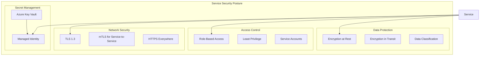

# L0 Security Posture Pattern

> Essential security building blocks that every service must implement consistently.

## Context
Every service in a distributed architecture needs consistent security foundations. Security cannot be an afterthought - it must be built into the service kernel from day one. This pattern establishes baseline security posture for secret management, TLS configuration, encryption defaults, and least privilege access.

## Problem & Forces
- **Secret Sprawl**: Hardcoded secrets, unencrypted configuration, inconsistent key management
- **Network Security**: Mixed TLS versions, weak ciphers, unencrypted internal traffic
- **Access Control**: Overprivileged services, shared credentials, unclear service boundaries
- **Compliance**: Need to meet regulatory requirements (GDPR, SOC2, etc.)
- **Operational Overhead**: Complex security setup vs developer productivity

### Trade-offs
- Security vs Convenience: Strong security adds complexity to development workflow
- Performance vs Encryption: Encryption overhead vs data protection requirements
- Centralized vs Decentralized: Central key management vs service autonomy

## Solution Sketch



## Standards/SLOs/Security

### Security Standards
- **TLS**: Minimum TLS 1.2, prefer TLS 1.3
- **Certificates**: Automated certificate rotation (max 90 days)
- **Secrets**: No secrets in code, configuration, or logs
- **Encryption**: AES-256 for data at rest, TLS for data in transit
- **Access**: Principle of least privilege, time-bound access where possible

### SLOs
- **Secret Rotation**: All secrets rotated within 90 days
- **Certificate Renewal**: Auto-renewal 30 days before expiry
- **Security Scanning**: Daily vulnerability scans, zero critical findings
- **Access Review**: Quarterly access reviews completed

### Compliance
- **GDPR**: Data encryption, access logging, right to be forgotten
- **SOC2**: Access controls, monitoring, incident response
- **ISO 27001**: Information security management system

## Tech Anchors
- **Azure Key Vault** - Secret and certificate management
- **Azure Managed Identity** - Service authentication without secrets
- **Azure AD/Entra ID** - Identity and access management
- **Application Gateway** - TLS termination and Web Application Firewall
- **Azure Security Center** - Security posture monitoring
- **Azure Policy** - Governance and compliance enforcement

## Code Starter

### Secret Management Configuration
```csharp
// Program.cs - Service startup with Key Vault integration
public class Program
{
    public static void Main(string[] args)
    {
        var builder = WebApplication.CreateBuilder(args);
        
        // Configure Key Vault with Managed Identity
        builder.Configuration.AddAzureKeyVault(
            new Uri($"https://{builder.Configuration["KeyVaultName"]}.vault.azure.net/"),
            new DefaultAzureCredential());
        
        // Configure services with security defaults
        builder.Services.AddSecurityPosture(builder.Configuration);
        
        var app = builder.Build();
        
        // Security middleware pipeline
        app.UseSecurityHeaders();
        app.UseHttpsRedirection();
        app.UseAuthentication();
        app.UseAuthorization();
        
        app.Run();
    }
}
```

### Security Posture Extensions
```csharp
public static class SecurityPostureExtensions
{
    public static IServiceCollection AddSecurityPosture(
        this IServiceCollection services, 
        IConfiguration configuration)
    {
        // Managed Identity configuration
        services.AddDefaultAzureCredential();
        
        // Secret management
        services.AddSingleton<ISecretManager, KeyVaultSecretManager>();
        
        // Certificate management
        services.AddCertificateManagement(options =>
        {
            options.AutoRenewDays = 30;
            options.KeyVaultName = configuration["KeyVaultName"];
        });
        
        // Data protection with Key Vault keys
        services.AddDataProtection()
            .PersistKeysToAzureBlobStorage(
                configuration.GetConnectionString("DataProtection"))
            .ProtectKeysWithAzureKeyVault(
                new Uri(configuration["DataProtectionKeyUri"]),
                new DefaultAzureCredential());
        
        // HTTP client security defaults
        services.AddHttpClient("secure", client =>
        {
            client.DefaultRequestHeaders.Add("User-Agent", "IOM-Migration-Platform/1.0");
        })
        .ConfigurePrimaryHttpMessageHandler(() => new HttpClientHandler()
        {
            SslProtocols = SslProtocols.Tls13 | SslProtocols.Tls12
        });
        
        return services;
    }
    
    public static IApplicationBuilder UseSecurityHeaders(this IApplicationBuilder app)
    {
        return app.Use(async (context, next) =>
        {
            // Security headers
            context.Response.Headers.Add("X-Content-Type-Options", "nosniff");
            context.Response.Headers.Add("X-Frame-Options", "DENY");
            context.Response.Headers.Add("X-XSS-Protection", "1; mode=block");
            context.Response.Headers.Add("Referrer-Policy", "strict-origin-when-cross-origin");
            context.Response.Headers.Add("Content-Security-Policy", 
                "default-src 'self'; script-src 'self'; style-src 'self' 'unsafe-inline'");
            
            await next();
        });
    }
}
```

### Secret Manager Implementation
```csharp
public interface ISecretManager
{
    Task<string> GetSecretAsync(string secretName);
    Task<T> GetSecretAsync<T>(string secretName) where T : class;
    Task SetSecretAsync(string secretName, string value, TimeSpan? expiry = null);
    Task DeleteSecretAsync(string secretName);
}

public class KeyVaultSecretManager : ISecretManager
{
    private readonly SecretClient _secretClient;
    private readonly ILogger<KeyVaultSecretManager> _logger;
    private readonly IMemoryCache _cache;

    public KeyVaultSecretManager(
        IConfiguration configuration,
        ILogger<KeyVaultSecretManager> logger,
        IMemoryCache cache)
    {
        var keyVaultUri = new Uri($"https://{configuration["KeyVaultName"]}.vault.azure.net/");
        _secretClient = new SecretClient(keyVaultUri, new DefaultAzureCredential());
        _logger = logger;
        _cache = cache;
    }

    public async Task<string> GetSecretAsync(string secretName)
    {
        var cacheKey = $"secret:{secretName}";
        
        if (_cache.TryGetValue(cacheKey, out string cachedValue))
        {
            return cachedValue;
        }

        try
        {
            var secret = await _secretClient.GetSecretAsync(secretName);
            var value = secret.Value.Value;
            
            // Cache for 5 minutes
            _cache.Set(cacheKey, value, TimeSpan.FromMinutes(5));
            
            _logger.LogInformation("Retrieved secret {SecretName} from Key Vault", secretName);
            return value;
        }
        catch (RequestFailedException ex) when (ex.Status == 404)
        {
            _logger.LogError("Secret {SecretName} not found in Key Vault", secretName);
            throw new SecretNotFoundException($"Secret '{secretName}' not found");
        }
    }

    public async Task<T> GetSecretAsync<T>(string secretName) where T : class
    {
        var jsonValue = await GetSecretAsync(secretName);
        return JsonSerializer.Deserialize<T>(jsonValue)
            ?? throw new InvalidOperationException($"Failed to deserialize secret '{secretName}'");
    }

    public async Task SetSecretAsync(string secretName, string value, TimeSpan? expiry = null)
    {
        var secretOptions = new CreateSecretOptions(secretName, value);
        
        if (expiry.HasValue)
        {
            secretOptions.ExpiresOn = DateTime.UtcNow.Add(expiry.Value);
        }

        await _secretClient.SetSecretAsync(secretOptions);
        
        // Invalidate cache
        _cache.Remove($"secret:{secretName}");
        
        _logger.LogInformation("Set secret {SecretName} in Key Vault", secretName);
    }

    public async Task DeleteSecretAsync(string secretName)
    {
        await _secretClient.StartDeleteSecretAsync(secretName);
        
        // Invalidate cache
        _cache.Remove($"secret:{secretName}");
        
        _logger.LogInformation("Deleted secret {SecretName} from Key Vault", secretName);
    }
}

public class SecretNotFoundException : Exception
{
    public SecretNotFoundException(string message) : base(message) { }
}
```

### TLS Configuration
```csharp
public static class TlsConfiguration
{
    public static IServiceCollection AddSecureTls(this IServiceCollection services)
    {
        services.Configure<KestrelServerOptions>(options =>
        {
            options.ConfigureHttpsDefaults(httpsOptions =>
            {
                httpsOptions.SslProtocols = SslProtocols.Tls13 | SslProtocols.Tls12;
                httpsOptions.ClientCertificateMode = ClientCertificateMode.AllowCertificate;
                httpsOptions.CheckCertificateRevocation = true;
            });
        });

        return services;
    }
}
```

### Encryption Helpers
```csharp
public interface IDataEncryption
{
    string Encrypt(string plaintext);
    string Decrypt(string ciphertext);
    byte[] Encrypt(byte[] data);
    byte[] Decrypt(byte[] encryptedData);
}

public class AesDataEncryption : IDataEncryption
{
    private readonly IDataProtector _protector;

    public AesDataEncryption(IDataProtectionProvider provider)
    {
        _protector = provider.CreateProtector("IOM.Migration.Platform.DataEncryption");
    }

    public string Encrypt(string plaintext)
    {
        return _protector.Protect(plaintext);
    }

    public string Decrypt(string ciphertext)
    {
        return _protector.Unprotect(ciphertext);
    }

    public byte[] Encrypt(byte[] data)
    {
        return Encoding.UTF8.GetBytes(_protector.Protect(Convert.ToBase64String(data)));
    }

    public byte[] Decrypt(byte[] encryptedData)
    {
        var base64String = _protector.Unprotect(Encoding.UTF8.GetString(encryptedData));
        return Convert.FromBase64String(base64String);
    }
}
```

### Access Control Attributes
```csharp
[AttributeUsage(AttributeTargets.Class | AttributeTargets.Method)]
public class RequireRoleAttribute : Attribute, IAuthorizationRequirement
{
    public string Role { get; }
    
    public RequireRoleAttribute(string role)
    {
        Role = role;
    }
}

public class RoleAuthorizationHandler : AuthorizationHandler<RequireRoleAttribute>
{
    protected override Task HandleRequirementAsync(
        AuthorizationHandlerContext context,
        RequireRoleAttribute requirement)
    {
        if (context.User.IsInRole(requirement.Role))
        {
            context.Succeed(requirement);
        }
        
        return Task.CompletedTask;
    }
}
```

## Tests

### Security Configuration Tests
```csharp
[TestClass]
public class SecurityPostureTests
{
    [TestMethod]
    public void AddSecurityPosture_RegistersRequiredServices()
    {
        // Arrange
        var services = new ServiceCollection();
        var configuration = new ConfigurationBuilder()
            .AddInMemoryCollection(new Dictionary<string, string>
            {
                ["KeyVaultName"] = "test-keyvault"
            })
            .Build();

        // Act
        services.AddSecurityPosture(configuration);

        // Assert
        var serviceProvider = services.BuildServiceProvider();
        Assert.IsNotNull(serviceProvider.GetService<ISecretManager>());
        Assert.IsNotNull(serviceProvider.GetService<IDataEncryption>());
    }

    [TestMethod]
    public async Task SecretManager_GetSecret_ReturnsValue()
    {
        // Arrange
        var mockSecretClient = new Mock<SecretClient>();
        var secret = SecretModelFactory.KeyVaultSecret(
            SecretModelFactory.SecretProperties("test-secret"),
            "test-value");
        
        mockSecretClient.Setup(x => x.GetSecretAsync("test-secret", null, default))
            .ReturnsAsync(Response.FromValue(secret, Mock.Of<Response>()));

        // Test implementation would use dependency injection
        // This is a simplified example
        Assert.IsTrue(true); // Placeholder for actual test
    }
}
```

### TLS Configuration Tests
```csharp
[TestClass]
public class TlsConfigurationTests
{
    [TestMethod]
    public void ConfigureHttpsDefaults_SetsTls13AndTls12()
    {
        // Arrange
        var services = new ServiceCollection();
        
        // Act
        services.AddSecureTls();
        
        // Assert
        var serviceProvider = services.BuildServiceProvider();
        var kestrelOptions = serviceProvider.GetService<IOptions<KestrelServerOptions>>();
        Assert.IsNotNull(kestrelOptions);
        
        // Verify TLS configuration would be tested in integration tests
        Assert.IsTrue(true);
    }
}
```

### Integration Tests
```csharp
[TestClass]
public class SecurityIntegrationTests
{
    [TestMethod]
    public async Task HttpClient_UsesTls13()
    {
        // Arrange
        var factory = new WebApplicationFactory<Program>();
        var client = factory.CreateClient();

        // Act & Assert
        // This would test actual TLS configuration in a real environment
        var response = await client.GetAsync("/health");
        Assert.AreEqual(HttpStatusCode.OK, response.StatusCode);
    }

    [TestMethod]
    public async Task SecurityHeaders_ArePresent()
    {
        // Arrange
        var factory = new WebApplicationFactory<Program>();
        var client = factory.CreateClient();

        // Act
        var response = await client.GetAsync("/health");

        // Assert
        Assert.IsTrue(response.Headers.Contains("X-Content-Type-Options"));
        Assert.IsTrue(response.Headers.Contains("X-Frame-Options"));
        Assert.IsTrue(response.Headers.Contains("X-XSS-Protection"));
    }
}
```

## Pitfalls & Anti-Patterns

### ❌ Anti-Patterns
- **Hardcoded Secrets**: Storing secrets in appsettings.json or environment variables
- **Shared Certificates**: Using the same certificate across multiple services
- **Weak TLS**: Allowing TLS 1.0/1.1 or weak cipher suites
- **Over-Privileged Access**: Granting more permissions than needed

### 🚨 Common Pitfalls
- **Certificate Expiry**: Not monitoring certificate expiration dates
- **Secret Sprawl**: Secrets stored in multiple locations without central management
- **Logging Secrets**: Accidentally logging sensitive information
- **Insecure Defaults**: Not overriding framework security defaults

### 🔧 Solutions
- Use Azure Key Vault for all secrets and certificates
- Implement automated certificate rotation
- Configure structured logging to prevent secret leakage
- Enable Azure Security Center and Policy for compliance monitoring
- Regular security reviews and penetration testing

## References
- [Azure Key Vault Best Practices](https://docs.microsoft.com/en-us/azure/key-vault/general/best-practices)
- [Azure Security Baseline](https://docs.microsoft.com/en-us/security/benchmark/azure/)
- [OWASP Application Security](https://owasp.org/www-project-application-security-verification-standard/)
- [NIST Cybersecurity Framework](https://www.nist.gov/cyberframework)
- Template: `templates/security-posture/`
- Example: `/samples/security-posture/`