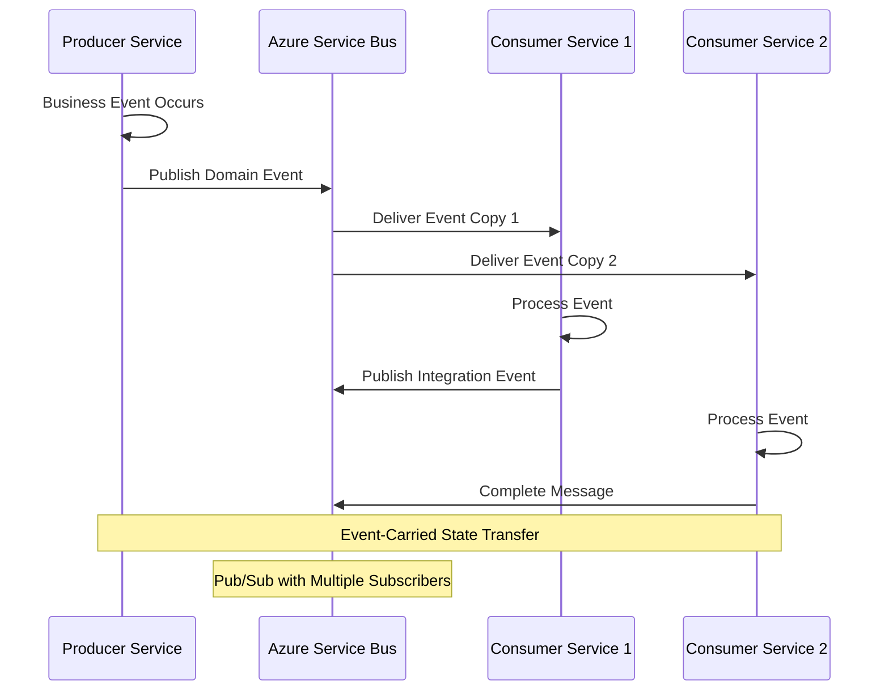
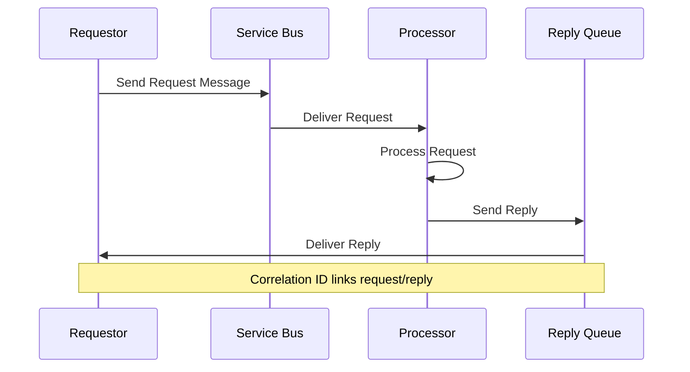

# L1 Async Collaboration Pattern

> Event-driven communication between services using pub/sub, request/reply, and event-carried state transfer.

## Context
Services need to collaborate asynchronously to maintain loose coupling and high availability. This includes domain events for business processes, integration events for cross-domain coordination, and various messaging patterns like pub/sub and request/reply.

## Problem & Forces
- **Loose Coupling**: Services should not be tightly coupled through synchronous calls
- **Eventual Consistency**: Data consistency across services happens eventually
- **Scalability**: Async processing allows better resource utilization
- **Reliability**: Messages must be delivered reliably even when services are down
- **Ordering**: Some business processes require message ordering guarantees

### Trade-offs
- Complexity vs Decoupling: Async messaging adds complexity but improves resilience
- Consistency vs Availability: Eventual consistency vs immediate consistency
- Message Size vs Performance: Event-carried state transfer vs event notification

## Solution Sketch



### Request/Reply Pattern


## Standards/SLOs/Security
- **Message Format**: CloudEvents v1.0 specification for event structure
- **Delivery**: At-least-once delivery with idempotency handling
- **Ordering**: FIFO ordering where business process requires it
- **Retention**: Messages retained for 7 days for replay scenarios
- **Dead Letter**: Failed messages moved to dead letter after 10 retries
- **Security**: Messages encrypted in transit and at rest

## Tech Anchors
- **Azure Service Bus** for reliable messaging (Topics/Subscriptions for pub/sub)
- **NServiceBus** or **MassTransit** for messaging framework
- **CloudEvents** for standardized event format
- **Outbox Pattern** for transactional messaging
- **Correlation IDs** for request/reply tracking

## Code Starter

### Event Definitions
```csharp
// Domain Event (within bounded context)
public record BeneficiaryRegistered
{
    public string BeneficiaryId { get; init; } = string.Empty;
    public string FirstName { get; init; } = string.Empty;
    public string LastName { get; init; } = string.Empty;
    public DateTime DateOfBirth { get; init; }
    public string Country { get; init; } = string.Empty;
    public DateTime RegisteredAt { get; init; } = DateTime.UtcNow;
    public string CorrelationId { get; init; } = string.Empty;
}

// Integration Event (cross-domain)
public record BeneficiaryCreatedIntegrationEvent
{
    public string BeneficiaryId { get; init; } = string.Empty;
    public string FullName { get; init; } = string.Empty;
    public DateTime DateOfBirth { get; init; }
    public string Country { get; init; } = string.Empty;
    public Dictionary<string, object> Metadata { get; init; } = new();
    public DateTime CreatedAt { get; init; } = DateTime.UtcNow;
}

// Request/Reply Messages
public record GetBeneficiaryStatusRequest
{
    public string BeneficiaryId { get; init; } = string.Empty;
    public string RequestId { get; init; } = Guid.NewGuid().ToString();
}

public record GetBeneficiaryStatusResponse
{
    public string BeneficiaryId { get; init; } = string.Empty;
    public string Status { get; init; } = string.Empty;
    public DateTime LastUpdated { get; init; }
    public string RequestId { get; init; } = string.Empty;
}
```

### NServiceBus Configuration
```csharp
// Program.cs for Producer Service
var builder = WebApplication.CreateBuilder(args);

builder.Services.AddNServiceBus("BeneficiaryService", (context, endpointConfiguration) =>
{
    // Configure transport
    var transport = endpointConfiguration.UseTransport<AzureServiceBusTransport>();
    transport.ConnectionString(context.Configuration.GetConnectionString("ServiceBus"));
    
    // Configure routing for pub/sub
    var routing = transport.Routing();
    routing.RouteToEndpoint(typeof(BeneficiaryRegistered), "BeneficiaryService");
    
    // Configure serialization
    endpointConfiguration.UseSerialization<SystemJsonSerializer>();
    
    // Configure outbox for transactional messaging
    var persistence = endpointConfiguration.UsePersistence<SqlPersistence>();
    persistence.ConnectionBuilder(() => new SqlConnection(
        context.Configuration.GetConnectionString("Database")));
    
    endpointConfiguration.EnableOutbox();
    
    // Configure error handling
    endpointConfiguration.Recoverability()
        .Delayed(delayed => delayed.NumberOfRetries(3))
        .Immediate(immediate => immediate.NumberOfRetries(5));
});

var app = builder.Build();
app.Run();
```

### Publishing Events
```csharp
[ApiController]
[Route("api/[controller]")]
public class BeneficiaryController : ControllerBase
{
    private readonly IMessageSession _messageSession;
    private readonly IBeneficiaryRepository _repository;
    private readonly ILogger<BeneficiaryController> _logger;

    public BeneficiaryController(
        IMessageSession messageSession,
        IBeneficiaryRepository repository,
        ILogger<BeneficiaryController> logger)
    {
        _messageSession = messageSession;
        _repository = repository;
        _logger = logger;
    }

    [HttpPost]
    public async Task<IActionResult> RegisterBeneficiary(
        [FromBody] RegisterBeneficiaryRequest request)
    {
        var correlationId = HttpContext.TraceIdentifier;
        
        try
        {
            // Create beneficiary in database
            var beneficiary = new Beneficiary
            {
                Id = Guid.NewGuid().ToString(),
                FirstName = request.FirstName,
                LastName = request.LastName,
                DateOfBirth = request.DateOfBirth,
                Country = request.Country
            };

            await _repository.CreateAsync(beneficiary);

            // Publish domain event
            var domainEvent = new BeneficiaryRegistered
            {
                BeneficiaryId = beneficiary.Id,
                FirstName = beneficiary.FirstName,
                LastName = beneficiary.LastName,
                DateOfBirth = beneficiary.DateOfBirth,
                Country = beneficiary.Country,
                CorrelationId = correlationId
            };

            await _messageSession.Publish(domainEvent);

            // Publish integration event for other domains
            var integrationEvent = new BeneficiaryCreatedIntegrationEvent
            {
                BeneficiaryId = beneficiary.Id,
                FullName = $"{beneficiary.FirstName} {beneficiary.LastName}",
                DateOfBirth = beneficiary.DateOfBirth,
                Country = beneficiary.Country,
                Metadata = new Dictionary<string, object>
                {
                    ["CorrelationId"] = correlationId,
                    ["Source"] = "BeneficiaryService",
                    ["Version"] = "1.0"
                }
            };

            await _messageSession.Publish(integrationEvent);

            _logger.LogInformation("Beneficiary {BeneficiaryId} registered successfully", 
                beneficiary.Id);

            return Ok(new { BeneficiaryId = beneficiary.Id });
        }
        catch (Exception ex)
        {
            _logger.LogError(ex, "Failed to register beneficiary");
            return StatusCode(500, "Failed to register beneficiary");
        }
    }
}
```

### Event Handlers
```csharp
// Domain Event Handler (same bounded context)
public class BeneficiaryRegisteredHandler : IHandleMessages<BeneficiaryRegistered>
{
    private readonly ILogger<BeneficiaryRegisteredHandler> _logger;
    private readonly IEmailService _emailService;

    public BeneficiaryRegisteredHandler(
        ILogger<BeneficiaryRegisteredHandler> logger,
        IEmailService emailService)
    {
        _logger = logger;
        _emailService = emailService;
    }

    public async Task Handle(BeneficiaryRegistered message, IMessageHandlerContext context)
    {
        _logger.LogInformation("Processing beneficiary registration for {BeneficiaryId}", 
            message.BeneficiaryId);

        try
        {
            // Send welcome email
            await _emailService.SendWelcomeEmailAsync(
                message.BeneficiaryId,
                $"{message.FirstName} {message.LastName}");

            // Update internal systems
            await UpdateBeneficiaryStatus(message.BeneficiaryId, "WelcomeEmailSent");

            _logger.LogInformation("Welcome email sent for beneficiary {BeneficiaryId}", 
                message.BeneficiaryId);
        }
        catch (Exception ex)
        {
            _logger.LogError(ex, "Failed to process beneficiary registration for {BeneficiaryId}", 
                message.BeneficiaryId);
            throw; // Let NServiceBus handle retry
        }
    }

    private async Task UpdateBeneficiaryStatus(string beneficiaryId, string status)
    {
        // Implementation to update status
        await Task.Delay(100); // Placeholder
    }
}

// Integration Event Handler (different bounded context)
public class BeneficiaryCreatedIntegrationEventHandler : IHandleMessages<BeneficiaryCreatedIntegrationEvent>
{
    private readonly IMedicalRecordService _medicalRecordService;
    private readonly ILogger<BeneficiaryCreatedIntegrationEventHandler> _logger;

    public async Task Handle(BeneficiaryCreatedIntegrationEvent message, IMessageHandlerContext context)
    {
        _logger.LogInformation("Creating medical record for beneficiary {BeneficiaryId}", 
            message.BeneficiaryId);

        try
        {
            // Create medical record in medical domain
            await _medicalRecordService.CreateMedicalRecordAsync(new CreateMedicalRecordRequest
            {
                BeneficiaryId = message.BeneficiaryId,
                FullName = message.FullName,
                DateOfBirth = message.DateOfBirth,
                Country = message.Country
            });

            _logger.LogInformation("Medical record created for beneficiary {BeneficiaryId}", 
                message.BeneficiaryId);
        }
        catch (Exception ex)
        {
            _logger.LogError(ex, "Failed to create medical record for beneficiary {BeneficiaryId}", 
                message.BeneficiaryId);
            throw;
        }
    }
}
```

### Request/Reply Pattern
```csharp
// Request Handler
public class GetBeneficiaryStatusHandler : IHandleMessages<GetBeneficiaryStatusRequest>
{
    private readonly IBeneficiaryRepository _repository;
    private readonly ILogger<GetBeneficiaryStatusHandler> _logger;

    public async Task Handle(GetBeneficiaryStatusRequest message, IMessageHandlerContext context)
    {
        _logger.LogInformation("Processing status request for beneficiary {BeneficiaryId}", 
            message.BeneficiaryId);

        try
        {
            var beneficiary = await _repository.GetByIdAsync(message.BeneficiaryId);
            
            var response = new GetBeneficiaryStatusResponse
            {
                BeneficiaryId = message.BeneficiaryId,
                Status = beneficiary?.Status ?? "NotFound",
                LastUpdated = beneficiary?.LastUpdated ?? DateTime.UtcNow,
                RequestId = message.RequestId
            };

            await context.Reply(response);
        }
        catch (Exception ex)
        {
            _logger.LogError(ex, "Failed to get beneficiary status for {BeneficiaryId}", 
                message.BeneficiaryId);
            
            var errorResponse = new GetBeneficiaryStatusResponse
            {
                BeneficiaryId = message.BeneficiaryId,
                Status = "Error",
                LastUpdated = DateTime.UtcNow,
                RequestId = message.RequestId
            };

            await context.Reply(errorResponse);
        }
    }
}

// Request Sender Service
public class BeneficiaryStatusService
{
    private readonly IMessageSession _messageSession;
    private readonly ILogger<BeneficiaryStatusService> _logger;

    public async Task<GetBeneficiaryStatusResponse> GetBeneficiaryStatusAsync(string beneficiaryId)
    {
        var request = new GetBeneficiaryStatusRequest
        {
            BeneficiaryId = beneficiaryId
        };

        _logger.LogInformation("Requesting status for beneficiary {BeneficiaryId}", beneficiaryId);

        try
        {
            // Send request and wait for response (with timeout)
            var response = await _messageSession.Request<GetBeneficiaryStatusResponse>(
                request, TimeSpan.FromSeconds(30));

            return response;
        }
        catch (TimeoutException)
        {
            _logger.LogWarning("Timeout waiting for beneficiary status response for {BeneficiaryId}", 
                beneficiaryId);
            throw;
        }
    }
}
```

## Tests

### Event Publishing Tests
```csharp
[TestClass]
public class BeneficiaryEventTests
{
    [TestMethod]
    public async Task RegisterBeneficiary_PublishesDomainEvent()
    {
        // Arrange
        var mockMessageSession = new Mock<IMessageSession>();
        var mockRepository = new Mock<IBeneficiaryRepository>();
        
        var controller = new BeneficiaryController(
            mockMessageSession.Object,
            mockRepository.Object,
            Mock.Of<ILogger<BeneficiaryController>>());

        var request = new RegisterBeneficiaryRequest
        {
            FirstName = "John",
            LastName = "Doe",
            DateOfBirth = new DateTime(1990, 1, 1),
            Country = "US"
        };

        // Act
        await controller.RegisterBeneficiary(request);

        // Assert
        mockMessageSession.Verify(ms => ms.Publish(
            It.Is<BeneficiaryRegistered>(e => 
                e.FirstName == "John" && 
                e.LastName == "Doe"), 
            It.IsAny<PublishOptions>()), 
            Times.Once);
    }
}
```

### Event Handler Tests
```csharp
[TestClass]
public class BeneficiaryRegisteredHandlerTests
{
    [TestMethod]
    public async Task Handle_SendsWelcomeEmail()
    {
        // Arrange
        var mockEmailService = new Mock<IEmailService>();
        var handler = new BeneficiaryRegisteredHandler(
            Mock.Of<ILogger<BeneficiaryRegisteredHandler>>(),
            mockEmailService.Object);

        var message = new BeneficiaryRegistered
        {
            BeneficiaryId = "123",
            FirstName = "John",
            LastName = "Doe"
        };

        // Act
        await handler.Handle(message, Mock.Of<IMessageHandlerContext>());

        // Assert
        mockEmailService.Verify(es => es.SendWelcomeEmailAsync("123", "John Doe"), Times.Once);
    }
}
```

## Pitfalls & Anti-Patterns

### ❌ Anti-Patterns
- **Event Sourcing Everything**: Using events for all data changes instead of appropriate use cases
- **Chatty Events**: Publishing too many fine-grained events
- **Event Chain Hell**: Long chains of events that are hard to debug
- **No Versioning Strategy**: Publishing events without considering schema evolution

### 🚨 Common Pitfalls
- **Missing Idempotency**: Not handling duplicate message processing
- **No Dead Letter Handling**: Not implementing proper error handling for poison messages
- **Tight Event Coupling**: Events containing too much implementation detail
- **No Correlation Tracking**: Unable to trace business processes across services

### 🔧 Solutions
- Always implement idempotent message handlers using message IDs
- Use outbox pattern for transactional messaging
- Keep events focused on business intent, not implementation details
- Implement proper correlation ID propagation and logging

## References
- [NServiceBus Documentation](https://docs.particular.net/nservicebus/)
- [Azure Service Bus Messaging Patterns](https://docs.microsoft.com/en-us/azure/service-bus-messaging/service-bus-messaging-overview)
- [CloudEvents Specification](https://cloudevents.io/)
- [Enterprise Integration Patterns](https://www.enterpriseintegrationpatterns.com/)
- Template: `templates/async-messaging-service/`
- Example: `/samples/async-collaboration/`