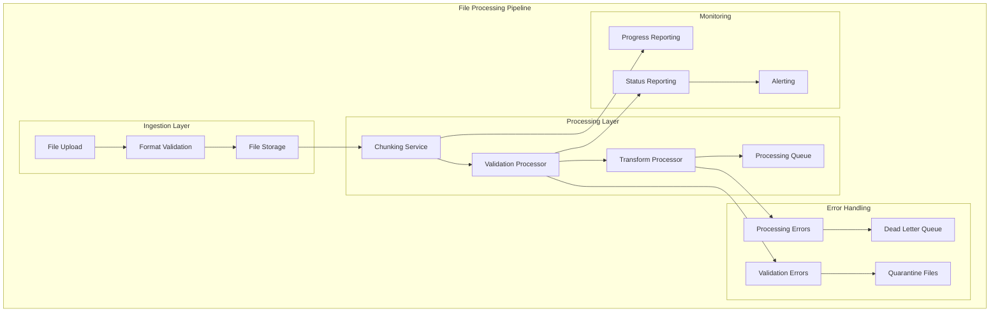

# L1 File & Batch Processing Pattern

> Reliable ingestion pipelines for file processing, validation, chunking, and poison file quarantine.

## Context
Migration platforms frequently need to process large batches of beneficiary data, medical records, and documents from various sources (CSV, Excel, XML). This pattern provides reliable, scalable approaches for file ingestion, validation, chunking for processing, and handling problematic files without blocking the entire pipeline.

## Problem & Forces
- **File Size Variations**: Files range from hundreds to millions of records
- **Data Quality**: Inconsistent formats, missing fields, validation failures
- **Processing Performance**: Need to process large files efficiently without blocking other operations
- **Error Handling**: Individual record failures shouldn't stop entire file processing
- **Monitoring**: Visibility into processing progress and failure rates

### Trade-offs
- Throughput vs Resource Usage: Parallel processing vs memory/CPU consumption
- Error Tolerance vs Data Quality: Continue processing vs strict validation
- Real-time vs Batch: Immediate feedback vs efficient batch processing

## Solution Sketch



## Standards/SLOs/Security

### Processing Standards
- **File Size Limits**: Maximum 100MB per file, 1M records per batch
- **Chunk Size**: Process in chunks of 1000 records for large files
- **Validation**: Schema validation + business rule validation
- **Error Threshold**: Continue processing if error rate < 5%
- **Retry Logic**: 3 attempts with exponential backoff

### SLOs
- **Processing Latency**: 95% of files processed within 10 minutes
- **Error Rate**: < 1% of records fail due to system errors
- **Availability**: File processing service 99.9% uptime
- **Throughput**: Process 10,000 records per minute per instance

### Security
- **File Scanning**: Virus/malware scanning before processing
- **Data Encryption**: Files encrypted at rest and in transit
- **Access Control**: Role-based access to file processing endpoints
- **Audit Logging**: All file operations logged with user context

## Tech Anchors
- **Azure Blob Storage** - File storage and quarantine
- **Azure Service Bus** - Processing queues and dead letter queues
- **Papa Parse / ExcelJS** - CSV and Excel parsing
- **FluentValidation** - Schema and business rule validation
- **Azure Functions** - Serverless file processing
- **SignalR** - Real-time progress notifications

## Code Starter

### File Upload and Validation
```csharp
[ApiController]
[Route("api/[controller]")]
public class FileProcessingController : ControllerBase
{
    private readonly IFileProcessingService _fileProcessingService;
    private readonly ILogger<FileProcessingController> _logger;

    public FileProcessingController(IFileProcessingService fileProcessingService, ILogger<FileProcessingController> logger)
    {
        _fileProcessingService = fileProcessingService;
        _logger = logger;
    }

    [HttpPost("upload")]
    public async Task<IActionResult> UploadFile(IFormFile file, [FromQuery] string fileType = "beneficiary")
    {
        if (file == null || file.Length == 0)
        {
            return BadRequest("No file uploaded");
        }

        // Validate file size and type
        var validationResult = await ValidateFile(file, fileType);
        if (!validationResult.IsValid)
        {
            return BadRequest(validationResult.Errors);
        }

        var processingRequest = new FileProcessingRequest
        {
            FileName = file.FileName,
            FileType = fileType,
            ContentType = file.ContentType,
            FileSizeBytes = file.Length,
            UploadedBy = User.Identity?.Name ?? "Anonymous",
            CorrelationId = Guid.NewGuid().ToString()
        };

        using var stream = file.OpenReadStream();
        var result = await _fileProcessingService.ProcessFileAsync(stream, processingRequest);

        return Accepted(new 
        { 
            ProcessingId = result.ProcessingId,
            EstimatedRecords = result.EstimatedRecords,
            Status = result.Status 
        });
    }

    [HttpGet("status/{processingId}")]
    public async Task<IActionResult> GetProcessingStatus(string processingId)
    {
        var status = await _fileProcessingService.GetProcessingStatusAsync(processingId);
        return Ok(status);
    }

    private async Task<ValidationResult> ValidateFile(IFormFile file, string fileType)
    {
        var result = new ValidationResult();

        // File size validation
        if (file.Length > 100 * 1024 * 1024) // 100MB
        {
            result.AddError("File size exceeds 100MB limit");
        }

        // File type validation
        var allowedTypes = new[] { "text/csv", "application/vnd.ms-excel", "application/vnd.openxmlformats-officedocument.spreadsheetml.sheet" };
        if (!allowedTypes.Contains(file.ContentType))
        {
            result.AddError("File type not supported. Only CSV and Excel files are allowed.");
        }

        // Virus scanning (placeholder)
        // var scanResult = await _virusScanner.ScanAsync(file);
        // if (!scanResult.IsClean) result.AddError("File failed security scan");

        return result;
    }
}
```

### File Processing Service
```csharp
public interface IFileProcessingService
{
    Task<FileProcessingResult> ProcessFileAsync(Stream fileStream, FileProcessingRequest request);
    Task<FileProcessingStatus> GetProcessingStatusAsync(string processingId);
    Task<FileProcessingResult> ReprocessFailedRecordsAsync(string processingId);
}

public class FileProcessingService : IFileProcessingService
{
    private readonly IBlobStorageService _blobStorage;
    private readonly IMessagePublisher _messagePublisher;
    private readonly IFileParsingService _fileParser;
    private readonly IProcessingStatusRepository _statusRepository;
    private readonly ILogger<FileProcessingService> _logger;

    public FileProcessingService(
        IBlobStorageService blobStorage,
        IMessagePublisher messagePublisher,
        IFileParsingService fileParser,
        IProcessingStatusRepository statusRepository,
        ILogger<FileProcessingService> logger)
    {
        _blobStorage = blobStorage;
        _messagePublisher = messagePublisher;
        _fileParser = fileParser;
        _statusRepository = statusRepository;
        _logger = logger;
    }

    public async Task<FileProcessingResult> ProcessFileAsync(Stream fileStream, FileProcessingRequest request)
    {
        var processingId = Guid.NewGuid().ToString();
        _logger.LogInformation("Starting file processing {ProcessingId} for file {FileName}", processingId, request.FileName);

        try
        {
            // Store original file
            var blobPath = await _blobStorage.UploadFileAsync(fileStream, $"uploads/{processingId}/{request.FileName}");

            // Parse file to estimate record count and validate structure
            fileStream.Position = 0;
            var parseResult = await _fileParser.ParseFileAsync(fileStream, request.FileType);

            if (!parseResult.IsValid)
            {
                await _statusRepository.UpdateStatusAsync(processingId, ProcessingStatus.Failed, parseResult.Errors);
                return new FileProcessingResult
                {
                    ProcessingId = processingId,
                    Status = ProcessingStatus.Failed,
                    Errors = parseResult.Errors
                };
            }

            // Create processing status record
            var status = new FileProcessingStatus
            {
                ProcessingId = processingId,
                FileName = request.FileName,
                FileType = request.FileType,
                UploadedBy = request.UploadedBy,
                CorrelationId = request.CorrelationId,
                Status = ProcessingStatus.Parsing,
                TotalRecords = parseResult.RecordCount,
                StartedAt = DateTime.UtcNow,
                BlobPath = blobPath
            };

            await _statusRepository.CreateAsync(status);

            // Publish message to start processing
            var processingCommand = new StartFileProcessingCommand
            {
                ProcessingId = processingId,
                BlobPath = blobPath,
                FileType = request.FileType,
                ChunkSize = DetermineChunkSize(parseResult.RecordCount),
                CorrelationId = request.CorrelationId
            };

            await _messagePublisher.PublishAsync(processingCommand);

            return new FileProcessingResult
            {
                ProcessingId = processingId,
                Status = ProcessingStatus.Queued,
                EstimatedRecords = parseResult.RecordCount
            };
        }
        catch (Exception ex)
        {
            _logger.LogError(ex, "Error processing file {FileName}", request.FileName);
            await _statusRepository.UpdateStatusAsync(processingId, ProcessingStatus.Failed, new[] { ex.Message });
            throw;
        }
    }

    public async Task<FileProcessingStatus> GetProcessingStatusAsync(string processingId)
    {
        return await _statusRepository.GetByIdAsync(processingId);
    }

    private static int DetermineChunkSize(int totalRecords)
    {
        return totalRecords switch
        {
            <= 1000 => totalRecords, // Process all at once
            <= 10000 => 1000,       // 1K chunks
            <= 100000 => 2000,      // 2K chunks
            _ => 5000                // 5K chunks for very large files
        };
    }
}
```

### File Parsing Service
```csharp
public interface IFileParsingService
{
    Task<FileParseResult> ParseFileAsync(Stream fileStream, string fileType);
    Task<IEnumerable<T>> ParseRecordsAsync<T>(Stream fileStream, string fileType) where T : class;
}

public class FileParsingService : IFileParsingService
{
    private readonly ILogger<FileParsingService> _logger;

    public FileParsingService(ILogger<FileParsingService> logger)
    {
        _logger = logger;
    }

    public async Task<FileParseResult> ParseFileAsync(Stream fileStream, string fileType)
    {
        try
        {
            return fileType.ToLower() switch
            {
                "beneficiary" => await ParseBeneficiaryFileAsync(fileStream),
                "medical" => await ParseMedicalFileAsync(fileStream),
                _ => new FileParseResult { IsValid = false, Errors = new[] { "Unsupported file type" } }
            };
        }
        catch (Exception ex)
        {
            _logger.LogError(ex, "Error parsing file of type {FileType}", fileType);
            return new FileParseResult 
            { 
                IsValid = false, 
                Errors = new[] { $"File parsing failed: {ex.Message}" } 
            };
        }
    }

    public async Task<IEnumerable<T>> ParseRecordsAsync<T>(Stream fileStream, string fileType) where T : class
    {
        var records = new List<T>();

        if (typeof(T) == typeof(BeneficiaryImportRecord))
        {
            using var reader = new StreamReader(fileStream);
            using var csv = new CsvReader(reader, CultureInfo.InvariantCulture);
            
            csv.Context.RegisterClassMap<BeneficiaryImportRecordMap>();
            
            await foreach (var record in csv.GetRecordsAsync<T>())
            {
                records.Add(record);
            }
        }

        return records;
    }

    private async Task<FileParseResult> ParseBeneficiaryFileAsync(Stream fileStream)
    {
        using var reader = new StreamReader(fileStream);
        using var csv = new CsvReader(reader, CultureInfo.InvariantCulture);

        var errors = new List<string>();
        var recordCount = 0;

        try
        {
            // Validate headers
            if (!csv.Read() || !csv.ReadHeader())
            {
                errors.Add("File has no header row");
                return new FileParseResult { IsValid = false, Errors = errors };
            }

            var requiredHeaders = new[] { "FirstName", "LastName", "DateOfBirth", "CaseStatus" };
            var missingHeaders = requiredHeaders.Where(h => !csv.HeaderRecord.Contains(h)).ToList();
            
            if (missingHeaders.Any())
            {
                errors.Add($"Missing required headers: {string.Join(", ", missingHeaders)}");
            }

            // Count records and check for basic format issues
            while (await csv.ReadAsync())
            {
                recordCount++;
                
                // Basic validation - check for empty critical fields
                if (string.IsNullOrEmpty(csv.GetField("FirstName")) || 
                    string.IsNullOrEmpty(csv.GetField("LastName")))
                {
                    errors.Add($"Row {recordCount}: Missing required fields");
                }

                // Stop after checking 100 errors to prevent excessive processing
                if (errors.Count > 100)
                {
                    errors.Add("Too many validation errors. Please fix the file and try again.");
                    break;
                }
            }

            return new FileParseResult
            {
                IsValid = errors.Count == 0,
                RecordCount = recordCount,
                Errors = errors
            };
        }
        catch (Exception ex)
        {
            _logger.LogError(ex, "Error parsing beneficiary file");
            return new FileParseResult
            {
                IsValid = false,
                Errors = new[] { $"File format error: {ex.Message}" }
            };
        }
    }

    private async Task<FileParseResult> ParseMedicalFileAsync(Stream fileStream)
    {
        // Similar implementation for medical records
        return new FileParseResult { IsValid = true, RecordCount = 0 };
    }
}
```

### Chunk Processing Handler
```csharp
public class FileChunkProcessingHandler : IHandleMessages<ProcessFileChunkCommand>
{
    private readonly IBlobStorageService _blobStorage;
    private readonly IFileParsingService _fileParser;
    private readonly IValidator<BeneficiaryImportRecord> _validator;
    private readonly IBeneficiaryService _beneficiaryService;
    private readonly IProcessingStatusRepository _statusRepository;
    private readonly IMessagePublisher _messagePublisher;
    private readonly ILogger<FileChunkProcessingHandler> _logger;

    public async Task Handle(ProcessFileChunkCommand message, IMessageHandlerContext context)
    {
        _logger.LogInformation("Processing chunk {ChunkNumber} of {TotalChunks} for processing {ProcessingId}", 
            message.ChunkNumber, message.TotalChunks, message.ProcessingId);

        try
        {
            // Download file chunk from blob storage
            var fileStream = await _blobStorage.DownloadFileAsync(message.BlobPath);
            
            // Parse records for this chunk
            var allRecords = await _fileParser.ParseRecordsAsync<BeneficiaryImportRecord>(fileStream, message.FileType);
            var chunkRecords = allRecords
                .Skip((message.ChunkNumber - 1) * message.ChunkSize)
                .Take(message.ChunkSize)
                .ToList();

            var processedCount = 0;
            var errorCount = 0;
            var errors = new List<ProcessingError>();

            foreach (var record in chunkRecords.Select((r, i) => new { Record = r, Index = i }))
            {
                try
                {
                    // Validate record
                    var validationResult = await _validator.ValidateAsync(record.Record);
                    if (!validationResult.IsValid)
                    {
                        errors.Add(new ProcessingError
                        {
                            RowNumber = (message.ChunkNumber - 1) * message.ChunkSize + record.Index + 2, // +2 for header row and 1-based indexing
                            ErrorType = "Validation",
                            ErrorMessage = string.Join(", ", validationResult.Errors.Select(e => e.ErrorMessage))
                        });
                        errorCount++;
                        continue;
                    }

                    // Process record
                    await _beneficiaryService.CreateFromImportAsync(record.Record, message.CorrelationId);
                    processedCount++;
                }
                catch (Exception ex)
                {
                    _logger.LogError(ex, "Error processing record at row {RowNumber}", record.Index + 2);
                    errors.Add(new ProcessingError
                    {
                        RowNumber = record.Index + 2,
                        ErrorType = "Processing",
                        ErrorMessage = ex.Message
                    });
                    errorCount++;
                }
            }

            // Update chunk status
            await _statusRepository.UpdateChunkStatusAsync(message.ProcessingId, message.ChunkNumber, 
                processedCount, errorCount, errors);

            // Publish chunk completion event
            await context.Publish(new FileChunkProcessedEvent
            {
                ProcessingId = message.ProcessingId,
                ChunkNumber = message.ChunkNumber,
                TotalChunks = message.TotalChunks,
                ProcessedRecords = processedCount,
                ErrorRecords = errorCount,
                CorrelationId = message.CorrelationId
            });

            _logger.LogInformation("Completed chunk {ChunkNumber} for processing {ProcessingId}. Processed: {ProcessedCount}, Errors: {ErrorCount}", 
                message.ChunkNumber, message.ProcessingId, processedCount, errorCount);
        }
        catch (Exception ex)
        {
            _logger.LogError(ex, "Error processing chunk {ChunkNumber} for processing {ProcessingId}", 
                message.ChunkNumber, message.ProcessingId);

            await _statusRepository.UpdateChunkStatusAsync(message.ProcessingId, message.ChunkNumber, 
                0, message.ChunkSize, new[] { new ProcessingError 
                { 
                    RowNumber = 0, 
                    ErrorType = "System", 
                    ErrorMessage = ex.Message 
                }});

            throw; // Re-throw to trigger retry logic
        }
    }
}
```

### Data Models
```csharp
public record FileProcessingRequest
{
    public string FileName { get; init; } = string.Empty;
    public string FileType { get; init; } = string.Empty;
    public string ContentType { get; init; } = string.Empty;
    public long FileSizeBytes { get; init; }
    public string UploadedBy { get; init; } = string.Empty;
    public string CorrelationId { get; init; } = string.Empty;
}

public record FileProcessingResult
{
    public string ProcessingId { get; init; } = string.Empty;
    public ProcessingStatus Status { get; init; }
    public int EstimatedRecords { get; init; }
    public IEnumerable<string> Errors { get; init; } = Array.Empty<string>();
}

public record FileParseResult
{
    public bool IsValid { get; init; }
    public int RecordCount { get; init; }
    public IEnumerable<string> Errors { get; init; } = Array.Empty<string>();
}

public enum ProcessingStatus
{
    Queued,
    Parsing,
    Processing,
    Completed,
    Failed,
    PartiallyCompleted
}

public class BeneficiaryImportRecord
{
    public string FirstName { get; set; } = string.Empty;
    public string LastName { get; set; } = string.Empty;
    public DateTime DateOfBirth { get; set; }
    public string Email { get; set; } = string.Empty;
    public string CaseStatus { get; set; } = string.Empty;
    public string Nationality { get; set; } = string.Empty;
    public string DocumentType { get; set; } = string.Empty;
    public string DocumentNumber { get; set; } = string.Empty;
}

public class BeneficiaryImportRecordMap : ClassMap<BeneficiaryImportRecord>
{
    public BeneficiaryImportRecordMap()
    {
        Map(m => m.FirstName).Name("FirstName", "First Name");
        Map(m => m.LastName).Name("LastName", "Last Name");
        Map(m => m.DateOfBirth).Name("DateOfBirth", "Date of Birth");
        Map(m => m.Email).Name("Email", "Email Address");
        Map(m => m.CaseStatus).Name("CaseStatus", "Case Status");
        Map(m => m.Nationality).Name("Nationality");
        Map(m => m.DocumentType).Name("DocumentType", "Document Type");
        Map(m => m.DocumentNumber).Name("DocumentNumber", "Document Number");
    }
}

// Commands and Events
public record StartFileProcessingCommand
{
    public string ProcessingId { get; init; } = string.Empty;
    public string BlobPath { get; init; } = string.Empty;
    public string FileType { get; init; } = string.Empty;
    public int ChunkSize { get; init; }
    public string CorrelationId { get; init; } = string.Empty;
}

public record ProcessFileChunkCommand
{
    public string ProcessingId { get; init; } = string.Empty;
    public string BlobPath { get; init; } = string.Empty;
    public string FileType { get; init; } = string.Empty;
    public int ChunkNumber { get; init; }
    public int TotalChunks { get; init; }
    public int ChunkSize { get; init; }
    public string CorrelationId { get; init; } = string.Empty;
}

public record FileChunkProcessedEvent
{
    public string ProcessingId { get; init; } = string.Empty;
    public int ChunkNumber { get; init; }
    public int TotalChunks { get; init; }
    public int ProcessedRecords { get; init; }
    public int ErrorRecords { get; init; }
    public string CorrelationId { get; init; } = string.Empty;
}
```

### Validation
```csharp
public class BeneficiaryImportRecordValidator : AbstractValidator<BeneficiaryImportRecord>
{
    public BeneficiaryImportRecordValidator()
    {
        RuleFor(x => x.FirstName)
            .NotEmpty().WithMessage("First name is required")
            .MaximumLength(32).WithMessage("First name cannot exceed 32 characters");

        RuleFor(x => x.LastName)
            .NotEmpty().WithMessage("Last name is required")
            .MaximumLength(32).WithMessage("Last name cannot exceed 32 characters");

        RuleFor(x => x.DateOfBirth)
            .NotEmpty().WithMessage("Date of birth is required")
            .LessThan(DateTime.Today).WithMessage("Date of birth must be in the past");

        RuleFor(x => x.Email)
            .EmailAddress().When(x => !string.IsNullOrEmpty(x.Email))
            .WithMessage("Invalid email format");

        RuleFor(x => x.CaseStatus)
            .NotEmpty().WithMessage("Case status is required")
            .Must(BeValidCaseStatus).WithMessage("Invalid case status");

        RuleFor(x => x.DocumentType)
            .NotEmpty().WithMessage("Document type is required")
            .Must(BeValidDocumentType).WithMessage("Invalid document type");

        RuleFor(x => x.DocumentNumber)
            .NotEmpty().WithMessage("Document number is required")
            .MaximumLength(50).WithMessage("Document number cannot exceed 50 characters");
    }

    private static bool BeValidCaseStatus(string status)
    {
        var validStatuses = new[] { "PENDING", "ACTIVE", "COMPLETED", "SUSPENDED" };
        return validStatuses.Contains(status?.ToUpper());
    }

    private static bool BeValidDocumentType(string documentType)
    {
        var validTypes = new[] { "PASSPORT", "ID_CARD", "BIRTH_CERTIFICATE", "REFUGEE_CARD" };
        return validTypes.Contains(documentType?.ToUpper());
    }
}
```

## Tests

### File Processing Tests
```csharp
[TestClass]
public class FileProcessingServiceTests
{
    [TestMethod]
    public async Task ProcessFileAsync_ValidCsvFile_ReturnsSuccess()
    {
        // Arrange
        var csvContent = "FirstName,LastName,DateOfBirth,CaseStatus\nJohn,Doe,1990-01-01,ACTIVE";
        var stream = new MemoryStream(Encoding.UTF8.GetBytes(csvContent));
        
        var request = new FileProcessingRequest
        {
            FileName = "test.csv",
            FileType = "beneficiary",
            ContentType = "text/csv",
            FileSizeBytes = stream.Length,
            UploadedBy = "test-user"
        };

        // Mock dependencies
        var blobStorage = new Mock<IBlobStorageService>();
        var messagePublisher = new Mock<IMessagePublisher>();
        var fileParser = new Mock<IFileParsingService>();
        var statusRepository = new Mock<IProcessingStatusRepository>();
        var logger = Mock.Of<ILogger<FileProcessingService>>();

        fileParser.Setup(x => x.ParseFileAsync(It.IsAny<Stream>(), "beneficiary"))
                 .ReturnsAsync(new FileParseResult { IsValid = true, RecordCount = 1 });

        var service = new FileProcessingService(blobStorage.Object, messagePublisher.Object, 
            fileParser.Object, statusRepository.Object, logger);

        // Act
        var result = await service.ProcessFileAsync(stream, request);

        // Assert
        Assert.AreEqual(ProcessingStatus.Queued, result.Status);
        Assert.AreEqual(1, result.EstimatedRecords);
    }
}
```

## Pitfalls & Anti-Patterns

### ❌ Anti-Patterns
- **Processing Everything in Memory**: Loading entire large files into memory
- **No Error Isolation**: Single record failure stops entire file processing
- **Synchronous Processing**: Blocking upload endpoint while processing large files
- **No Progress Tracking**: Users have no visibility into processing status

### 🚨 Common Pitfalls
- **Missing Validation**: Not validating file structure before processing
- **Poor Error Reporting**: Generic error messages without specific row/field information
- **Resource Exhaustion**: Not limiting concurrent file processing
- **Lost Files**: No mechanism to recover from processing failures

### 🔧 Solutions
- Use streaming and chunking for large file processing
- Implement comprehensive validation with detailed error reporting
- Use async processing with status tracking and progress notifications
- Implement file quarantine and reprocessing capabilities

## References
- [Azure Blob Storage](https://docs.microsoft.com/en-us/azure/storage/blobs/)
- [CsvHelper Documentation](https://joshclose.github.io/CsvHelper/)
- [FluentValidation](https://docs.fluentvalidation.net/)
- [Stream Processing Patterns](https://docs.microsoft.com/en-us/azure/architecture/patterns/)
- Template: `templates/file-batch/`
- Example: `/samples/file-batch/`