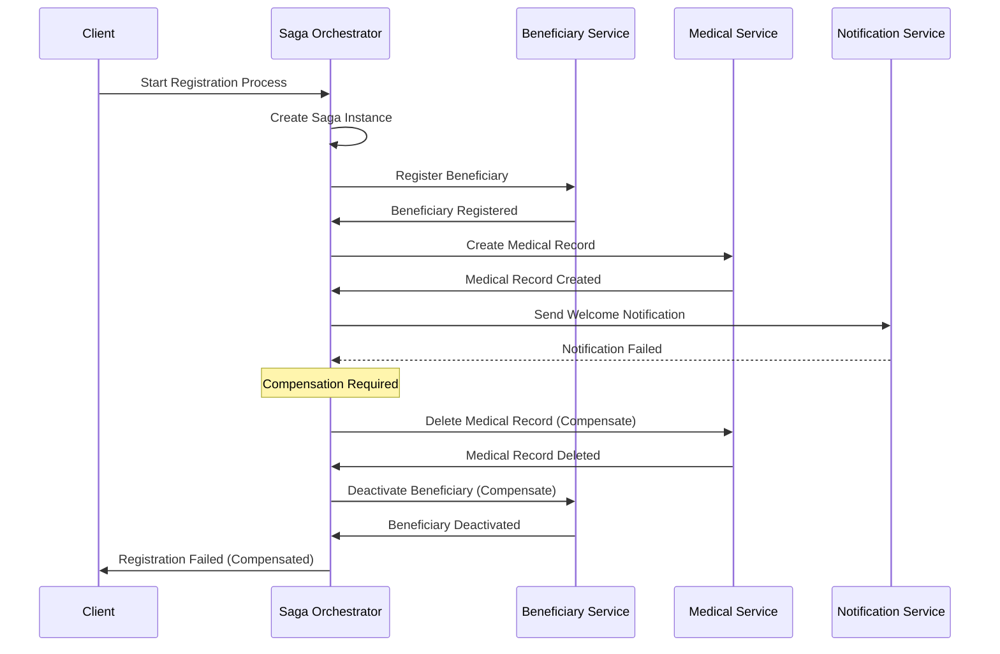

# L1 Saga Orchestration Pattern

> Coordinated workflow management for distributed transactions and long-running business processes.

## Context
Complex business processes span multiple services and require coordination, compensation, and state management. When a process involves multiple steps across different services, you need a way to ensure consistency and handle failures gracefully.

## Problem & Forces
- **Distributed Transactions**: ACID transactions don't work across service boundaries
- **Consistency**: Need eventual consistency with compensation for failures
- **Long-Running Processes**: Business processes can take hours, days, or weeks
- **Partial Failures**: Some steps succeed while others fail, requiring compensation
- **Visibility**: Need to track progress and handle timeouts

### Trade-offs
- Complexity vs Consistency: Orchestration adds complexity but provides better control
- Performance vs Reliability: Additional coordination overhead vs guaranteed completion
- Choreography vs Orchestration: Event-driven flows vs centralized control

## Solution Sketch



## Standards/SLOs/Security
- **State Management**: Saga state persisted for recovery after failures
- **Idempotency**: All operations must be idempotent using correlation IDs
- **Timeouts**: Each step has configurable timeout (default 30 minutes)
- **Compensation**: All operations have corresponding compensation actions
- **Monitoring**: Saga progress tracked with business metrics
- **Security**: Saga state may contain sensitive data requiring encryption

## Tech Anchors
- **NServiceBus Sagas** for orchestration framework
- **Azure Service Bus** for reliable messaging
- **SQL Server/CosmosDB** for saga state persistence  
- **Polly** for retry policies and timeouts
- **Azure Durable Functions** (alternative implementation)

## Code Starter

### Saga Definition
```csharp
public class BeneficiaryRegistrationSaga : 
    Saga<BeneficiaryRegistrationSagaData>,
    IAmStartedByMessages<StartBeneficiaryRegistration>,
    IHandleMessages<BeneficiaryRegistered>,
    IHandleMessages<MedicalRecordCreated>, 
    IHandleMessages<MedicalRecordCreationFailed>,
    IHandleMessages<NotificationSent>,
    IHandleMessages<NotificationFailed>,
    IHandleTimeouts<RegistrationTimeout>
{
    private readonly ILogger<BeneficiaryRegistrationSaga> _logger;

    public BeneficiaryRegistrationSaga(ILogger<BeneficiaryRegistrationSaga> logger)
    {
        _logger = logger;
    }

    protected override void ConfigureHowToFindSaga(SagaPropertyMapper<BeneficiaryRegistrationSagaData> mapper)
    {
        mapper.ConfigureMapping<StartBeneficiaryRegistration>(msg => msg.CorrelationId)
              .ToSaga(data => data.CorrelationId);
        mapper.ConfigureMapping<BeneficiaryRegistered>(msg => msg.CorrelationId)
              .ToSaga(data => data.CorrelationId);
        mapper.ConfigureMapping<MedicalRecordCreated>(msg => msg.CorrelationId)
              .ToSaga(data => data.CorrelationId);
        mapper.ConfigureMapping<MedicalRecordCreationFailed>(msg => msg.CorrelationId)
              .ToSaga(data => data.CorrelationId);
        mapper.ConfigureMapping<NotificationSent>(msg => msg.CorrelationId)
              .ToSaga(data => data.CorrelationId);
        mapper.ConfigureMapping<NotificationFailed>(msg => msg.CorrelationId)
              .ToSaga(data => data.CorrelationId);
    }

    public async Task Handle(StartBeneficiaryRegistration message, IMessageHandlerContext context)
    {
        _logger.LogInformation("Starting beneficiary registration saga for {CorrelationId}", 
            message.CorrelationId);

        Data.CorrelationId = message.CorrelationId;
        Data.BeneficiaryInfo = message.BeneficiaryInfo;
        Data.StartedAt = DateTime.UtcNow;
        Data.State = RegistrationState.Started;

        // Set overall timeout
        await RequestTimeout<RegistrationTimeout>(context, TimeSpan.FromHours(1));

        // Start the process by registering beneficiary
        var registerCommand = new RegisterBeneficiary
        {
            CorrelationId = message.CorrelationId,
            BeneficiaryInfo = message.BeneficiaryInfo
        };

        await context.Send(registerCommand);
        Data.State = RegistrationState.RegisteringBeneficiary;
    }

    public async Task Handle(BeneficiaryRegistered message, IMessageHandlerContext context)
    {
        _logger.LogInformation("Beneficiary registered for saga {CorrelationId}, BeneficiaryId: {BeneficiaryId}", 
            Data.CorrelationId, message.BeneficiaryId);

        Data.BeneficiaryId = message.BeneficiaryId;
        Data.State = RegistrationState.BeneficiaryRegistered;

        // Next step: Create medical record
        var createMedicalRecordCommand = new CreateMedicalRecord
        {
            CorrelationId = Data.CorrelationId,
            BeneficiaryId = Data.BeneficiaryId,
            BeneficiaryInfo = Data.BeneficiaryInfo
        };

        await context.Send(createMedicalRecordCommand);
        Data.State = RegistrationState.CreatingMedicalRecord;
    }

    public async Task Handle(MedicalRecordCreated message, IMessageHandlerContext context)
    {
        _logger.LogInformation("Medical record created for saga {CorrelationId}", Data.CorrelationId);

        Data.MedicalRecordId = message.MedicalRecordId;
        Data.State = RegistrationState.MedicalRecordCreated;

        // Final step: Send notification
        var sendNotificationCommand = new SendWelcomeNotification
        {
            CorrelationId = Data.CorrelationId,
            BeneficiaryId = Data.BeneficiaryId,
            EmailAddress = Data.BeneficiaryInfo.Email
        };

        await context.Send(sendNotificationCommand);
        Data.State = RegistrationState.SendingNotification;
    }

    public async Task Handle(NotificationSent message, IMessageHandlerContext context)
    {
        _logger.LogInformation("Registration completed successfully for saga {CorrelationId}", 
            Data.CorrelationId);

        Data.State = RegistrationState.Completed;
        Data.CompletedAt = DateTime.UtcNow;

        // Publish completion event
        await context.Publish(new BeneficiaryRegistrationCompleted
        {
            CorrelationId = Data.CorrelationId,
            BeneficiaryId = Data.BeneficiaryId,
            CompletedAt = Data.CompletedAt.Value
        });

        MarkAsComplete();
    }

    public async Task Handle(MedicalRecordCreationFailed message, IMessageHandlerContext context)
    {
        _logger.LogWarning("Medical record creation failed for saga {CorrelationId}, starting compensation", 
            Data.CorrelationId);

        await StartCompensation(context, "Medical record creation failed");
    }

    public async Task Handle(NotificationFailed message, IMessageHandlerContext context)
    {
        _logger.LogWarning("Notification failed for saga {CorrelationId}, starting compensation", 
            Data.CorrelationId);

        await StartCompensation(context, "Notification failed");
    }

    public async Task Timeout(RegistrationTimeout state, IMessageHandlerContext context)
    {
        _logger.LogError("Registration timeout for saga {CorrelationId}", Data.CorrelationId);
        await StartCompensation(context, "Process timeout");
    }

    private async Task StartCompensation(IMessageHandlerContext context, string reason)
    {
        Data.State = RegistrationState.Compensating;
        Data.CompensationReason = reason;

        // Compensate in reverse order
        if (!string.IsNullOrEmpty(Data.MedicalRecordId))
        {
            var deleteMedicalRecordCommand = new DeleteMedicalRecord
            {
                CorrelationId = Data.CorrelationId,
                MedicalRecordId = Data.MedicalRecordId
            };
            await context.Send(deleteMedicalRecordCommand);
        }

        if (!string.IsNullOrEmpty(Data.BeneficiaryId))
        {
            var deactivateBeneficiaryCommand = new DeactivateBeneficiary
            {
                CorrelationId = Data.CorrelationId,
                BeneficiaryId = Data.BeneficiaryId
            };
            await context.Send(deactivateBeneficiaryCommand);
        }

        Data.State = RegistrationState.Compensated;
        
        await context.Publish(new BeneficiaryRegistrationFailed
        {
            CorrelationId = Data.CorrelationId,
            Reason = reason,
            FailedAt = DateTime.UtcNow
        });

        MarkAsComplete();
    }
}
```

### Saga Data
```csharp
public class BeneficiaryRegistrationSagaData : ContainSagaData
{
    public string CorrelationId { get; set; } = string.Empty;
    public string? BeneficiaryId { get; set; }
    public string? MedicalRecordId { get; set; }
    public BeneficiaryInfo BeneficiaryInfo { get; set; } = new();
    public RegistrationState State { get; set; }
    public DateTime StartedAt { get; set; }
    public DateTime? CompletedAt { get; set; }
    public string? CompensationReason { get; set; }
}

public enum RegistrationState
{
    Started,
    RegisteringBeneficiary,
    BeneficiaryRegistered,
    CreatingMedicalRecord,
    MedicalRecordCreated,
    SendingNotification,
    Completed,
    Compensating,
    Compensated
}

public record BeneficiaryInfo
{
    public string FirstName { get; init; } = string.Empty;
    public string LastName { get; init; } = string.Empty;
    public DateTime DateOfBirth { get; init; }
    public string Email { get; init; } = string.Empty;
    public string Country { get; init; } = string.Empty;
}
```

### Messages and Commands
```csharp
// Saga Trigger
public record StartBeneficiaryRegistration
{
    public string CorrelationId { get; init; } = string.Empty;
    public BeneficiaryInfo BeneficiaryInfo { get; init; } = new();
}

// Commands
public record RegisterBeneficiary
{
    public string CorrelationId { get; init; } = string.Empty;
    public BeneficiaryInfo BeneficiaryInfo { get; init; } = new();
}

public record CreateMedicalRecord
{
    public string CorrelationId { get; init; } = string.Empty;
    public string BeneficiaryId { get; init; } = string.Empty;
    public BeneficiaryInfo BeneficiaryInfo { get; init; } = new();
}

public record SendWelcomeNotification
{
    public string CorrelationId { get; init; } = string.Empty;
    public string BeneficiaryId { get; init; } = string.Empty;
    public string EmailAddress { get; init; } = string.Empty;
}

// Compensation Commands
public record DeactivateBeneficiary
{
    public string CorrelationId { get; init; } = string.Empty;
    public string BeneficiaryId { get; init; } = string.Empty;
}

public record DeleteMedicalRecord
{
    public string CorrelationId { get; init; } = string.Empty;
    public string MedicalRecordId { get; init; } = string.Empty;
}

// Events
public record BeneficiaryRegistered
{
    public string CorrelationId { get; init; } = string.Empty;
    public string BeneficiaryId { get; init; } = string.Empty;
}

public record MedicalRecordCreated
{
    public string CorrelationId { get; init; } = string.Empty;
    public string MedicalRecordId { get; init; } = string.Empty;
}

public record NotificationSent
{
    public string CorrelationId { get; init; } = string.Empty;
}

// Failure Events
public record MedicalRecordCreationFailed
{
    public string CorrelationId { get; init; } = string.Empty;
    public string Reason { get; init; } = string.Empty;
}

public record NotificationFailed
{
    public string CorrelationId { get; init; } = string.Empty;
    public string Reason { get; init; } = string.Empty;
}

// Completion Events
public record BeneficiaryRegistrationCompleted
{
    public string CorrelationId { get; init; } = string.Empty;
    public string BeneficiaryId { get; init; } = string.Empty;
    public DateTime CompletedAt { get; init; }
}

public record BeneficiaryRegistrationFailed
{
    public string CorrelationId { get; init; } = string.Empty;
    public string Reason { get; init; } = string.Empty;
    public DateTime FailedAt { get; init; }
}

// Timeout
public class RegistrationTimeout
{
}
```

### Service Implementation
```csharp
[ApiController]
[Route("api/[controller]")]
public class RegistrationController : ControllerBase
{
    private readonly IMessageSession _messageSession;
    private readonly ILogger<RegistrationController> _logger;

    public RegistrationController(
        IMessageSession messageSession,
        ILogger<RegistrationController> logger)
    {
        _messageSession = messageSession;
        _logger = logger;
    }

    [HttpPost("start")]
    public async Task<IActionResult> StartRegistration([FromBody] StartRegistrationRequest request)
    {
        var correlationId = Guid.NewGuid().ToString();
        
        _logger.LogInformation("Starting registration process with correlation {CorrelationId}", 
            correlationId);

        var command = new StartBeneficiaryRegistration
        {
            CorrelationId = correlationId,
            BeneficiaryInfo = new BeneficiaryInfo
            {
                FirstName = request.FirstName,
                LastName = request.LastName,
                DateOfBirth = request.DateOfBirth,
                Email = request.Email,
                Country = request.Country
            }
        };

        await _messageSession.SendLocal(command);

        return Accepted(new { CorrelationId = correlationId });
    }

    [HttpGet("status/{correlationId}")]
    public async Task<IActionResult> GetStatus(string correlationId)
    {
        // Implementation would query saga state
        // This is a simplified version
        return Ok(new { Status = "Processing", CorrelationId = correlationId });
    }
}
```

### Command Handlers
```csharp
// Beneficiary Service Handler
public class RegisterBeneficiaryHandler : IHandleMessages<RegisterBeneficiary>
{
    private readonly IBeneficiaryRepository _repository;
    private readonly ILogger<RegisterBeneficiaryHandler> _logger;

    public async Task Handle(RegisterBeneficiary message, IMessageHandlerContext context)
    {
        _logger.LogInformation("Processing beneficiary registration for correlation {CorrelationId}", 
            message.CorrelationId);

        try
        {
            var beneficiary = new Beneficiary
            {
                Id = Guid.NewGuid().ToString(),
                FirstName = message.BeneficiaryInfo.FirstName,
                LastName = message.BeneficiaryInfo.LastName,
                DateOfBirth = message.BeneficiaryInfo.DateOfBirth,
                Email = message.BeneficiaryInfo.Email,
                Country = message.BeneficiaryInfo.Country,
                Status = "Active"
            };

            await _repository.CreateAsync(beneficiary);

            await context.Publish(new BeneficiaryRegistered
            {
                CorrelationId = message.CorrelationId,
                BeneficiaryId = beneficiary.Id
            });
        }
        catch (Exception ex)
        {
            _logger.LogError(ex, "Failed to register beneficiary for correlation {CorrelationId}", 
                message.CorrelationId);
            throw;
        }
    }
}

// Medical Service Handler  
public class CreateMedicalRecordHandler : IHandleMessages<CreateMedicalRecord>
{
    private readonly IMedicalRecordRepository _repository;
    private readonly ILogger<CreateMedicalRecordHandler> _logger;

    public async Task Handle(CreateMedicalRecord message, IMessageHandlerContext context)
    {
        _logger.LogInformation("Creating medical record for beneficiary {BeneficiaryId}", 
            message.BeneficiaryId);

        try
        {
            var medicalRecord = new MedicalRecord
            {
                Id = Guid.NewGuid().ToString(),
                BeneficiaryId = message.BeneficiaryId,
                CreatedAt = DateTime.UtcNow
            };

            await _repository.CreateAsync(medicalRecord);

            await context.Publish(new MedicalRecordCreated
            {
                CorrelationId = message.CorrelationId,
                MedicalRecordId = medicalRecord.Id
            });
        }
        catch (Exception ex)
        {
            _logger.LogError(ex, "Failed to create medical record for correlation {CorrelationId}", 
                message.CorrelationId);

            await context.Publish(new MedicalRecordCreationFailed
            {
                CorrelationId = message.CorrelationId,
                Reason = ex.Message
            });
        }
    }
}
```

## Tests

### Saga Tests
```csharp
[TestClass]
public class BeneficiaryRegistrationSagaTests
{
    private TestableMessageHandlerContext _context;
    private BeneficiaryRegistrationSaga _saga;

    [TestInitialize]
    public void Setup()
    {
        _context = new TestableMessageHandlerContext();
        _saga = new BeneficiaryRegistrationSaga(Mock.Of<ILogger<BeneficiaryRegistrationSaga>>());
    }

    [TestMethod]
    public async Task Handle_StartBeneficiaryRegistration_SendsRegisterBeneficiaryCommand()
    {
        // Arrange
        var message = new StartBeneficiaryRegistration
        {
            CorrelationId = "test-correlation-id",
            BeneficiaryInfo = new BeneficiaryInfo
            {
                FirstName = "John",
                LastName = "Doe"
            }
        };

        // Act
        await _saga.Handle(message, _context);

        // Assert
        Assert.AreEqual(RegistrationState.RegisteringBeneficiary, _saga.Data.State);
        Assert.IsTrue(_context.SentMessages.Any(m => m.Message is RegisterBeneficiary));
    }

    [TestMethod]
    public async Task Handle_BeneficiaryRegistered_SendsCreateMedicalRecordCommand()
    {
        // Arrange
        _saga.Data.CorrelationId = "test-correlation-id";
        _saga.Data.State = RegistrationState.RegisteringBeneficiary;

        var message = new BeneficiaryRegistered
        {
            CorrelationId = "test-correlation-id",
            BeneficiaryId = "beneficiary-123"
        };

        // Act
        await _saga.Handle(message, _context);

        // Assert
        Assert.AreEqual(RegistrationState.CreatingMedicalRecord, _saga.Data.State);
        Assert.AreEqual("beneficiary-123", _saga.Data.BeneficiaryId);
        Assert.IsTrue(_context.SentMessages.Any(m => m.Message is CreateMedicalRecord));
    }
}
```

### Integration Tests
```csharp
[TestClass]
public class SagaIntegrationTests
{
    [TestMethod]
    public async Task FullRegistrationProcess_CompletesSuccessfully()
    {
        // This would be a full end-to-end test with test harness
        // Testing the complete saga flow with all services
        Assert.Inconclusive("Integration test implementation");
    }
}
```

## Pitfalls & Anti-Patterns

### ❌ Anti-Patterns
- **God Saga**: Single saga handling too many different business processes
- **Synchronous Saga**: Making synchronous calls from saga handlers
- **No Compensation**: Not implementing compensation for every operation
- **Shared Saga Data**: Multiple sagas sharing the same data store

### 🚨 Common Pitfalls
- **Lost Messages**: Not handling message failures and retries properly  
- **Saga Timeouts**: Not setting appropriate timeouts for long-running processes
- **State Corruption**: Not handling concurrent updates to saga state
- **No Monitoring**: Unable to track saga progress and identify stuck instances

### 🔧 Solutions
- Keep sagas focused on single business processes
- Always implement idempotent operations and compensation
- Use proper timeout strategies and monitoring
- Implement saga correlation properly to avoid state corruption

## References
- [NServiceBus Sagas](https://docs.particular.net/nservicebus/sagas/)
- [Saga Pattern](https://microservices.io/patterns/data/saga.html)
- [Azure Durable Functions](https://docs.microsoft.com/en-us/azure/azure-functions/durable/)
- [Enterprise Integration Patterns - Process Manager](https://www.enterpriseintegrationpatterns.com/ProcessManager.html)
- Template: `templates/saga-orchestration/`
- Example: `/samples/saga-orchestration/`