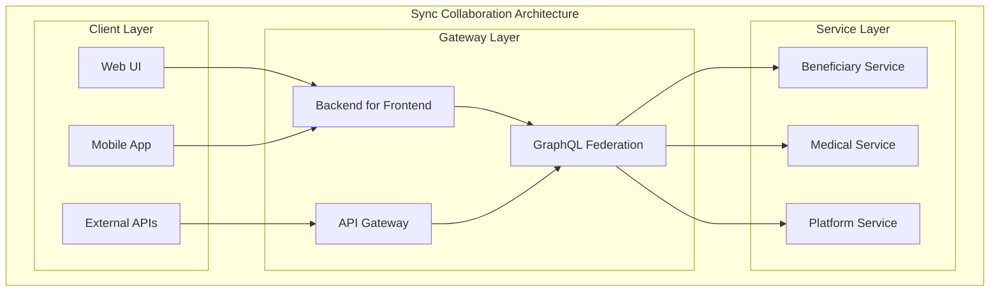

# L1 Sync Collaboration Pattern

> Backend-for-Frontend (BFF), API Gateway, GraphQL federation, and composite UI patterns for synchronous service collaboration.

## Context
When services need to collaborate synchronously to serve user interfaces or external clients, this pattern provides approaches for API composition, request routing, and maintaining service boundaries while delivering cohesive user experiences.

## Problem & Forces
- **UI Composition**: Multiple services serving a single user interface
- **API Gateway vs BFF**: Centralized routing vs client-specific backends
- **Service Coordination**: Orchestrating multiple service calls efficiently
- **Cross-Service Authentication**: Consistent security across service boundaries
- **Performance**: Minimizing latency in multi-service requests

### Trade-offs
- Centralization vs Distribution: Single gateway vs multiple BFFs
- Coupling vs Performance: Service independence vs optimized data fetching
- Complexity vs Simplicity: Advanced patterns vs direct service calls

## Solution Sketch

## Tech Anchors
- **Azure API Management** - Enterprise API gateway
- **GraphQL** - Query language for APIs
- **Ocelot** - .NET API gateway
- **YARP** - Reverse proxy framework

## Key Components
- **Backend for Frontend**: Client-specific API aggregation
- **API Gateway**: Centralized routing and cross-cutting concerns
- **Service Composition**: Patterns for combining multiple service responses
- **Micro-frontend Integration**: Client-side service composition

*[Full implementation details coming soon]*

## References
- [Backend for Frontend Pattern](https://docs.microsoft.com/en-us/azure/architecture/patterns/backends-for-frontends)
- [API Gateway Pattern](https://microservices.io/patterns/apigateway.html)
- Template: `templates/sync-collaboration/`