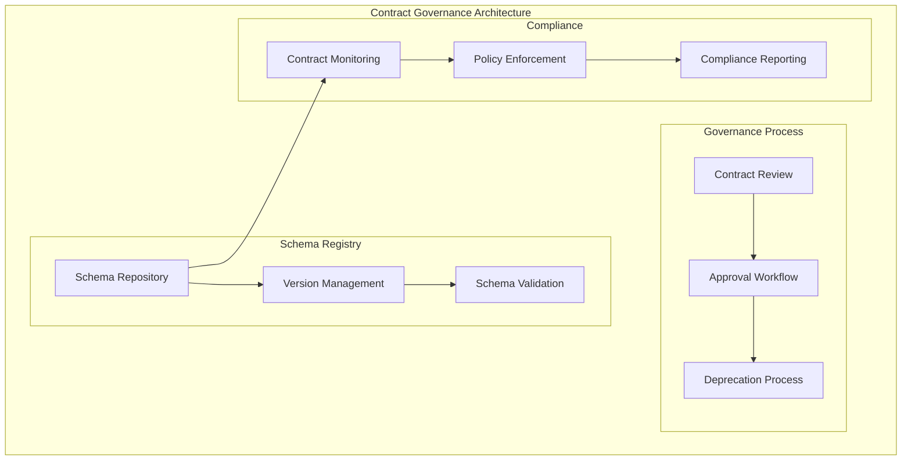

# L2 Contract Governance Pattern

> Schema evolution, deprecation workflows, and breaking change management across the enterprise platform.

## Context
As the platform grows, managing API contracts and message schemas across multiple domains becomes critical for maintaining system stability and enabling safe evolution. This pattern provides governance mechanisms for schema changes, deprecation processes, and ensuring contract compliance.

## Problem & Forces
- **Schema Evolution**: Supporting changes without breaking existing consumers
- **Deprecation Management**: Safely removing old contract versions
- **Breaking Change Control**: Managing necessary breaking changes across domains
- **Contract Discovery**: Finding and understanding available contracts
- **Compliance Monitoring**: Ensuring adherence to contract standards

### Trade-offs
- Governance Overhead vs Development Speed: Control processes vs team autonomy
- Backward Compatibility vs Technical Debt: Supporting old versions vs system simplicity
- Centralized vs Distributed: Central schema registry vs domain ownership

## Solution Sketch

## Tech Anchors
- **Azure API Management** - API lifecycle management
- **GitHub** - Schema version control and review
- **OpenAPI Tools** - Contract validation and generation
- **Azure Policy** - Governance rule enforcement

## Key Components
- **Schema Registry**: Centralized contract repository with versioning
- **Review Process**: Automated and manual contract review workflows
- **Breaking Change Detection**: Tools to identify backward compatibility issues
- **Consumer Impact Analysis**: Understanding the blast radius of changes

*[Full implementation details coming soon]*

## References
- [API Lifecycle Management](https://docs.microsoft.com/en-us/azure/api-management/)
- [Schema Registry Patterns](https://www.confluent.io/blog/schema-registry-patterns-and-use-cases/)
- Template: `templates/contract-governance/`