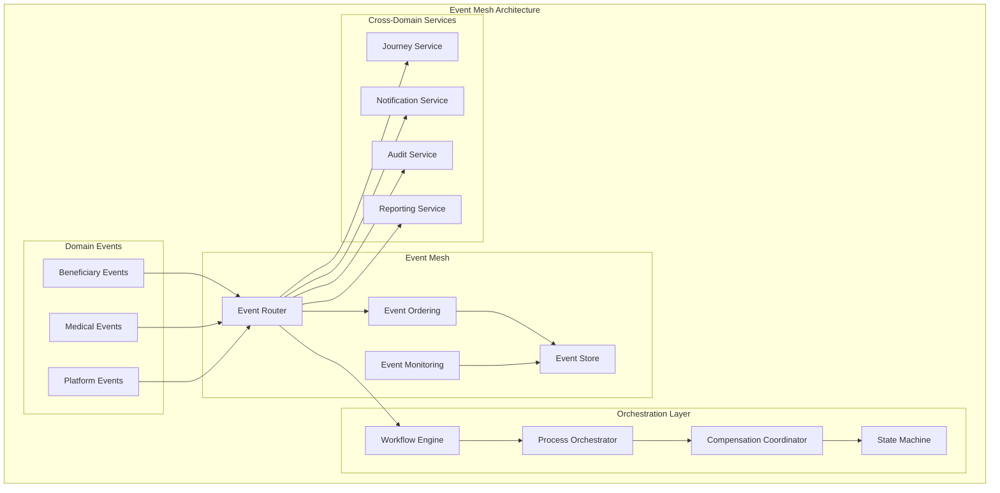

# L2 Orchestration & Event Mesh Pattern

> Enterprise-level patterns for cross-domain journeys, event routing, and distributed workflow coordination.

## Context
At the platform level, multiple domains (Beneficiary, Medical, Platform) need to coordinate complex business processes that span service boundaries. This pattern provides enterprise orchestration capabilities for multi-domain workflows, event routing across bounded contexts, and maintaining event ordering and consistency.

## Problem & Forces
- **Cross-Domain Workflows**: Business processes that span multiple bounded contexts
- **Event Ordering**: Maintaining causal ordering of events across domains
- **Routing Complexity**: Dynamic routing based on business rules and context
- **Workflow Visibility**: Understanding complex multi-domain process states
- **Failure Recovery**: Compensating actions across multiple domains

### Trade-offs
- Centralized vs Decentralized: Central orchestration vs choreographed collaboration
- Consistency vs Performance: Strong consistency vs eventual consistency
- Coupling vs Autonomy: Orchestration coupling vs domain autonomy

## Solution Sketch



## Standards/SLOs/Security

### Event Standards
- **Event Schema**: CloudEvents format with domain-specific extensions
- **Routing Rules**: Declarative routing configuration
- **Ordering**: Causal ordering within aggregate boundaries
- **Durability**: All events persisted with replay capability
- **Versioning**: Backward-compatible event schema evolution

### SLOs
- **Event Delivery**: 99.95% of events delivered within 5 seconds
- **Orchestration Latency**: 95% of workflows complete steps within 30 seconds
- **Cross-Domain Consistency**: 99.9% eventual consistency within 10 minutes
- **Workflow Visibility**: Real-time status available for all active workflows

### Security
- **Event Authorization**: RBAC for event publishing and subscription
- **Data Classification**: Sensitive events encrypted with domain keys
- **Audit Trail**: Complete event lineage for compliance
- **Cross-Domain Access**: Service mesh authorization between domains

## Tech Anchors
- **Azure Service Bus** - Enterprise messaging backbone
- **Azure Event Grid** - Event routing and filtering
- **Azure Logic Apps** - Visual workflow orchestration
- **Azure Durable Functions** - Code-based orchestration
- **NServiceBus** - Saga orchestration framework
- **Azure Event Hubs** - High-throughput event streaming

## Code Starter

### Event Mesh Configuration
```csharp
public static class EventMeshExtensions
{
    public static IServiceCollection AddEventMesh(
        this IServiceCollection services,
        IConfiguration configuration)
    {
        // Event routing
        services.AddSingleton<IEventRouter, ServiceBusEventRouter>();
        services.AddSingleton<IEventStore, EventStoreRepository>();
        services.AddSingleton<IWorkflowOrchestrator, DurableFunctionOrchestrator>();
        
        // Event serialization
        services.AddSingleton<IEventSerializer, CloudEventSerializer>();
        
        // Cross-domain services
        services.AddScoped<IJourneyService, JourneyService>();
        services.AddScoped<ICrossDomainNotificationService, CrossDomainNotificationService>();
        
        // Workflow engine
        services.AddScoped<IWorkflowEngine, WorkflowEngine>();
        services.AddScoped<ICompensationCoordinator, CompensationCoordinator>();
        
        return services;
    }
}
```

### Event Router Implementation
```csharp
public interface IEventRouter
{
    Task RouteEventAsync<T>(T domainEvent, RoutingContext context) where T : IDomainEvent;
    Task<IEnumerable<EventSubscription>> GetSubscriptionsForEventAsync(string eventType);
    Task RegisterSubscriptionAsync(EventSubscription subscription);
}

public class ServiceBusEventRouter : IEventRouter
{
    private readonly ServiceBusClient _serviceBusClient;
    private readonly IEventStore _eventStore;
    private readonly IEventSerializer _serializer;
    private readonly IRoutingRuleEngine _routingEngine;
    private readonly ILogger<ServiceBusEventRouter> _logger;

    public ServiceBusEventRouter(
        ServiceBusClient serviceBusClient,
        IEventStore eventStore,
        IEventSerializer serializer,
        IRoutingRuleEngine routingEngine,
        ILogger<ServiceBusEventRouter> logger)
    {
        _serviceBusClient = serviceBusClient;
        _eventStore = eventStore;
        _serializer = serializer;
        _routingEngine = routingEngine;
        _logger = logger;
    }

    public async Task RouteEventAsync<T>(T domainEvent, RoutingContext context) where T : IDomainEvent
    {
        var eventType = typeof(T).Name;
        var eventId = Guid.NewGuid().ToString();
        
        _logger.LogInformation("Routing event {EventType} with ID {EventId}", eventType, eventId);

        try
        {
            // Store event for replay capability
            await _eventStore.StoreEventAsync(domainEvent, context);

            // Get routing destinations
            var routingDecisions = await _routingEngine.GetRoutingDecisionsAsync(domainEvent, context);

            // Route to each destination
            foreach (var decision in routingDecisions)
            {
                await RouteToDestinationAsync(domainEvent, decision, context);
            }

            _logger.LogInformation("Successfully routed event {EventType} to {DestinationCount} destinations", 
                eventType, routingDecisions.Count());
        }
        catch (Exception ex)
        {
            _logger.LogError(ex, "Failed to route event {EventType}", eventType);
            
            // Store failed routing for retry
            await _eventStore.StoreFaiiedRoutingAsync(domainEvent, context, ex);
            throw;
        }
    }

    private async Task RouteToDestinationAsync<T>(T domainEvent, RoutingDecision decision, RoutingContext context) where T : IDomainEvent
    {
        var cloudEvent = _serializer.SerializeToCloudEvent(domainEvent, context);
        
        switch (decision.DestinationType)
        {
            case DestinationType.ServiceBusTopic:
                await RouteToServiceBusTopicAsync(cloudEvent, decision.Destination);
                break;
                
            case DestinationType.EventGrid:
                await RouteToEventGridAsync(cloudEvent, decision.Destination);
                break;
                
            case DestinationType.WebHook:
                await RouteToWebHookAsync(cloudEvent, decision.Destination);
                break;
                
            default:
                throw new InvalidOperationException($"Unsupported destination type: {decision.DestinationType}");
        }
    }

    private async Task RouteToServiceBusTopicAsync(CloudEvent cloudEvent, string topicName)
    {
        var sender = _serviceBusClient.CreateSender(topicName);
        var message = new ServiceBusMessage(cloudEvent.Data.ToBytes())
        {
            Subject = cloudEvent.Type,
            MessageId = cloudEvent.Id,
            CorrelationId = cloudEvent.Source,
            ContentType = cloudEvent.DataContentType
        };

        // Add CloudEvent headers
        foreach (var attribute in cloudEvent.GetPopulatedAttributes())
        {
            message.ApplicationProperties[$"ce-{attribute.Key}"] = attribute.Value;
        }

        await sender.SendMessageAsync(message);
    }

    public async Task<IEnumerable<EventSubscription>> GetSubscriptionsForEventAsync(string eventType)
    {
        // Implementation would query subscription store
        return Array.Empty<EventSubscription>();
    }

    public async Task RegisterSubscriptionAsync(EventSubscription subscription)
    {
        // Implementation would store subscription
        await Task.CompletedTask;
    }
}
```

### Cross-Domain Journey Service
```csharp
public interface IJourneyService
{
    Task<Journey> StartJourneyAsync(StartJourneyRequest request);
    Task<Journey> GetJourneyAsync(string journeyId);
    Task UpdateJourneyStepAsync(string journeyId, string stepId, JourneyStepStatus status, object? stepData = null);
    Task<IEnumerable<Journey>> GetActiveJourneysAsync(string userId);
}

public class JourneyService : IJourneyService
{
    private readonly IJourneyRepository _journeyRepository;
    private readonly IWorkflowOrchestrator _orchestrator;
    private readonly IEventRouter _eventRouter;
    private readonly ILogger<JourneyService> _logger;

    public JourneyService(
        IJourneyRepository journeyRepository,
        IWorkflowOrchestrator orchestrator,
        IEventRouter eventRouter,
        ILogger<JourneyService> logger)
    {
        _journeyRepository = journeyRepository;
        _orchestrator = orchestrator;
        _eventRouter = eventRouter;
        _logger = logger;
    }

    public async Task<Journey> StartJourneyAsync(StartJourneyRequest request)
    {
        _logger.LogInformation("Starting journey {JourneyType} for user {UserId}", request.JourneyType, request.UserId);

        var journey = new Journey
        {
            Id = Guid.NewGuid().ToString(),
            Type = request.JourneyType,
            UserId = request.UserId,
            Status = JourneyStatus.Started,
            StartedAt = DateTime.UtcNow,
            Steps = GetJourneySteps(request.JourneyType),
            Context = request.Context
        };

        await _journeyRepository.CreateAsync(journey);

        // Start orchestration
        await _orchestrator.StartWorkflowAsync(new WorkflowStartRequest
        {
            WorkflowType = $"{request.JourneyType}Workflow",
            InstanceId = journey.Id,
            Input = new { Journey = journey, Request = request }
        });

        // Publish journey started event
        await _eventRouter.RouteEventAsync(new JourneyStartedEvent
        {
            JourneyId = journey.Id,
            JourneyType = request.JourneyType,
            UserId = request.UserId,
            StartedAt = journey.StartedAt
        }, new RoutingContext { Source = "JourneyService" });

        return journey;
    }

    public async Task<Journey> GetJourneyAsync(string journeyId)
    {
        return await _journeyRepository.GetByIdAsync(journeyId);
    }

    public async Task UpdateJourneyStepAsync(string journeyId, string stepId, JourneyStepStatus status, object? stepData = null)
    {
        var journey = await _journeyRepository.GetByIdAsync(journeyId);
        if (journey == null)
        {
            throw new NotFoundException($"Journey {journeyId} not found");
        }

        var step = journey.Steps.FirstOrDefault(s => s.Id == stepId);
        if (step == null)
        {
            throw new NotFoundException($"Journey step {stepId} not found");
        }

        step.Status = status;
        step.UpdatedAt = DateTime.UtcNow;
        step.Data = stepData;

        // Update overall journey status
        journey.Status = CalculateJourneyStatus(journey.Steps);
        if (journey.Status == JourneyStatus.Completed)
        {
            journey.CompletedAt = DateTime.UtcNow;
        }

        await _journeyRepository.UpdateAsync(journey);

        // Publish step updated event
        await _eventRouter.RouteEventAsync(new JourneyStepUpdatedEvent
        {
            JourneyId = journeyId,
            StepId = stepId,
            Status = status,
            Data = stepData,
            UpdatedAt = DateTime.UtcNow
        }, new RoutingContext { Source = "JourneyService" });
    }

    private static List<JourneyStep> GetJourneySteps(string journeyType)
    {
        return journeyType switch
        {
            "BeneficiaryRegistration" => new List<JourneyStep>
            {
                new() { Id = "personal-info", Name = "Personal Information", Order = 1, Status = JourneyStepStatus.Pending },
                new() { Id = "document-upload", Name = "Document Upload", Order = 2, Status = JourneyStepStatus.Pending },
                new() { Id = "medical-screening", Name = "Medical Screening", Order = 3, Status = JourneyStepStatus.Pending },
                new() { Id = "case-assignment", Name = "Case Assignment", Order = 4, Status = JourneyStepStatus.Pending },
                new() { Id = "welcome-notification", Name = "Welcome Notification", Order = 5, Status = JourneyStepStatus.Pending }
            },
            "MedicalExamination" => new List<JourneyStep>
            {
                new() { Id = "appointment-scheduling", Name = "Appointment Scheduling", Order = 1, Status = JourneyStepStatus.Pending },
                new() { Id = "examination", Name = "Medical Examination", Order = 2, Status = JourneyStepStatus.Pending },
                new() { Id = "results-processing", Name = "Results Processing", Order = 3, Status = JourneyStepStatus.Pending },
                new() { Id = "report-generation", Name = "Report Generation", Order = 4, Status = JourneyStepStatus.Pending }
            },
            _ => throw new ArgumentException($"Unknown journey type: {journeyType}")
        };
    }

    private static JourneyStatus CalculateJourneyStatus(IEnumerable<JourneyStep> steps)
    {
        var stepsList = steps.ToList();
        
        if (stepsList.All(s => s.Status == JourneyStepStatus.Completed))
            return JourneyStatus.Completed;
            
        if (stepsList.Any(s => s.Status == JourneyStepStatus.Failed))
            return JourneyStatus.Failed;
            
        if (stepsList.Any(s => s.Status == JourneyStepStatus.InProgress))
            return JourneyStatus.InProgress;
            
        return JourneyStatus.Started;
    }
}
```

### Workflow Orchestrator
```csharp
public interface IWorkflowOrchestrator
{
    Task<string> StartWorkflowAsync(WorkflowStartRequest request);
    Task<WorkflowStatus> GetWorkflowStatusAsync(string instanceId);
    Task<bool> CancelWorkflowAsync(string instanceId);
    Task SendEventToWorkflowAsync(string instanceId, string eventName, object eventData);
}

// Using Azure Durable Functions as the orchestration engine
[FunctionName("BeneficiaryRegistrationOrchestrator")]
public static async Task<object> BeneficiaryRegistrationOrchestrator(
    [OrchestrationTrigger] IDurableOrchestrationContext context,
    ILogger log)
{
    var input = context.GetInput<BeneficiaryRegistrationWorkflowInput>();
    var journeyId = input.Journey.Id;

    try
    {
        log.LogInformation("Starting beneficiary registration workflow for journey {JourneyId}", journeyId);

        // Step 1: Validate personal information
        var personalInfoResult = await context.CallActivityAsync<StepResult>(
            "ValidatePersonalInformation", 
            new { JourneyId = journeyId, Data = input.Request.PersonalInfo });

        if (!personalInfoResult.IsSuccess)
        {
            await NotifyStepFailure(context, journeyId, "personal-info", personalInfoResult.Error);
            return new { Status = "Failed", Error = personalInfoResult.Error };
        }

        await NotifyStepCompletion(context, journeyId, "personal-info", personalInfoResult.Data);

        // Step 2: Process document upload
        var documentResult = await context.CallActivityAsync<StepResult>(
            "ProcessDocumentUpload",
            new { JourneyId = journeyId, Documents = input.Request.Documents });

        if (!documentResult.IsSuccess)
        {
            await NotifyStepFailure(context, journeyId, "document-upload", documentResult.Error);
            return new { Status = "Failed", Error = documentResult.Error };
        }

        await NotifyStepCompletion(context, journeyId, "document-upload", documentResult.Data);

        // Step 3: Schedule medical screening
        var medicalResult = await context.CallActivityAsync<StepResult>(
            "ScheduleMedicalScreening",
            new { JourneyId = journeyId, BeneficiaryId = personalInfoResult.Data.BeneficiaryId });

        if (!medicalResult.IsSuccess)
        {
            await NotifyStepFailure(context, journeyId, "medical-screening", medicalResult.Error);
            return new { Status = "Failed", Error = medicalResult.Error };
        }

        await NotifyStepCompletion(context, journeyId, "medical-screening", medicalResult.Data);

        // Step 4: Assign case worker
        var assignmentResult = await context.CallActivityAsync<StepResult>(
            "AssignCaseWorker",
            new { JourneyId = journeyId, BeneficiaryId = personalInfoResult.Data.BeneficiaryId });

        if (!assignmentResult.IsSuccess)
        {
            await NotifyStepFailure(context, journeyId, "case-assignment", assignmentResult.Error);
            return new { Status = "Failed", Error = assignmentResult.Error };
        }

        await NotifyStepCompletion(context, journeyId, "case-assignment", assignmentResult.Data);

        // Step 5: Send welcome notification
        var notificationResult = await context.CallActivityAsync<StepResult>(
            "SendWelcomeNotification",
            new { JourneyId = journeyId, BeneficiaryId = personalInfoResult.Data.BeneficiaryId });

        if (!notificationResult.IsSuccess)
        {
            // Notification failure shouldn't fail the entire journey
            await NotifyStepFailure(context, journeyId, "welcome-notification", notificationResult.Error);
        }
        else
        {
            await NotifyStepCompletion(context, journeyId, "welcome-notification", notificationResult.Data);
        }

        log.LogInformation("Completed beneficiary registration workflow for journey {JourneyId}", journeyId);

        return new { Status = "Completed", BeneficiaryId = personalInfoResult.Data.BeneficiaryId };
    }
    catch (Exception ex)
    {
        log.LogError(ex, "Workflow failed for journey {JourneyId}", journeyId);
        return new { Status = "Failed", Error = ex.Message };
    }
}

private static async Task NotifyStepCompletion(IDurableOrchestrationContext context, string journeyId, string stepId, object stepData)
{
    await context.CallActivityAsync("UpdateJourneyStep", new
    {
        JourneyId = journeyId,
        StepId = stepId,
        Status = JourneyStepStatus.Completed,
        Data = stepData
    });
}

private static async Task NotifyStepFailure(IDurableOrchestrationContext context, string journeyId, string stepId, string error)
{
    await context.CallActivityAsync("UpdateJourneyStep", new
    {
        JourneyId = journeyId,
        StepId = stepId,
        Status = JourneyStepStatus.Failed,
        Data = new { Error = error }
    });
}
```

### Domain Models
```csharp
public class Journey
{
    public string Id { get; set; } = string.Empty;
    public string Type { get; set; } = string.Empty;
    public string UserId { get; set; } = string.Empty;
    public JourneyStatus Status { get; set; }
    public DateTime StartedAt { get; set; }
    public DateTime? CompletedAt { get; set; }
    public List<JourneyStep> Steps { get; set; } = new();
    public Dictionary<string, object> Context { get; set; } = new();
}

public class JourneyStep
{
    public string Id { get; set; } = string.Empty;
    public string Name { get; set; } = string.Empty;
    public int Order { get; set; }
    public JourneyStepStatus Status { get; set; }
    public DateTime? StartedAt { get; set; }
    public DateTime? UpdatedAt { get; set; }
    public object? Data { get; set; }
}

public enum JourneyStatus
{
    Started,
    InProgress,
    Completed,
    Failed,
    Cancelled
}

public enum JourneyStepStatus
{
    Pending,
    InProgress,
    Completed,
    Failed,
    Skipped
}

// Events
public record JourneyStartedEvent : IDomainEvent
{
    public string JourneyId { get; init; } = string.Empty;
    public string JourneyType { get; init; } = string.Empty;
    public string UserId { get; init; } = string.Empty;
    public DateTime StartedAt { get; init; }
}

public record JourneyStepUpdatedEvent : IDomainEvent
{
    public string JourneyId { get; init; } = string.Empty;
    public string StepId { get; init; } = string.Empty;
    public JourneyStepStatus Status { get; init; }
    public object? Data { get; init; }
    public DateTime UpdatedAt { get; init; }
}
```

## Tests

### Event Router Tests
```csharp
[TestClass]
public class ServiceBusEventRouterTests
{
    [TestMethod]
    public async Task RouteEventAsync_ValidEvent_RoutesToCorrectDestinations()
    {
        // Arrange
        var mockServiceBus = new Mock<ServiceBusClient>();
        var mockEventStore = new Mock<IEventStore>();
        var mockSerializer = new Mock<IEventSerializer>();
        var mockRoutingEngine = new Mock<IRoutingRuleEngine>();
        var logger = Mock.Of<ILogger<ServiceBusEventRouter>>();

        var router = new ServiceBusEventRouter(mockServiceBus.Object, mockEventStore.Object, 
            mockSerializer.Object, mockRoutingEngine.Object, logger);

        var domainEvent = new JourneyStartedEvent
        {
            JourneyId = "journey-123",
            JourneyType = "BeneficiaryRegistration",
            UserId = "user-456"
        };

        var routingDecisions = new[]
        {
            new RoutingDecision { DestinationType = DestinationType.ServiceBusTopic, Destination = "journey-events" }
        };

        mockRoutingEngine.Setup(x => x.GetRoutingDecisionsAsync(domainEvent, It.IsAny<RoutingContext>()))
                        .ReturnsAsync(routingDecisions);

        // Act
        await router.RouteEventAsync(domainEvent, new RoutingContext());

        // Assert
        mockEventStore.Verify(x => x.StoreEventAsync(domainEvent, It.IsAny<RoutingContext>()), Times.Once);
    }
}
```

## Pitfalls & Anti-Patterns

### ❌ Anti-Patterns
- **Central God Orchestrator**: Single orchestrator handling all cross-domain workflows
- **Tight Event Coupling**: Events that contain implementation details from other domains
- **Synchronous Cross-Domain Calls**: Blocking calls between domains
- **Missing Compensation**: No compensating actions for failed cross-domain transactions

### 🚨 Common Pitfalls
- **Event Ordering Assumptions**: Assuming events arrive in order across domains
- **Lost Event Handling**: Not handling event delivery failures properly
- **Workflow State Explosion**: Complex state machines that are hard to understand
- **Missing Monitoring**: No visibility into cross-domain workflow execution

### 🔧 Solutions
- Use choreographed workflows where possible, orchestration only when necessary
- Design events to be domain-independent and backward compatible
- Implement proper event sourcing and replay capabilities
- Monitor workflow health and provide clear failure diagnostics

## References
- [Azure Service Bus](https://docs.microsoft.com/en-us/azure/service-bus-messaging/)
- [Azure Durable Functions](https://docs.microsoft.com/en-us/azure/azure-functions/durable/)
- [CloudEvents Specification](https://cloudevents.io/)
- [Saga Pattern](https://microservices.io/patterns/data/saga.html)
- Template: `templates/orchestration-event-mesh/`
- Example: `/samples/orchestration-event-mesh/`