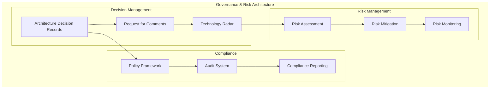

# L3 Governance & Risk Pattern

> Architecture Decision Records (ADRs), technology radar, RFC processes, compliance monitoring, and audit trails for enterprise governance.

## Context
Large platforms require governance mechanisms to ensure architectural consistency, manage technical risk, maintain compliance, and provide audit trails for decision-making. This pattern establishes processes and tooling for enterprise-level governance while maintaining development team productivity.

## Problem & Forces
- **Decision Documentation**: Capturing architectural decisions and rationale
- **Technology Standardization**: Managing approved technologies and patterns
- **Compliance Requirements**: Meeting regulatory and organizational standards
- **Risk Management**: Identifying and mitigating technical and operational risks
- **Audit Trails**: Providing complete audit histories for compliance

### Trade-offs
- Governance vs Agility: Control processes vs development speed
- Standardization vs Innovation: Approved technologies vs emerging solutions
- Centralized vs Federated: Central oversight vs domain autonomy

## Solution Sketch

## Tech Anchors
- **GitHub** - ADR and RFC repositories
- **Azure DevOps** - Work item tracking and approvals
- **Azure Policy** - Automated compliance enforcement
- **Power BI** - Governance dashboards and reporting

## Key Components
- **ADR Repository**: Structured decision documentation
- **Technology Radar**: Approved, trial, and deprecated technologies
- **RFC Process**: Structured proposal and review workflow
- **Compliance Dashboard**: Real-time compliance monitoring

*[Full implementation details coming soon]*

## References
- [Architecture Decision Records](https://adr.github.io/)
- [Technology Radar](https://www.thoughtworks.com/radar)
- [Azure Governance](https://docs.microsoft.com/en-us/azure/governance/)
- Template: `templates/governance-risk/`