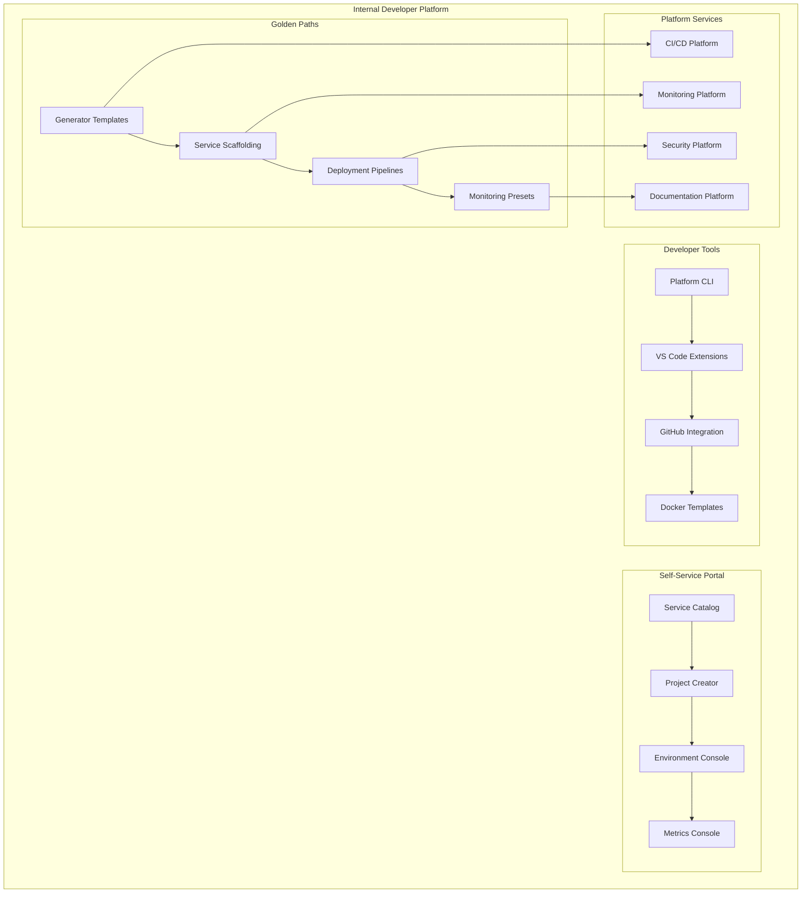

# L3 Platform Engineering Pattern

> Golden paths, template repositories, and internal developer platform for consistent development experience.

## Context
As the platform scales, development teams need consistent tooling, standardized approaches, and self-service capabilities. This pattern establishes an Internal Developer Platform (IDP) that provides golden paths for common development tasks, reduces cognitive load, and enables teams to focus on business value rather than infrastructure complexity.

## Problem & Forces
- **Developer Productivity**: Reducing time from idea to production
- **Consistency**: Standardizing development practices across teams
- **Cognitive Load**: Simplifying complex infrastructure decisions
- **Onboarding**: Getting new developers productive quickly
- **Governance**: Ensuring compliance and best practices without blocking teams

### Trade-offs
- Standardization vs Flexibility: Opinionated paths vs team autonomy
- Abstraction vs Control: Simple interfaces vs infrastructure control
- Centralized vs Distributed: Platform team ownership vs team independence

## Solution Sketch



## Standards/SLOs/Security

### Platform Standards
- **Golden Paths**: 90% of services use standard templates
- **Self-Service**: New services deployable within 2 hours
- **Documentation**: Auto-generated docs from code and config
- **Compliance**: Built-in security and governance controls
- **Versioning**: Semantic versioning for all platform components

### SLOs
- **Template Adoption**: 95% of new services use platform templates
- **Time to Production**: New service deployed within 4 hours
- **Developer Satisfaction**: 85% satisfaction score in quarterly surveys
- **Platform Availability**: 99.9% uptime for developer-facing services

### Security
- **Secure by Default**: Security controls built into all templates
- **Least Privilege**: Minimal permissions in generated configurations
- **Compliance**: Automated compliance checking in pipelines
- **Secret Management**: Integrated secret scanning and rotation

## Tech Anchors
- **Backstage** - Developer portal and service catalog
- **Cookiecutter** - Project template generation
- **GitHub Actions** - CI/CD automation
- **Azure DevOps** - Alternative CI/CD platform
- **Helm Charts** - Kubernetes deployment templates
- **Terraform** - Infrastructure as Code templates

## Code Starter

### Platform CLI Tool
```typescript
#!/usr/bin/env node
// bin/iom-platform
import { Command } from 'commander';
import { createService } from './commands/create-service';
import { deployService } from './commands/deploy-service';
import { generateDocs } from './commands/generate-docs';
import { checkCompliance } from './commands/check-compliance';

const program = new Command();

program
  .name('iom-platform')
  .description('IOM Migration Platform CLI')
  .version('1.0.0');

program
  .command('create')
  .description('Create a new service from template')
  .argument('<service-name>', 'Name of the service')
  .option('-t, --template <template>', 'Template to use', 'api-service')
  .option('-d, --domain <domain>', 'Domain (beneficiary, medical, platform)', 'platform')
  .action(createService);

program
  .command('deploy')
  .description('Deploy service to environment')
  .argument('<service-name>', 'Name of the service')
  .option('-e, --environment <env>', 'Target environment', 'dev')
  .option('--dry-run', 'Show what would be deployed without deploying')
  .action(deployService);

program
  .command('docs')
  .description('Generate documentation for service')
  .argument('<service-path>', 'Path to service directory')
  .option('-f, --format <format>', 'Output format (markdown, html)', 'markdown')
  .action(generateDocs);

program
  .command('check')
  .description('Check service compliance')
  .argument('<service-path>', 'Path to service directory')
  .option('--fix', 'Automatically fix compliance issues')
  .action(checkCompliance);

program.parse();
```

### Service Template Generator
```typescript
// commands/create-service.ts
import { execSync } from 'child_process';
import { writeFileSync, mkdirSync } from 'fs';
import path from 'path';
import Mustache from 'mustache';

interface ServiceOptions {
  template: string;
  domain: string;
}

export async function createService(serviceName: string, options: ServiceOptions) {
  console.log(`🚀 Creating service ${serviceName} using ${options.template} template`);

  const templateContext = {
    serviceName,
    serviceNamePascal: toPascalCase(serviceName),
    serviceNameKebab: toKebabCase(serviceName),
    domain: options.domain,
    year: new Date().getFullYear(),
    author: execSync('git config user.name', { encoding: 'utf8' }).trim(),
    email: execSync('git config user.email', { encoding: 'utf8' }).trim(),
  };

  // Create service directory
  const serviceDir = path.join(process.cwd(), serviceName);
  mkdirSync(serviceDir, { recursive: true });

  // Generate from template
  await generateFromTemplate(options.template, serviceDir, templateContext);

  // Initialize git repository
  execSync('git init', { cwd: serviceDir });
  execSync('git add .', { cwd: serviceDir });
  execSync('git commit -m "Initial commit from platform template"', { cwd: serviceDir });

  // Setup CI/CD pipeline
  await setupCiCdPipeline(serviceName, options.domain, serviceDir);

  // Create monitoring configuration
  await setupMonitoring(serviceName, options.domain, serviceDir);

  console.log(`✅ Service ${serviceName} created successfully!`);
  console.log(`📁 Location: ${serviceDir}`);
  console.log(`🔗 Next steps:`);
  console.log(`   cd ${serviceName}`);
  console.log(`   iom-platform deploy ${serviceName} --environment dev`);
}

async function generateFromTemplate(templateName: string, targetDir: string, context: any) {
  const templates = {
    'api-service': [
      'src/Program.cs',
      'src/Controllers/HealthController.cs',
      'src/Services/{{serviceNamePascal}}Service.cs',
      'src/{{serviceNamePascal}}.csproj',
      'Dockerfile',
      'docker-compose.yml',
      '.github/workflows/ci-cd.yml',
      'helm/Chart.yaml',
      'helm/values.yaml',
      'helm/templates/deployment.yaml',
      'helm/templates/service.yaml',
      'README.md',
      '.gitignore'
    ],
    'function-app': [
      'src/Functions/{{serviceNamePascal}}Function.cs',
      'src/{{serviceNamePascal}}.csproj',
      'host.json',
      'local.settings.json.template',
      'Dockerfile',
      '.github/workflows/ci-cd.yml',
      'README.md',
      '.gitignore'
    ],
    'ui-app': [
      'src/App.tsx',
      'src/index.tsx',
      'src/components/{{serviceNamePascal}}.tsx',
      'package.json',
      'webpack.config.js',
      'Dockerfile',
      '.github/workflows/ci-cd.yml',
      'README.md',
      '.gitignore'
    ]
  };

  const templateFiles = templates[templateName as keyof typeof templates] || templates['api-service'];

  for (const templateFile of templateFiles) {
    const processedFileName = Mustache.render(templateFile, context);
    const targetPath = path.join(targetDir, processedFileName);
    const templateContent = await getTemplateContent(templateName, templateFile);
    const processedContent = Mustache.render(templateContent, context);

    // Ensure directory exists
    mkdirSync(path.dirname(targetPath), { recursive: true });
    writeFileSync(targetPath, processedContent);
  }
}

async function getTemplateContent(templateName: string, fileName: string): Promise<string> {
  // In a real implementation, this would fetch from a template repository
  // For now, return sample content based on file type
  
  if (fileName.endsWith('.cs')) {
    return `using Microsoft.AspNetCore.Mvc;

namespace {{serviceNamePascal}}.Controllers;

[ApiController]
[Route("api/[controller]")]
public class {{serviceNamePascal}}Controller : ControllerBase
{
    private readonly I{{serviceNamePascal}}Service _service;
    
    public {{serviceNamePascal}}Controller(I{{serviceNamePascal}}Service service)
    {
        _service = service;
    }
    
    [HttpGet]
    public async Task<IActionResult> Get()
    {
        var result = await _service.GetAsync();
        return Ok(result);
    }
}
`;
  }

  if (fileName.endsWith('.csproj')) {
    return `<Project Sdk="Microsoft.NET.Sdk.Web">

  <PropertyGroup>
    <TargetFramework>net8.0</TargetFramework>
    <Nullable>enable</Nullable>
    <ImplicitUsings>enable</ImplicitUsings>
  </PropertyGroup>

  <ItemGroup>
    <PackageReference Include="Microsoft.AspNetCore.OpenApi" Version="8.0.0" />
    <PackageReference Include="Swashbuckle.AspNetCore" Version="6.4.0" />
    <PackageReference Include="Serilog.AspNetCore" Version="7.0.0" />
    <PackageReference Include="Microsoft.ApplicationInsights.AspNetCore" Version="2.21.0" />
  </ItemGroup>

</Project>
`;
  }

  if (fileName === 'README.md') {
    return `# {{serviceNamePascal}}

{{serviceName}} service for the IOM Migration Platform.

## Domain
{{domain}}

## Getting Started

1. Install dependencies:
   \`\`\`bash
   dotnet restore
   \`\`\`

2. Run the service:
   \`\`\`bash
   dotnet run
   \`\`\`

3. View the API documentation:
   Open http://localhost:5000/swagger

## Deployment

Deploy using the platform CLI:
\`\`\`bash
iom-platform deploy {{serviceName}} --environment dev
\`\`\`

## Monitoring

Service metrics and logs are available in the platform monitoring dashboard.

## Contributing

This service follows the IOM Platform standards. See the [Platform Guidelines](https://platform.iom.int/guidelines) for more information.
`;
  }

  return '# Generated by IOM Platform CLI';
}
```

### Platform Service Catalog
```csharp
// Platform.ServiceCatalog/Controllers/ServiceCatalogController.cs
[ApiController]
[Route("api/[controller]")]
public class ServiceCatalogController : ControllerBase
{
    private readonly IServiceCatalogService _catalogService;
    private readonly ITemplateService _templateService;
    private readonly ILogger<ServiceCatalogController> _logger;

    public ServiceCatalogController(
        IServiceCatalogService catalogService,
        ITemplateService templateService,
        ILogger<ServiceCatalogController> logger)
    {
        _catalogService = catalogService;
        _templateService = templateService;
        _logger = logger;
    }

    [HttpGet("services")]
    public async Task<IActionResult> GetServices([FromQuery] ServiceFilter filter)
    {
        var services = await _catalogService.GetServicesAsync(filter);
        return Ok(services);
    }

    [HttpGet("services/{serviceId}")]
    public async Task<IActionResult> GetService(string serviceId)
    {
        var service = await _catalogService.GetServiceAsync(serviceId);
        if (service == null)
        {
            return NotFound();
        }
        return Ok(service);
    }

    [HttpPost("services")]
    public async Task<IActionResult> RegisterService([FromBody] ServiceRegistration registration)
    {
        var result = await _catalogService.RegisterServiceAsync(registration);
        return CreatedAtAction(nameof(GetService), new { serviceId = result.ServiceId }, result);
    }

    [HttpGet("templates")]
    public async Task<IActionResult> GetTemplates()
    {
        var templates = await _templateService.GetTemplatesAsync();
        return Ok(templates);
    }

    [HttpPost("templates/{templateId}/generate")]
    public async Task<IActionResult> GenerateFromTemplate(string templateId, [FromBody] TemplateGenerationRequest request)
    {
        var result = await _templateService.GenerateFromTemplateAsync(templateId, request);
        return Ok(result);
    }

    [HttpGet("golden-paths")]
    public async Task<IActionResult> GetGoldenPaths()
    {
        var goldenPaths = await _catalogService.GetGoldenPathsAsync();
        return Ok(goldenPaths);
    }
}

public interface IServiceCatalogService
{
    Task<IEnumerable<CatalogService>> GetServicesAsync(ServiceFilter filter);
    Task<CatalogService?> GetServiceAsync(string serviceId);
    Task<ServiceRegistrationResult> RegisterServiceAsync(ServiceRegistration registration);
    Task<IEnumerable<GoldenPath>> GetGoldenPathsAsync();
}

public class ServiceCatalogService : IServiceCatalogService
{
    private readonly IServiceRepository _serviceRepository;
    private readonly IGitHubService _gitHubService;
    private readonly IComplianceChecker _complianceChecker;
    private readonly ILogger<ServiceCatalogService> _logger;

    public async Task<IEnumerable<CatalogService>> GetServicesAsync(ServiceFilter filter)
    {
        var services = await _serviceRepository.GetServicesAsync(filter);
        
        // Enrich with runtime information
        var enrichedServices = new List<CatalogService>();
        foreach (var service in services)
        {
            var runtimeInfo = await GetServiceRuntimeInfoAsync(service.Name);
            enrichedServices.Add(service with { RuntimeInfo = runtimeInfo });
        }
        
        return enrichedServices;
    }

    public async Task<ServiceRegistrationResult> RegisterServiceAsync(ServiceRegistration registration)
    {
        _logger.LogInformation("Registering service {ServiceName}", registration.ServiceName);

        // Validate service configuration
        var validationResult = await ValidateServiceAsync(registration);
        if (!validationResult.IsValid)
        {
            throw new ValidationException(validationResult.Errors);
        }

        // Create service entry
        var service = new CatalogService
        {
            Id = Guid.NewGuid().ToString(),
            Name = registration.ServiceName,
            Domain = registration.Domain,
            Description = registration.Description,
            Owner = registration.Owner,
            Repository = registration.Repository,
            Technology = registration.Technology,
            Status = ServiceStatus.Active,
            CreatedAt = DateTime.UtcNow,
            Compliance = await _complianceChecker.CheckComplianceAsync(registration)
        };

        await _serviceRepository.CreateServiceAsync(service);

        // Setup monitoring and alerting
        await SetupServiceMonitoringAsync(service);

        // Create deployment pipeline
        await SetupDeploymentPipelineAsync(service, registration);

        return new ServiceRegistrationResult
        {
            ServiceId = service.Id,
            ServiceName = service.Name,
            Status = "Registered",
            NextSteps = new[]
            {
                "Service registered in catalog",
                "Monitoring configured",
                "Deployment pipeline created",
                $"View service: https://platform.iom.int/services/{service.Id}",
                $"Deploy: iom-platform deploy {service.Name}"
            }
        };
    }

    private async Task<ServiceRuntimeInfo> GetServiceRuntimeInfoAsync(string serviceName)
    {
        // This would integrate with monitoring systems to get real-time info
        return new ServiceRuntimeInfo
        {
            Status = "Healthy",
            Version = "1.0.0",
            LastDeployment = DateTime.UtcNow.AddDays(-2),
            HealthCheckUrl = $"https://{serviceName}.iom.int/health",
            MetricsUrl = $"https://metrics.iom.int/d/service-{serviceName}",
            LogsUrl = $"https://logs.iom.int/app/discover#/?q=service:{serviceName}"
        };
    }

    private async Task SetupServiceMonitoringAsync(CatalogService service)
    {
        // Create Grafana dashboard
        // Setup Application Insights
        // Configure alerts
        await Task.CompletedTask;
    }

    private async Task SetupDeploymentPipelineAsync(CatalogService service, ServiceRegistration registration)
    {
        // Create GitHub Actions workflow
        // Setup Azure DevOps pipeline
        // Configure environments
        await Task.CompletedTask;
    }
}
```

### Platform Compliance Checker
```csharp
public interface IComplianceChecker
{
    Task<ComplianceResult> CheckComplianceAsync(ServiceRegistration registration);
    Task<ComplianceResult> CheckServiceComplianceAsync(string serviceId);
    Task<IEnumerable<ComplianceRule>> GetComplianceRulesAsync();
}

public class ComplianceChecker : IComplianceChecker
{
    private readonly IGitHubService _gitHubService;
    private readonly ISecurityScanner _securityScanner;
    private readonly ILogger<ComplianceChecker> _logger;

    public async Task<ComplianceResult> CheckComplianceAsync(ServiceRegistration registration)
    {
        var checks = new List<ComplianceCheck>();

        // Security compliance
        checks.AddRange(await CheckSecurityComplianceAsync(registration));

        // Documentation compliance
        checks.AddRange(await CheckDocumentationComplianceAsync(registration));

        // Monitoring compliance
        checks.AddRange(await CheckMonitoringComplianceAsync(registration));

        // Testing compliance
        checks.AddRange(await CheckTestingComplianceAsync(registration));

        var passedChecks = checks.Count(c => c.Status == ComplianceStatus.Passed);
        var totalChecks = checks.Count;
        var score = (double)passedChecks / totalChecks * 100;

        return new ComplianceResult
        {
            ServiceId = registration.ServiceName,
            Score = score,
            Status = score >= 80 ? ComplianceStatus.Passed : ComplianceStatus.Failed,
            Checks = checks,
            Recommendations = GenerateRecommendations(checks)
        };
    }

    private async Task<IEnumerable<ComplianceCheck>> CheckSecurityComplianceAsync(ServiceRegistration registration)
    {
        var checks = new List<ComplianceCheck>();

        // Check for Dockerfile security
        if (await HasDockerfile(registration.Repository))
        {
            var dockerfileContent = await GetDockerfileContent(registration.Repository);
            checks.Add(new ComplianceCheck
            {
                Category = "Security",
                Name = "Dockerfile Security",
                Description = "Dockerfile follows security best practices",
                Status = CheckDockerfileSecurity(dockerfileContent) ? ComplianceStatus.Passed : ComplianceStatus.Failed,
                Details = "Checks for non-root user, minimal base image, etc."
            });
        }

        // Check for secrets scanning
        checks.Add(new ComplianceCheck
        {
            Category = "Security",
            Name = "Secrets Scanning",
            Description = "No secrets in source code",
            Status = await _securityScanner.ScanForSecretsAsync(registration.Repository) ? ComplianceStatus.Passed : ComplianceStatus.Failed,
            Details = "Automated scanning for hardcoded secrets and credentials"
        });

        // Check for dependency scanning
        checks.Add(new ComplianceCheck
        {
            Category = "Security",
            Name = "Dependency Scanning",
            Description = "Dependencies are up to date and secure",
            Status = await CheckDependencySecurityAsync(registration.Repository) ? ComplianceStatus.Passed : ComplianceStatus.Failed,
            Details = "Checks for known vulnerabilities in dependencies"
        });

        return checks;
    }

    private async Task<IEnumerable<ComplianceCheck>> CheckDocumentationComplianceAsync(ServiceRegistration registration)
    {
        var checks = new List<ComplianceCheck>();

        // Check for README
        checks.Add(new ComplianceCheck
        {
            Category = "Documentation",
            Name = "README.md",
            Description = "Service has comprehensive README",
            Status = await HasRequiredDocumentation(registration.Repository, "README.md") ? ComplianceStatus.Passed : ComplianceStatus.Failed,
            Details = "README should include setup, usage, and deployment instructions"
        });

        // Check for API documentation
        if (registration.Technology.Contains("API"))
        {
            checks.Add(new ComplianceCheck
            {
                Category = "Documentation",
                Name = "API Documentation",
                Description = "API endpoints are documented",
                Status = await HasSwaggerDocumentation(registration.Repository) ? ComplianceStatus.Passed : ComplianceStatus.Failed,
                Details = "OpenAPI/Swagger documentation for all endpoints"
            });
        }

        return checks;
    }

    private async Task<IEnumerable<ComplianceCheck>> CheckMonitoringComplianceAsync(ServiceRegistration registration)
    {
        var checks = new List<ComplianceCheck>();

        // Check for health endpoint
        checks.Add(new ComplianceCheck
        {
            Category = "Monitoring",
            Name = "Health Endpoint",
            Description = "Service exposes health check endpoint",
            Status = await HasHealthEndpoint(registration.Repository) ? ComplianceStatus.Passed : ComplianceStatus.Failed,
            Details = "/health endpoint returning 200 OK when healthy"
        });

        // Check for metrics endpoint
        checks.Add(new ComplianceCheck
        {
            Category = "Monitoring",
            Name = "Metrics Endpoint",
            Description = "Service exposes metrics endpoint",
            Status = await HasMetricsEndpoint(registration.Repository) ? ComplianceStatus.Passed : ComplianceStatus.Failed,
            Details = "/metrics endpoint in Prometheus format"
        });

        // Check for structured logging
        checks.Add(new ComplianceCheck
        {
            Category = "Monitoring",
            Name = "Structured Logging",
            Description = "Service uses structured logging",
            Status = await HasStructuredLogging(registration.Repository) ? ComplianceStatus.Passed : ComplianceStatus.Failed,
            Details = "JSON formatted logs with correlation IDs"
        });

        return checks;
    }

    private List<string> GenerateRecommendations(List<ComplianceCheck> checks)
    {
        var recommendations = new List<string>();

        var failedChecks = checks.Where(c => c.Status == ComplianceStatus.Failed).ToList();

        if (failedChecks.Any(c => c.Category == "Security"))
        {
            recommendations.Add("🔒 Review security practices - ensure secrets scanning and dependency updates");
        }

        if (failedChecks.Any(c => c.Category == "Documentation"))
        {
            recommendations.Add("📚 Improve documentation - add comprehensive README and API docs");
        }

        if (failedChecks.Any(c => c.Category == "Monitoring"))
        {
            recommendations.Add("📊 Enhance observability - add health checks, metrics, and structured logging");
        }

        if (failedChecks.Any(c => c.Category == "Testing"))
        {
            recommendations.Add("🧪 Improve test coverage - add unit tests and integration tests");
        }

        return recommendations;
    }
}
```

### Platform Models
```csharp
public record CatalogService
{
    public string Id { get; init; } = string.Empty;
    public string Name { get; init; } = string.Empty;
    public string Domain { get; init; } = string.Empty;
    public string Description { get; init; } = string.Empty;
    public string Owner { get; init; } = string.Empty;
    public string Repository { get; init; } = string.Empty;
    public string Technology { get; init; } = string.Empty;
    public ServiceStatus Status { get; init; }
    public DateTime CreatedAt { get; init; }
    public ComplianceResult Compliance { get; init; } = new();
    public ServiceRuntimeInfo RuntimeInfo { get; init; } = new();
}

public record ServiceRegistration
{
    public string ServiceName { get; init; } = string.Empty;
    public string Domain { get; init; } = string.Empty;
    public string Description { get; init; } = string.Empty;
    public string Owner { get; init; } = string.Empty;
    public string Repository { get; init; } = string.Empty;
    public string Technology { get; init; } = string.Empty;
    public Dictionary<string, string> Configuration { get; init; } = new();
}

public record ComplianceResult
{
    public string ServiceId { get; init; } = string.Empty;
    public double Score { get; init; }
    public ComplianceStatus Status { get; init; }
    public IEnumerable<ComplianceCheck> Checks { get; init; } = Array.Empty<ComplianceCheck>();
    public IEnumerable<string> Recommendations { get; init; } = Array.Empty<string>();
}

public record ComplianceCheck
{
    public string Category { get; init; } = string.Empty;
    public string Name { get; init; } = string.Empty;
    public string Description { get; init; } = string.Empty;
    public ComplianceStatus Status { get; init; }
    public string Details { get; init; } = string.Empty;
}

public enum ServiceStatus
{
    Active,
    Inactive,
    Deprecated,
    Experimental
}

public enum ComplianceStatus
{
    Passed,
    Failed,
    Warning,
    NotApplicable
}

public record GoldenPath
{
    public string Id { get; init; } = string.Empty;
    public string Name { get; init; } = string.Empty;
    public string Description { get; init; } = string.Empty;
    public string Template { get; init; } = string.Empty;
    public IEnumerable<string> Steps { get; init; } = Array.Empty<string>();
    public Dictionary<string, string> Tools { get; init; } = new();
}
```

## Tests

### Service Catalog Tests
```csharp
[TestClass]
public class ServiceCatalogServiceTests
{
    [TestMethod]
    public async Task RegisterServiceAsync_ValidService_ReturnsSuccessResult()
    {
        // Arrange
        var registration = new ServiceRegistration
        {
            ServiceName = "test-service",
            Domain = "platform",
            Description = "Test service",
            Owner = "platform-team",
            Repository = "https://github.com/iom/test-service",
            Technology = "ASP.NET Core API"
        };

        var mockRepository = new Mock<IServiceRepository>();
        var mockGitHub = new Mock<IGitHubService>();
        var mockCompliance = new Mock<IComplianceChecker>();
        var logger = Mock.Of<ILogger<ServiceCatalogService>>();

        mockCompliance.Setup(x => x.CheckComplianceAsync(registration))
                     .ReturnsAsync(new ComplianceResult { Score = 90, Status = ComplianceStatus.Passed });

        var service = new ServiceCatalogService(mockRepository.Object, mockGitHub.Object, 
            mockCompliance.Object, logger);

        // Act
        var result = await service.RegisterServiceAsync(registration);

        // Assert
        Assert.AreEqual("test-service", result.ServiceName);
        Assert.AreEqual("Registered", result.Status);
        Assert.IsTrue(result.NextSteps.Any());
    }
}
```

## Pitfalls & Anti-Patterns

### ❌ Anti-Patterns
- **Over-Engineering**: Creating complex abstractions that hide too much
- **One-Size-Fits-All**: Forcing all teams to use identical approaches
- **Platform Team Bottleneck**: Requiring platform team approval for everything
- **Documentation Debt**: Templates without proper documentation

### 🚨 Common Pitfalls
- **Template Sprawl**: Too many templates with subtle differences
- **Version Skew**: Templates becoming outdated with platform changes
- **Adoption Resistance**: Teams not adopting platform tools
- **Missing Feedback Loop**: No mechanism to improve platform based on usage

### 🔧 Solutions
- Start with simple, opinionated templates and evolve based on feedback
- Automate template updates and provide migration guides
- Measure and optimize developer experience metrics
- Create communities of practice around platform adoption

## References
- [Backstage.io](https://backstage.io/) - Open source developer portal
- [Platform Engineering](https://platformengineering.org/) - Community resources
- [Cookiecutter](https://cookiecutter.readthedocs.io/) - Project templating
- [Team Topologies](https://teamtopologies.com/) - Platform team patterns
- Template: `templates/platform-engineering/`
- Example: `/samples/platform-engineering/`